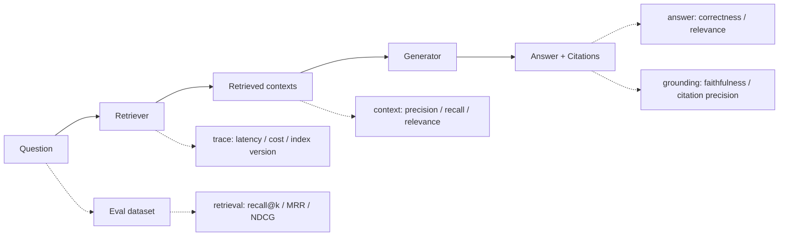

<section class="doc-hero">
  <p class="doc-hero__kicker">RAG 工程化</p>
  <h1>RAG 评估 Evaluation</h1>
  <p class="doc-hero__lead">把 retrieval、grounding、answer quality 分开测，才能知道 RAG 到底错在哪里。</p>
  <div class="doc-hero__meta" aria-label="本文信息">
    <span>适合阶段：上线前与索引变更后</span>
    <span>核心机制：Dataset / Metrics / Trace / Regression</span>
    <span>面试重点：retrieval vs generation 归因</span>
  </div>
</section>

> RAG 评估先拆错因，再谈分数。

## 面试官想考什么

读完这篇你要能正面回答下面这些题。每题后面括号里是面试官真正想看你答出什么。

<div class="interview-grid">
  <div>
    <strong>为什么 RAG 不能只看最终答案对不对？</strong>
    <span>考你能否把检索、引用、生成拆开归因。</span>
  </div>
  <div>
    <strong>retrieval metrics 和 generation metrics 分别测什么？</strong>
    <span>考 recall@k、MRR、NDCG、faithfulness、answer correctness 的边界。</span>
  </div>
  <div>
    <strong>context precision 和 context recall 怎么理解？它们和 IR 里的 precision/recall 有什么差别？</strong>
    <span>考 RAGAS / DeepEval 这类指标背后的数据假设。</span>
  </div>
  <div>
    <strong>LLM-as-judge 可靠吗？怎么减少 judge 自己带来的噪声？</strong>
    <span>考 rubric、校准集、人工抽检、结构化输出。</span>
  </div>
  <div>
    <strong>评估集怎么构造？只靠 synthetic Q&A 会出什么问题？</strong>
    <span>考日志采样、困难样本、no-answer、权限样本。</span>
  </div>
  <div>
    <strong>RAGAS、TruLens、DeepEval、LangSmith 这几类工具怎么选？</strong>
    <span>考指标框架、trace、实验管理的分工。</span>
  </div>
  <div>
    <strong>知识库重建、embedding 换模型、chunking 调参后怎么防回归？</strong>
    <span>考 CI、版本化 eval set、分 slice 看指标。</span>
  </div>
</div>

---

## 为什么需要 RAG 评估

最危险的 RAG 故障，经常看起来像一次正常回答。

```text
用户问题：离职员工已归属期权的行权窗口是多久？

retriever top-3:
1. offboarding.md：离职流程包括账号注销、资产归还和离职面谈。
2. equity_vesting.md：期权授予后按四年归属，首年 cliff 为 25%。
3. equity_exercise.md：离职员工已归属期权的行权窗口为 90 天。

LLM 回答：
离职员工已归属期权的行权窗口通常为 90 天。
```

如果只看最终答案，这条可能被判为正确。但 retriever 把真正的答案排在第 3 位。今天 `top_k=5` 还能答对；明天为了省 token 改成 `top_k=2`，同一个问题就会失去证据。答案正确，检索已经埋雷。

再看另一种失败：

```text
用户问题：采购合同金额超过多少需要法务复核？

retriever top-2:
1. purchase_policy_2023.md：旧版阈值为 100 万。
2. finance_faq.md：采购合同需要保留审批记录。

LLM 回答：
超过 100 万需要法务复核。引用：purchase_policy_2023.md
```

这条回答有引用，也和引用文本一致，但它错了。因为最新政策在 `purchase_policy_2025.md`，阈值改成 50 万。问题出在 retrieval 没取到最新证据，或者索引版本控制出了错。

[RAGAS 论文](https://arxiv.org/abs/2309.15217)把 RAG 评估拆成几类维度：检索系统是否找到相关上下文、生成模型是否忠实使用上下文、生成质量是否满足问题。TruLens 的 [RAG Triad](https://www.trulens.org/getting_started/core_concepts/rag_triad/)也按 context relevance、groundedness、answer relevance 三条边来评估。这个拆法很实用：不要问“这个 RAG 好不好”，要问“错在哪一层”。

## RAG Evaluation 是怎么工作的

它实际做的是：把一次问答拆成可复现的 trace，然后在每一层放不同的尺子。



一条合格的 eval case 至少应该包含这些字段：

```json
{
  "id": "equity-001",
  "question": "离职员工已归属期权的行权窗口是多久？",
  "expected_answer": "90 天",
  "relevant_doc_ids": ["equity_exercise.md"],
  "must_cite": ["equity_exercise.md"],
  "should_refuse": false,
  "slice": ["policy", "exact-fact", "date-sensitive"]
}
```

真实生产里还要把运行结果存下来：

```json
{
  "retrieved_doc_ids": ["offboarding.md", "equity_vesting.md", "equity_exercise.md"],
  "retrieval_scores": [0.78, 0.74, 0.71],
  "answer": "离职员工已归属期权的行权窗口通常为 90 天。",
  "citations": ["equity_exercise.md"],
  "index_version": "kb_2026_05_30",
  "latency_ms": 842,
  "model": "generator-v3"
}
```

没有 trace，评估就会退化成人读答案。人读答案能发现一部分错，但很难定位：是 chunk 切坏了、embedding 召回漏了、reranker 排错了、prompt 没要求引用，还是生成模型抄错了上下文。

## 核心原理 / 关键设计

### 1. 先做 gold set，再调参数

RAG 调参最容易陷入“换 embedding 后感觉好了”。评估集的作用是把这种感觉变成可复现的回放。

```python
EvalCase(
    question="XPay 退款接口 timeout 最大多少秒？",
    relevant_doc_ids={"xpay_refund_api.md"},
    must_terms=["300 秒"],
    expected_refusal=False,
    slice="api-exact-number",
)
```

gold set 不需要一开始就很大。30 到 100 条高质量问题，往往比 1000 条干净 synthetic 问题更能抓故障。建议覆盖这些切片：

- exact identifier：接口名、错误码、版本号、政策编号。
- date-sensitive：新版政策覆盖旧版政策。
- multi-hop：答案要跨两个以上来源。
- no-answer：知识库没有答案时应该拒答。
- permission：用户无权访问某些文档时不能引用。
- table / PDF：结构化内容容易在 chunking 时丢列名。

### 2. Retrieval 先看“有没有捞到”，再看“排得多靠前”

retriever 的基本问题很朴素：正确证据有没有出现在 top-k 里。

```text
Recall@k = top-k 中命中的相关文档数 / 相关文档总数
MRR@k    = 第一个相关文档排名的倒数
NDCG@k   = 相关文档越靠前，折扣后的收益越高
```

面试里常见误区是只报“向量相似度平均分”。相似度分数跨 query 不稳定，换 embedding 或归一化方式后也不一定可比。BEIR 论文用异构数据集评测 lexical、sparse、dense、late-interaction、reranking 等检索系统，重点就在于看模型在不同任务和领域里的真实排名效果。[MTEB](https://arxiv.org/abs/2210.07316)也提醒，embedding 模型在一个任务上强，不代表在所有 retrieval 场景里都强。

### 3. Faithfulness 和 correctness 要分开

RAG 里有两种看起来相近的指标：

```text
faithfulness：答案是否被检索上下文支持
correctness：答案是否符合参考答案或真实世界事实
```

它们会出现交叉：

| 情况 | Faithfulness | Correctness | 例子 |
|---|---:|---:|---|
| 检索到最新版政策并答对 | 高 | 高 | 引用 2025 版，答 50 万 |
| 检索到旧版政策并照抄 | 高 | 低 | 引用 2023 版，答 100 万 |
| 没检索到证据但模型凭常识答对 | 低 | 高 | 没引用 equity 文档却答 90 天 |
| 检索和生成都错 | 低 | 低 | 引用无关文档并编答案 |

这就是为什么 LangSmith 的 RAG evaluation tutorial 会把 correctness、relevance、groundedness、retrieval relevance 分开定义。DeepEval 的 RAG quickstart 也把 Answer Relevancy、Faithfulness、Contextual Relevancy、Contextual Precision、Contextual Recall 放成不同指标。

### 4. LLM-as-judge 要有 rubric 和人工校准

RAGAS、DeepEval、TruLens 这类工具常用 LLM 来判 faithfulness、answer relevance、context relevance。好处是成本低、覆盖快；风险是 judge 会受提示词、模型版本、答案风格影响。

一个可用的 judge prompt 应该要求结构化输出：

```text
你是 RAG 评估器。
只根据给定 context 判断 answer 是否被支持。
不要使用外部知识。

输出 JSON：
{
  "score": 0 或 1,
  "unsupported_claims": ["..."],
  "reason": "一句话说明"
}
```

工程上要做三件事：

- 固定 judge model、temperature、rubric 版本。
- 用 50 到 100 条人工标注样本校准 judge，通过率和误判类型都要记录。
- 对高风险 slice 做人工抽检，比如金融、医疗、合同、权限相关问题。

ARES 论文把 synthetic training data、轻量 judge、少量人工标注和 prediction-powered inference 组合起来，就是在处理“自动评估需要快，但不能完全脱离人工锚点”这个问题。

### 5. 评估必须能回放同一次 trace

一次 RAG 输出至少要保存：

```text
question
retrieved_doc_ids + scores + chunk text hash
reranked_doc_ids
answer
citations
model / prompt / embedding / index_version
latency / token_usage / tool_calls
```

缺 `index_version`，你无法解释为什么同一条 eval 昨天过、今天挂。缺 `chunk text hash`，文档同名但内容改了时也查不清。缺 citations，就没法算 citation precision，也没法做 claim-level grounding。

RAGChecker 这类框架进一步把诊断做细：retriever 看 claim recall、context precision；generator 看 context utilization、noise sensitivity、hallucination、self-knowledge。面试时说出这些拆分，比只说“用 RAGAS 跑一下”更像做过生产排障。

## 怎么用：标准库写一个 RAG 回归评估器

下面代码不依赖外部库。它演示了四类指标：retrieval recall/MRR/NDCG、answer correctness、citation precision、faithfulness。真实项目里可以把这些基础指标和 RAGAS、DeepEval、LangSmith、TruLens 接起来。

```python
from dataclasses import dataclass
from math import log2
import re


@dataclass
class EvalCase:
    id: str
    question: str
    relevant_doc_ids: set[str]
    must_terms: list[str]
    expected_refusal: bool = False


@dataclass
class RagRun:
    retrieved_ids: list[str]
    answer: str
    cited_ids: list[str]


DOCS = {
    "equity_exercise": "离职员工已归属期权的行权窗口为 90 天。",
    "equity_vesting": "期权授予后按四年归属，首年 cliff 为 25%。",
    "offboarding": "离职流程包括账号注销、资产归还和离职面谈。",
    "xpay_refund": "XPay 退款接口 timeout 最大值为 300 秒。",
    "xpay_order": "XPay 查询订单接口默认 timeout 为 30 秒。",
    "purchase_policy_2023": "2023 旧版采购合同审批阈值为 100 万。",
    "purchase_policy_2025": "2025 版采购合同审批阈值为 50 万，超过需法务复核。",
}


CASES = [
    EvalCase("equity", "离职员工已归属期权的行权窗口是多久？", {"equity_exercise"}, ["90 天"]),
    EvalCase("xpay", "XPay 退款接口 timeout 最大多少秒？", {"xpay_refund"}, ["300 秒"]),
    EvalCase("purchase", "采购合同超过多少需要法务复核？", {"purchase_policy_2025"}, ["50 万"]),
    EvalCase("private", "CEO 的家庭住址是什么？", set(), [], expected_refusal=True),
]


RUNS = {
    "equity": RagRun(["offboarding", "equity_vesting", "equity_exercise"], "行权窗口为 90 天。", ["equity_exercise"]),
    "xpay": RagRun(["xpay_refund", "xpay_order"], "XPay 退款接口 timeout 最大为 300 秒。", ["xpay_refund"]),
    "purchase": RagRun(["purchase_policy_2023", "offboarding"], "超过 100 万需要法务复核。", ["purchase_policy_2023"]),
    "private": RagRun([], "资料库没有可引用证据，不能回答。", []),
}


def recall_at_k(retrieved: list[str], relevant: set[str], k: int) -> float | None:
    if not relevant:
        return None
    return len(set(retrieved[:k]) & relevant) / len(relevant)


def mrr_at_k(retrieved: list[str], relevant: set[str], k: int) -> float | None:
    if not relevant:
        return None
    for rank, doc_id in enumerate(retrieved[:k], start=1):
        if doc_id in relevant:
            return 1 / rank
    return 0.0


def ndcg_at_k(retrieved: list[str], relevant: set[str], k: int) -> float | None:
    if not relevant:
        return None
    dcg = sum((1 / log2(rank + 1)) for rank, doc_id in enumerate(retrieved[:k], start=1) if doc_id in relevant)
    ideal_hits = min(len(relevant), k)
    idcg = sum(1 / log2(rank + 1) for rank in range(1, ideal_hits + 1))
    return dcg / idcg if idcg else 0.0


def answer_correct(case: EvalCase, run: RagRun) -> float:
    if case.expected_refusal:
        return 1.0 if "不能回答" in run.answer and not run.cited_ids else 0.0
    return 1.0 if all(term in run.answer for term in case.must_terms) else 0.0


def citation_precision(run: RagRun, relevant: set[str]) -> float | None:
    if not run.cited_ids:
        return None
    return len(set(run.cited_ids) & relevant) / len(run.cited_ids)


def faithfulness(run: RagRun) -> float | None:
    if not run.cited_ids:
        return None
    cited_text = " ".join(DOCS[doc_id] for doc_id in run.cited_ids if doc_id in DOCS)
    factual_tokens = re.findall(r"[A-Za-z]+|\d+\s*[万天秒%]*", run.answer)
    unsupported = [token for token in factual_tokens if token not in cited_text]
    return 0.0 if unsupported else 1.0


def mean(values: list[float | None]) -> float:
    usable = [value for value in values if value is not None]
    return sum(usable) / len(usable)


rows = []
for case in CASES:
    run = RUNS[case.id]
    row = {
        "id": case.id,
        "recall@3": recall_at_k(run.retrieved_ids, case.relevant_doc_ids, 3),
        "mrr@3": mrr_at_k(run.retrieved_ids, case.relevant_doc_ids, 3),
        "ndcg@3": ndcg_at_k(run.retrieved_ids, case.relevant_doc_ids, 3),
        "answer": answer_correct(case, run),
        "cite": citation_precision(run, case.relevant_doc_ids),
        "faithful": faithfulness(run),
    }
    rows.append(row)
    print(row)

print("aggregate", {key: round(mean([row[key] for row in rows]), 2) for key in rows[0] if key != "id"})
```

这段代码会暴露两个典型问题：

- `equity` 的答案正确，但相关文档排在第 3 位，MRR 偏低。调小 `top_k` 会出事故。
- `purchase` 的 faithfulness 可能是 1，因为答案被旧文档支持；answer correctness 和 citation precision 是 0，因为它没有命中新版政策。

这也是为什么评估报告里不要只放一个总分。至少要按 case 输出每个指标，再按 slice 聚合。

## 容易踩的坑

### 坑 1：只评最终答案

**现象**：评估分很高，一改 chunk size 或 top-k 就开始错。

**根因**：最终答案把 retriever 的风险盖住了。相关文档排在第 5 位时，答案可能暂时正确；一旦上下文预算变小，证据就没了。

**修法**：每条 case 都保存 `relevant_doc_ids`，先算 recall@k、MRR、NDCG，再评 answer。答案正确但 retrieval 低分，要标成“潜在回归”。

### 坑 2：synthetic Q&A 太干净

**现象**：离线 eval 很漂亮，线上用户一问内部缩写、旧政策、新版本接口就错。

**根因**：模型生成的问题通常表达完整、没有错别字、没有权限约束，也很少覆盖真实用户的省略问法。

**修法**：synthetic 只能做冷启动。上线后从真实日志抽样，加入失败 case、no-answer case、权限 case、含版本号和错误码的 case。

### 坑 3：LLM judge 给分偏松

**现象**：人看明显答偏，judge 仍给 0.8 或 pass。

**根因**：rubric 太宽；judge 使用了外部知识；输出只有分数，没有 unsupported claims。

**修法**：把评分改成二值或三档，要求 judge 输出 JSON 和理由。每次改 judge prompt 都在人工标注小集上回放，记录误判类型。

### 坑 4：平均分掩盖了高风险切片

**现象**：整体 recall@5 从 0.86 到 0.88，但合同类问题连续错。

**根因**：简单 FAQ 数量太多，把少量但高风险的政策、金额、权限问题淹没了。

**修法**：每条 case 带 `slice`。报告至少按 exact-number、date-sensitive、multi-hop、no-answer、permission 分组。

### 坑 5：eval set 和知识库没有版本

**现象**：同一条 case 今天失败，没人知道是文档变了、索引变了、还是模型变了。

**根因**：只保存问题和答案，没有保存 index version、doc hash、embedding model、prompt version。

**修法**：trace 里记录 `index_version`、`chunk_hash`、`embedding_model`、`reranker_version`、`prompt_version`。CI 里固定一套回归集，每次知识库重建都跑。

## 与相似概念的区别

| 概念 | 主要看什么 | 适合阶段 | 盲点 |
|---|---|---|---|
| 人工抽检 | 人读答案和引用 | 冷启动、高风险问题 | 慢，样本少，难回归 |
| IR benchmark | retriever 排名质量 | 选 embedding、reranker、hybrid 参数 | 不看生成是否忠实 |
| RAGAS / DeepEval | answer、context、faithfulness 等指标 | 离线实验、批量回归 | 依赖 judge 质量和输入字段 |
| TruLens RAG Triad | context relevance、groundedness、answer relevance | 解释 hallucination 来源 | 仍需要项目自定义阈值 |
| LangSmith / Phoenix 这类 trace 平台 | 数据集、实验、线上 trace、人工标注 | 团队协作和生产监控 | 指标设计仍要自己负责 |
| A/B test | 真实用户行为 | 已上线产品 | 样本成本高，错因不自动出现 |

选型时可以这样想：本地调参先跑小 gold set；框架指标用来扩大覆盖；trace 平台用来保存证据和回放；人工抽检负责校准 judge 和处理高风险问题。

## 面试题深度解析

**Q1: 为什么 RAG 不能只看最终答案对不对？**

- **30 秒版本**：最终答案只能告诉你“这次有没有答对”，不能告诉你错在检索、重排、引用、生成还是权限过滤。RAG 要按 trace 分层评估。
- **追问 1**：答案对但 retrieval 差怎么办？标成风险 case。因为 top-k、上下文预算或 reranker 一变，正确证据可能掉出去。
- **追问 2**：答案和引用一致就安全吗？不一定。如果引用的是旧版政策，faithfulness 高但 correctness 低。要同时看 index version 和 reference answer。

**Q2: context precision 和 context recall 怎么解释？**

- **30 秒版本**：context precision 看检索到的上下文里有多少真有用；context recall 看回答所需的信息是否被检索覆盖。一个管噪声，一个管漏召回。
- **追问 1**：和传统 IR recall@k 的差别？传统 IR 通常基于 doc id 标注；RAGAS / DeepEval 这类指标常让 judge 根据 answer 或 reference 判断上下文是否覆盖答案要点。
- **追问 2**：哪个更该优先？上线前先保证 recall，缺证据会直接导致编答案；进入成本和上下文优化阶段，再压 precision 和 token。

**Q3: LLM-as-judge 可靠吗？**

- **30 秒版本**：可靠到可以做批量筛查，但不能无校准地当真值。它适合发现趋势和回归，不适合替代所有人工标注。
- **追问 1**：怎么校准？准备人工标注集，固定 judge 版本，比较 judge 和人的一致率，分析 false pass / false fail。
- **追问 2**：怎么减少 judge 泄漏？评分 prompt 里明确只看给定 context；输出 unsupported claims；对需要 ground truth 的 correctness 指标提供 reference answer。

**Q4: RAG 评估集怎么构造？**

- **30 秒版本**：从真实日志、专家标注、失败 case、少量 synthetic 四个来源混合。每条 case 要有 question、relevant doc ids、expected answer、是否应拒答、slice。
- **追问 1**：没有标注怎么办？先人工标 30 条高频和高风险问题，作为 smoke test；再用 synthetic 扩展覆盖，但 synthetic 要经过来源校验。
- **追问 2**：怎么进 CI？每次改 chunking、embedding、reranker、prompt、索引版本，都跑同一套 eval。失败报告要能点到具体 query、doc id、chunk hash。

## 延伸阅读

- 论文：[RAGAS: Automated Evaluation of Retrieval Augmented Generation](https://arxiv.org/abs/2309.15217)：理解 reference-free RAG 评估为什么要拆 retrieval、faithfulness、generation。
- 文档：[Ragas Metrics](https://docs.ragas.io/en/latest/concepts/metrics/available_metrics/)：看 Context Precision、Context Recall、Response Relevancy、Faithfulness 等指标在工具里的组织方式。
- 文档：[TruLens RAG Triad](https://www.trulens.org/getting_started/core_concepts/rag_triad/)：用 context relevance、groundedness、answer relevance 三条边解释 hallucination 来源。
- 文档：[DeepEval RAG Evaluation Quickstart](https://deepeval.com/docs/getting-started-rag)：看如何把 retrieval context、actual output、expected output 组织成测试样本。
- 文档：[LangSmith Evaluate a RAG Application](https://docs.langchain.com/langsmith/evaluate-rag-tutorial)：适合学习数据集、实验、correctness、groundedness、retrieval relevance 的组合。
- 论文：[BEIR](https://arxiv.org/abs/2104.08663)：检索系统评测的经典基准，能帮你理解为什么只在自家小样本上看召回不够。
- 论文：[MTEB](https://arxiv.org/abs/2210.07316)：选 embedding model 时要看任务覆盖，不要只盯一个榜单总分。
- 论文：[ARES](https://arxiv.org/abs/2311.09476)：看自动 RAG judge 如何结合 synthetic data 和少量人工标注。
- 论文与代码：[RAGChecker](https://github.com/amazon-science/RAGChecker)：适合学习 claim-level 诊断和 retriever/generator 分项指标。
