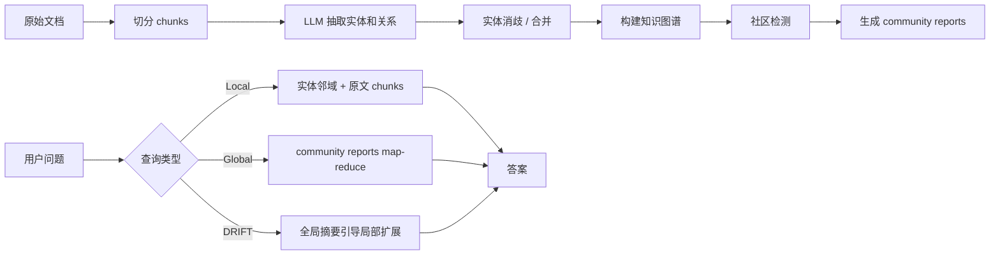

<section class="doc-hero">
  <p class="doc-hero__kicker">RAG 进阶</p>
  <h1>GraphRAG 图增强检索</h1>
  <p class="doc-hero__lead">当问题需要理解一批文档里的实体、关系和主题时，GraphRAG 才值得上场。</p>
  <div class="doc-hero__meta" aria-label="本文信息">
    <span>适合阶段：复杂知识库分析</span>
    <span>核心机制：实体 / 关系 / 社区摘要</span>
    <span>面试重点：Local vs Global Search</span>
  </div>
</section>

> 把文本先组织成图，再沿实体关系和社区摘要检索。

## 面试官想考什么

读完这篇你要能正面回答下面这些题。每题后面括号里是面试官真正想看你答出什么。

<div class="interview-grid">
  <div>
    <strong>GraphRAG 解决的是什么问题？普通向量 RAG 为什么不够？</strong>
    <span>考你是否知道它主要面向全局理解和多跳关系。</span>
  </div>
  <div>
    <strong>Microsoft GraphRAG 的索引阶段做了哪些事？</strong>
    <span>考实体抽取、关系抽取、社区检测、community report。</span>
  </div>
  <div>
    <strong>Local Search 和 Global Search 有什么区别？</strong>
    <span>考具体实体问答 vs 全局主题总结。</span>
  </div>
  <div>
    <strong>GraphRAG 一定比 Vector RAG 好吗？什么时候反而更差？</strong>
    <span>考成本、抽取错误和任务匹配。</span>
  </div>
  <div>
    <strong>实体消歧为什么是 GraphRAG 的关键难点？</strong>
    <span>考真实工程问题：同名、别名、缩写、跨文档合并。</span>
  </div>
  <div>
    <strong>GraphRAG 的成本主要花在哪里？怎么降？</strong>
    <span>考 LLM 抽取、社区摘要、增量更新和 LazyGraphRAG。</span>
  </div>
  <div>
    <strong>GraphRAG 和知识图谱 QA 有什么区别？</strong>
    <span>考是否能区分“临时从文本构图”和“长期治理的 KG”。</span>
  </div>
</div>

---

## 为什么需要 GraphRAG

普通 RAG 擅长回答这种问题：

```text
XPay 退款接口 timeout 最大能设多少？
```

答案在某个 chunk 里，检索到那一段就够了。

GraphRAG 想解决的是另一类问题：

```text
这批客户投诉里，主要风险主题是什么？哪些产品、团队和故障类型被反复关联？
```

这个问题没有单个 chunk 能回答。你需要把几百、几千段文本里的实体和关系串起来：哪个产品被投诉最多，哪些故障和哪个团队相关，哪些主题形成一簇。普通向量检索会拿回 top-K 片段，但 top-K 片段很可能只是局部样本；你问的是全局结构。

Microsoft 的 GraphRAG 论文 [From Local to Global: A Graph RAG Approach to Query-Focused Summarization](https://arxiv.org/abs/2404.16130) 把这个问题称为从 local 到 global 的差异。Local 问题可以围绕实体附近检索；global 问题需要先把语料组织成社区、主题和摘要，再回答"整个数据集里发生了什么"。

所以 GraphRAG 不能理解成 "RAG + Neo4j"。它要做的是：**把无结构文本先变成实体关系图，再把图社区摘要作为全局检索入口。**

## GraphRAG 是怎么工作的

Microsoft GraphRAG 的典型流程分成索引和查询两部分。



GraphRAG 官方文档把 query 分成多种形态：Global Search 用 community reports 做 map-reduce，Local Search 围绕实体、关系、原文片段取上下文，DRIFT Search 则把全局社区信息和局部搜索结合起来。你可以把它理解成三种入口：

| 查询类型 | 适合问题 | 主要上下文 |
|---|---|---|
| Local Search | "A 公司和 B 项目有什么关系？" | 实体邻域、关系、源 chunk |
| Global Search | "这批文档的主要主题是什么？" | 社区摘要、全局 map-reduce |
| DRIFT Search | "围绕某主题逐步深入有哪些证据？" | 社区摘要引导下的局部扩展 |

这也是面试里的重点：GraphRAG 的价值不在"用了图数据库"，而在它把 query 分流到不同检索路径。

## 核心原理 / 关键设计

### 1. 图索引从实体和关系抽取开始

GraphRAG indexing 的第一步是让 LLM 从 chunk 里抽实体和关系。官方架构文档也把 `ExtractGraph` 放在索引管线里。

```text
chunk:
XPay 退款接口由支付网关团队维护。网关在 timeout 超过 300 秒时拒绝请求。

entities:
XPay 退款接口, 支付网关团队, 网关, timeout

relationships:
XPay 退款接口 --由...维护--> 支付网关团队
网关 --拒绝--> timeout 超过 300 秒的请求
```

这里最容易出错的是抽取质量。LLM 可能漏实体、乱合并、抽出泛泛关系。Microsoft GraphRAG 的 prompt tuning 文档专门提供 manual / auto tuning，就是因为不同领域需要不同实体类型和关系抽取提示。医疗、金融、代码仓库、客服工单，抽取 schema 不可能一样。

### 2. 实体消歧决定图能不能用

同一个实体在文档里可能有很多名字：

```text
OpenAI
OpenAI, Inc.
开放人工智能公司
OA
```

如果不合并，图会碎成很多孤岛；如果乱合并，两个不同实体会被揉成一个点。GraphRAG 的真实难点经常在 entity resolution。

```python
ALIASES = {
    "XPay": "xpay",
    "XPay 退款接口": "xpay_refund_api",
    "退款接口": "xpay_refund_api",
    "支付网关团队": "payment_gateway_team",
}


def normalize_entity(name: str) -> str:
    return ALIASES.get(name, name.lower().replace(" ", "_"))
```

这段代码当然很简陋，但方向是真的：生产系统需要别名表、规则、人工校验、模型消歧和增量合并策略。没有实体消歧，社区检测和关系查询都会失真。

### 3. Community reports 是 GraphRAG 的全局入口

GraphRAG 论文的一个重要设计是社区摘要：先在实体关系图上做社区检测，再让 LLM 为每个社区生成 report。Global Search 回答全局问题时，先检索 / 汇总这些 community reports，避免把所有原文直接塞给模型。

```text
社区 A：支付接口、退款、超时、网关拒绝、支付网关团队
社区 B：账号体系、OAuth、token、签名错误、认证团队

问题：这批工单主要风险是什么？
Global Search 会先读社区摘要，再汇总主要主题。
```

这解释了 GraphRAG 为什么适合"全局 sensemaking"。如果你问"这份 500 页文档主要讲了哪些风险"，top-K chunk 很难代表全局；社区摘要能让模型先看到结构化主题。

代价也明显：生成 community reports 要花 LLM 调用。Microsoft 后续提出 LazyGraphRAG，就是因为完整预生成摘要的索引成本对一些场景太高。

### 4. Local Search 要控制邻居扩展

Local Search 看起来像从实体出发找邻居，但实际要组合多种上下文：实体描述、关系、协变量、原始文本片段、可能还有社区报告。

```text
query: XPay 退款接口 timeout 为什么不能超过 300 秒？

Local Search context:
- 实体：XPay 退款接口
- 关系：由支付网关团队维护
- 关系：网关拒绝 timeout > 300 秒请求
- 原文 chunk：timeout 参数范围 1-300 秒...
- 社区摘要：支付网关相关接口遵循统一网关超时限制
```

这比普通向量 top-K 更适合多跳问题，因为它把"关系路径"显式拿出来。但它仍然有边界：如果实体抽取错了，Local Search 会沿着错误图走。

### 5. GraphRAG 要和 Vector RAG 混用

GraphRAG 不应该完全替代向量检索。很多问题仍然是局部事实查找，用普通 hybrid search + reranking 更便宜、更直接。

```python
def route_query(query: str) -> str:
    global_words = ["主要主题", "整体趋势", "有哪些风险", "总结这批"]
    relation_words = ["关系", "影响", "关联", "路径"]
    if any(w in query for w in global_words):
        return "global_graph"
    if any(w in query for w in relation_words):
        return "local_graph"
    return "vector_rag"
```

这也是成熟架构常见的样子：普通事实问答走 Vector RAG；全局总结走 GraphRAG Global；实体关系和多跳问答走 GraphRAG Local；不确定时两路都搜，再融合。

## 怎么用：标准库模拟实体图 + Local / Global Search

下面这段代码不用图数据库，只用标准库演示 GraphRAG 的核心控制流：从文档里抽取实体和关系，构建邻接表，做连通社区，Local Search 找实体邻域，Global Search 汇总社区摘要。真实项目里，实体/关系抽取和摘要生成会由 LLM 完成，图存储可以用 Neo4j、NetworkX、Memgraph、Kuzu 或普通表。

```python
from collections import defaultdict, deque

DOCS = {
    "d1": "XPay 退款接口 由 支付网关团队 维护。退款接口 timeout 超过 300 秒 会被 网关 拒绝。",
    "d2": "XPay 查询订单接口 由 支付网关团队 维护。查询订单 默认 timeout 为 30 秒。",
    "d3": "OAuth 登录接口 由 账号团队 维护。token 过期 会导致 认证失败。",
    "d4": "ERR_AUTH_4017 表示 客户端签名 timestamp 超过 5 分钟。",
    "d5": "支付网关团队 近期 投诉 集中在 退款接口 超时 和 网关拒绝。",
}

KNOWN_ENTITIES = [
    "XPay 退款接口", "XPay 查询订单接口", "支付网关团队", "网关",
    "OAuth 登录接口", "账号团队", "token", "认证失败", "ERR_AUTH_4017",
    "退款接口", "查询订单",
]

ALIASES = {"退款接口": "XPay 退款接口", "查询订单": "XPay 查询订单接口"}


def normalize(entity: str) -> str:
    return ALIASES.get(entity, entity)


def extract_entities(text: str) -> list[str]:
    return [normalize(e) for e in KNOWN_ENTITIES if e in text]


def build_graph(docs: dict[str, str]):
    graph = defaultdict(set)
    mentions = defaultdict(list)

    for doc_id, text in docs.items():
        entities = sorted(set(extract_entities(text)))
        for entity in entities:
            mentions[entity].append(doc_id)
        for i, left in enumerate(entities):
            for right in entities[i + 1:]:
                graph[left].add(right)
                graph[right].add(left)

    return graph, mentions


def connected_components(graph):
    seen, groups = set(), []
    for start in graph:
        if start in seen:
            continue
        queue, group = deque([start]), []
        seen.add(start)
        while queue:
            node = queue.popleft()
            group.append(node)
            for nxt in graph[node]:
                if nxt not in seen:
                    seen.add(nxt)
                    queue.append(nxt)
        groups.append(sorted(group))
    return groups


def local_search(query: str, graph, mentions, hops: int = 1):
    seeds = extract_entities(query)
    visited, queue = set(seeds), deque((s, 0) for s in seeds)
    while queue:
        node, depth = queue.popleft()
        if depth == hops:
            continue
        for nxt in graph[node]:
            if nxt not in visited:
                visited.add(nxt)
                queue.append((nxt, depth + 1))

    doc_ids = sorted({doc_id for entity in visited for doc_id in mentions[entity]})
    return visited, [(doc_id, DOCS[doc_id]) for doc_id in doc_ids]


def global_search(graph, mentions):
    reports = []
    for idx, group in enumerate(connected_components(graph), start=1):
        docs = sorted({doc_id for entity in group for doc_id in mentions[entity]})
        reports.append({
            "community": idx,
            "entities": group,
            "docs": docs,
            "summary": f"社区 {idx} 覆盖 {', '.join(group)}，关联文档 {', '.join(docs)}。",
        })
    return reports


graph, mentions = build_graph(DOCS)

entities, evidence = local_search("XPay 退款接口 和 支付网关团队 有什么关系？", graph, mentions)
print("local entities:", sorted(entities))
for doc_id, text in evidence:
    print(doc_id, text)

print("\nglobal reports:")
for report in global_search(graph, mentions):
    print(report["summary"])
```

这个 demo 故意保留了粗糙感：实体列表、别名表、关系抽取都很简单。GraphRAG 的工程成本正来自这些地方。你可以先用这种小脚本确认任务是否真的需要图，再决定要不要引入完整 GraphRAG 管线。

## 容易踩的坑

### 坑 1：把 GraphRAG 当成向量库升级版

**现象**：原本查单个政策条款很快，换 GraphRAG 后成本更高、延迟更长，答案没变好。

**根因**：单点事实问答不需要图。GraphRAG 擅长全局主题、多跳关系、实体网络，不擅长替代所有 top-K chunk 检索。

**修法**：做 query router。局部事实走普通 RAG；全局总结和关系问题走 GraphRAG；两者都可能有用时并行检索再融合。

### 坑 2：实体抽取不做领域调优

**现象**：图里到处是"系统"、"接口"、"用户"这种泛实体，真正重要的产品名、错误码、团队名反而没抽出来。

**根因**：默认抽取 prompt 不知道你的领域 schema。GraphRAG 官方也提供 prompt tuning，因为 entity/relationship extraction 对领域非常敏感。

**修法**：定义实体类型和关系类型；抽样检查抽取结果；用 manual / auto prompt tuning；必要时加规则抽取错误码、API 名、代码符号。

### 坑 3：实体消歧把图搞碎或搞脏

**现象**：同一个实体有五个节点，或者两个不同实体被合成一个节点。

**根因**：别名、缩写、同名实体没有治理。LLM 抽取出来的是候选，不是干净主数据。

**修法**：维护 alias table、canonical id、人工抽检；高价值实体做实体解析模型；每次增量构图前先查重再合并。

### 坑 4：社区摘要过时

**现象**：新增文档已经改变事实，Global Search 仍然引用旧社区摘要。

**根因**：community report 是派生摘要。文档更新后，如果社区结构或摘要没有增量刷新，图索引就和事实源脱节。

**修法**：把原始文档作为事实源，图和社区摘要作为可重建索引；记录 report 版本、输入文档版本和生成时间；对高频社区做增量更新。

### 坑 5：没有成本预算

**现象**：索引阶段 LLM 调用费用爆炸，项目在 POC 后无法扩到全量数据。

**根因**：GraphRAG 索引要做实体/关系抽取、社区检测、社区摘要生成，比普通 embedding 入库贵很多。Microsoft 也专门讨论过 GraphRAG 成本，并提出 LazyGraphRAG 来降低预处理开销。

**修法**：先在小样本验证任务收益；只对高价值语料构图；降低社区摘要层级；缓存抽取结果；评估 LazyGraphRAG 或按需图扩展。

## 与相似概念的区别

| 概念 | 数据形态 | 主要用途 | 关键代价 |
|---|---|---|---|
| Vector RAG | chunk 向量 | 局部事实问答 | 可能漏多跳关系和全局主题 |
| Hybrid RAG | 向量 + BM25 | 精确词 + 语义召回 | 仍以 chunk 为中心 |
| GraphRAG | 实体、关系、社区摘要 | 多跳关系、全局总结、主题发现 | 构图和摘要成本高 |
| Knowledge Graph QA | 长期治理的结构化 KG | 稳定实体关系查询 | schema 和数据治理重 |
| Agentic RAG | Agent 决定何时查、查哪里 | 多源检索、动态规划 | 控制流复杂，评估难 |

GraphRAG 和知识图谱 QA 最容易混。GraphRAG 通常从非结构化文本临时/半自动抽图，是为了增强检索和总结；知识图谱 QA 更依赖长期维护的 schema、实体 ID、关系约束和数据质量。前者更灵活，后者更可靠。

## 面试题深度解析

**Q1: GraphRAG 解决的是什么问题？**

- **30 秒版本**：它解决普通 RAG 难处理的全局理解和多跳关系问题。普通 RAG 找 top-K chunk，GraphRAG 先从文本抽实体关系和社区摘要，再按实体邻域或社区检索。
- **追问 1**：什么时候没必要？单点事实问答、FAQ、API 参数查询，用 hybrid search + reranker 更便宜。
- **追问 2**：GraphRAG 的重点在索引过程：实体抽取、关系抽取、社区检测和 community reports。图数据库只是可能的存储选择。

**Q2: Local Search 和 Global Search 怎么选？**

- **30 秒版本**：问某个实体、某条关系、某个项目的具体问题，用 Local Search；问整个语料的主题、趋势、风险，用 Global Search。
- **追问 1**：Global Search 为什么不用原文 top-K？因为全局问题需要覆盖整个语料，top-K chunk 只是局部样本。community reports 是更适合全局汇总的中间层。
- **追问 2**：DRIFT Search 是什么？它试图结合 global 和 local：先用社区信息给方向，再沿局部实体和原文深入。

**Q3: GraphRAG 的最大工程风险是什么？**

- **30 秒版本**：索引成本和抽取质量。LLM 抽实体关系会错，社区摘要会过时，构图比普通 embedding 入库贵。
- **追问 1**：怎么控质量？领域 prompt tuning、实体类型 schema、别名消歧、抽样验收、trace 每条答案来自哪些实体/关系/原文。
- **追问 2**：怎么控成本？小样本验证、只构高价值语料、缓存抽取结果、减少社区层级、评估 LazyGraphRAG 或按需构图。

**Q4: GraphRAG 怎么评估？**

- **30 秒版本**：分 Local 和 Global。Local 看多跳 QA、实体关系命中、引用准确率；Global 看主题覆盖率、摘要一致性、遗漏率和人工偏好。
- **追问 1**：只看答案准确率够吗？不够。还要看图抽取质量：实体 precision/recall、关系 precision、社区是否可解释。
- **追问 2**：线上要记录什么？query 路由、命中的实体、关系路径、community report、原文 chunk、最终引用。没有这些 trace，GraphRAG 很难 debug。

## 延伸阅读

- 论文：[From Local to Global: A Graph RAG Approach to Query-Focused Summarization](https://arxiv.org/abs/2404.16130) — Microsoft GraphRAG 核心论文，理解 local/global 的任务差异。
- 文档：[GraphRAG Indexing Architecture](https://microsoft.github.io/graphrag/index/architecture/) — 看官方索引管线和 knowledge model。
- 文档：[GraphRAG Query Overview](https://microsoft.github.io/graphrag/query/overview/) — 看 Global、Local、DRIFT 等查询模式。
- 文档：[GraphRAG Global Search](https://microsoft.github.io/graphrag/examples_notebooks/global_search/) — 看 community reports 如何参与全局搜索。
- 文档：[GraphRAG Local Search](https://microsoft.github.io/graphrag/examples_notebooks/local_search/) — 看实体、关系、原文片段如何组成局部上下文。
- 文档：[GraphRAG Manual Prompt Tuning](https://microsoft.github.io/graphrag/prompt_tuning/manual_prompt_tuning/) — 看实体/关系抽取和 community report prompt 为什么需要调优。
- 博客：[Introducing DRIFT Search](https://www.microsoft.com/en-us/research/blog/introducing-drift-search-combining-global-and-local-search-methods-to-improve-quality-and-efficiency/) — 理解 Microsoft 如何把全局和局部搜索结合。
- 博客：[LazyGraphRAG](https://www.microsoft.com/en-us/research/blog/lazygraphrag-setting-a-new-standard-for-quality-and-cost/) — 关注 GraphRAG 成本问题和按需图检索方向。
- 综述：[Graph Retrieval-Augmented Generation: A Survey](https://arxiv.org/abs/2408.08921) — 想系统看 GraphRAG 分类和研究版图，可以从这篇开始。
