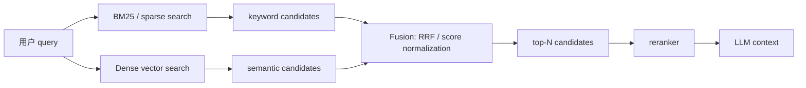

<section class="doc-hero">
  <p class="doc-hero__kicker">RAG 检索优化</p>
  <h1>混合检索 Hybrid Search</h1>
  <p class="doc-hero__lead">让关键词精确匹配和语义向量召回互相补位，别让 RAG 输在第一轮候选。</p>
  <div class="doc-hero__meta" aria-label="本文信息">
    <span>适合阶段：向量检索之后</span>
    <span>核心机制：BM25 + Dense + RRF</span>
    <span>面试重点：分数尺度与候选融合</span>
  </div>
</section>

> 同时召回关键词命中和语义命中的候选，再融合排序。

## 面试官想考什么

读完这篇你要能正面回答下面这些题。每题后面括号里是面试官真正想看你答出什么。

<div class="interview-grid">
  <div>
    <strong>BM25 解决什么问题？为什么不是词频越高越相关？</strong>
    <span>考 IDF、词频饱和、文档长度归一化。</span>
  </div>
  <div>
    <strong>Dense retrieval 和 BM25 的根本差异是什么？</strong>
    <span>考语义召回和词项匹配的边界。</span>
  </div>
  <div>
    <strong>为什么 RAG 里常用 Hybrid Search？</strong>
    <span>考精确术语和语义改写两类 query 的互补。</span>
  </div>
  <div>
    <strong>Hybrid Search 是分数相加，还是结果融合？</strong>
    <span>考 score normalization、rank fusion、RRF 的区别。</span>
  </div>
  <div>
    <strong>为什么不能直接把 BM25 score 和 cosine similarity 相加？</strong>
    <span>考分数尺度问题，生产里非常常见。</span>
  </div>
  <div>
    <strong>RRF 的公式是什么？`k=60` 是什么意思？</strong>
    <span>考是否真懂融合，而不是只会调库。</span>
  </div>
  <div>
    <strong>Hybrid Search 后还需要 reranker 吗？</strong>
    <span>考召回和精排的职责边界。</span>
  </div>
</div>

---

## 为什么需要混合检索

只用向量检索时，RAG 经常在这种问题上翻车：

```text
用户问题：ERR_AUTH_4017 怎么处理？

文档 A：ERR_AUTH_4017：客户端签名 timestamp 超过 5 分钟，请重新生成签名。
文档 B：认证失败通常由 token 过期、签名错误、权限不足导致。
文档 C：OAuth 登录失败排查指南。
```

Dense embedding 很擅长把 "认证失败"、"登录失败"、"token 过期" 拉近，但它可能把精确错误码 `ERR_AUTH_4017` 稀释掉。BM25 反过来：只要错误码 token 保留得好，它会非常坚定地把 A 排到前面。

再换一个问题：

```text
用户问题：员工离职后股票期权还能保留多久？

文档 A：离职员工已归属期权的行权窗口为 90 天。
文档 B：离职手续包括账号注销和资产归还。
```

BM25 会抓住"离职"、"期权"，但未必知道"保留多久"和"行权窗口"是一回事。Dense retrieval 更容易把 A 找出来。

混合检索解决的就是这个矛盾：**BM25 负责精确词、编号、错误码、API 名；dense retrieval 负责同义改写、口语 query、语义近邻。** 两路都召回，再融合排序，给后面的 reranker 和 LLM 更完整的候选集。

这不是新概念。BM25 的理论背景可以追到 Robertson & Zaragoza 的 [The Probabilistic Relevance Framework: BM25 and Beyond](https://www.nowpublishers.com/article/Details/INR-019)；dense retrieval 的代表性工作 DPR 在 [Dense Passage Retrieval for Open-Domain Question Answering](https://arxiv.org/abs/2004.04906) 里和 Lucene-BM25 做过对比；RRF 则来自 Cormack et al. 2009 的 [Reciprocal Rank Fusion](https://dl.acm.org/doi/10.1145/1571941.1572114)。

## 混合检索是怎么工作的

它实际做了三步：同一个 query 同时跑 BM25 和 dense 向量检索；每一路取一个较大的候选集；用 RRF、归一化加权或平台内置 fusion 合成最终排序。



这里最重要的一点：**Hybrid Search 偏召回，不是最终裁判。** 它的目标是让正确 chunk 进入候选池。候选池进来后，通常还要用 reranker 做精排，再喂给 LLM。下一篇 [重排序 Reranking](./reranking) 会专门讲这一步。

## 核心原理 / 关键设计

### 1. BM25 的三个信号：IDF、词频饱和、长度归一化

BM25 并非只数词频。一个词在 query 和文档里同时出现，只是基础；它还会看这个词在全库里稀不稀有、在当前文档里出现几次、文档长度是否偏长。

```python
idf = log(1 + (N - df + 0.5) / (df + 0.5))
score += idf * tf * (k1 + 1) / (tf + k1 * (1 - b + b * doc_len / avg_doc_len))
```

直觉：

- `idf`：越少见的词越重要。`ERR_AUTH_4017` 比 `the` 重要。
- `tf` 饱和：出现 10 次不该比出现 1 次重要 10 倍。
- `b` 长度归一化：长文档天然词多，不能因此占便宜。

Lucene 的 `BM25Similarity` 默认 `k1=1.2`、`b=0.75`。面试里如果能讲出这两个参数，你就已经比"BM25 就是关键词搜索"深一层了。

### 2. Dense retrieval 补的是语义缺口

Dense retrieval 把 query 和 chunk 编成向量，再用余弦相似度或点积取近邻。它擅长这种问题：

```text
query: 离职后股票还能保留多久？
chunk: 已归属期权的行权窗口为 90 天。
```

BM25 看不到"保留多久"和"行权窗口"的关系；dense 模型如果训练得好，可以把它们拉近。但 dense 也会犯错：错误码、函数名、配置键、法规条款号这些精确符号，往往不是语义相近就行。

所以 hybrid 的出发点很直接：用户问题有两类：

| Query 类型 | 例子 | 更依赖 |
|---|---|---|
| 精确型 | `ERR_AUTH_4017`、`gpt-4o-mini`、`timeout_ms` | BM25 / sparse |
| 语义型 | "离职后期权还能保留多久" | Dense |
| 混合型 | "XPay 退款接口 timeout 配置" | BM25 + Dense |

### 3. 直接相加分数通常是错的

BM25 分数没有固定上界，cosine similarity 常见范围是 `[-1, 1]` 或 `[0, 1]`，dot product 又取决于向量归一化。直接相加很容易让某一路支配结果。

```python
bad_score = 0.5 * bm25_score + 0.5 * cosine_score
```

这行看起来公平，实际上可能完全不公平。Pinecone 的 hybrid search 文档明确提醒：BM25 / sparse 分数和 dense cosine 范围不归一，不加权时 sparse 可能支配结果。OpenSearch 的 normalization processor 也是为了解决这个问题：先归一化，再合并不同检索子句的分数。

如果没有稳定评测集，RRF 通常比手写分数相加更安全。

### 4. RRF 用排名融合，避开分数尺度

RRF（Reciprocal Rank Fusion）不看原始分数，只看每个检索器给出的排名：

```text
RRF(doc) = Σ 1 / (k + rank_i(doc))
```

如果某个文档在 BM25 里排第 2，在 dense 里排第 5，`k=60`：

```python
score = 1 / (60 + 2) + 1 / (60 + 5)
```

它的直觉很清楚：排名越靠前，贡献越大；同时被多路检索器命中，也会叠加加分。`k=60` 是常见默认值，用来减弱低排名结果的影响，让前几名之间的差距不要过于夸张。Azure AI Search 和 Elasticsearch 都把 RRF 作为 hybrid / multi-retriever 融合方案写进官方文档。

### 5. 候选集大小决定 RRF 的上限

RRF 只能融合已经取回的候选，不能凭空救回漏掉的文档。

```python
bm25_top = bm25_search(query, k=20)
dense_top = vector_search(query, k=20)
final_top = rrf(bm25_top, dense_top)[:5]
```

如果正确文档在 BM25 排第 80、dense 排第 70，而你每路只取 top-20，它永远进不了 RRF。生产里常见做法是每路先取 50 或 100，再融合成 top-20，最后 rerank 到 top-5。这个候选大小要用 `recall@k` 和延迟一起调。

## 怎么用：标准库实现 BM25 + Dense + RRF

下面这段代码只用 Python 标准库。`hash_embedding()` 不是语义模型，只是为了本地演示 dense 排序流程；真实项目里把它换成 OpenAI / BGE / Voyage embedding，把 BM25 换成 Elasticsearch / OpenSearch / PostgreSQL FTS / Weaviate / Qdrant sparse 即可。

```python
import hashlib
import math
import re
from collections import Counter, defaultdict

DOCS = [
    "BM25 is a strong lexical baseline for exact terms in search systems.",
    "Dense vector retrieval maps text into embeddings and compares cosine similarity.",
    "Hybrid search combines keyword search and vector search before reranking.",
    "Reciprocal rank fusion merges ranked lists without normalizing raw scores.",
    "RAG retrieval benefits from both exact product names and semantic paraphrases.",
    "Python standard library can build a tiny BM25 and hash embedding demo.",
]
QUERY = "hybrid RAG search with BM25 vector fusion"

TOKEN_RE = re.compile(r"[a-z0-9]+")


def tok(text: str) -> list[str]:
    return TOKEN_RE.findall(text.lower())


def bm25_scores(query: str, docs: list[str], k1: float = 1.5, b: float = 0.75):
    doc_tokens = [tok(d) for d in docs]
    avgdl = sum(map(len, doc_tokens)) / len(doc_tokens)
    df = Counter(t for terms in doc_tokens for t in set(terms))
    q = tok(query)
    scores = []

    for i, terms in enumerate(doc_tokens):
        tf, dl, score = Counter(terms), len(terms), 0.0
        for term in q:
            if term not in tf:
                continue
            idf = math.log(1 + (len(docs) - df[term] + 0.5) / (df[term] + 0.5))
            denom = tf[term] + k1 * (1 - b + b * dl / avgdl)
            score += idf * tf[term] * (k1 + 1) / denom
        scores.append((i, score))

    return sorted(scores, key=lambda x: x[1], reverse=True)


def hash_embedding(text: str, dims: int = 64) -> list[float]:
    vec = [0.0] * dims
    for term in tok(text):
        h = hashlib.blake2b(term.encode(), digest_size=8).digest()
        n = int.from_bytes(h, "little")
        vec[n % dims] += 1.0 if (n >> 8) & 1 else -1.0

    norm = math.sqrt(sum(x * x for x in vec)) or 1.0
    return [x / norm for x in vec]


def cosine(a: list[float], b: list[float]) -> float:
    return sum(x * y for x, y in zip(a, b))


def dense_scores(query: str, docs: list[str]):
    qv = hash_embedding(query)
    return sorted(
        [(i, cosine(qv, hash_embedding(d))) for i, d in enumerate(docs)],
        key=lambda x: x[1],
        reverse=True,
    )


def rrf(*ranked_lists, k: int = 60):
    fused = defaultdict(float)
    parts = defaultdict(list)

    for name, ranked in ranked_lists:
        for rank, (doc_id, raw_score) in enumerate(ranked, start=1):
            fused[doc_id] += 1.0 / (k + rank)
            parts[doc_id].append(f"{name}#{rank}={raw_score:.3f}")

    return sorted(fused.items(), key=lambda x: x[1], reverse=True), parts


bm25 = bm25_scores(QUERY, DOCS)
dense = dense_scores(QUERY, DOCS)
fused, why = rrf(("bm25", bm25), ("hash", dense))

print(f"query: {QUERY}\n")
for rank, (doc_id, score) in enumerate(fused[:5], start=1):
    print(f"{rank}. score={score:.4f} doc={doc_id} | {'; '.join(why[doc_id])}")
    print(f"   {DOCS[doc_id]}")
```

你应该关注输出里的 `bm25#...` 和 `hash#...`。如果某个文档同时被两路排到前面，它的 RRF 分数会更高；如果只被一路命中，也有机会进入候选，但分数通常不如"两路都认可"的结果。

真实项目里要把这段脚本扩展成评测：

```python
def evaluate(queries, gold_ids, retriever, k=10):
    hits = 0
    for query, gold in zip(queries, gold_ids):
        ranked = retriever(query)[:k]
        hits += int(any(doc_id in gold for doc_id, _ in ranked))
    return hits / len(queries)
```

分别测 BM25、dense、hybrid 三条曲线。只要你没有这三条曲线，就很难判断 hybrid 是真的提升，还是只是多加了一层复杂度。

## 容易踩的坑

### 坑 1：直接相加导致某一路支配结果

**现象**：混合检索看起来开了，但结果几乎全是 BM25，或者几乎全是向量结果。

**根因**：BM25、sparse score、cosine、dot product 不在同一个尺度。Pinecone 文档明确说，单 index sparse+dense 混合时，不加权可能让 sparse component 支配结果。Azure AI Search 文档也把 BM25、vector score、RRF score 分开解释。

**修法**：优先用 RRF；如果必须分数融合，先做 min-max / z-score / 平台内置 normalization，再用评测集调权重。

### 坑 2：每路 candidate 太少

**现象**：RRF 后召回没有提升，甚至比纯 dense 差。

**根因**：BM25 和 dense 各自只取 top-5，正确文档还没进入融合池就被截断。RRF 只能融合列表里的文档，救不了没取回的候选。

**修法**：每路先取更大的候选，例如 top-50 或 top-100，再融合到 top-20，最后 rerank 到 top-5。调参时同时看 recall@k 和 p95 latency。

### 坑 3：技术文档的 analyzer 把符号切坏了

**现象**：API 名、错误码、配置项搜不到，BM25 分支没有贡献。

**根因**：分词、lowercase、停用词、符号清洗把 `ERR_AUTH_4017`、`timeout_ms`、`gpt-4o-mini` 拆坏了。BM25 的强项是精确词；词都被 analyzer 处理没了，它当然帮不上忙。

**修法**：为代码、错误码、配置键保留原文 token；对标题、代码块、表格字段做单独索引；必要时用 keyword field、ngram 或 BM25F。

### 坑 4：Hybrid 比纯向量更差

**现象**：加了 BM25 后，正确语义候选被一堆关键词命中的噪声挤下去。

**根因**：BM25 分支质量低，可能来自 OCR 噪声、表格解析差、chunk 太碎、语言 analyzer 不匹配。一个烂 ranker 参与 RRF，确实会拖累结果。

**修法**：分别评测 BM25、dense、hybrid。先修 BM25 分支的解析和 analyzer，再调融合权重。不要默认 hybrid 一定赢。

### 坑 5：把 Hybrid 当 reranker

**现象**：Hybrid 召回了正确 chunk，但最终答案仍引用错片段。

**根因**：Hybrid 只是在多路候选里做融合，判断粒度仍然粗。它不知道 query 和 chunk 每句话的细粒度对应关系，也不能修复 chunk 边界和 metadata 错误。

**修法**：Hybrid 后接 reranker；rerank 后做去重、相邻 chunk 合并和来源保留。不要把召回层当精排层。

## 与相似概念的区别

| 概念 | 解决的问题 | 典型做法 | 什么时候用 |
|---|---|---|---|
| BM25 | 精确词、错误码、术语 | 倒排索引 + IDF + 长度归一化 | 领域术语强、query 含精确字符串 |
| Dense retrieval | 同义改写、语义近邻 | embedding + vector search | 用户口语化、问题和文档措辞不同 |
| Hybrid search | 召回更全的候选池 | BM25 + dense + RRF / 归一化融合 | 生产 RAG 的默认候选召回层 |
| Sparse embedding | 学习型词项权重 | SPLADE / sparse vector | 想保留 lexical 信号但比 BM25 更语义化 |
| Reranker | 精排候选 | query-doc cross encoder | Hybrid 召回之后，最终 top-5 前 |

Weaviate 的 hybrid search 用 `alpha` 控制 vector 和 keyword 权重；Qdrant 支持 dense/sparse prefetch 后用 `rrf` 或 `dbsf` 融合；Elasticsearch 和 Azure AI Search 都把 RRF 作为多检索器结果融合方案。名字不同，本质都在处理同一件事：**让不同检索信号进入同一个候选排序。**

## 面试题深度解析

**Q1: 为什么不能直接把 BM25 score 和 cosine similarity 相加？**

- **30 秒版本**：因为分数尺度不同。BM25 无固定上界，cosine 通常在有限范围内；直接相加会让某一路支配结果。
- **追问 1**：那怎么融合？没有评测集时优先 RRF，因为它只看排名；有评测集时可以做归一化加权，调 `alpha` 或权重。
- **追问 2**：怎么证明融合有效？分别跑 BM25、dense、hybrid 的 recall@k / MRR / answer accuracy，不能只看几个例子。

**Q2: RRF 的公式和直觉是什么？**

- **30 秒版本**：`score(doc)=Σ 1/(k+rank_i)`。文档在某一路排得越靠前贡献越大；多路都命中的文档会叠加。
- **追问 1**：`k=60` 是什么？它是平滑参数，减弱排名靠后的结果影响，也避免第一名过度碾压后面。常用默认是 60，但要按候选长度调。
- **追问 2**：RRF 有什么缺点？它不看原始相关性分数，也不知道某一路 ranker 是否质量很差；如果 BM25 分支噪声很多，RRF 也可能被拖累。

**Q3: Hybrid Search 后还需要 reranker 吗？**

- **30 秒版本**：通常需要。Hybrid 负责召回更全，reranker 负责精排更准。召回层看的是"候选别漏"，精排层看的是"最终 top-5 别错"。
- **追问 1**：为什么不直接让 hybrid 出最终答案上下文？BM25 和 dense 都是粗粒度信号，无法充分判断 query-doc 细节匹配；cross-encoder reranker 能一起读 query 和 doc。
- **追问 2**：候选怎么配？常见是 BM25 top-50 + dense top-50，RRF 成 top-30，再 rerank 到 top-5。具体值用评测和延迟调。

**Q4: Hybrid 比纯向量更差时怎么 debug？**

- **30 秒版本**：先拆开看 BM25、dense、hybrid 三套结果。不要直接调融合参数，先确认哪一路质量差。
- **追问 1**：BM25 分支差怎么办？检查 analyzer、停用词、大小写、代码/错误码 token、PDF/OCR 文本质量、chunk 标题是否入索引。
- **追问 2**：dense 分支差怎么办？回到 embedding 和 chunking：模型是否适配语言和领域，query/document instruction 是否正确，chunk 是否切坏。

## 延伸阅读

- 论文：[The Probabilistic Relevance Framework: BM25 and Beyond](https://www.nowpublishers.com/article/Details/INR-019) — BM25 背后的概率检索框架和参数设计。
- 论文：[Dense Passage Retrieval for Open-Domain Question Answering](https://arxiv.org/abs/2004.04906) — 理解 dense retrieval 为什么能补 BM25 的语义缺口。
- 论文：[Reciprocal Rank Fusion outperforms Condorcet and individual Rank Learning Methods](https://dl.acm.org/doi/10.1145/1571941.1572114) — RRF 原始论文，读它是为了理解为什么 rank fusion 简单但很稳。
- 文档：[Weaviate Hybrid Search](https://weaviate.io/developers/weaviate/search/hybrid) — 看 `alpha`、fusion strategy、`explainScore` 等工程参数。
- 文档：[Qdrant Hybrid Queries](https://qdrant.tech/documentation/search/hybrid-queries/) — 看 dense / sparse prefetch 后用 RRF 或 DBSF 融合的实现方式。
- 文档：[Pinecone Hybrid Search](https://docs.pinecone.io/guides/search/hybrid-search) — 重点看 sparse 与 dense 分数不归一时的权重问题。
- 文档：[Elasticsearch RRF Retriever](https://www.elastic.co/guide/en/elasticsearch/reference/current/rrf.html) — 看 lexical retriever 和 dense retriever 如何用 RRF 合并。
- 文档：[OpenSearch Hybrid Search](https://docs.opensearch.org/docs/latest/vector-search/ai-search/hybrid-search/index/) — 看 normalization processor 和 hybrid query pipeline。
- 文档：[Azure AI Search Hybrid Ranking](https://learn.microsoft.com/en-us/azure/search/hybrid-search-ranking) — 官方清楚解释了 BM25、vector、RRF score 的区别。
- 源码文档：[Lucene BM25Similarity](https://lucene.apache.org/core/7_1_0/core/org/apache/lucene/search/similarities/BM25Similarity.html) — 查 Lucene 默认 `k1=1.2`、`b=0.75` 和长度归一化实现。
