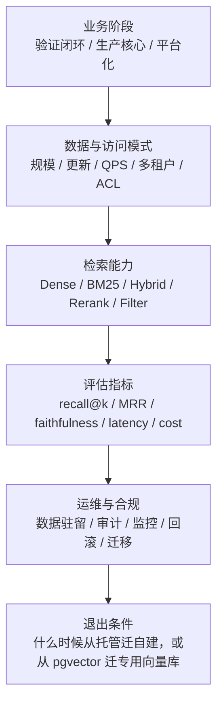

<section class="doc-hero">
  <p class="doc-hero__kicker">匿名真实面经</p>
  <h1>RAG 选型面试深挖：别再说“当时就用了”</h1>
  <p class="doc-hero__lead">RAG 选型题考的不是你用过哪个平台，而是你有没有一套能经得起追问的决策框架。</p>
  <div class="doc-hero__meta" aria-label="本文信息">
    <span>适合阶段：Agent 工程师 / 平台面 / 项目深挖</span>
    <span>核心能力：托管 vs 自建 · recall@k · rerank · 退出条件</span>
    <span>脱敏原则：只保留技术取舍，不保留项目细节</span>
  </div>
</section>

> “用了某某知识库平台”不是答案。面试官真正追的是：为什么先用它、风险是什么、怎么评估、什么时候换。

> **本文边界**：这篇是面试追问型文章，不重复讲 RAG 基础链路。Naive RAG 见 [Naive RAG 与瓶颈](./basics)，向量库参数见 [向量数据库对比](./vector-db)，BM25 + Dense 见 [混合检索](./hybrid-search)，reranker 见 [重排序](./reranking)，评估指标见 [RAG 评估](./evaluation)。

> **脱敏说明**：本文来自多场 Agent/RAG 项目面试里反复出现的选型追问。文中不出现公司名、项目名、用户规模、业务指标、内部系统名；案例统一改写成通用“企业知识库 / 业务内容推荐 / 私有文档问答”场景。

## 面试官想考什么

这组问题的杀伤力很强，因为它能把“做过一个 RAG demo”和“能为生产系统做技术判断”直接分开。

<div class="interview-grid">
  <div>
    <strong>你们为什么选托管知识库平台，而不是自建 Milvus / pgvector / Elasticsearch？</strong>
    <span>考你能不能讲交付周期、运维成本、可控性、评估指标和退出条件。</span>
  </div>
  <div>
    <strong>如果当时没有做横向对比，面试里怎么诚实回答？</strong>
    <span>考成熟度：承认阶段性选择，同时补上现在会怎么验证。</span>
  </div>
  <div>
    <strong>RAG 方案选型要看哪些指标？只看最终答案行不行？</strong>
    <span>考 retrieval、grounding、answer quality、latency、cost 的分层意识。</span>
  </div>
  <div>
    <strong>什么时候用 pgvector，什么时候上专用向量库？</strong>
    <span>考规模、过滤、更新、运维复杂度和团队能力之间的取舍。</span>
  </div>
  <div>
    <strong>为什么生产 RAG 往往要混合检索和 rerank？</strong>
    <span>考你是否知道精确词、错误码、专有名词靠 BM25 更稳，语义改写靠 dense 更稳。</span>
  </div>
  <div>
    <strong>TopK、相似度阈值、chunk size 怎么调？</strong>
    <span>考你有没有用评估集调参，而不是在控制台凭感觉拖滑块。</span>
  </div>
  <div>
    <strong>如果后面从托管迁到自建，怎么保证效果不回退？</strong>
    <span>考 index version、case-level diff、shadow run 和灰度切换。</span>
  </div>
  <div>
    <strong>权限、审计、数据驻留会怎么影响 RAG 选型？</strong>
    <span>考多租户和合规意识：检索层过滤不是 UI 层过滤。</span>
  </div>
</div>

## 为什么“用了托管平台”不是一个合格答案

面试里最危险的回答长这样：

```text
我们把文档导出成 Markdown，接入托管知识库平台。
平台支持智能切分、向量检索、关键词检索和重排，所以我们没有自己搭向量库。
```

这段技术上可能是真的，但面试官会继续追：

```text
为什么是它？
有没有和自建方案对比？
召回效果怎么评估？
chunk 策略调过吗？
相似度阈值怎么设？
如果知识库变大或要做权限过滤，你还会这么选吗？
```

如果你只答“当时没有对比”，会给人一种感觉：这个方案是被工具推着走的，不是你判断出来的。

更稳的答法是先把阶段讲清：

```text
第一阶段我会优先托管知识库，因为目标是快速验证业务闭环：文档导入、切分、embedding、向量存储、query 改写、rerank 都能少搭一层基础设施。
但这不是无条件选择。我会同时设评估集和退出条件：看 recall@k、MRR、faithfulness、P95 延迟、单次成本、权限过滤、审计和可迁移性。
如果后续出现个性化召回、复杂 ACL、大规模更新、深度调参或成本不可控，就迁到自建检索链路。
```

这句话的关键不是“托管更好”或“自建更好”，而是：**先把工程阶段、判断指标、退出条件说出来**。

RAG 原论文把模型参数里的知识和外部非参数记忆结合起来，用 dense index 访问外部知识；它的出发点就是让模型能访问可更新、可溯源的知识，而不是背一个产品名。到了工程面试，RAG 选型也应该围绕“外部知识怎么被可靠召回和验证”展开。

## RAG 选型的五层框架

一套能扛追问的 RAG 选型回答，至少要拆五层：



面试里你可以把它压成一句：

```text
我会按阶段、数据规模、检索能力、评估指标和运维合规五层做选型；每个选择都要有退出条件，而不是一次选完永远不改。
```

### 第一层：先判断 RAG 在系统里有多核心

RAG 的权重不同，选型也不同。

| RAG 角色 | 典型场景 | 合理选择 |
|---|---|---|
| 辅助推荐 | 回答后推荐相关文章、补充阅读 | 托管知识库优先，重点看接入速度和成本 |
| 问答增强 | 企业文档问答、客服 SOP | 托管或自建都可，必须有评估集和引用链 |
| 核心搜索 | 文档检索、代码检索、金融/法律专业查询 | 更偏自建或可深度控制的搜索平台 |
| 平台能力 | 多业务域共用知识库、权限复杂 | 自建检索服务或托管 + 强治理层 |

如果 RAG 只是辅助推荐，托管平台是合理工程取舍；如果 RAG 是用户体验的核心，面试官会期待你讲出更多控制面：索引版本、召回指标、rerank、权限过滤、监控、回滚。

### 第二层：数据规模和更新模式决定基础设施

同样是“知识库”，10 万个 chunk 和 1 亿个 chunk 不是一回事；每天批量更新和每分钟增量更新也不是一回事。

| 维度 | 该问的问题 | 影响 |
|---|---|---|
| 数据量 | chunk 是十万、百万、千万还是上亿 | pgvector / 专用向量库 / 托管搜索的边界 |
| 更新频率 | 离线导入、每日同步、实时增量 | 索引重建、热更新、回滚策略 |
| 查询 QPS | 内部低频还是用户高频 | 延迟、缓存、扩缩容、成本 |
| 过滤复杂度 | tenant、部门、文档 ACL、多语言 | metadata filter 是否会伤召回 |
| 文档形态 | Markdown、PDF、表格、图片、代码 | chunking、解析、字段索引、multimodal |

pgvector README 对 HNSW 和 IVFFlat 的描述就很适合面试引用：HNSW 的速度/召回取舍更好，但构建更慢、内存更多；IVFFlat 构建更快、内存更少，但查询速度/召回取舍较弱。这说明“用 PostgreSQL 顺手存向量”不是不行，关键是你知道它的边界。

### 第三层：检索能力不是“向量相似度”四个字

生产 RAG 通常需要不止 dense retrieval。

| 能力 | 解决什么问题 | 什么时候变成刚需 |
|---|---|---|
| Dense vector | 语义改写、口语问题、同义表达 | 用户问题自然语言化明显 |
| BM25 / sparse | 错误码、术语、编号、API 名 | 文档里有大量精确符号 |
| Hybrid search | dense 和 BM25 互补 | 企业知识库、代码、产品文档 |
| Rerank | 候选多、top-k 噪声大 | top-20 里有答案但 top-5 不稳 |
| Metadata filter | 租户、权限、语言、版本过滤 | 多租户、合规、个性化 |
| Citation / source | 回答可溯源 | 客服、合规、专业问答 |

Microsoft Azure AI Search 文档把 hybrid search 描述为 full-text 和 vector 并行执行，再用 RRF 合并结果；Milvus 文档也强调 sparse 和 dense 的互补：dense 捕捉语义关系，sparse 对精确关键词有效。面试里别只说“支持混合检索”，要说清它解决哪类 query。

### 第四层：评估指标要提前绑定选型

没有 eval 的选型，本质是体感。

| 层 | 指标 | 解释 |
|---|---|---|
| Retrieval | recall@k、MRR、NDCG | 正确证据有没有进 top-k，排得多靠前 |
| Context | context precision、context recall | 给 LLM 的上下文是不是相关、是否覆盖答案 |
| Generation | faithfulness、answer correctness | 回答是否忠于资料、是否答对问题 |
| System | P95 latency、token cost、index freshness | 用户体验和工程成本 |
| Governance | ACL miss、wrong citation、stale doc hit | 权限、引用、旧文档误召回 |

RAGAS 论文把评估拆成检索上下文、忠实使用上下文和生成质量几个维度；BEIR 则提醒我们，检索模型在同质数据上表现好，不代表跨领域稳，BM25 仍是强基线，reranking / late interaction 通常效果强但成本高。这些都支持同一个结论：RAG 选型不能只看最终答案，更要拆层归因。

### 第五层：退出条件比“最终选择”更重要

面试官喜欢听“什么时候换方案”，因为这能看出你是否真的理解边界。

| 当前方案 | 继续用的条件 | 触发迁移的信号 |
|---|---|---|
| 托管知识库 | 数据量适中、权限简单、调参需求有限、交付优先 | 需要复杂 ACL、深度调 index、审计、成本压缩、跨云迁移 |
| pgvector | 团队已有 PostgreSQL、数据量不大、过滤简单、组件少 | HNSW 内存压力、QPS 上升、复杂 ANN + filter、更新/重建压力 |
| Milvus / Qdrant / Weaviate | 检索是核心能力、需要专门索引和过滤 | 团队没有运维能力、数据规模不足、只是辅助场景 |
| Elasticsearch / OpenSearch hybrid | 已有全文检索资产、关键词强、需要 RRF | 语义向量能力或向量规模不是它擅长的部分 |

阿里云 Model Studio 知识库文档很适合做“托管平台边界”的例子：它提供相似度阈值、最大召回数、reranking、内置向量库和 ADB-PG 选择；同时文档也说明，阈值过高会丢相关 chunk，TopK 增大可能提升回答准确性但会增加输入 token。这说明即便是托管平台，也不是“点一下就结束”，仍然要调 recall/precision/cost。

## 一个可复用的面试回答模板

遇到“为什么选 X”这类题，可以用四步：

```text
1. 先给阶段判断：当时是快速验证、生产核心，还是平台化。
2. 再给权衡轴：召回质量、调参能力、运维成本、权限合规、迁移成本。
3. 锚到指标：recall@k、MRR、faithfulness、P95 latency、cost、ACL 错误率。
4. 主动给退出条件：什么时候从托管迁自建，或从轻量库迁专用检索层。
```

套到托管知识库场景：

```text
第一阶段我会选托管知识库，不是因为它一定比自建强，而是因为这个阶段 RAG 不是核心搜索引擎，目标是快速跑通文档导入、切分、embedding、召回、rerank 和引用链。
但我会同时建一套小评估集，至少看 recall@k、MRR、faithfulness、P95 延迟和单次成本。
如果后续数据规模、ACL、审计、索引调参或成本触发阈值，就把托管平台当成 first version，迁到自建向量库 + hybrid search + rerank 的链路。
```

这段话既诚实，又有工程判断。它不会假装当时做了不存在的横评，但也不会把自己放在“工具用户”的位置。

## 怎么做一个最小 RAG 选型矩阵

下面这段 Python 代码不是产品评分器，而是把面试中的取舍轴写成可讨论的结构。你可以把它当作技术评审会里的起点。

```python
from __future__ import annotations

from dataclasses import dataclass


@dataclass(frozen=True)
class RagRequirement:
    stage: str                 # prototype / production / platform
    chunks: int
    qps: int
    needs_hybrid: bool
    needs_complex_acl: bool
    needs_deep_tuning: bool
    ops_team_ready: bool
    cloud_lock_in_sensitive: bool


@dataclass(frozen=True)
class RagOption:
    name: str
    score: int
    reasons: list[str]
    exit_conditions: list[str]


def choose_rag(req: RagRequirement) -> RagOption:
    managed_score = 0
    pgvector_score = 0
    vector_db_score = 0
    reasons: dict[str, list[str]] = {
        "managed": [],
        "pgvector": [],
        "vector_db": [],
    }

    if req.stage == "prototype":
        managed_score += 4
        reasons["managed"].append("验证阶段优先减少基础设施建设")
    if req.stage == "platform":
        vector_db_score += 4
        reasons["vector_db"].append("平台化通常需要更强索引、权限、审计和迁移控制")

    if req.chunks < 1_000_000 and req.qps < 20:
        pgvector_score += 3
        reasons["pgvector"].append("规模和 QPS 不高时，少一个独立组件更划算")
    elif req.chunks > 10_000_000 or req.qps > 100:
        vector_db_score += 4
        reasons["vector_db"].append("高规模或高 QPS 更适合专用检索基础设施")

    if req.needs_hybrid:
        managed_score += 1
        vector_db_score += 2
        reasons["vector_db"].append("混合检索需要明确控制 BM25、dense 和融合策略")

    if req.needs_complex_acl:
        vector_db_score += 3
        reasons["vector_db"].append("复杂权限过滤必须进入检索层，不能只靠 UI 层过滤")

    if req.needs_deep_tuning:
        vector_db_score += 3
        reasons["vector_db"].append("需要调 chunk、embedding、index、rerank 时，自建控制面更强")
    else:
        managed_score += 2
        reasons["managed"].append("调参需求有限时，托管平台能降低维护成本")

    if not req.ops_team_ready:
        managed_score += 3
        pgvector_score += 1
        reasons["managed"].append("团队暂时没有向量检索运维能力")

    if req.cloud_lock_in_sensitive:
        vector_db_score += 2
        pgvector_score += 1
        reasons["vector_db"].append("对云绑定敏感时，索引和原文要保持可迁移")

    options = {
        "managed": managed_score,
        "pgvector": pgvector_score,
        "vector_db": vector_db_score,
    }
    best = max(options, key=options.get)

    exit_map = {
        "managed": [
            "recall@5 连续低于目标阈值",
            "需要复杂文档 ACL 或审计",
            "TopK / threshold / rerank 调参空间不足",
            "单次检索 + 生成成本超过预算",
        ],
        "pgvector": [
            "HNSW 内存或构建时间不可接受",
            "metadata filter 导致召回不足",
            "QPS 或数据量超过 PostgreSQL 运维舒适区",
        ],
        "vector_db": [
            "团队运维成本超过收益",
            "检索不是核心能力，专用组件利用率过低",
            "托管平台已能满足评估指标且成本更低",
        ],
    }

    display = {
        "managed": "托管知识库平台",
        "pgvector": "PostgreSQL + pgvector",
        "vector_db": "自建专用向量库 / 搜索平台",
    }
    return RagOption(display[best], options[best], reasons[best], exit_map[best])


if __name__ == "__main__":
    req = RagRequirement(
        stage="prototype",
        chunks=300_000,
        qps=10,
        needs_hybrid=True,
        needs_complex_acl=False,
        needs_deep_tuning=False,
        ops_team_ready=False,
        cloud_lock_in_sensitive=False,
    )
    choice = choose_rag(req)
    print(choice.name)
    print("reasons:", " / ".join(choice.reasons))
    print("exit:", " / ".join(choice.exit_conditions))
```

这段代码跑出来不是“真理”，而是把选型讨论从“我喜欢哪个”拉回“当前阶段和约束是什么”。真正上线前，还要用评估集做 shadow run。

## 迁移时怎么防回归

从托管知识库迁自建，或者从 pgvector 迁专用向量库，最怕的是“架构变高级了，答案变差了”。迁移时至少做四件事：

| 动作 | 目的 |
|---|---|
| 固化 eval set | 用真实 query、no-answer、权限样本、长尾术语样本覆盖旧系统表现 |
| 版本化 index | 记录 chunk_version、embedding_model、index_params、reranker_version |
| shadow run | 新旧两套检索链路同时跑，不影响用户，只比 trace |
| case-level diff | 看哪些 query 的 relevant doc 从 top-k 掉出，哪些旧文档误召回 |

不要只看最终答案总分。RAG 迁移最常见的假象是：生成模型足够强，暂时把检索退化补上了；等 prompt、TopK 或模型一变，检索层的问题就暴露。迁移验收应该至少看：

```text
retrieval_recall@5 不下降
MRR 不下降或可解释
faithfulness 不下降
P95 latency 和 cost 在预算内
ACL / stale_doc / wrong_citation 不能新增高风险问题
```

这和 [RAG 评估](./evaluation) 里的思路一致：先拆层，再谈总分。

## 容易踩的坑

### 坑一：把“没做正式横评”说成“没对比”

**现象**：面试官追“为什么选它”，候选人直接说“当时没对比，就用了平台能力”。

**根因**：回答只停在历史事实，没有补上工程判断。面试官不是要求你伪造横评，而是要看你现在是否知道当时的取舍。

**修法**：诚实说第一阶段没有完整横评，但补上“当时合理性 + 现在会补的评估”：交付周期、运维能力、数据驻留、recall@k、faithfulness、latency、cost、退出条件。

### 坑二：把托管平台当黑盒

**现象**：只知道能上传文件、能设置 TopK，不知道 chunk、threshold、rerank、向量存储、索引版本怎么影响结果。

**根因**：把 RAG 当控制台功能，而不是一条检索链路。

**修法**：至少能讲出文档导入、解析、chunk、embedding、召回、rerank、上下文注入、引用和评估这几段；托管平台也要看每段暴露了哪些旋钮。

### 坑三：只看最终答案，不看 retrieval

**现象**：答案对了，但正确证据排在 top-8；后面为了省 token 改成 top-5，答案突然错。

**根因**：生成模型掩盖了检索层风险。

**修法**：单独看 recall@k、MRR、NDCG、citation correctness。最终答案只是最后一层。

### 坑四：忽略权限过滤对召回的影响

**现象**：全库检索效果很好，一加租户/部门/权限过滤就召回不足。

**根因**：ANN 召回和 metadata filter 的执行顺序会影响 top-k，post-filter 可能把候选删空。

**修法**：在评估集里加入 ACL case；检索层必须知道权限过滤，不能只在应用层把结果删掉。

### 坑五：把 TopK 调大当万能解法

**现象**：召回多了，答案反而更啰嗦、更容易被旧文档污染，成本也上升。

**根因**：TopK 提升 recall 的同时也引入噪声和 token 成本。

**修法**：TopK、threshold、rerank、context budget 一起调。阿里云 Model Studio 文档也明确提醒，最大召回数增大可能提升准确性，但会增加输入 token。

### 坑六：迁移时不保留原文事实源

**现象**：换 embedding 或 chunk 策略后无法复现旧索引，也不能判断哪条文档导致退化。

**根因**：把向量库当事实源，而不是把原文、解析结果、chunk 版本和 embedding 版本分开管理。

**修法**：原文库是事实源，向量索引是可重建产物。每次索引构建都记录版本和参数，支持回滚。

## 与相邻主题的区别

| 主题 | 解决的问题 | 本文怎么衔接 |
|---|---|---|
| Naive RAG | 文档切分、检索、生成的基础链路 | 本文假设你已经知道链路，重点讲怎么选型 |
| 向量数据库 | HNSW、IVF、metadata filter 等底层能力 | 本文把这些能力放进决策框架 |
| 混合检索 | BM25 + Dense + RRF | 本文判断什么时候它是刚需 |
| 重排序 | 候选精排，降低 top-k 噪声 | 本文判断什么时候要把 rerank 作为退出条件 |
| RAG 评估 | recall、faithfulness、answer quality | 本文要求所有选型都绑定评估指标 |
| Agentic RAG | 把检索当工具，由 Agent 决定何时查 | 本文更偏检索基础设施和工程选型 |

面试里的标准表达可以是：

```text
向量库选型是底层组件题，RAG 选型是系统题。系统题要把检索能力、评估、权限、成本、运维和退出条件一起讲。
```

## 面试题深度解析

### Q1：为什么选托管知识库，而不是自建？

**30 秒版本**：如果阶段是快速验证，托管知识库能少搭基础设施，快速跑通导入、切分、embedding、召回、rerank 和引用链。但我会同时设评估和退出条件；如果后续需要复杂 ACL、深度调参、低成本大规模或跨云迁移，就切自建。

**追问 1：那当时没横评是不是扣分？**  
不一定。扣分点不是没横评，而是讲不出判断依据。可以诚实说当时没有完整横评，但补上阶段性理由和现在会补的指标。

**追问 2：托管平台有哪些边界？**  
调参空间、索引透明度、权限/审计能力、迁移成本、成本结构、特殊文档解析能力。越接近核心搜索能力，越要关注这些边界。

### Q2：pgvector 什么时候够用？

**30 秒版本**：数据量和 QPS 不高、团队已有 PostgreSQL、过滤简单、想减少组件时，pgvector 很合适。它的边界在高规模 ANN、复杂过滤、索引构建成本、内存和运维压力。

**追问 1：HNSW 和 IVFFlat 怎么影响选择？**  
HNSW 通常查询速度/召回取舍更好，但构建慢、内存多；IVFFlat 构建快、内存少，但 recall/latency 更依赖 lists/probes 调参。

**追问 2：什么时候迁到专用向量库？**  
当检索成为核心能力，且出现高 QPS、大规模数据、复杂 metadata filter、多向量字段、混合检索和精细监控需求时，专用向量库或搜索平台更合适。

### Q3：怎么用指标证明方案更好？

**30 秒版本**：把 retrieval、generation、system 三层分开。retrieval 看 recall@k、MRR、NDCG；generation 看 faithfulness、answer correctness；system 看 P95 latency、cost、index freshness、ACL 错误率。

**追问 1：只有几十条 case 有意义吗？**  
有。几十条高质量、覆盖长尾和高风险场景的 case，比大量简单 synthetic case 更能发现问题。后面再从线上 badcase 扩充。

**追问 2：最终答案对了，retrieval 指标差，要不要上线？**  
谨慎。最终答案可能被模型常识或大 TopK 掩盖。RAG 系统要看证据链，正确证据长期排不进前面，迟早会在降 TopK、换模型、换 prompt 时出问题。

### Q4：TopK 和相似度阈值怎么调？

**30 秒版本**：TopK 和 threshold 是 recall、precision、token 成本的三角关系。TopK 大能捞更多证据，但噪声和成本上升；threshold 高能减少噪声，但可能漏召回。调参必须跟 eval set 绑定。

**追问 1：是不是 TopK 越大越好？**  
不是。TopK 太大会把旧文档、不相关 chunk、重复 chunk 都塞给模型，反而增加幻觉和上下文污染。

**追问 2：托管平台只能调几个旋钮怎么办？**  
先用它暴露的 TopK、threshold、知识库权重、rerank 开关做 hit testing；如果这些旋钮不足以达到指标，就是迁移自建的证据。

### Q5：如果从托管迁自建，怎么设计迁移？

**30 秒版本**：不要直接切。先保留同一批原文和 eval set，构建新索引，shadow run 新旧链路，比 retrieval 和 answer 的 case-level diff；通过后小流量灰度，并保留 index 回滚。

**追问 1：迁移最容易漏什么？**  
文档解析和 chunk 版本。很多退化不是向量库问题，而是 PDF/HTML 解析、标题层级、表格列名、chunk overlap 变了。

**追问 2：怎么处理旧索引和新索引并存？**  
给每次构建打 `index_version`，trace 里记录 `chunk_version`、`embedding_model`、`index_params`、`reranker_version`。出问题时能回放到具体版本。

## 延伸阅读

- [RAG 原论文：Retrieval-Augmented Generation for Knowledge-Intensive NLP Tasks](https://arxiv.org/abs/2005.11401)  
  为什么读：回到 RAG 的原始动机，理解参数记忆和外部非参数记忆的分工。

- [RAGAS: Automated Evaluation of Retrieval Augmented Generation](https://arxiv.org/abs/2309.15217)  
  为什么读：它把 RAG 评估拆成 retrieval、faithfulness、generation 等维度，很适合补选型指标。

- [BEIR: A Heterogeneous Benchmark for Zero-shot Evaluation of Information Retrieval Models](https://arxiv.org/abs/2104.08663)  
  为什么读：它提醒你不要只在单一数据集上相信 dense retrieval，BM25 和 rerank 仍然是强基线。

- [pgvector README](https://github.com/pgvector/pgvector/blob/master/README.md)  
  为什么读：直接看 HNSW 和 IVFFlat 的官方描述，理解 pgvector 的能力边界。

- [Milvus Multi-Vector Hybrid Search](https://milvus.io/docs/multi-vector-search.md)  
  为什么读：看专用向量库如何表达多向量、dense + sparse、multimodal 这类复杂检索需求。

- [Azure AI Search Hybrid Search](https://learn.microsoft.com/en-us/azure/search/hybrid-search-overview)  
  为什么读：官方把 full-text、vector、BM25、HNSW、RRF 放在一条链路里，适合作为 hybrid search 的工程参考。

- [Elasticsearch Hybrid Search with RRF](https://www.elastic.co/search-labs/tutorials/search-tutorial/vector-search/hybrid-search)  
  为什么读：如果团队已有 Elasticsearch，这篇能帮助你理解如何渐进式加入向量检索。

- [Alibaba Cloud Model Studio Knowledge Base](https://www.alibabacloud.com/help/en/model-studio/rag-knowledge-base)  
  为什么读：托管知识库不是黑盒，文档里能看到 threshold、TopK、rerank、vector storage、limits 等真实工程旋钮。

- 配套阅读：[向量数据库对比](./vector-db)、[混合检索](./hybrid-search)、[重排序](./reranking)、[RAG 评估](./evaluation)  
  为什么读：选型题不是孤立知识点，它要把检索底层、召回融合、精排和评估串起来。
