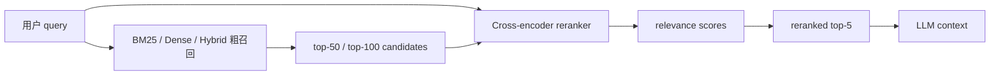

<section class="doc-hero">
  <p class="doc-hero__kicker">RAG 检索优化</p>
  <h1>重排序 Reranking</h1>
  <p class="doc-hero__lead">先把可能相关的 chunk 捞上来，再用更贵但更准的模型把真正能回答问题的证据排到前面。</p>
  <div class="doc-hero__meta" aria-label="本文信息">
    <span>适合阶段：Hybrid Search 之后</span>
    <span>核心机制：粗召回 → 精排 → 入 prompt</span>
    <span>面试重点：bi-encoder vs cross-encoder</span>
  </div>
</section>

> 用更细的 query-doc 匹配，把候选证据重新排一遍。

## 面试官想考什么

读完这篇你要能正面回答下面这些题。每题后面括号里是面试官真正想看你答出什么。

<div class="interview-grid">
  <div>
    <strong>RAG 为什么需要 reranking？第一阶段检索不是已经排过序了吗？</strong>
    <span>考召回和精排的职责边界。</span>
  </div>
  <div>
    <strong>bi-encoder 和 cross-encoder 的区别是什么？为什么 cross-encoder 更准但更慢？</strong>
    <span>考模型结构，不接受“更智能”这种虚答。</span>
  </div>
  <div>
    <strong>典型 reranking pipeline 怎么设计？top-50、top-100 怎么选？</strong>
    <span>考候选数、延迟、召回之间的取舍。</span>
  </div>
  <div>
    <strong>reranker 输入整篇文档还是 chunk？长文档被截断怎么办？</strong>
    <span>考 token 上限和 chunk 粒度。</span>
  </div>
  <div>
    <strong>BGE-reranker、Cohere Rerank、Jina、Voyage 这类方案怎么选？</strong>
    <span>考开源部署、托管 API、多语言和成本。</span>
  </div>
  <div>
    <strong>ColBERT / late interaction 和普通 cross-encoder reranker 有什么区别？</strong>
    <span>考检索模型谱系，不是所有 reranker 都同一种。</span>
  </div>
  <div>
    <strong>LLM-as-reranker 值不值得用？RankGPT 这类方法有什么工程问题？</strong>
    <span>考前沿理解和成本意识。</span>
  </div>
</div>

---

## 为什么需要重排序

Hybrid Search 已经把 BM25 和 dense retrieval 的候选合在一起了，为什么还要再排一次？

看一个真实 RAG 里很常见的候选列表：

```text
用户问题：离职员工已归属期权的行权窗口是多久？

粗召回 top-5:
1. 离职流程包括账号注销、资产归还和离职面谈。
2. 期权授予后按四年归属，首年 cliff 为 25%。
3. 离职员工已归属期权的行权窗口为 90 天。
4. 员工离职后未归属期权自动失效。
5. 期权税务处理请咨询个人税务顾问。
```

向量检索和 BM25 都可能把 1、2、4 排得很靠前，因为它们包含"离职"、"期权"、"归属"这些词。但真正能回答"行权窗口是多久"的是第 3 条。LLM 如果只拿 top-2，就会缺答案；如果把 top-20 全塞进去，又会增加噪声和成本，还可能触发 Lost in the Middle。

Reranking 的价值就在这里：**第一阶段尽量别漏，第二阶段把真正能回答问题的证据排到最前。** Sentence Transformers 的 [Retrieve & Re-Rank](https://sbert.net/examples/sentence_transformer/applications/retrieve_rerank/README.html) 文档就是这个套路：先用 BM25 或 bi-encoder 快速召回，再用 cross-encoder 对 query 和候选段落逐一打分。

## Reranking 是怎么工作的

它实际做的是：拿第一阶段召回的 top-N 候选，把 query 和每个 candidate 拼成一对，送进一个更精细的相关性模型，输出 relevance score，再按这个 score 重新排序。



关键区别在模型能看到什么：

| 模型 | 怎么算分 | 能不能离线预计算文档 | 适合 |
|---|---|---:|---|
| bi-encoder | query 和 doc 分别编码，再算向量相似度 | 能 | 百万级粗召回 |
| cross-encoder | query 和 doc 一起输入 Transformer，直接输出相关性 | 不能 | top-N 精排 |
| late interaction / ColBERT | query/doc 分别编码 token 向量，再做 MaxSim 等细粒度交互 | 部分能 | 兼顾效率和细粒度匹配 |
| LLM-as-reranker | 让 LLM 比较或排序候选 | 不能 | 小候选集、高价值任务 |

SBERT 论文 [Sentence-BERT](https://arxiv.org/abs/1908.10084) 解释过这个效率差异：原始 BERT 成对比较 10,000 个句子需要约 5,000 万次推理，所以才需要可预编码的 bi-encoder。Cross-encoder 更准，是因为 query 和文档 token 从一开始就能相互 attention；它更慢，也是同一个原因。

## 核心原理 / 关键设计

### 1. 召回层保数量，reranker 保顺序

第一阶段检索的目标是把答案候选捞上来，最终排序交给后面的精排模型。Reranker 只能重排已有候选，不能凭空找回没召回的 chunk。

```python
candidate_ids = hybrid_search(query, k=100)     # 先保 recall
reranked = cross_encoder_score(query, candidate_ids)
context = reranked[:5]                          # 再保 precision
```

这也是为什么 "reranker 没效果" 经常要先查候选池大小。BGE-reranker 官方文档的示例就是先召回 top-100，再 rerank 到最终 top-3。生产里可以从 `50 -> 5` 或 `100 -> 5` 起步，然后用 eval 调。

### 2. Cross-encoder 能看细粒度匹配

Bi-encoder 只比较两个向量，很多细节会被压缩掉。Cross-encoder 直接读 `[query, document]`，能判断"文档是否真的回答了这个问法"。

```text
query: 离职员工已归属期权的行权窗口是多久？

chunk A: 离职员工已归属期权的行权窗口为 90 天。
chunk B: 期权授予后按四年归属，首年 cliff 为 25%。

bi-encoder: A 和 B 都有“离职/期权/归属”附近语义
cross-encoder: A 明确回答“多久”，B 只讲归属节奏
```

这就是 reranker 的加分点。它换了一种评分方式：从"两个压缩向量的距离"变成"query-doc 成对阅读后的相关性"。

### 3. 候选数是质量和延迟的旋钮

Cross-encoder 的计算量基本随候选数线性增长。每多 rerank 一个 chunk，就多一次 query-doc 推理。

```python
def estimate_rerank_calls(qps: int, candidates_per_query: int) -> int:
    return qps * candidates_per_query


print(estimate_rerank_calls(qps=20, candidates_per_query=100))  # 2000 pairs/s
```

如果 rerank 模型每秒只能处理 500 对，`20 QPS * 100 candidates` 就会排队。调参时要画两条曲线：

```text
candidates:   20   50   100   200
recall@5:    .71  .79   .82   .83
p95 latency: 80  140   260   520 ms
```

当 recall 开始平台化，继续加候选通常不值。把预算留给更好的 chunking、hybrid search 或更强 reranker，往往更有效。

### 4. Reranker 分数不是跨模型通用阈值

Cohere、BGE、Jina、Voyage、SentenceTransformers 的 reranker 分数标定不同。有的是 logits，有的是 relevance score，有的做过归一化。不能把 `score > 0.6` 从一个模型搬到另一个模型。

```python
def keep_top_scores(scored_docs, top_k: int):
    # 比固定阈值更稳：先按排序截断，再用业务 eval 决定是否加阈值
    return sorted(scored_docs, key=lambda x: x["score"], reverse=True)[:top_k]
```

RAG 里最稳的做法通常是按排名取 top-K，再结合 answer evaluator 看效果。如果必须用阈值拒答，要用自己的验证集校准。

### 5. Reranker 不能修复错误 chunk

如果 chunk 切坏了，reranker 只能在坏候选里挑一个相对好的。

```text
坏 chunk:
"行权窗口为 90 天。超过窗口后..."

缺失的上文:
"离职员工已归属期权..."
```

这个 chunk 对"离职员工已归属期权的行权窗口"来说是答案，但离开上文后语义不完整。Reranker 可能给它低分。修法要回到 [文档切分策略](./chunking)：保留标题、parent chunk、相邻窗口和 source metadata。

## 怎么用：标准库模拟粗召回 + rerank

下面这段代码只用 Python 标准库。粗召回用 BM25，reranker 用一个 mock cross-encoder scorer：它会更重视 query 里表示答案意图的词和文档中是否出现数值/关键事实。真实项目里把 `mock_cross_encoder_score()` 换成 Cohere Rerank、BGE-reranker、Jina、Voyage 或 SentenceTransformers CrossEncoder。

```python
import math
import re
from collections import Counter

DOCS = {
    "d1": "离职流程包括账号注销、资产归还和离职面谈。",
    "d2": "期权授予后按四年归属，首年 cliff 为 25%。",
    "d3": "离职员工已归属期权的行权窗口为 90 天。",
    "d4": "员工离职后未归属期权自动失效。",
    "d5": "期权税务处理请咨询个人税务顾问。",
    "d6": "员工手册说明年假未休部分不可结转至下一自然年度。",
}
QUERY = "离职后期权还能保留多久？"
GOLD = {"d3"}


def tokenize(text: str) -> list[str]:
    # 演示用：中文按字符 + 英文数字串；生产请换成合适分词器
    return re.findall(r"[a-zA-Z0-9_]+|[\u4e00-\u9fff]", text.lower())


def bm25(query: str, docs: dict[str, str], k1: float = 1.5, b: float = 0.75):
    tokenized = {doc_id: tokenize(text) for doc_id, text in docs.items()}
    avgdl = sum(len(t) for t in tokenized.values()) / len(tokenized)
    df = Counter(t for terms in tokenized.values() for t in set(terms))
    q_terms = tokenize(query)
    rows = []

    for doc_id, terms in tokenized.items():
        tf, dl, score = Counter(terms), len(terms), 0.0
        for term in q_terms:
            if term not in tf:
                continue
            idf = math.log(1 + (len(docs) - df[term] + 0.5) / (df[term] + 0.5))
            denom = tf[term] + k1 * (1 - b + b * dl / avgdl)
            score += idf * tf[term] * (k1 + 1) / denom
        rows.append((doc_id, score))

    return sorted(rows, key=lambda x: x[1], reverse=True)


def mock_cross_encoder_score(query: str, doc: str) -> float:
    q, d = set(tokenize(query)), set(tokenize(doc))
    overlap = len(q & d) / max(len(q), 1)
    has_time_answer = bool(re.search(r"\d+\s*(天|日|个月|年)", doc))
    asks_duration = any(x in query for x in ["多久", "多长", "几天", "几个月"])
    has_window = "窗口" in doc or "行权" in doc
    return overlap + 0.8 * (asks_duration and has_time_answer) + 0.4 * has_window


def rerank(query: str, docs: dict[str, str], candidates: list[tuple[str, float]], top_k: int):
    scored = []
    for doc_id, recall_score in candidates:
        rerank_score = mock_cross_encoder_score(query, docs[doc_id])
        scored.append((doc_id, recall_score, rerank_score))
    return sorted(scored, key=lambda x: x[2], reverse=True)[:top_k]


def mrr(ranked_doc_ids: list[str], gold: set[str]) -> float:
    for rank, doc_id in enumerate(ranked_doc_ids, start=1):
        if doc_id in gold:
            return 1 / rank
    return 0.0


recall_candidates = bm25(QUERY, DOCS)[:5]
reranked = rerank(QUERY, DOCS, recall_candidates, top_k=3)

print("before:", [doc_id for doc_id, _ in recall_candidates[:3]], "MRR", mrr([x[0] for x in recall_candidates], GOLD))
print("after: ", [doc_id for doc_id, _, _ in reranked], "MRR", mrr([x[0] for x in reranked], GOLD))
for doc_id, recall_score, rerank_score in reranked:
    print(doc_id, f"recall={recall_score:.3f}", f"rerank={rerank_score:.3f}", DOCS[doc_id])
```

这个 demo 不追求模拟真实神经网络分数，它要让你看清流程：第一阶段先把 `d3` 捞进候选；第二阶段发现它既覆盖 query 关键词，又回答"多久"，所以把它排到前面。

真实代码通常长这样：

```python
# Cohere / BGE / Jina / Voyage 这类 API 或本地模型都类似
candidates = retriever.search(query, top_k=100)
pairs = [(query, c.text) for c in candidates]
scores = reranker.predict(pairs)
top_context = sorted(zip(candidates, scores), key=lambda x: x[1], reverse=True)[:5]
```

## 容易踩的坑

### 坑 1：召回池太小，reranker 没米下锅

**现象**：加了 reranker，答案仍然错，甚至看起来没有任何提升。

**根因**：第一阶段没有召回正确 chunk。Reranker 只能重排候选，不能从全库重新搜索。

**修法**：先把粗召回做高。用 BM25 + dense / hybrid search 拉大候选池，例如 top-50 或 top-100，再 rerank 到 top-5。评估时看 rerank 前的 `recall@100`，别只看最终答案。

### 坑 2：reranker 排了相关，但不是可回答

**现象**：reranked top-1 语义相关，却不包含答案事实，LLM 仍然编。

**根因**：很多训练数据标的是相关性，不一定标"能支持答案"。一个 chunk 可能讲同一主题，但缺少关键数值、结论或条件。

**修法**：评估里加入 answer-supporting chunk 命中率。标注时不只标相关文档，还标"这段能不能独立支持答案"。

### 坑 3：延迟被候选数打爆

**现象**：线上 p95 延迟突然升高，GPU/CPU 推理排队。

**根因**：Cross-encoder 对每个 query-doc pair 都要推理一次，候选数翻倍，计算量基本翻倍。LLM reranker 还会受 token 数和批处理影响。

**修法**：限制候选数；按 query 类型动态 rerank；短文本用轻量模型，复杂任务才用强模型；缓存高频 query；必要时两级 rerank：轻模型先从 200 到 50，强模型从 50 到 5。

### 坑 4：跨模型复用分数阈值

**现象**：从 BGE 换 Cohere 或 Jina 后，`score > 0.6` 的过滤规则突然失效。

**根因**：不同 reranker 的 score 分布和标定不同，有的是 logits，有的是归一化 relevance score。分数不是跨模型通用语义。

**修法**：不要直接迁移阈值。用验证集重新画正负例分布；优先按排名取 top-K，需要拒答再单独校准阈值。

### 坑 5：长文档直接塞给 reranker

**现象**：reranker 成本高、延迟高，还经常忽略答案位置。

**根因**：Reranker 有上下文限制。Cohere 文档也提醒 query 和 document 会共同计入上下文；超长文档可能被截断或自动分块。把整篇文档丢进去，会浪费 token，也可能丢答案。

**修法**：rerank passage / chunk，而不是整篇文档；保留 parent metadata；rerank 后再扩展相邻 chunk 或 parent section 给 LLM。

## 与相似概念的区别

| 概念 | 主要职责 | 计算方式 | 适合阶段 |
|---|---|---|---|
| bi-encoder embedding | 大规模召回 | query/doc 分别编码，向量相似度 | 第一阶段 |
| BM25 / sparse | 精确词召回 | 倒排索引和词项权重 | 第一阶段 |
| hybrid search | 候选池更全 | BM25 + dense + 融合 | 第一阶段 |
| cross-encoder reranker | 精排候选 | query 和 doc 一起输入模型 | 第二阶段 |
| ColBERT / late interaction | 细粒度检索与排序折中 | query/doc token 向量 MaxSim | 检索或精排 |
| LLM-as-reranker | 高成本复杂排序 | prompt 让 LLM 比较/排序候选 | 小候选、高价值任务 |

ColBERT 论文 [Efficient and Effective Passage Search via Contextualized Late Interaction over BERT](https://arxiv.org/abs/2004.12832) 很适合放在这里理解：它让 query/doc 分别编码成 token 向量，再做 late interaction，所以能比纯 bi-encoder 更细，又比每个 query-doc 都跑完整 cross-attention 更容易扩展。

RankGPT 论文 [Is ChatGPT Good at Search?](https://arxiv.org/abs/2304.09542) 则代表 LLM reranker 路线：用 GPT-4/ChatGPT 排序候选，效果有竞争力，但工程上要面对成本、延迟、位置偏置和输出稳定性。面试里可以把它当高级方案讲，不要把它当默认生产方案。

## 面试题深度解析

**Q1: bi-encoder 和 cross-encoder 的区别是什么？**

- **30 秒版本**：bi-encoder 分别编码 query 和 doc，能离线预计算文档向量，适合大规模召回；cross-encoder 把 query 和 doc 一起输入，能看 token 级交互，更准但不能预计算 doc score。
- **追问 1**：为什么 cross-encoder 更慢？每个 query-doc pair 都要跑一次模型。100 个候选就是 100 次 pair scoring。
- **追问 2**：为什么还要用它？因为最终 prompt 只放少量 chunk，top-5 排错的代价很高。用一点计算换上下文质量，通常比把 20 个噪声 chunk 塞进 LLM 更划算。

**Q2: Reranking 的 top-N 怎么选？**

- **30 秒版本**：从 `50 -> 5` 或 `100 -> 5` 起步，用 recall@N 和 p95 latency 调。N 太小漏答案，N 太大拖延迟。
- **追问 1**：怎么判断 N 不够？看 rerank 前的 candidate recall。如果正确 chunk 没进 top-N，reranker 再强也没用。
- **追问 2**：怎么优化延迟？批量推理、缓存、轻量模型、动态候选数、两级 rerank，或者把长 chunk 拆 passage 后再精排。

**Q3: Reranker 能不能替代 hybrid search？**

- **30 秒版本**：不能。Hybrid 负责从全库召回更多候选，reranker 只在候选里重排。它们是上下游，不是替代关系。
- **追问 1**：只用 dense top-20 + reranker 行不行？如果 query 里有错误码、API 名、法规条款编号，dense 可能漏召回，reranker 没机会看到正确 chunk。
- **追问 2**：生产常见流程是什么？BM25 + dense 召回各 top-50，RRF 融合 top-100，cross-encoder rerank top-5，再给 LLM。

**Q4: LLM-as-reranker 什么时候值得用？**

- **30 秒版本**：候选很少、任务很贵、需要复杂判断时可以用。默认生产流程不建议一上来用 LLM rerank，因为成本和延迟难控。
- **追问 1**：RankGPT 说明了什么？经过合适提示，LLM 可以做有竞争力的 reranking；还可以蒸馏到小模型。
- **追问 2**：工程风险是什么？列表位置偏置、输出格式不稳定、token 成本高、批量排序难、线上延迟抖动。通常先用专用 reranker，LLM rerank 做兜底或高价值请求。

## 延伸阅读

- 文档：[SentenceTransformers Retrieve & Re-Rank](https://sbert.net/examples/sentence_transformer/applications/retrieve_rerank/README.html) — 两阶段检索最清楚的工程解释之一。
- 论文：[Sentence-BERT](https://arxiv.org/abs/1908.10084) — 理解 bi-encoder 为什么出现，以及 cross-encoder 为什么贵。
- 文档：[SentenceTransformers MS MARCO Cross-Encoders](https://www.sbert.net/docs/pretrained-models/ce-msmarco.html) — 看开源 cross-encoder 的速度和质量对比。
- 文档：[BGE-Reranker](https://bge-model.com/bge/bge_reranker.html) — 看 BGE 官方推荐的 top-100 到 top-3 rerank 流程。
- 模型卡：[BAAI/bge-reranker-v2-m3](https://huggingface.co/BAAI/bge-reranker-v2-m3) — 想本地部署中文/多语言 reranker，可以从这里开始。
- 文档：[Cohere Rerank](https://docs.cohere.com/v2/docs/rerank) — 看托管 rerank API 的上下文限制、JSON/半结构化支持和多语言能力。
- 文档：[Jina Reranker](https://jina.ai/reranker/) — 看 multilingual cross-encoder、listwise reranker 和 ColBERT 风格模型。
- 文档：[Voyage AI Rerankers](https://docs.voyageai.com/docs/reranker) — 看 `/v1/rerank` API 和 `rerank-2` 等模型。
- 论文：[ColBERT](https://arxiv.org/abs/2004.12832) — late interaction 路线的经典论文，适合理解 reranking 和 retrieval 的中间形态。
- 论文：[RankGPT](https://arxiv.org/abs/2304.09542) — LLM-as-reranker 的代表工作，适合作为前沿扩展阅读。
