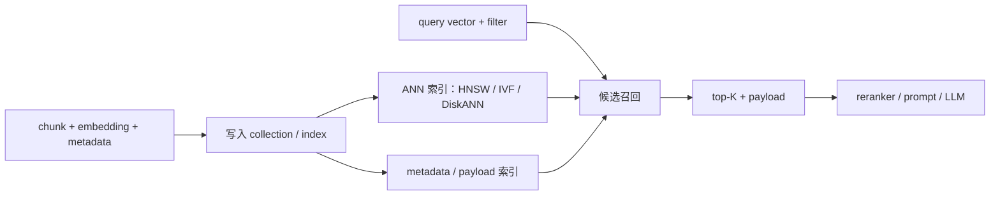

<section class="doc-hero">
  <p class="doc-hero__kicker">RAG 工程化</p>
  <h1>向量数据库对比 Vector DB</h1>
  <p class="doc-hero__lead">向量库要在召回、过滤、更新、权限和运维成本之间做取舍。</p>
  <div class="doc-hero__meta" aria-label="本文信息">
    <span>适合阶段：RAG demo → 生产检索层</span>
    <span>核心权衡：召回 / 延迟 / 过滤 / 运维</span>
    <span>面试重点：HNSW 与 metadata filter</span>
  </div>
</section>

> 为向量检索提供低延迟、可过滤、可更新的索引层。

## 面试官想考什么

读完这篇你要能正面回答下面这些题。每题后面括号里是面试官真正想看你答出什么。

<div class="interview-grid">
  <div>
    <strong>RAG 里为什么不能只说“用了向量数据库”，还要问索引类型和过滤策略？</strong>
    <span>考你是否知道向量库会影响召回，而不只是存储。</span>
  </div>
  <div>
    <strong>HNSW、IVF、Flat 的核心差异是什么？什么时候 HNSW 反而不合适？</strong>
    <span>考 ANN 基础和内存 / 构建成本取舍。</span>
  </div>
  <div>
    <strong>metadata filter 是 pre-filter、post-filter，还是和 ANN 搜索融合？为什么会影响召回？</strong>
    <span>考生产 RAG 最常见的隐性坑。</span>
  </div>
  <div>
    <strong>Pinecone、Weaviate、Qdrant、Milvus、Chroma、pgvector 怎么选？</strong>
    <span>考选型边界，而不是背产品广告。</span>
  </div>
  <div>
    <strong>ef_search、m、ef_construction、nprobe/probes 分别怎么调？</strong>
    <span>考 recall / latency / build time 的量化意识。</span>
  </div>
  <div>
    <strong>pgvector 适合什么场景？什么时候该迁到专用向量库？</strong>
    <span>考架构判断：少组件和大规模能力之间怎么取舍。</span>
  </div>
  <div>
    <strong>多租户 RAG 的权限过滤应该放在哪里？只在应用层过滤行不行？</strong>
    <span>考安全和召回的交叉问题。</span>
  </div>
</div>

---

## 为什么需要向量数据库

RAG demo 里，几十条文档直接放进 Python list，算一遍余弦相似度就能跑。问题是生产系统不是几十条。

假设你有 1000 万个 chunk，每个 chunk 用 `text-embedding-3-small` 的 1536 维 float32 向量：

```python
def scan_cost(n_vectors: int, dim: int, qps: int) -> str:
    bytes_per_query = n_vectors * dim * 4
    gb_per_second = bytes_per_query * qps / 1024**3
    return f"{gb_per_second:.1f} GiB/s memory bandwidth"

print(scan_cost(10_000_000, 1536, qps=20))
```

输出约 `1144.4 GiB/s memory bandwidth`。这还只是把所有向量扫一遍，不算 metadata、网络、并发、重排、权限过滤。你当然可以用 NumPy 暴力扫，但很快会遇到三个问题：

- **延迟**：每次 query 扫全量向量，数据一大就撑不住。
- **过滤**：只允许搜某个租户、某个语言、某个权限范围，过滤后还要保证 top-K 足够。
- **更新**：文档新增、删除、重嵌、回滚，索引必须能跟上。

向量数据库要把这些工程问题合在一起处理：ANN 索引、payload/metadata filter、分片、持久化、删除、备份、监控和成本控制。

如果面试官问"你们 RAG 用了什么向量库"，他想听的通常不是 "Pinecone" 或 "Qdrant" 这个名字。他更关心你是否能讲清楚：**为什么选它、索引怎么调、过滤怎么做、召回怎么测、出问题怎么回滚。**

## 向量数据库是怎么工作的

它实际做了五件事：接收 embedding 向量和 metadata，构建近似最近邻索引；查询时用 ANN 快速找候选；再把 metadata 过滤、排序、top-K、payload 返回整合到一次检索请求里。



这里最容易误解的是 ANN。向量库通常不会精确扫描所有向量，而是用近似算法少看一部分点。少看就会快，但也可能漏掉真正最近的点。所以向量库调优要问：

```text
在 p95 latency 可接受的前提下，把 recall@k 拉到业务够用。
```

这句话比任何产品对比表都重要。

## 核心原理 / 关键设计

### 1. HNSW 用内存换低延迟

HNSW 原论文 [Efficient and robust approximate nearest neighbor search using Hierarchical Navigable Small World graphs](https://arxiv.org/abs/1603.09320) 的核心想法是：把向量连成多层图，搜索时先从稀疏高层快速跳到大概区域，再到低层细找近邻。

```text
高层：少量节点，长距离跳跃
  A ----------- K ----------- Z
              |
中层：更多节点，缩小范围
          H -- K -- M
              |
底层：所有节点，局部精搜
       I -- J -- K -- L -- M -- N
```

几个参数面试高频：

- `m`：每个节点最多连多少邻居。越大图越密，召回更稳，但内存和构建成本更高。
- `ef_construction`：建图时保留多少候选。越大图质量越好，但构建更慢。
- `ef_search` / `hnsw_ef`：查询时探索多少候选。越大召回越高，延迟越高。

Weaviate 文档明确说 HNSW 是内存索引，节点和边都要放内存；pgvector 文档也写到 HNSW 通常比 IVFFlat 有更好的速度 / 召回取舍，但构建更慢、占用更多内存。

### 2. IVF 用聚类换内存和构建速度

IVF（Inverted File）会先把向量聚成很多簇，查询时只搜离 query 最近的几个簇。

```python
def ivf_search(query, centroids, inverted_lists, nprobe: int):
    nearby_lists = top_n_centroids(query, centroids, nprobe)
    candidates = []
    for list_id in nearby_lists:
        candidates.extend(inverted_lists[list_id])
    return exact_top_k(query, candidates)
```

`nprobe` 或 `probes` 越大，搜的簇越多，召回越高，延迟越高。pgvector 文档给 IVFFlat 的建议很实用：`lists` 可以从百万级以下 `rows / 1000` 起步，百万级以上用 `sqrt(rows)` 起步；查询时 `probes` 可以从 `sqrt(lists)` 起步。

IVF 适合什么？大规模、内存紧、可以接受一点召回损失的场景。它的问题是需要训练 / 聚类，数据分布变化后可能要重建；过滤很强时也可能搜错簇。

### 3. 过滤不是普通 WHERE 条件

RAG 生产里常见查询经常带过滤条件：

```text
tenant_id = "acme"
lang = "zh"
doc_acl contains "sales-team"
vector nearest to query
limit 5
```

如果向量库先做 ANN，再对候选做过滤，就可能出现一个尴尬结果：全局 top-50 都很像，但都不是 `acme` 租户；过滤后只剩 1 条，甚至 0 条。你看到的现象是"向量库没返回够 top-K"，根因是过滤和 ANN 的执行顺序。

```python
def post_filter_bad(global_candidates, filter_fn, k):
    # 候选先从全局 ANN 来，过滤太强时会被删空
    return [x for x in global_candidates if filter_fn(x)][:k]


def filter_aware_better(index, query, filter_expr, k):
    # 理想情况：搜索过程知道 filter，能多探索符合条件的区域
    return index.search(query=query, filter=filter_expr, limit=k)
```

Qdrant 文档强调 payload index 会帮助过滤和 query planning，而且 payload index 最好在导入数据前创建；Pinecone 也专门有 metadata filtering 的研究；Weaviate 则有 HNSW filtering 策略。面试里讲 metadata filter，要明确它会影响召回，不只是 SQL 风格的附加条件。

### 4. 向量库不是事实源，原文库才是事实源

向量库里一般存 chunk、metadata、embedding，有时还存 parent text。但它不应该成为唯一事实源。原因很简单：换 embedding 模型、换 chunking 策略、修复解析 bug，都需要重建索引。

```text
推荐结构：
原始文档 / 解析后 Markdown / chunk 清单  ->  source of truth
向量数据库                                ->  可丢弃重建的检索索引
问答日志 / eval 集                         ->  质量回归依据
```

如果你只把文档塞进向量库，没有保留 chunk 版本、source id、embedding model、chunker config，后面迁移模型时会很痛苦。前一篇 [嵌入模型选型](./embedding-models) 讲过：换 embedding 模型等于换向量空间。向量库必须按 schema 版本管理。

### 5. pgvector 的价值是"少一个系统"

pgvector 不一定是最强向量库，但它有一个朴素优势：如果你的产品数据已经在 PostgreSQL，文档权限、租户、事务、审计也都在 PostgreSQL，把向量检索放进去可以少引入一个分布式系统。

```sql
CREATE EXTENSION IF NOT EXISTS vector;

CREATE TABLE chunks (
  id bigserial PRIMARY KEY,
  tenant_id text NOT NULL,
  doc_id text NOT NULL,
  content text NOT NULL,
  embedding vector(1536)
);

CREATE INDEX ON chunks USING hnsw (embedding vector_cosine_ops);
CREATE INDEX ON chunks (tenant_id);

SET hnsw.ef_search = 100;

SELECT id, content
FROM chunks
WHERE tenant_id = 'acme'
ORDER BY embedding <=> $1
LIMIT 5;
```

什么时候 pgvector 很合适？中小规模、强 SQL 过滤、团队已经熟 PostgreSQL、QPS 不高、希望降低运维复杂度。什么时候该迁？向量条数很大、过滤复杂、写入更新频繁、需要水平扩展、需要多索引策略或独立检索集群。

## 怎么用：Qdrant 本地向量检索 + metadata filter

这段代码用 Qdrant 的 local mode，不需要 Docker，也不需要外部 embedding API。为了让代码能直接跑，`embed()` 用一个小型 hashing embedding；真实项目里把它换成 OpenAI、BGE、Voyage 或 Cohere 即可。

安装依赖：

```bash
pip install "qdrant-client>=1.14.2"
```

```python
import hashlib
import math

from qdrant_client import QdrantClient, models

COLLECTION = "rag_chunks_demo"
DIM = 64

docs = [
    ("acme", "zh", "hnsw-intro", "HNSW 用多层图做近似最近邻检索，适合低延迟召回。"),
    ("acme", "zh", "filters", "metadata filter 可以按 tenant、语言、权限过滤候选向量。"),
    ("acme", "en", "latency", "Higher ef_search usually improves recall but increases latency."),
    ("beta", "zh", "pgvector", "pgvector 可以把向量检索放进 PostgreSQL，适合已有 SQL 栈。"),
    ("beta", "zh", "qdrant", "Qdrant 提供 payload index，过滤字段应提前建索引。"),
    ("beta", "en", "rerank", "RAG systems often retrieve top-k chunks and rerank them."),
    ("acme", "zh", "m-param", "HNSW 的 m 越大，图越稠密，内存和构建成本越高。"),
    ("beta", "zh", "ops", "向量库选型要看数据规模、过滤复杂度、运维和成本。"),
]


def embed(text: str, dim: int = DIM) -> list[float]:
    vec = [0.0] * dim
    for token in text.lower().replace("，", " ").replace("。", " ").split():
        h = int(hashlib.md5(token.encode("utf-8")).hexdigest(), 16)
        idx = (h >> 1) % dim
        vec[idx] += 1.0 if h & 1 else -1.0
    norm = math.sqrt(sum(x * x for x in vec)) or 1.0
    return [x / norm for x in vec]


client = QdrantClient(":memory:")

if client.collection_exists(COLLECTION):
    client.delete_collection(COLLECTION)

client.create_collection(
    collection_name=COLLECTION,
    vectors_config=models.VectorParams(size=DIM, distance=models.Distance.COSINE),
    hnsw_config=models.HnswConfigDiff(m=16, ef_construct=100, full_scan_threshold=0),
    optimizers_config=models.OptimizersConfigDiff(indexing_threshold=0),
)

for field in ["tenant", "lang"]:
    client.create_payload_index(
        collection_name=COLLECTION,
        field_name=field,
        field_schema=models.PayloadSchemaType.KEYWORD,
    )

points = [
    models.PointStruct(
        id=i,
        vector=embed(text),
        payload={"tenant": tenant, "lang": lang, "title": title, "text": text},
    )
    for i, (tenant, lang, title, text) in enumerate(docs, start=1)
]
client.upsert(collection_name=COLLECTION, points=points)


def search(query: str, tenant: str | None = None, lang: str | None = None, ef: int = 64):
    must = []
    if tenant:
        must.append(models.FieldCondition(key="tenant", match=models.MatchValue(value=tenant)))
    if lang:
        must.append(models.FieldCondition(key="lang", match=models.MatchValue(value=lang)))

    result = client.query_points(
        collection_name=COLLECTION,
        query=embed(query),
        query_filter=models.Filter(must=must) if must else None,
        search_params=models.SearchParams(hnsw_ef=ef, exact=False),
        limit=3,
        with_payload=["title", "tenant", "lang", "text"],
    )
    return result.points


for point in search("HNSW metadata filter latency", tenant="acme", lang="zh", ef=128):
    print(round(point.score, 3), point.payload["tenant"], point.payload["lang"], point.payload["title"])
```

这段代码有三个故意保留的工程细节：`tenant/lang` 进入 payload，查询时强制过滤；过滤字段提前建 payload index；查询时显式传 `hnsw_ef`，方便做 recall / latency 曲线。demo 很小，但这三个动作就是生产 RAG 的基本功。

如果你在本地 mode 运行时看到 "Payload indexes have no effect in the local Qdrant" 这类 warning，不是代码错了。本地 mode 主要用于开发和测试；payload index 的性能收益要在 Qdrant server / cloud 里评估。

## 容易踩的坑

### 坑 1：过滤后 top-K 不够

**现象**：请求 `top_k=10`，结果只返回 2 条；或者明明相关文档存在，加了 `tenant_id` 过滤后就搜不到。

**根因**：很多 ANN 流程会先找候选，再过滤。过滤条件很强时，候选被删掉，返回数就不够。pgvector 文档也提醒过，approximate index 下过滤可能导致结果不足，需要提高 `hnsw.ef_search` 或使用 partial index / partition / iterative scan。

**修法**：把过滤字段建索引；提高 ANN 候选数或 `ef_search`；高频过滤字段考虑分 collection、namespace、partition 或 partial index；用离线 eval 单独测 "带过滤的 recall@k"。

### 坑 2：HNSW 参数越调越大

**现象**：`m`、`ef_construction`、`ef_search` 一路加，召回只涨一点，内存和 p95 延迟暴涨。

**根因**：HNSW 参数本质是交换。`m` 增加图边，吃内存；`ef_construction` 增加构建成本；`ef_search` 增加查询时探索候选，拖慢延迟。数据分布、filter 比例、top-K 都会改变最佳点。

**修法**：先固定 `m=16` 或默认值，扫 `ef_search=32/64/128/256`，画 recall@k 和 p95 latency 曲线。只有查询时参数救不回来，再考虑提高 `m` 或重建索引。

### 坑 3：把向量库当唯一数据源

**现象**：想换 embedding 模型或 chunking 策略时，发现原始文档、chunk 边界、metadata 版本都找不回来了。

**根因**：向量库是派生索引，不是事实源。它服务检索，不负责长期内容治理。

**修法**：保留原文、解析结果、chunk 配置、embedding 模型版本、向量库 collection 版本。向量库可以随时 drop + rebuild。

### 坑 4：多租户只在应用层过滤

**现象**：偶发返回别的租户 chunk，或者为了防越权在应用层过滤后结果不足。

**根因**：ANN 检索在全局空间里先找相似点，应用层再删不符合权限的结果。只要某处漏传过滤条件，就可能越权。

**修法**：每条向量写入 `tenant_id`、`user_id`、`acl` 等 metadata，并在向量查询层强制过滤。高安全场景按租户拆 collection / namespace / partition，再加审计测试。

### 坑 5：用 Chroma demo 结论推生产

**现象**：本地 Chroma demo 很顺，上百万向量后写入、查询、内存开始抖。

**根因**：单机 HNSW 需要把图放进内存。Chroma 官方性能文档也提醒，HNSW index 通常先成为内存瓶颈。

**修法**：Chroma 很适合本地开发、测试、轻量 demo；如果要多租户、高 QPS、大规模过滤、独立扩容，应该评估 Qdrant、Weaviate、Milvus、Pinecone 或 pgvector。

## 与常见方案的区别

| 方案 | 最适合 | 强项 | 主要代价 |
|---|---|---|---|
| Pinecone | 想少运维、直接用托管服务 | serverless、metadata filter、dense/sparse/full-text 一体化能力 | 成本和云厂商绑定，需要接受托管抽象 |
| Weaviate | 需要 schema、hybrid、模块化生态 | HNSW/Flat/Dynamic index，过滤和混合检索能力完整 | 运维和 schema 设计复杂度高于轻量库 |
| Qdrant | 需要强 metadata filter 和本地/服务一致 API | payload index、filterable HNSW、本地 mode 好用 | 多一个服务，复杂规模下仍需调索引和分片 |
| Milvus | 大规模、高吞吐、复杂索引策略 | IVF、HNSW、DiskANN、GPU/量化等选择多 | 集群运维复杂，适合专门检索团队 |
| Chroma | 本地开发、原型、轻量知识库 | API 简单，和 Agent/RAG 框架集成顺 | 单机内存和规模边界明显 |
| pgvector | 已有 PostgreSQL、强 SQL 过滤、中小规模 | 少一个系统，事务/权限/SQL 生态复用 | 大规模向量负载可能影响主库，ANN/filter 调优受 PG planner 影响 |

一个好记的判断：**已有 Postgres 且规模不大，先 pgvector；本地 demo，Chroma；需要过滤和独立检索服务，Qdrant / Weaviate；大规模检索平台，Milvus；不想运维，Pinecone。**

## 面试题深度解析

**Q1: HNSW、IVF、Flat 的核心差异是什么？**

- **30 秒版本**：Flat 精确扫全量，准但慢；HNSW 建图，用内存换低延迟和高召回；IVF 先聚类，只搜部分簇，用一点召回换内存和构建速度。
- **追问 1**：什么时候 HNSW 不合适？数据量巨大但内存有限、强过滤比例很高、更新写入非常频繁，或者每个租户数据很小。这些场景 Flat、IVF、DiskANN、分区可能更合适。
- **追问 2**：怎么调 HNSW？先扫查询时 `ef_search`，看 recall / latency 曲线；再考虑 `m` 和 `ef_construction`。`m` 不是越大越好，因为它直接增加边和内存。

**Q2: metadata filter 为什么会影响召回？**

- **30 秒版本**：如果 ANN 先在全局找候选，再过滤 metadata，过滤会把候选删掉，top-K 不够或正确文档根本没进候选。
- **追问 1**：怎么验证？同一批 query 同时测无过滤 recall 和带租户/权限过滤 recall。很多系统无过滤表现很好，带过滤才暴露问题。
- **追问 2**：怎么修？过滤字段建索引，增加候选数和 `ef_search`，高频过滤字段做 partition/namespace/collection，或者选 filter-aware 搜索能力更强的向量库。

**Q3: pgvector 适合什么场景？**

- **30 秒版本**：适合已有 PostgreSQL、数据规模中小、QPS 不高、SQL 过滤和事务重要的场景。它的价值是少一个系统。
- **追问 1**：什么时候迁走？向量数量上千万以上、p95 延迟压不住、过滤复杂、写入重建影响主库、需要独立扩容或多索引策略。
- **追问 2**：pgvector 怎么避免过滤坑？WHERE 字段建 B-tree，常见过滤值用 partial HNSW index 或 partition；调 `hnsw.ef_search`；必要时用 iterative scan。

**Q4: 多租户 RAG 的权限过滤怎么做？**

- **30 秒版本**：权限条件必须进入向量检索请求，不应该只在应用层过滤。每条向量要有 `tenant_id`、`doc_id`、`acl` 等 metadata。
- **追问 1**：只在应用层过滤有什么问题？可能越权，也可能全局 ANN 返回的 top-K 都被删掉，导致正确租户文档没机会进入候选。
- **追问 2**：高安全场景怎么设计？租户级 collection/namespace/partition 隔离，加查询层强制过滤和审计测试；不要让业务调用方自由拼过滤条件。

## 延伸阅读

- 论文：[Efficient and robust approximate nearest neighbor search using HNSW](https://arxiv.org/abs/1603.09320) — HNSW 原论文，理解 `m`、层级图和近似搜索的根。
- 论文：[Billion-scale similarity search with GPUs](https://arxiv.org/abs/1702.08734) — Faiss / IVF / PQ / GPU 大规模相似度搜索的重要基础。
- 论文：[DiskANN: Fast Accurate Billion-point Nearest Neighbor Search](https://papers.nips.cc/paper_files/paper/2019/hash/09853c7fb1d3f8ee67a61b6bf4a7f8e6-Abstract.html) — 理解为什么大规模向量检索不一定全靠内存。
- 文档：[pgvector README](https://github.com/pgvector/pgvector) — 看 HNSW、IVFFlat、过滤、partial index、partition 和 `hnsw.ef_search`。
- 文档：[Qdrant Indexing](https://qdrant.tech/documentation/manage-data/indexing/) — 看 payload index、filterable HNSW 和过滤字段建索引的时机。
- 文档：[Qdrant Search API](https://qdrant.tech/documentation/search/search/) — 看 `query_points`、`query_filter`、`hnsw_ef` 的当前 Python 用法。
- 文档：[Weaviate Vector Index](https://docs.weaviate.io/weaviate/concepts/vector-index) — 看 HNSW、Flat、Dynamic index 和 dynamic ef。
- 文档：[Milvus Index Explained](https://milvus.io/docs/index-explained.md) — 适合做大规模索引选择时查 HNSW、IVF、DiskANN、量化。
- 文档：[Chroma Metadata Filtering](https://docs.trychroma.com/docs/querying-collections/metadata-filtering) — 看本地向量库的 metadata filter 语义。
- 文档：[Pinecone Indexing Overview](https://docs.pinecone.io/guides/index-data/indexing-overview) — 看 dense、sparse、full-text ranking field 和托管索引抽象。
