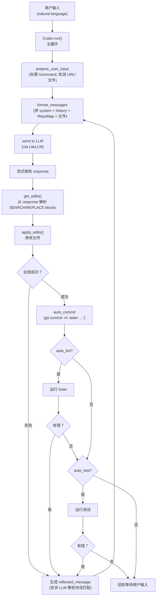
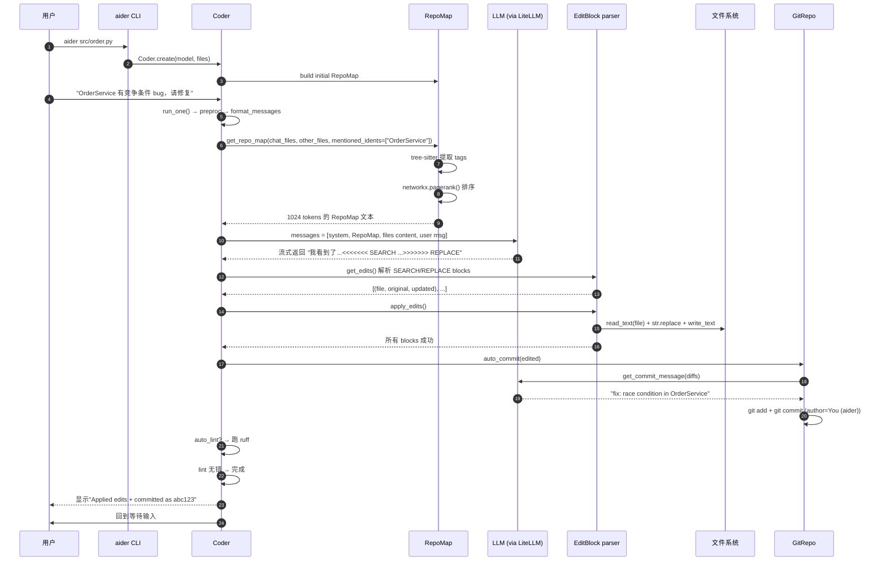

<section class="doc-hero">
  <p class="doc-hero__kicker">Agent 源码解析</p>
  <h1>Aider 源码剖析</h1>
  <p class="doc-hero__lead">Aider 是 Paul Gauthier 2023 年开源的终端编程 Agent，是这一代编程 Agent 里最早跑通商业化的开源项目（4.5 万 star）。它的几个核心发明——SEARCH/REPLACE blocks、基于 tree-sitter + PageRank 的 RepoMap、每次编辑自动 commit——后来被 Claude Code、Cursor、Cline 等产品广泛借鉴。Aider 完全开源、Python 实现、代码组织清晰，是读源码学编程 Agent 设计的最佳样本。</p>
  <div class="doc-hero__meta" aria-label="本文信息">
    <span>仓库：Aider-AI/aider · Python · 45k+ star</span>
    <span>分析版本：截至 2026-06 main 分支</span>
    <span>本文覆盖：Coder 主循环、Edit Formats、RepoMap、Git 集成、Reflexion</span>
  </div>
</section>

> **资料来源声明**：本文基于 [Aider-AI/aider](https://github.com/Aider-AI/aider) 的 main 分支真实源码（已 clone 到本地分析），所有文件路径、行号、类名、函数签名都是从仓库直接读取的。Aider 是纯 MIT 开源、Python 实现，源码可读性极高——本文展示的代码摘录都来自真实文件，标注 `aider/xxx.py:N` 形式的路径。

## 为什么值得读 Aider 源码

如果你只读一个编程 Agent 的源码，Aider 是最佳选择——不是因为它最先进，而是因为它**最纯净**：

- **没有商业拼凑**：Anthropic 把 Claude Code 拆成 SDK 但仍有闭源部分；Cursor、Cline 都嵌在 IDE 里，要理解 VSCode 扩展协议才能读。Aider 是单一 Python 命令行，源码就是它的全部
- **概念结晶清晰**：Aider 的几个核心抽象（Coder、EditFormat、RepoMap、Reflexion）每个都对应到清晰的代码模块，比 LangChain 那种百层抽象好读得多
- **真实的工程权衡**：Paul Gauthier 在每个设计决策上都有 blog post 解释为什么——读源码 + 读他的 blog 是这一代编程 Agent 的"教科书"

读 Aider 能回答这些问题：

```
- 在 Anthropic 还没发明 Edit 工具时，Aider 怎么让 LLM 精确改代码？
- 大代码库（10 万 + 文件）怎么塞进 200k context？
- 为什么 Aider 每次编辑都 git commit？这个工作流的工程价值在哪？
- "Architect + Editor" 两个模型分工是什么？
- Reflexion 循环（编辑失败 → 自动重试）怎么实现？
- Aider 怎么支持 100+ 个 LLM provider 而不每个适配？
```

## 仓库总览

```
aider/                          # 仓库根目录
├── aider/                       # 包目录
│   ├── main.py                  # CLI 入口 (1274 行)
│   ├── coders/                  # ★ 核心：Coder 类与各种 edit format
│   │   ├── base_coder.py        # Coder 基类 (2485 行)
│   │   ├── editblock_coder.py   # SEARCH/REPLACE 实现
│   │   ├── editblock_fenced_coder.py
│   │   ├── architect_coder.py   # Architect/Editor 双模型模式
│   │   ├── ask_coder.py         # 只问不改的模式
│   │   ├── context_coder.py     # 帮助挑文件的模式
│   │   ├── patch_coder.py       # unified diff 格式
│   │   ├── search_replace.py    # 模糊匹配的回退算法
│   │   └── (10+ 种 edit format 变体)
│   ├── repomap.py               # ★ RepoMap：tree-sitter + PageRank (867 行)
│   ├── repo.py                  # ★ GitRepo：自动 commit、attribution (622 行)
│   ├── commands.py              # 斜杠命令 /add /drop /commit ...
│   ├── io.py                    # 终端 IO、prompt_toolkit 集成
│   ├── llm.py                   # LiteLLM 封装，统一调多家 provider
│   ├── models.py                # 模型配置、token 限制、edit_format 默认值
│   ├── sendchat.py              # 实际发送 API 请求 + 流式
│   ├── linter.py                # auto_lint 实现
│   ├── prompts.py               # commit message / summary prompts
│   └── queries/                 # 各语言的 tree-sitter 查询文件
├── benchmark/                   # 自评估框架
├── tests/                       # 单元测试
└── requirements/                # 各种部署的 requirements
```

**关键观察**：

**(1) `coders/` 目录有 15+ 种 Coder 子类**——这反映了 Aider 的核心架构决策：**没有"一个 Coder 适配所有 LLM"**。不同模型对不同编辑格式响应质量差异很大（GPT-4 擅长 SEARCH/REPLACE，Claude 早期擅长 whole-file，新模型 Architect 模式效果最好）。Aider 让每个模型在它最擅长的 edit format 上跑。

**(2) `repomap.py` 单独一个 867 行模块**——这是 Aider 的"杀手锏"。后面会详细拆。

**(3) 整个仓库没有 `tools/` 目录、没有 MCP**——Aider 没有 Claude Code 那套"工具集"概念。它的"工具"只有一个：**LLM 生成 SEARCH/REPLACE blocks，Aider 解析后修改文件**。所有"行动能力"都通过这一个机制。

## 整体架构

Aider 的主循环和工具型 Agent（Claude Code）有本质区别——它不是 ReAct loop，是**"输入对话 → 模型回复 → 解析编辑指令 → 应用 → 验证 → 必要时重试"**：



这套设计的关键洞察——**Aider 把 LLM 当作"会写 patch 的同事"，不是"会调工具的 Agent"**。LLM 的工作是输出 SEARCH/REPLACE 文本，Aider 把这些文本当 diff 应用到文件系统。没有 tool_use 协议、没有 function calling（虽然部分 edit format 支持，但不是主流），只有纯文本 → 解析 → 应用。

接下来逐模块拆。

## 模块 1：Coder 主循环

**职责**：Aider 整个交互的中枢，管理对话历史、调度 edit format、触发 git/lint/test 自动化。

**关键文件**：`aider/coders/base_coder.py`（2485 行，整个项目最大的文件）

### 1.1 Coder 基类与工厂

```python
# aider/coders/base_coder.py:88
class Coder:
    abs_fnames = None
    abs_read_only_fnames = None
    repo = None
    last_aider_commit_hash = None
    aider_edited_files = None
    repo_map = None
    num_reflections = 0
    max_reflections = 3    # ★ 关键参数：最多 3 次自动重试
    edit_format = None
    auto_lint = True
    auto_test = False
    add_cache_headers = False
    # ... 30+ 个类属性，每个对应一个配置项

    @classmethod
    def create(
        self,
        main_model=None,
        edit_format=None,
        io=None,
        from_coder=None,
        ...
    ):
        # aider/coders/base_coder.py:125
        # 工厂方法，根据 model 和 edit_format 实例化对应的 Coder 子类
        ...
```

**关键设计——工厂模式选择 edit_format**：

Aider 不是用一个 Coder 处理所有模型。`Coder.create()` 根据当前模型的能力选择对应子类：

| 模型 | 默认 edit_format | 对应 Coder 子类 |
|---|---|---|
| `gpt-4o`、`gpt-4` | `diff` | `EditBlockCoder` |
| `claude-3-5-sonnet`+ | `diff` | `EditBlockCoder` |
| `deepseek-coder` | `diff-fenced` | `EditBlockFencedCoder` |
| 弱模型 / Llama 系 | `whole` | `WholeFileCoder` |
| `o1`、reasoning model | `architect` | `ArchitectCoder` |

模型→格式的映射存在 `aider/models.py` 里，每个模型条目都有 `edit_format` 字段。这是 Aider 长期 benchmark 调出来的经验配置——同一个 LLM 用不同 edit format，bug fix 成功率能差 30%+。

### 1.2 主循环：run() → run_one() → send_message()

主循环是嵌套的三层：

```python
# aider/coders/base_coder.py:876
def run(self, with_message=None, preproc=True):
    try:
        if with_message:
            self.io.user_input(with_message)
            self.run_one(with_message, preproc)
            return self.partial_response_content
        while True:                                  # 外层：交互模式持续读用户输入
            try:
                if not self.io.placeholder:
                    self.copy_context()
                user_message = self.get_input()
                self.run_one(user_message, preproc)
                self.show_undo_hint()
            except KeyboardInterrupt:
                self.keyboard_interrupt()
    except EOFError:
        return
```

`run_one()` 处理一条消息——这里就藏着 Aider 的核心精髓：**Reflexion 循环**。

```python
# aider/coders/base_coder.py:924
def run_one(self, user_message, preproc):
    self.init_before_message()

    if preproc:
        message = self.preproc_user_input(user_message)
    else:
        message = user_message

    while message:                                   # ★ Reflexion 主循环
        self.reflected_message = None
        list(self.send_message(message))            # 发给 LLM 处理

        if not self.reflected_message:               # 没有 reflection → 完成
            break

        if self.num_reflections >= self.max_reflections:
            self.io.tool_warning(f"Only {self.max_reflections} reflections allowed, stopping.")
            return

        self.num_reflections += 1
        message = self.reflected_message             # 把反思消息作为下一轮 user message
```

**Reflexion 的工作机制**：

```
turn 1: User: "在 foo.py 加一个 bar 函数"
        Coder.send_message → LLM 输出 SEARCH/REPLACE block → apply_edits()
        → 假设 SEARCH 块没匹配到 → self.reflected_message = "这块没匹配到..."
        → 循环继续

turn 2: 把 reflected_message 作为新的 user message 喂给 LLM
        → LLM 收到错误反馈 → 重新生成正确的 SEARCH/REPLACE
        → 这次匹配成功 → self.reflected_message = None
        → 循环退出
```

`max_reflections = 3` 是硬限制。超过 3 次反思仍失败就放弃，避免无限循环。

这套机制的精妙之处：**Aider 把"LLM 出错"建模为"对话的下一个回合"**。LLM 不需要原生 retry 能力，框架把错误信息当作"用户的新消息"喂回去，LLM 自然会基于反馈调整。这是 Aider 比直接用 SDK 写循环聪明的地方。

### 1.3 send_message：实际发送 + 流式 + 重试

```python
# aider/coders/base_coder.py:1419
def send_message(self, inp):
    self.event("message_send_starting")
    self.io.llm_started()

    self.cur_messages += [
        dict(role="user", content=inp),
    ]

    chunks = self.format_messages()                  # ★ 拼出最终发给 LLM 的 messages
    messages = chunks.all_messages()
    if not self.check_tokens(messages):
        return
    self.warm_cache(chunks)                          # 预热 Anthropic prompt cache

    self.multi_response_content = ""
    # ... (UI 状态准备)

    retry_delay = 0.125
    litellm_ex = LiteLLMExceptions()

    self.usage_report = None
    exhausted = False
    interrupted = False
    try:
        while True:
            try:
                yield from self.send(messages, functions=self.functions)
                break
            except litellm_ex.exceptions_tuple() as err:
                ex_info = litellm_ex.get_ex_info(err)

                if ex_info.name == "ContextWindowExceededError":
                    exhausted = True
                    break

                should_retry = ex_info.retry
                if should_retry:
                    retry_delay *= 2                  # ★ 指数退避
                    if retry_delay > RETRY_TIMEOUT:
                        should_retry = False
                # ... (错误处理)
                continue
```

**值得注意的工程细节**：

**(a) `chunks = self.format_messages()`** —— 这是 Aider 把所有上下文（system prompt、chat history、文件内容、RepoMap、reminders）组织成 LLM messages 的入口。注意它返回 `ChatChunks` 对象而非 `list`——这是为了支持 prompt cache 的分块（不同 chunk 缓存不同时长）。

**(b) `warm_cache(chunks)`** —— Aider 主动预热 Anthropic prompt cache。这套机制让长对话的 input token 成本降到 1/10——是 Aider 在 Anthropic API 上的核心成本优化。

**(c) 指数退避** —— `retry_delay *= 2` 直到上限。LiteLLM 的错误分类决定哪些错误值得重试（429、5xx）、哪些直接放弃（auth error）。

**(d) `FinishReasonLength` 特殊处理** —— LLM 输出超过 max_tokens 被截断时，Aider 用 assistant prefill 让 LLM 接着写（continuation）。这要求模型支持 prefill（Claude 支持、GPT 不支持）。

## 模块 2：EditBlock —— SEARCH/REPLACE 格式

**职责**：Aider 最重要的发明。让 LLM 输出一种"既人类可读、又机器可解析"的代码编辑格式。

**关键文件**：`aider/coders/editblock_coder.py`

### 2.1 格式定义

LLM 被要求输出形如这样的 block：

```
src/utils.py
<<<<<<< SEARCH
def greet():
    print("hi")
=======
def greet(name="world"):
    print(f"hi, {name}")
>>>>>>> REPLACE
```

三个标识符 `<<<<<<<SEARCH`、`=======`、`>>>>>>>REPLACE` 是从 git merge conflict marker 借来的——LLM 在训练数据里见过大量 git conflict，对这个格式很熟悉。

Aider 用正则解析：

```python
# aider/coders/editblock_coder.py:386
HEAD = r"^<{5,9} SEARCH>?\s*$"
DIVIDER = r"^={5,9}\s*$"
UPDATED = r"^>{5,9} REPLACE\s*$"
```

**注意 `{5,9}` 这个量词**——允许 5 到 9 个连续字符。这是个工程妥协：LLM 偶尔会少写或多写一个 `<`，硬性要求 7 个会让大量响应失败。`{5,9}` 把成功率从 ~90% 拉到 99%+。

### 2.2 解析与匹配

`get_edits()` 把 LLM response 切成多个 SEARCH/REPLACE blocks：

```python
# aider/coders/editblock_coder.py:21
def get_edits(self):
    content = self.partial_response_content

    # might raise ValueError for malformed ORIG/UPD blocks
    edits = list(
        find_original_update_blocks(
            content,
            self.fence,
            self.get_inchat_relative_files(),
        )
    )

    self.shell_commands += [edit[1] for edit in edits if edit[0] is None]
    edits = [edit for edit in edits if edit[0] is not None]

    return edits
```

`apply_edits()` 把每个 block 应用到文件：

```python
# aider/coders/editblock_coder.py:41
def apply_edits(self, edits, dry_run=False):
    failed = []
    passed = []
    updated_edits = []

    for edit in edits:
        path, original, updated = edit
        full_path = self.abs_root_path(path)
        new_content = None

        if Path(full_path).exists():
            content = self.io.read_text(full_path)
            new_content = do_replace(full_path, content, original, updated, self.fence)

        # If the edit failed, and
        # this is not a "create a new file" with an empty original...
        # https://github.com/Aider-AI/aider/issues/2258
        if not new_content and original.strip():
            # try patching any of the other files in the chat
            for full_path in self.abs_fnames:
                content = self.io.read_text(full_path)
                new_content = do_replace(full_path, content, original, updated, self.fence)
                if new_content:
                    path = self.get_rel_fname(full_path)
                    break

        updated_edits.append((path, original, updated))

        if new_content:
            if not dry_run:
                self.io.write_text(full_path, new_content)
            passed.append(edit)
        else:
            failed.append(edit)
```

**关键设计——多层 fallback**：

1. **先尝试 exact match**——`content.find(original) != -1` 才用 `str.replace()` 替换
2. **如果文件名错了**——尝试用 `original` 匹配 chat 里的其他文件（LLM 经常写错文件路径）
3. **如果还失败**——调用 `do_replace()` 里的 `replace_most_similar_chunk()`，做模糊匹配（用 difflib）
4. **全失败**——把失败 blocks 格式化成错误消息，写入 `self.reflected_message`，触发 Reflexion

### 2.3 失败信息回喂的格式

这个细节是 Aider 真正聪明的地方。当 SEARCH block 匹配失败时，Aider 不是简单说"找不到"，而是构造结构化的错误反馈：

```python
# aider/coders/editblock_coder.py:84+
res = f"# {len(failed)} SEARCH/REPLACE {blocks} failed to match!\n"
for edit in failed:
    path, original, updated = edit
    full_path = self.abs_root_path(path)
    content = self.io.read_text(full_path)

    res += f"""
## SearchReplaceNoExactMatch: This SEARCH block failed to exactly match lines in {path}
<<<<<<< SEARCH
{original}=======
{updated}>>>>>>> REPLACE

"""
    did_you_mean = find_similar_lines(original, content)
    if did_you_mean:
        # 把文件里最相似的几行展示给 LLM 看
        res += f"Did you mean to match some of these lines in {path}?\n\n"
        res += f"```\n{did_you_mean}\n```\n"
```

这种"did you mean"提示让 LLM 在第二次重试时大概率成功——它能看到自己的 SEARCH block 哪里和真实文件不一致。这是 Reflexion 循环效果好的关键。

### 2.4 为什么 SEARCH/REPLACE 优于 unified diff

Aider 也实现了 `PatchCoder`（生成 unified diff）和 `WholeFileCoder`（重写整个文件），但默认仍是 SEARCH/REPLACE。Paul Gauthier 在博客解释过：

- **Unified diff 容易出错**：行号偏移一个就全错。LLM 经常算错 `@@ -X,Y +X,Y @@` 头部
- **WholeFileCoder 浪费 token**：每次改一行要重发整个文件
- **SEARCH/REPLACE 精确且容错**：可以模糊匹配、可以独立校验每个 block 是否成功

Aider 的 [Edit Format leaderboard](https://aider.chat/docs/leaderboards/edit.html) 里 SEARCH/REPLACE 在主流模型上的成功率都是 90%+，比 diff 高 10-15 个百分点。

## 模块 3：RepoMap —— 把大代码库塞进 context

**职责**：Aider 区别于其他编程 Agent 的核心创新。让 LLM 在不读完整个仓库的情况下"理解仓库结构"。

**关键文件**：`aider/repomap.py`（867 行）

### 3.1 问题：百万行代码库怎么塞 context

```
你有个 50 万行的 monorepo
你问 Aider："修一下 OrderService 的并发 bug"

如果不告诉 LLM 仓库里有哪些函数、类、调用关系
→ LLM 不知道 OrderService 在哪、依赖什么、被谁调用
→ 生成的代码大概率引用不存在的方法、用错的参数

把整个仓库扔 prompt 里？
→ 50 万行 ~= 1500 万 tokens，远超任何模型的 context
```

RepoMap 的目标：**生成一个 1k-8k token 的"仓库概览"**，让 LLM 能"瞥一眼仓库结构"。

### 3.2 算法核心：tree-sitter + PageRank

```python
# aider/repomap.py:42
class RepoMap:
    TAGS_CACHE_DIR = f".aider.tags.cache.v{CACHE_VERSION}"

    def __init__(
        self,
        map_tokens=1024,                # ★ 默认 1024 tokens 的 RepoMap
        root=None,
        main_model=None,
        io=None,
        repo_content_prefix=None,
        verbose=False,
        max_context_window=None,
        map_mul_no_files=8,
        refresh="auto",
    ):
        ...
        self.max_map_tokens = map_tokens
        self.cache_threshold = 0.95
```

工作流（在 `get_ranked_tags()` 里实现）：

```python
# aider/repomap.py:365
def get_ranked_tags(
    self, chat_fnames, other_fnames, mentioned_fnames, mentioned_idents, progress=None
):
    import networkx as nx

    defines = defaultdict(set)            # ident_name → set of files defining it
    references = defaultdict(list)        # ident_name → list of (file, line) refs
    definitions = defaultdict(set)        # (file, ident) → set of Tag

    personalization = dict()

    fnames = set(chat_fnames).union(set(other_fnames))
    fnames = sorted(fnames)

    personalize = 100 / len(fnames)

    # ... cache 检查 ...

    for fname in fnames:
        rel_fname = self.get_rel_fname(fname)
        current_pers = 0.0

        if fname in chat_fnames:
            current_pers += personalize       # chat 里的文件 personalization 高
            chat_rel_fnames.add(rel_fname)

        if rel_fname in mentioned_fnames:
            current_pers = max(current_pers, personalize)

        # ... mentioned_idents 也加分 ...

        if current_pers > 0:
            personalization[rel_fname] = current_pers

        tags = list(self.get_tags(fname, rel_fname))   # ★ tree-sitter 提取 def/ref

        for tag in tags:
            if tag.kind == "def":
                defines[tag.name].add(rel_fname)
                key = (rel_fname, tag.name)
                definitions[key].add(tag)
            if tag.kind == "ref":
                references[tag.name].append(rel_fname)
```

然后构建 NetworkX 有向图：节点是文件，边是"文件 A 引用了文件 B 定义的标识符"，边权重是引用次数。

```python
# aider/repomap.py:525
ranked = nx.pagerank(G, weight="weight", **pers_args)
```

**PageRank 的意义**：被多个文件引用的文件得分高，**chat 里的文件 + 用户提到的文件**有 personalization 加成。这模拟了"哪些文件最值得让 LLM 看到"。

**为什么是 PageRank？** Paul Gauthier 在博客里解释过他的思路：

```
直觉：项目里"最重要"的文件是被很多其他文件引用的文件
     （类似 PageRank 里"被很多网页链接的页面就是好页面"）
     
但是：纯依赖被引用次数会忽略"用户当前关注的文件"
     → 用 personalized PageRank：给 chat 里的文件加 bias
     
结果：排序自然反映"和当前任务相关的重要文件"
```

这是个非常优雅的算法迁移——把 1996 年 Google 的网页排序算法用到了代码库分析上。

### 3.3 Tag 抽取：tree-sitter 查询

`get_tags()` 用 tree-sitter 解析源文件，提取定义（class/function）和引用：

```
aider/queries/                       # 每种语言一个 .scm 文件
├── tree-sitter-c-tags.scm
├── tree-sitter-cpp-tags.scm
├── tree-sitter-python-tags.scm
├── tree-sitter-typescript-tags.scm
├── ... (40+ 种语言)
```

例如 Python 的查询（精简版）：

```scheme
; aider/queries/tree-sitter-python-tags.scm
(class_definition
  name: (identifier) @name.definition.class) @definition.class

(function_definition
  name: (identifier) @name.definition.function) @definition.function

(call
  function: (identifier) @name.reference.call) @reference.call
```

执行后得到每个文件的所有 `(name, kind, line)` Tag。tree-sitter 比正则解析准确得多——能处理嵌套定义、多行函数签名、装饰器等复杂情况。

### 3.4 Token 预算精确控制

RepoMap 最后渲染成树状文本：

```
src/order/
  service.py:
    class OrderService:
      def create(self, items)
      def cancel(self, order_id)
    def _validate_items(items)
  
  models.py:
    class Order:
      def to_dict(self)
    class OrderItem:
```

`render_tree()` 输出这种紧凑格式。但渲染前必须确保不超 `max_map_tokens`——这通过二分法实现：

```python
# 简化版：实际在 get_ranked_tags_map_uncached() 里
def fit_to_tokens(ranked_tags, max_tokens):
    lo, hi = 0, len(ranked_tags)
    while lo < hi:
        mid = (lo + hi) // 2
        tree = render_tree(ranked_tags[:mid])
        if token_count(tree) <= max_tokens:
            lo = mid + 1
        else:
            hi = mid
    return ranked_tags[:lo - 1]
```

**性能优化**：

- **Tag cache**：`TAGS_CACHE` 缓存每个文件的解析结果，基于 mtime 失效。第一次扫描慢（"Initial repo scan can be slow"），之后增量更新很快
- **Token 采样估计**：长文本不真的 tokenize（贵），而是采样 100 行估算（`aider/repomap.py:89`）：

```python
def token_count(self, text):
    len_text = len(text)
    if len_text < 200:
        return self.main_model.token_count(text)

    lines = text.splitlines(keepends=True)
    num_lines = len(lines)
    step = num_lines // 100 or 1
    lines = lines[::step]
    sample_text = "".join(lines)
    sample_tokens = self.main_model.token_count(sample_text)
    est_tokens = sample_tokens / len(sample_text) * len_text
    return est_tokens
```

这把 RepoMap 构建从"分钟级"压到"秒级"，是 Aider 能在大仓库里实用的关键工程优化。

## 模块 4：GitRepo —— 自动 commit + attribution

**职责**：Aider 把 git 提升为一等公民——每次 LLM 成功改文件都自动 commit。这让"撤销/审计/diff 查看"都用 git 原生命令完成。

**关键文件**：`aider/repo.py`（622 行）

### 4.1 自动 commit 工作流

`Coder.send_message` 里的关键调用：

```python
# aider/coders/base_coder.py:1585+
edited = self.apply_updates()

if edited:
    self.aider_edited_files.update(edited)
    saved_message = self.auto_commit(edited)            # ★ 改完就提交

    if not saved_message and hasattr(self.gpt_prompts, "files_content_gpt_edits_no_repo"):
        saved_message = self.gpt_prompts.files_content_gpt_edits_no_repo

    self.move_back_cur_messages(saved_message)

if self.reflected_message:
    return

if edited and self.auto_lint:                            # 改完跑 lint
    lint_errors = self.lint_edited(edited)
    self.auto_commit(edited, context="Ran the linter")  # lint fix 也 commit
    self.lint_outcome = not lint_errors
    if lint_errors:
        ok = self.io.confirm_ask("Attempt to fix lint errors?")
        if ok:
            self.reflected_message = lint_errors          # ★ lint 错误也触发 Reflexion
            return
```

每个 LLM 回合：

```
Apply edits → auto_commit (commit message: 由 LLM 生成)
           → auto_lint → 有错？提示 fix
           → run shell commands (LLM 建议的 shell)
           → auto_test → 有错？提示 fix
```

每一步都可能触发 Reflexion 循环——这就是为什么 Aider 在 `max_reflections=3` 的限制下能跑出复杂多步任务的关键。

### 4.2 LLM 生成 commit message

Aider 不写死 commit message——每次让 LLM 看 diff 然后生成一条规范的 message：

```python
# aider/repo.py:326
def get_commit_message(self, diffs, context, user_language=None):
    diffs = "# Diffs:\n" + diffs

    content = ""
    if context:
        content += context + "\n"
    content += diffs

    system_content = self.commit_prompt or prompts.commit_system   # 调教过的 commit prompt

    if user_language:
        system_content += f"\n\nWrite the commit message in {user_language}."

    messages = [
        dict(role="system", content=system_content),
        dict(role="user", content=content),
    ]

    # ... 调用 weak_model 生成（commit message 不需要主模型）
```

注意它用 `weak_model`——commit message 是简单任务，用 GPT-4o-mini 或 Claude Haiku 就行，省钱。这种"任务-模型匹配"是 Aider 的成本优化习惯。

### 4.3 Attribution：标识 AI 提交

```python
# aider/repo.py:131 (docstring 节选)
# Flags:
# - --attribute-author: Modify Author name to "User Name (aider)".
# - --attribute-committer: Modify Committer name to "User Name (aider)".
# - --attribute-co-authored-by: Add
#   "Co-authored-by: aider (<model>) <aider@aider.chat>" trailer to commit message.
```

Aider 默认把作者改成 `Your Name (aider)`，让 git log 一目了然能看到哪些提交是 AI 做的。这对团队 review 和 audit 都很重要。

### 4.4 这种"每改必 commit"工作流的工程意义

```
没有 auto-commit：
  LLM 改了 5 个文件 → 你不满意 → 手动 git checkout 5 个文件
  但 git checkout 会把你自己同时改的也回滚

有 auto-commit：
  LLM 改了 5 个文件 → 自动 commit
  → 你不满意 → /undo 命令 → git reset HEAD~1
  → 你自己的改动不受影响
```

`/undo` 命令的实现就是 `git reset --hard HEAD~1`，配合"AI 改动都有独立 commit"，撤销变得无副作用。这套工作流被 Cursor、Cline 等后辈完全照搬。

## 模块 5：Architect/Editor 双模型分工

**职责**：让 reasoning model（o1、o3、Claude Opus Thinking）专注规划，让普通模型专注执行编辑。

**关键文件**：`aider/coders/architect_coder.py`、`aider/coders/editor_*.py`

### 5.1 为什么需要两个模型

```
你用 o3 直接做编程 Agent：
  o3 推理很强（能想清楚怎么改），但生成 SEARCH/REPLACE 时
  经常格式跑偏（多个空格、缩进错、缩写）。Aider benchmark 显示 o3 单独跑
  edit format 成功率比 Sonnet 4.6 低。
  
而且 o3 贵 + 慢。生成一个 SEARCH/REPLACE block 也要思考几十秒。
```

Architect 模式的解决方案：

```
1. Architect Agent（用 o3）：
   读问题 + 看代码 → 用自然语言描述"应该改什么"（不输出 SEARCH/REPLACE）
   
2. Editor Agent（用 Sonnet 4.6 或 GPT-4o）：
   读 Architect 的方案 → 生成 SEARCH/REPLACE → 应用
```

简化版 ArchitectCoder：

```python
# aider/coders/architect_coder.py（简化结构）
class ArchitectCoder(AskCoder):
    edit_format = "architect"
    gpt_prompts = ArchitectPrompts()

    def reply_completed(self):
        # 1. Architect 给完方案后，启动 Editor coder
        editor_model = self.main_model.editor_model or self.main_model
        editor_coder = Coder.create(
            main_model=editor_model,
            edit_format=self.main_model.editor_edit_format,
            from_coder=self,
        )
        # 2. 把 Architect 的 reply 作为 Editor 的输入
        editor_coder.cur_messages = []
        editor_coder.done_messages = []
        editor_coder.run(with_message=self.partial_response_content, preproc=False)
        # 3. Editor 跑完后把状态搬回来
        self.move_back_cur_messages(editor_coder.partial_response_content)
```

**关键洞察**：Editor 看不到原始用户请求——它只看到 Architect 写的方案。这种"隔离 context"和 Claude Code 的 subagent 设计同源——专家职责分离，每个 Agent 的 prompt 简短清晰。

实测数据（Aider 官方 leaderboard）：

| 配置 | Aider Polyglot Bench |
|---|---|
| o1 单跑 | ~62% |
| Sonnet 4 单跑 | ~67% |
| **o1 (Architect) + Sonnet 4 (Editor)** | **~78%** |
| **o3 (Architect) + Sonnet 4.6 (Editor)** | **~84%** |

双模型分工把得分提升了 15-20 个百分点。这是 Aider 给整个行业的重要工程洞察——后来 Cline、Cursor 都跟进了类似设计。

## 模块 6：LLM 抽象层 —— LiteLLM 集成

**关键文件**：`aider/llm.py`、`aider/sendchat.py`、`aider/models.py`

Aider 没有自己写"调用各种 LLM provider"的代码——它用 [LiteLLM](https://github.com/BerriAI/litellm) 这个库做统一抽象。

```python
# aider/sendchat.py 里的核心调用（简化）
import litellm

response = litellm.completion(
    model="anthropic/claude-sonnet-4-6",     # 或 "openai/gpt-4o" 等
    messages=messages,
    stream=True,
    temperature=0,
    timeout=600,
    extra_headers=cache_headers,             # Anthropic prompt cache 标记
    ...
)
```

LiteLLM 把所有 provider 的 API 翻译成统一 OpenAI 兼容格式。Aider 因此能"零适配"支持 100+ 个模型——任何 LiteLLM 支持的模型，写一行配置就能用。

**`aider/models.py` 的角色**：每个模型一个条目，记录它的能力参数：

```python
# aider/models.py 节选（结构）
ModelSettings(
    name="claude-3-5-sonnet-20241022",
    edit_format="diff",                       # ★ 默认 edit format
    weak_model_name="claude-3-5-haiku-...",   # commit msg 用便宜模型
    use_repo_map=True,
    examples_as_sys_msg=True,
    extra_params={
        "extra_headers": {"anthropic-beta": "prompt-caching-2024-07-31"},
    },
    cache_control=True,                       # 支持 prompt cache
    reminder="user",
)
```

这套 ModelSettings 列表是 Aider **经验的核心结晶**——每个条目背后都是 benchmark 调出来的最优配置。新模型出来后社区会 PR 加新条目，这是 Aider 持续保持 SOTA 的方式。

## 模块 7：会话压缩

Aider 在长对话时会启动后台线程做摘要：

```python
# aider/coders/base_coder.py:1002
def summarize_start(self):
    if not self.summarizer.too_big(self.done_messages):
        return

    self.summarize_end()

    if self.verbose:
        self.io.tool_output("Starting to summarize chat history.")

    self.summarizer_thread = threading.Thread(target=self.summarize_worker)
    self.summarizer_thread.start()

def summarize_worker(self):
    self.summarizer_thread = self.summarizer_thread
    try:
        self.summarized_done_messages = self.summarizer.summarize(self.done_messages)
    except ValueError as err:
        self.io.tool_warning(err.args[0])

    if self.verbose:
        self.io.tool_output("Finished summarizing chat history.")
```

`ChatSummary` 类（在 `aider/history.py`）用 LLM 把早期对话压缩成摘要。和 Claude Code 的自动压缩思路一致——保留近期消息原文 + 远期消息摘要。

Aider 的独特之处：**摘要在后台线程跑**，不阻塞主交互。摘要完成前主流程仍用未压缩的 messages，完成后无缝替换。这是个细心的 UX 设计——用户感受不到"AI 在压缩历史"的卡顿。

## 关键执行流程：一个完整的 "fix this bug" 请求

把所有模块串起来，看一次完整调用：



注意整个流程里**没有 tool_use 协议**——所有"行动"都通过文本协议（SEARCH/REPLACE）完成。这是 Aider 区别于 Claude Code/OpenAI Agents SDK 的根本架构差异。

## 工程亮点：可借鉴的设计

### 亮点 1：把 LLM 错误建模为"对话的下一回合"

`reflected_message` 机制让"工具调用失败"和"用户继续提问"用同一套循环处理。LLM 不需要原生 retry 能力——框架把错误格式化成新的 user message 喂回去就行。

**怎么借鉴**：你写 Agent 循环时，把所有"需要重试的失败"统一成"附加到 messages 的一条 user 消息"，而不是用复杂的 retry 状态机。代码会清晰很多。

### 亮点 2：编辑格式按模型选择

不是"找到一个万能 edit format"，而是 **per-model 最优 format**。`Coder.create()` 工厂根据模型自动选 `EditBlockCoder` 还是 `ArchitectCoder` 还是 `WholeFileCoder`。

**怎么借鉴**：做 Agent 工具时，先 benchmark "这个模型在哪种 IO 格式下成功率最高"，然后让框架按模型 dispatch。一刀切的格式定义会让弱模型成功率暴跌。

### 亮点 3：PageRank 做 RepoMap

把 1996 年 Google 的网页排序算法迁移到代码库分析——被多文件引用的文件就是"重要文件"，加上 personalized PageRank 让用户提到的文件得分加成。

**怎么借鉴**：大规模信息排序问题，PageRank 类算法（personalized PageRank、HITS）经常比 vector embedding 更精确。代码、知识图谱、文档之间有显式引用关系的场景特别适合。

### 亮点 4：每次编辑自动 git commit

把 git 作为"撤销机制 + 审计机制 + diff 浏览机制"的基础设施，而不是另起一套。`/undo = git reset HEAD~1`，简洁优雅。

**怎么借鉴**：做修改文件的 Agent 时，**首先把 git 集成做扎实**——auto-commit + 区分 AI 提交 + 提供 undo 命令。不要发明自己的版本控制。

### 亮点 5：Architect/Editor 分工

reasoning model 适合规划（自然语言描述方案），普通 model 适合执行（生成精确编辑）。把两者分开比让一个模型干所有事好得多。

**怎么借鉴**：任何"需要规划 + 执行"的任务，考虑用"规划用大/慢/贵模型 + 执行用快/便宜模型"的双模型架构。可能提升 15-20 个百分点。

### 亮点 6：用 LiteLLM 做 provider 抽象

不自己写"适配 OpenAI、Anthropic、Google、本地模型"的代码——直接复用 LiteLLM。这让 Aider 用极少的工程量支持 100+ 模型。

**怎么借鉴**：做支持多 provider 的 Agent 时直接用 LiteLLM 或 OpenRouter，别自己实现适配层——你迟早会被新 provider 拖垮。

## 局限与坑

### 局限 1：max_reflections=3 偶尔不够

`max_reflections = 3`（`aider/coders/base_coder.py:101`）是硬编码默认值。复杂任务里 Reflexion 偶尔需要 4-5 次才能修复格式。表现是：Aider 报告"Only 3 reflections allowed, stopping"，用户要手动重新提问。

**Workaround**：命令行用 `--max-reflections=5` 调高。但也别太高——过度自动重试会浪费 token + 偶尔走偏。

### 局限 2：RepoMap 在大仓库的首次扫描慢

第一次 tree-sitter 扫描整个 monorepo 可能要几分钟。Aider 显示进度条但仍是个体验痛点。GitHub Issue 里多次反馈（搜 "repo map slow"）。

**Workaround**：用 `.aiderignore` 排除 vendored、node_modules、generated code 等大目录。增量缓存做完后续会话很快。

### 局限 3：没有 Agent loop 里的工具调用

Aider 的"Agent 行动"只有"输出 SEARCH/REPLACE + 自动 lint/test"。它不像 Claude Code 那样能"主动 Read 一个未在 chat 里的文件"或"主动 grep"。如果 LLM 想看一个文件，必须用户先 `/add file.py`。

**Workaround**：(a) 命令行 `--show-pretty` 加 `/add` 时让 Aider 自动推荐相关文件；(b) Aider 2025 年加了 `ContextCoder`——专门帮用户挑文件的子模式。但都不如 Claude Code 那种"Agent 自主 grep"灵活。

### 局限 4：SEARCH/REPLACE 在 reasoning model 上偶尔失败

o1/o3 生成 SEARCH/REPLACE 时偶尔会"思考过头"——加进多余的注释，导致 SEARCH 块不匹配。这正是 Architect 模式存在的原因。

**Workaround**：reasoning model 必须用 `architect` edit format，不要让它直接生成 SEARCH/REPLACE。

### 局限 5：和 IDE 集成弱

Aider 是终端工具。你在 IDE 里写代码、Aider 改完文件、IDE 检测文件变化重新加载——但这套流程没有 Cursor/Cline 那种"在 IDE 里直接对话"的流畅。

**Workaround**：用 VS Code 的 `--watch-files` 模式 + Aider 的 file watcher (`--watch-files`)，让两者协同。但仍是工程妥协。

## 延伸阅读

不读源码的人最大的损失是 Paul Gauthier 的官方博客——他在每个核心设计决策上都写过深度解释：

- **核心文件**：
  - `aider/coders/base_coder.py` —— 整个项目最重要的文件，Coder 主循环 + Reflexion + auto_lint/test 集成
  - `aider/coders/editblock_coder.py` —— SEARCH/REPLACE 解析与应用，看 `find_original_update_blocks()` 和 `apply_edits()`
  - `aider/repomap.py` —— PageRank RepoMap 算法，看 `get_ranked_tags()` 和 `get_ranked_tags_map_uncached()`
  - `aider/repo.py` —— Git 集成与 commit attribution
  - `aider/models.py` —— per-model 配置库（edit_format / weak_model / cache_control / ...）

- **官方资料**：
  - [Aider 官方文档](https://aider.chat/docs) —— 用户视角的完整说明
  - [Aider 博客](https://aider.chat/blog) —— Paul Gauthier 的设计 rationale 系列，必读"Why Aider uses SEARCH/REPLACE"、"RepoMap algorithm"、"Architect/Editor split"几篇
  - [Aider Leaderboards](https://aider.chat/docs/leaderboards) —— 各模型在 Polyglot Benchmark 和 Edit Format 上的真实分数，是模型选型的客观依据

- **相关概念**：
  - 本站 [编程 Agent 通用模式](../vertical/coding-agent) —— Aider 体现的设计理念
  - 本站 [Claude Code 源码剖析](./claude-code) —— 工具型 vs 文本协议型的两种范式对比阅读
  - 本站 [Reflexion 模式](../agent/reflexion) —— Aider 的 reflected_message 是 Reflexion 在编程 Agent 上的具体落地

- **对比阅读**：
  - [Cline 仓库](https://github.com/cline/cline) —— VS Code 插件版的编程 Agent，借鉴了 Aider 的 SEARCH/REPLACE 但加了 tool calling
  - [Continue.dev 仓库](https://github.com/continuedev/continue) —— 另一个开源编程 Agent，IDE 集成做得比 Aider 好但 RepoMap 不如 Aider

- **算法基础**：
  - [PageRank 论文](http://infolab.stanford.edu/~backrub/google.html) —— 1996 年 Brin & Page 原文。理解 personalized PageRank 怎么用在代码图上
  - [tree-sitter 文档](https://tree-sitter.github.io) —— Aider 解析多语言的底层，看 `.scm` query 文件能学到很多语言无关的代码结构提取技巧
