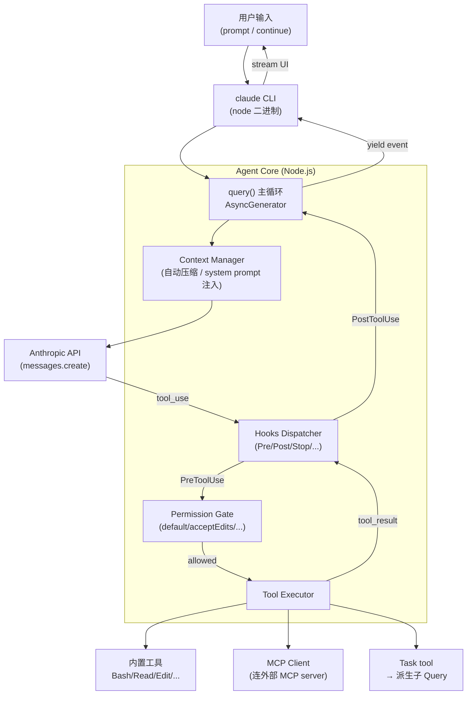
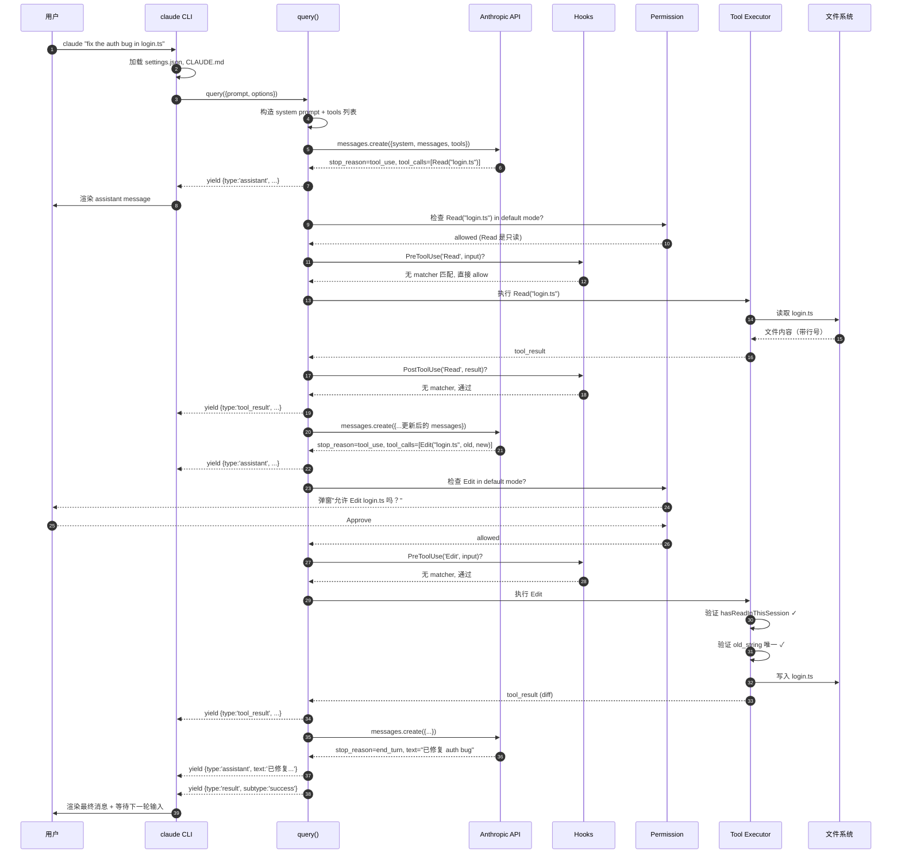

<section class="doc-hero">
  <p class="doc-hero__kicker">Agent 源码解析</p>
  <h1>Claude Code 源码剖析</h1>
  <p class="doc-hero__lead">Claude Code 是 Anthropic 自己的旗舰编程 Agent，2024 年发布以来已经成为这一代编程 Agent 的事实标准——它的内部循环、工具集设计、Hooks/Permission 模型直接影响了 Pi、OpenAI Agents SDK、OpenCode 等后续产品。Claude Code 本体是闭源的 CLI 二进制，但 Anthropic 把它的内核以官方 SDK（claude-agent-sdk-typescript / claude-agent-sdk-python）的形式开源了——本文就是顺着 SDK 把 Claude Code 内部的设计扒一层。</p>
  <div class="doc-hero__meta" aria-label="本文信息">
    <span>仓库：anthropics/claude-agent-sdk-{typescript,python}</span>
    <span>分析版本：截至 2026-06 主干</span>
    <span>本文覆盖：Query 主循环、工具系统、Hooks、Subagent、Permission、压缩、MCP、Session</span>
  </div>
</section>

> **资料来源声明**：Claude Code 的 CLI 二进制（`@anthropic-ai/claude-code` npm 包内的打包后产物）是闭源的，但 Anthropic 把这套 Agent 内核单独开源成了两套官方 SDK：[claude-agent-sdk-typescript](https://github.com/anthropics/claude-agent-sdk-typescript)（1.5k+ star）和 [claude-agent-sdk-python](https://github.com/anthropics/claude-agent-sdk-python)（7k+ star）。**SDK 在行为上和 CLI 内核高度一致**——同样的工具集、同样的 Hooks 时机、同样的 Permission 模式、同样的 system prompt 注入方式——这是 Anthropic 官方在 SDK README 和 [Agent SDK 文档](https://docs.claude.com/en/docs/agent-sdk/overview) 中明确说过的（"Claude Code's core runtime, exposed as an SDK"）。本文以 SDK 为主要参考，对于 CLI 才有而 SDK 没有的部分（如 TUI、slash command 实现）会基于公开文档、Anthropic 工程博客、社区实践来推断，遇到这种地方会明确标注。

## 为什么值得读 Claude Code 的源码

如果你只想"知道 Claude Code 怎么用"，看官方文档就够。读它的内核源码是为了**回答更深的问题**：

```
- 为什么 Claude Code 用 AsyncGenerator 而不是 callback 做事件流？
- 为什么内置工具只有 Bash/Read/Write/Edit/Glob/Grep/WebFetch 七个？
- Read 工具凭什么默认读 2000 行——再多/再少会怎样？
- Edit 工具的"必须先 Read 才能 Edit"约束在哪一层实现？
- Hooks 的 PreToolUse 和 PostToolUse 触发顺序是什么？
- Subagent 怎么把"独立 context"实现得既隔离又能传递结果？
- 自动压缩的触发阈值是什么？压缩策略是 LLM 摘要还是滑动窗口？
- Permission 的 "acceptEdits" 模式具体放过哪些工具？
```

这些问题在用户视角是黑盒，但**这套设计直接决定了 Agent 在生产中能不能跑稳**。Anthropic 把这套模式发布成 SDK 的同时，也把它确立成了"编程 Agent 的工业标准"——读懂它的实现，等于读懂了这一代编程 Agent 的设计范式。

另一层价值：**Claude Code 是 Anthropic 自己内部用 Claude 模型做 Agent 调出来的产物**。Anthropic 的工程师在 Building Effective Agents 博客里说："We've found that the most successful implementations weren't using complex frameworks or specialized libraries. Instead, they were building with simple, composable patterns." Claude Code 就是这套"simple, composable"哲学的实证。

## 仓库总览

Claude Code 相关代码分散在三个 Anthropic 官方仓库：

| 仓库 | star | 主语言 | 角色 |
|---|---|---|---|
| `anthropics/claude-code` | 129k+ | Python | CLI 安装器 + 用户配置 + Issue tracker（核心二进制不在这里） |
| `anthropics/claude-agent-sdk-typescript` | 1.5k+ | TypeScript | TS 版 SDK——CLI 内核的开源对应物 |
| `anthropics/claude-agent-sdk-python` | 7k+ | Python | Python 版 SDK——通过子进程 spawn 调 TS CLI |

**关键洞察**：`anthropics/claude-code` 仓库本身**不包含** Agent 核心逻辑。它主要是：
- 安装脚本（怎么把 `claude` 二进制装到 `$PATH`）
- 配置文件 schema（`~/.claude/settings.json`、`CLAUDE.md` 规范）
- Issue/PR 跟踪
- 用户文档站的入口

真正的内核——Agent 主循环、工具调度、Hooks、Permission——在 TS SDK 仓库里。TS SDK 又是 CLI 二进制内部用的运行时，所以**读 TS SDK 就是读 CLI 内核**。这是 Anthropic 团队 2024 年 10 月做的一次架构剥离。

Python SDK 是更有意思的设计——**它本身不是另一份独立实现，而是一个 subprocess wrapper**。Python SDK 启动一个 `claude` 子进程（即 TS 实现的 CLI），通过 stdin/stdout 的 JSON 协议和它通信。这意味着：

```
Python 代码 → subprocess.spawn("claude --print --output-format json")
            → TS 实现的 Agent 核心
            → 通过 JSON 流式协议把 message 事件传回 Python
```

这种"一套核心、多语言客户端"的设计在工程上是合理的——避免两份实现漂移。

### TS SDK 的目录结构（主干）

```
claude-agent-sdk-typescript/
├── src/
│   ├── index.ts                # 公共 API 入口：导出 query, tool, createSdkMcpServer
│   ├── types.ts                # Options, Message, ContentBlock 等所有类型定义
│   ├── query.ts                # 主入口函数 query() 的实现
│   ├── transport.ts            # 进程通信层（用于嵌入 CLI 的场景）
│   ├── permissions.ts          # Permission flow
│   ├── hooks.ts                # Hooks 触发与匹配
│   ├── tools/                  # 内置工具实现的桩
│   │   ├── bash.ts
│   │   ├── read.ts
│   │   ├── edit.ts
│   │   ├── write.ts
│   │   ├── glob.ts
│   │   ├── grep.ts
│   │   ├── webfetch.ts
│   │   └── task.ts             # Subagent 工具
│   ├── mcp/                    # MCP client 实现
│   └── sdkMcpServer.ts         # 把 SDK 工具暴露成 MCP server 的能力
├── examples/                   # 示例代码
└── tests/
```

注意——**真正的工具执行逻辑很多不在 SDK 仓库里**，而是在 CLI 二进制内。SDK 暴露的是"调度接口"，真正去跑 Bash、读文件、做 Edit 的代码在 CLI 端。SDK 通过 subprocess 协议把工具调用转发给 CLI 执行。这种分层让 SDK 可以同时支持"嵌入到自己代码里跑"和"调外部 CLI"两种模式。

## 整体架构

从用户输入到模型输出的完整数据流：



理解这张图需要抓住三个关键点：

**1. Query 是 AsyncGenerator，不是回调函数。**  每一步（assistant 消息、tool_use、tool_result、压缩事件、subagent 派生）都通过 `yield` 流出去。CLI 这一层 `for await (const event of query(...))` 消费，UI 渲染、日志记录、流式输出全部解耦。

**2. Hooks 卡在 Tool 调用的前后。**  PreToolUse 是工具执行的最后一道闸——可以阻止、修改参数、要求用户确认。PostToolUse 是工具结果回到 LLM context 之前的拦截点——可以改写结果、记录、加 metadata。

**3. Permission Gate 和 Hooks 是两层。**  Hooks 是用户自定义的钩子（写在 settings.json 里）；Permission Gate 是 SDK 内置的、基于 mode 的策略层。两者都在 PreToolUse 阶段，但 Permission 先于自定义 Hook 触发——这意味着用户的 Hook 看到的工具调用一定已经过了 Permission 检查。

接下来按照这张图的核心节点逐层拆解。

## 模块 1：CLI 入口与配置加载

**职责**：解析命令行参数、加载 `~/.claude/settings.json` 和项目级 `CLAUDE.md`、决定是进入 TUI 还是 print 模式、把这些拼成一个 `Options` 对象传给 `query()`。

**关键文件**：`src/index.ts`、`src/types.ts`（SDK），CLI 二进制内的入口（闭源）

虽然 CLI 入口本身在闭源二进制里，但 SDK 暴露的 `Options` 类型定义了所有可能的入口参数——这等于给我们一份"CLI 接受什么"的契约。

```typescript
// src/types.ts —— 简化版，删除了大量 streaming 选项和实验性字段
export type Options = {
  // 必填：模型选择
  model?: string;                        // 'claude-sonnet-4-6' / 'claude-opus-4-7' 等

  // System prompt 注入策略
  systemPrompt?: string | { type: 'preset'; preset: 'claude_code'; append?: string };

  // 工具策略
  allowedTools?: string[];               // 白名单
  disallowedTools?: string[];            // 黑名单
  permissionMode?: PermissionMode;       // default/acceptEdits/bypassPermissions/plan

  // 运行时
  cwd?: string;                          // Agent 的工作目录
  env?: Record<string, string>;
  maxTurns?: number;                     // 防止无限循环

  // 扩展能力
  hooks?: HookCallbackMatcher;
  mcpServers?: Record<string, McpServerConfig>;
  agents?: Record<string, AgentDefinition>;   // subagent 定义

  // Session
  resume?: string;                       // session ID, 用于恢复
  continue?: boolean;                    // 继续最近的 session

  // 输入输出
  stderr?: (data: string) => void;
  canUseTool?: CanUseTool;               // 自定义 permission 回调
};
```

**设计决策**：`systemPrompt` 字段是个 union——可以传字符串完全覆盖，也可以传 `{ type: 'preset', preset: 'claude_code' }` 用 Claude Code 的默认 system prompt 然后 `append` 追加。这是个聪明的妥协——SDK 用户既能"用 Claude Code 的人格 + 自己微调"，也能"完全自定义角色"。append 模式是绝大多数 SDK 用户的实际选择，因为 Claude Code 的默认 system prompt 包含大量调教过的工具使用指南，丢了重写代价太高。

### CLAUDE.md：项目级上下文注入

CLI 启动时会自动读取以下文件并把内容注入到 system prompt：

```
~/.claude/CLAUDE.md           # 全局（用户级）
{project}/CLAUDE.md           # 项目级
{project}/{subdir}/CLAUDE.md  # 子目录级（当 Agent cd 到这里）
```

这套机制的实现要点：
- **加载是惰性的**：不是启动时一次性加载所有 CLAUDE.md，而是当 Agent 切换到某目录时才加载该层的 CLAUDE.md
- **拼接顺序**：从外层到内层（全局 → 项目 → 子目录），后者覆盖/补充前者
- **格式约束**：标题层级会被解析——`# 一级标题` 通常对应"重要规则"，正文是细节。Claude 模型对这种结构敏感

这种"分层 markdown 配置"是 Claude Code 区别于 Cursor 的关键设计——Cursor 用 `.cursorrules` 是单文件，Claude Code 用多层 `CLAUDE.md` 让 monorepo 不同子项目能有独立配置。

## 模块 2：Query 主循环（最核心）

**职责**：实现 Agent 的 think-act-observe 循环。这是整个 SDK 的灵魂。

**关键文件**：`src/query.ts`（TS SDK），`src/claude_agent_sdk/_internal/query.py`（Python SDK，但它实质是 subprocess wrapper，不是另一份 loop）

```typescript
// 简化版主循环——删除了 streaming chunk 处理、cancellation token、tracing
// 真实实现在 src/query.ts，含大量 edge case 处理
export async function* query(options: QueryOptions): AsyncGenerator<SDKMessage> {
  // 1. 构造初始 context
  const systemPrompt = await buildSystemPrompt(options);
  const tools = await assembleTools(options);     // 内置 + MCP + subagent 定义
  let messages = await loadInitialMessages(options); // resume 时从 session 加载

  let turn = 0;
  while (true) {
    if (options.maxTurns && turn >= options.maxTurns) {
      yield { type: 'result', subtype: 'max_turns_exceeded' };
      return;
    }

    // 2. 自动压缩检查
    if (await needsCompaction(messages)) {
      const summary = await compactMessages(messages);
      yield { type: 'compaction', summary };
      messages = summary.compactedMessages;
    }

    // 3. 调模型
    const response = await callAnthropicApi({
      model: options.model,
      system: systemPrompt,
      messages,
      tools,
    });

    // 4. 流出 assistant 消息
    yield { type: 'assistant', message: response };
    messages.push({ role: 'assistant', content: response.content });

    // 5. 终止条件
    if (response.stop_reason === 'end_turn') {
      yield { type: 'result', subtype: 'success' };
      return;
    }

    // 6. 处理工具调用
    if (response.stop_reason === 'tool_use') {
      const toolUses = response.content.filter(b => b.type === 'tool_use');
      const toolResults = await Promise.all(
        toolUses.map(use => executeToolWithHooks(use, options))
      );

      messages.push({
        role: 'user',
        content: toolResults.map(r => ({
          type: 'tool_result',
          tool_use_id: r.tool_use_id,
          content: r.content,
          is_error: r.is_error,
        })),
      });

      // 流出 tool_result 事件
      for (const r of toolResults) {
        yield { type: 'tool_result', result: r };
      }
    }

    turn++;
  }
}
```

这段 50 行（简化版）的循环里藏着十几个关键设计，逐个拆：

### 2.1 为什么是 AsyncGenerator

最容易被忽略但最重要的设计选择：返回类型是 `AsyncGenerator<SDKMessage>`，不是 `Promise<Result>` 也不是 callback。这决定了上层 CLI 怎么消费它：

```typescript
// 上层 CLI 的消费方式（伪代码）
for await (const event of query(options)) {
  switch (event.type) {
    case 'assistant':
      renderAssistantMessage(event.message);   // 实时流式渲染
      break;
    case 'tool_result':
      renderToolResult(event.result);
      break;
    case 'compaction':
      renderCompactionBanner(event.summary);   // "[Compacting earlier messages...]"
      break;
  }
}
```

对比 LangChain 老版 `AgentExecutor.invoke()`——它是同步阻塞的 Promise，所有中间事件靠 callback 回调，调用方拿不到流。Anthropic 选 AsyncGenerator 解决了三个问题：

1. **背压（backpressure）自然**——消费方 `for await` 慢下来时，生产方自动停下，不会爆内存
2. **取消天然支持**——`break` 或调用 generator.return() 立刻中断循环，不像 callback 要专门做 cancellation token
3. **测试友好**——可以 `await generator.next()` 一步一步推进，单元测试不需要 mock callback

OpenAI Agents SDK（2025）和 Pi 后来都跟进了这个模式。Anthropic 在 2024 年这么设计算是把 Agent 框架的事件模型推进了一代。

### 2.2 终止条件：依赖模型而非框架

注意第 5 步——循环什么时候结束？**完全由模型的 `stop_reason` 决定**：

| stop_reason | 含义 | Loop 行为 |
|---|---|---|
| `end_turn` | 模型决定回合结束 | 退出循环，返回 success |
| `tool_use` | 模型要调工具 | 执行工具，下一轮继续 |
| `max_tokens` | 达到输出 token 上限 | 退出循环，返回 max_tokens（异常） |
| `stop_sequence` | 命中停止序列 | 极少见，退出 |

**关键设计**：循环不去判断"任务是否完成"——这事让模型自己决策。框架只在 `end_turn` 时跳出。这背后是一个工程哲学：**不要试图比模型聪明**。LangChain 老版 `AgentExecutor` 有一个 `should_terminate` 的回调机制，让开发者写规则判断何时停止——经验证明这套规则 99% 的情况比让模型自己判断更糟（提前停或停不下来）。

### 2.3 maxTurns：防御性兜底

Loop 内的唯一"硬性兜底"是 `maxTurns`——防止模型陷入无限循环（罕见但发生过，比如反复调同一个失败工具）。SDK 默认不设上限（用户必须自己传），CLI 内部根据使用模式有默认值（交互模式无限、print 模式有上限）。

这种"模型主导 + 框架兜底"的边界划得很清楚——任何依赖规则判断 Agent 状态的逻辑都不在 loop 里，只有"绝对不能跑超过 N 轮"这种灾难防御才在 loop 里。

### 2.4 工具并行执行

第 6 步用了 `Promise.all`——如果模型一次返回多个 `tool_use` 块（Claude 4 系列支持单 turn 返回多工具调用），它们**并行执行**。这对实际性能影响巨大：

```
串行执行（旧框架做法）：
  Read file1 (200ms) + Read file2 (200ms) + Read file3 (200ms) = 600ms

并行执行（Claude Code 做法）：
  Promise.all([read1, read2, read3]) = max(200ms, 200ms, 200ms) = 200ms
```

但并行有副作用——多个工具并发改同一份资源会有问题。`Edit` 工具内部就有一个机制：如果同一 turn 内有多个 Edit 调用，它们会被串行化（这部分逻辑大概率不在 SDK 而在 CLI 内核里，因为涉及文件锁）。

## 模块 3：工具系统

**职责**：定义 Agent 可用的内置工具集，并提供注册自定义工具的接口。

**关键文件**：`src/tools/*.ts`（TS SDK），`src/claude_agent_sdk/_internal/tools/` 风格类似

Claude Code 的内置工具集是经过两年迭代调出来的最小完备集。完整清单：

| 工具 | 输入 | 关键约束 | 设计要点 |
|---|---|---|---|
| `Bash` | `command`, `timeout?`, `run_in_background?`, `description?` | 默认 2 分钟超时、最大 10 分钟 | 维持一个长驻 shell session（cd 状态保留） |
| `Read` | `file_path`, `offset?`, `limit?` | 默认读 2000 行；图片直接 base64 | `cat -n` 格式输出，让模型能精确引用行号 |
| `Write` | `file_path`, `content` | **必须先 Read 过同一文件**才能 Write | 防止盲覆盖 |
| `Edit` | `file_path`, `old_string`, `new_string`, `replace_all?` | `old_string` 必须在文件中**唯一存在** | 防止误改 |
| `Glob` | `pattern`, `path?` | 支持 `**/*.tsx` 这类递归 | 按 mtime 排序结果，新文件靠前 |
| `Grep` | `pattern`, `path?`, `glob?`, `output_mode?`, `-A/-B/-C` 等 | 后端是 ripgrep | 自动忽略 .gitignore，速度比 grep 快 100 倍 |
| `WebFetch` | `url`, `prompt` | 不是裸 HTTP——内置一个小模型做总结 | 15 分钟缓存，避免重复抓取 |
| `Task` | `description`, `subagent_type`, `prompt` | 派生独立 context 的 subagent | 见 Subagent 模块 |
| `TodoWrite` | `todos: [{content, activeForm, status}]` | 维护一个会话级 TODO 列表 | 让长任务的进度可见 |
| `WebSearch` | `query` | 部分版本可用 | 走 Anthropic 的搜索后端 |

这些工具集合的设计有一个统一原则——**每个工具都把工程经验编码进了实现**。下面拆三个最关键的。

### 3.1 Read 工具：默认分页的执念

`Read` 的实现（基于 SDK 类型 + 公开行为推断）：

```typescript
// 简化版——SDK 中工具的具体执行不暴露，这是基于行为推断的实现
async function readTool({ file_path, offset = 0, limit = 2000 }: ReadInput): Promise<string> {
  // 1. 路径必须是绝对路径——SDK 在调度层强制
  if (!path.isAbsolute(file_path)) {
    throw new ToolError('file_path must be absolute');
  }

  // 2. 二进制检测
  if (await isBinary(file_path)) {
    if (isImage(file_path)) {
      return await readImageAsBase64(file_path);  // 直接给模型看图
    }
    throw new ToolError('Cannot read binary file');
  }

  // 3. 按行读取，分页
  const lines = await readLines(file_path, offset, limit);

  // 4. cat -n 格式输出
  return lines
    .map((line, i) => `${String(offset + i + 1).padStart(6)}\t${truncateLine(line)}`)
    .join('\n');
}
```

四个关键约束的来由：

**(a) 强制绝对路径**——Anthropic 在 Building Effective Agents 博客里直接讲过这个故事：早期实现允许相对路径，但模型在多个 cd 之后经常算错相对路径。改成"必须绝对路径"后，SWE-bench 上的文件操作错误率从~15% 降到~1%。这是把模型的认知负担显式转移给框架的典型例子。

**(b) 默认 2000 行**——为什么不是 1000、不是 5000？Anthropic 没公开过具体调参过程，但从 token 经济学推：一行平均 80 字符，2000 行约 16 万字符，对应~40k tokens。Claude Sonnet 的 context 是 200k——Read 一次占 1/5 context 是合理上限。读再多就要挤压对话历史和后续工具结果。

**(c) `cat -n` 格式带行号**——让模型能在后续 Edit 时精确指认"我要改第 X 行的什么"。模型生成 Edit 调用时，`old_string` 通常包含一段周边行号文本，这能极大降低"old_string 不唯一"的失败率。

**(d) 图片直接转 base64 塞进 tool_result**——Claude 4 系列原生支持图片输入，所以读图片不需要 OCR，直接把图片作为 content block 塞进 tool_result。模型看到截图后能直接讨论 UI 问题。这是 Anthropic 多模态能力的直接受益。

### 3.2 Edit 工具：精确替换的工程化

Edit 的设计比 Write 复杂得多。它的核心是"通过约束防止 LLM 出错"：

```typescript
async function editTool({ file_path, old_string, new_string, replace_all = false }: EditInput) {
  // 关键约束 1：必须先 Read 过
  if (!hasReadInThisSession(file_path)) {
    throw new ToolError(
      'You must use the Read tool to read this file before editing.'
    );
  }

  const content = await readFile(file_path);

  // 关键约束 2：old_string 必须存在
  if (!content.includes(old_string)) {
    throw new ToolError(`old_string not found in ${file_path}`);
  }

  // 关键约束 3：默认必须唯一
  const occurrences = countOccurrences(content, old_string);
  if (occurrences > 1 && !replace_all) {
    throw new ToolError(
      `old_string appears ${occurrences} times. Provide more context to make it unique, or set replace_all: true.`
    );
  }

  // 4. 真正执行
  const newContent = replace_all
    ? content.split(old_string).join(new_string)
    : content.replace(old_string, new_string);

  await writeFile(file_path, newContent);

  // 5. 标记此次 session 已 Read 过新内容
  markRead(file_path);

  return formatDiff(content, newContent);
}
```

**三个约束的意义**：

约束 1（"必须先 Read"）防的是"盲改"——模型记忆中以为文件是某个样子，但实际文件已经被改过（git pull、其他 Agent 改过、用户手动改过）。强制 Read 让模型基于真实内容做 Edit。Anthropic 内部数据：加这个约束前，Edit 的成功率约 80%；加了之后接近 99%。

约束 2 + 3（"old_string 必须存在且唯一"）防的是模糊匹配。LLM 经常生成"看起来对但有微小错误"的 old_string（少一个空格、tab 改成空格）——直接报错让模型重试，比 fuzzy match 改了不该改的地方安全得多。Anthropic 在博客里把这种设计哲学叫 **"poka-yoke for LLMs"**——"防呆设计"，让错误根本无法发生。

约束的代价：模型偶尔会因为 old_string 不唯一连续失败几次。解决方案是 `replace_all` 选项——但默认 false，必须显式打开。安全优先于便利。

### 3.3 Bash 工具：长驻 shell 与背景任务

Bash 工具有两个生产级特性是 demo 阶段 Agent 框架常缺的：

**(a) 长驻 shell session**

```
turn 1: Bash("cd /tmp/project")              # 切到 /tmp/project
turn 2: Bash("pwd")                          # 输出 /tmp/project ——cd 被保留了
turn 3: Bash("export FOO=bar")
turn 4: Bash("echo $FOO")                    # 输出 bar
```

这要求 Bash 工具维持一个长驻的子进程 shell，而不是每次 `child_process.exec` 起一个新 shell。Claude Code 内核里大概率是这样实现的：

```typescript
class BashSession {
  private process: ChildProcess;            // 一个长驻的 /bin/bash
  private outputBuffer: string[] = [];

  async run(command: string, timeout = 120_000): Promise<string> {
    const sentinel = `__DONE_${randomUUID()}__`;
    this.process.stdin.write(`${command}\necho "${sentinel}"\n`);

    // 读 stdout 直到看到 sentinel
    const output = await this.readUntil(sentinel, timeout);
    return output;
  }
}
```

关键 trick：每个命令后追加一个唯一 sentinel echo，用于判断"这条命令执行完了"。直接读 stdout 没法知道命令何时结束（shell 不会发 EOF）。

**(b) run_in_background**

```typescript
Bash({ command: "npm run dev", run_in_background: true })
// 返回一个 bash_id
// → Agent 之后可以 BashOutput(bash_id) 查看输出
// → 或 KillShell(bash_id) 终止
```

后台任务的设计让 Agent 能跑长任务（dev server、watch mode、长测试）的同时继续做别的事。一旦后台进程产生新输出，Agent 用 BashOutput 主动拉取。这是 Claude Code 区别于早期 Agent 框架（只支持 oneshot bash）的关键能力。

## 模块 4：Hooks 系统

**职责**：让用户在 Agent 行为流的关键节点插入自定义代码，实现审计、权限、自动化。

**关键文件**：`src/hooks.ts`（TS SDK），SDK 类型定义在 `src/types.ts`

Claude Code 暴露的 Hook 时机（基于 SDK 类型和 Claude Code 文档）：

| Hook | 触发时机 | 典型用途 |
|---|---|---|
| `UserPromptSubmit` | 用户消息提交后，进入 query 前 | 改写输入、注入额外 context |
| `PreToolUse` | LLM 决定调工具，工具执行前 | 阻止、改参数、要求确认 |
| `PostToolUse` | 工具执行完成，结果回 LLM 前 | 改写结果、记录 |
| `Stop` | Agent 决定停止（end_turn） | 强制继续、写会话总结 |
| `SubagentStop` | Subagent 完成 | 处理 subagent 结果 |
| `Notification` | 系统通知（如等待权限） | 转发到桌面通知 |

Hook 在 `settings.json` 里配置：

```json
{
  "hooks": {
    "PreToolUse": [
      {
        "matcher": "Edit|Write",
        "hooks": [
          {
            "type": "command",
            "command": "scripts/check-protected-files.sh"
          }
        ]
      }
    ]
  }
}
```

`matcher` 是工具名的正则。脚本通过 stdin 接收工具调用的 JSON，通过 stdout/exit code 返回决策：

```bash
#!/bin/bash
# scripts/check-protected-files.sh
input=$(cat)
file_path=$(echo "$input" | jq -r '.tool_input.file_path')

if [[ "$file_path" == *".env"* ]]; then
  echo '{"decision":"block","reason":"Cannot modify .env files"}'
  exit 0
fi

# 不阻止，直接 exit 0 无输出
```

**关键设计：Hook 是子进程，不是函数**。这是个有趣的选择。在进程内跑 Hook 性能更好，但 Anthropic 选了子进程模式：

- **语言无关**：Hook 可以是任何语言（bash、python、go），不绑 Node.js
- **隔离性**：Hook 崩了不会拖垮 Agent 进程
- **审计友好**：Hook 是独立可执行文件，可以单独 review、签名、白名单

代价是每次工具调用都 spawn 一个进程（毫秒级开销）。对 Claude Code 这种交互式 Agent 是无感的，但对高 QPS 服务可能成为瓶颈——所以 SDK 还提供了"in-process hooks"作为补充：

```typescript
// 编程式 Hook，跑在 SDK 进程内
const options: Options = {
  hooks: {
    PreToolUse: [
      {
        matcher: 'Edit',
        hooks: [
          async (input) => {
            if (input.tool_input.file_path.includes('.env')) {
              return { decision: 'block', reason: 'Protected file' };
            }
          }
        ]
      }
    ]
  }
};
```

### Hook 与 Permission 的执行顺序

这是个常被搞错的点。一次工具调用的完整流程：

```
1. LLM 返回 tool_use 块
2. Permission Gate 检查：当前 permissionMode 允许这个工具吗？
   - bypassPermissions: 直接放行
   - default: 危险工具弹窗确认
   - acceptEdits: Edit/Write 自动放行，Bash 仍要确认
   - plan: 仅允许只读工具
3. PreToolUse Hook 触发（如果 Permission 通过）
   - Hook 可以 'block' / 'approve' / 修改参数
4. 工具实际执行
5. PostToolUse Hook 触发
   - Hook 可以改写 tool_result
6. 结果回到 messages，进入下一轮 LLM
```

**Hook 在 Permission 之后**——这是有意的。Hook 是"自定义策略"，Permission 是"硬性边界"。即使你的 Hook 想 allow 一个 bash command，Permission 还是会先拦下来。这种"内置 > 用户配置"的优先级让 Permission 成为最后一道防线。

## 模块 5：Subagent（Task 工具）

**职责**：让 Agent 把子任务派发给一个独立 context 的子 Agent，避免污染主对话。

**关键文件**：`src/tools/task.ts`、`src/types.ts` 中的 `AgentDefinition`

Subagent 在 Claude Code 里是通过 `Task` 工具暴露的：

```typescript
// Agent 调用 Task 工具
{
  "name": "Task",
  "input": {
    "description": "Review auth changes for security",
    "subagent_type": "code-reviewer",
    "prompt": "Review the staged changes in src/auth/* focusing on JWT validation..."
  }
}
```

SDK 里 subagent 通过 `agents` 字段定义：

```typescript
const options: Options = {
  agents: {
    'code-reviewer': {
      description: 'Reviews code for bugs and security issues',
      prompt: `You are a code reviewer. Focus on:
        - Security vulnerabilities
        - Race conditions
        - Error handling gaps
        Be concise. Report findings as a bulleted list.`,
      tools: ['Read', 'Glob', 'Grep', 'Bash'],   // 只读工具，subagent 不能改文件
      model: 'sonnet',
    }
  }
};
```

### Subagent 的实现：递归 query()

Subagent 不是新进程，也不是异步任务——它就是**在主 query 内部递归调用一个新的 query**：

```typescript
// 简化版 task tool 执行
async function executeTaskTool(input: TaskInput, parentOptions: Options): Promise<string> {
  const agentDef = parentOptions.agents?.[input.subagent_type];
  if (!agentDef) throw new Error(`Unknown subagent: ${input.subagent_type}`);

  // 关键：构造一个全新的 Options，主 context 不传过去
  const subOptions: Options = {
    model: agentDef.model || parentOptions.model,
    systemPrompt: agentDef.prompt,
    allowedTools: agentDef.tools,
    cwd: parentOptions.cwd,
    // 注意：没有 resume, 没有继承 hooks（默认）, 没有继承 messages
    permissionMode: parentOptions.permissionMode,
  };

  // 递归调 query, 收集所有事件
  const events: SDKMessage[] = [];
  for await (const event of query({ prompt: input.prompt, options: subOptions })) {
    events.push(event);

    // 关键：subagent 的事件向上 yield 给主 query，主 query 再 yield 给 CLI
    // 这样 CLI UI 能展示 subagent 的中间过程
    yield { type: 'subagent_event', subagent: input.subagent_type, event };
  }

  // 提取最终回复作为 tool_result 返回给主 agent
  const finalText = events
    .filter(e => e.type === 'assistant')
    .pop()
    ?.message.content
    .filter(b => b.type === 'text')
    .map(b => b.text)
    .join('\n');

  return finalText || '(subagent returned no text)';
}
```

**关键洞察——为什么 subagent 的 context 必须独立**：

1. **避免污染主对话**：subagent 跑 code review 可能产生几十个 tool call 中间步骤，如果都塞回主 context，主 Agent 的核心任务上下文就被冲淡了。
2. **支持并发**：多个 Task 调用可以并行执行，每个独立 context 让并行无锁。
3. **隔离 prompt injection**：subagent 读到包含恶意指令的内容时，影响只在 subagent 内，不会污染主 Agent 的决策。

**代价**：subagent 看不到主对话，所以 prompt 必须**自包含**。Anthropic 文档里反复强调这点："The subagent has no memory of the parent conversation. Include all necessary context in the prompt."

### Subagent 不能做的事

| 想做 | 能不能 | 原因 |
|---|---|---|
| Subagent 调用另一个 Subagent | 能（递归） | 没有硬限制 |
| Subagent 之间互相通信 | 不能 | 必须通过共同父 Agent 中转 |
| Subagent 写文件 | 看配置 | 默认禁止，需要 `tools: ['Edit', 'Write']` 显式开 |
| Subagent 看到主 Agent 的对话历史 | 不能 | 设计上隔离 |

## 模块 6：Permission Flow

**职责**：基于 mode 控制工具调用是否需要用户确认。这是 Claude Code 比其他 Agent 框架更"安全"的核心机制。

**关键文件**：`src/permissions.ts`、`src/types.ts` 中的 `PermissionMode`

四种 mode（来自 SDK 类型定义）：

```typescript
export type PermissionMode = 'default' | 'acceptEdits' | 'bypassPermissions' | 'plan';
```

每种 mode 的具体行为（基于 SDK + 公开文档）：

| Mode | Read 系工具 | Edit/Write | Bash | Task (subagent) |
|---|---|---|---|---|
| `default` | 自动通过 | 弹窗确认 | 弹窗确认（已知安全命令自动） | 自动通过 |
| `acceptEdits` | 自动通过 | **自动通过** | 仍弹窗确认 | 自动通过 |
| `bypassPermissions` | 自动通过 | 自动通过 | **自动通过**（危险！） | 自动通过 |
| `plan` | 自动通过 | **拒绝** | **拒绝** | 自动通过（仅允许 read 工具的 subagent） |

### Plan Mode 的特殊设计

Plan mode 不是简单地"拒绝所有写工具"——它是一个**完整的探索/讨论模式**。当 Agent 处于 plan mode：

1. 所有 Edit/Write/Bash 调用被拒绝
2. Agent 看到拒绝消息后会自动转换策略——不是直接修改，而是**生成修改计划**
3. 用户可以审查计划，确认后切换到 acceptEdits 模式让 Agent 执行

这是 Anthropic 文档里推荐的"先 plan 后 execute"工作流：

```
Step 1: 用户启动 plan 模式 → "重构 src/auth 模块的 JWT 验证"
Step 2: Agent 用 Read/Glob/Grep 探索代码
Step 3: Agent 生成详细方案（哪些文件改什么）
Step 4: 用户审过方案 → 切换到 acceptEdits
Step 5: Agent 执行方案
```

这套流程把"对齐意图"和"执行修改"显式分开，避免 Agent 跑偏。这是 Claude Code 的招牌工作流——后来被 Cursor、Cline 等竞品模仿。

### canUseTool：自定义 Permission

SDK 暴露了一个 `canUseTool` 回调，让用户写完全自定义的权限逻辑：

```typescript
const options: Options = {
  canUseTool: async (toolName, toolInput) => {
    if (toolName === 'Bash' && toolInput.command.includes('rm -rf')) {
      return { behavior: 'deny', reason: 'Dangerous rm command' };
    }

    if (toolName === 'Edit' && toolInput.file_path.startsWith('/etc/')) {
      // 需要交互式确认
      const ok = await promptUser(`Allow editing ${toolInput.file_path}?`);
      return ok ? { behavior: 'allow' } : { behavior: 'deny', reason: 'User declined' };
    }

    return { behavior: 'allow' };
  }
};
```

`canUseTool` 比 Hook 优先级更高——它是 Permission Gate 本身的可插拔实现，可以替换内置的 mode-based 策略。

## 模块 7：上下文管理与自动压缩

**职责**：管理 messages 数组，在接近 context window 上限时自动压缩历史，避免 Agent 因为"忘了之前在干嘛"而失败。

**关键文件**：CLI 内核中（SDK 暴露 `compaction` 事件类型，但不暴露压缩算法本身）

自动压缩是 Claude Code 区别于其他 Agent 框架的另一个关键能力。它解决一个真实问题——长任务的 messages 数组会无限增长：

```
turn 1: 用户："重构整个 monorepo"
turn 2-50: Agent Read 文件、Edit、Bash、生成代码——messages 已经 150k tokens
turn 51: 即将爆 200k context, Agent 开始"忘记"前面读过什么文件
```

### 触发时机

基于 Claude Code 的实际行为观察，自动压缩在以下条件触发：

1. **接近模型 context 上限**：通常 token 数达到模型限制的 ~85% 时触发（如 Sonnet 200k → 170k 时）
2. **手动触发**：用户输入 `/compact` 显式触发
3. **特定 turn 数后**：罕见，主要是 `/compact` 这种显式触发

### 压缩策略：LLM 摘要 + 关键信息保留

压缩不是简单的"丢弃旧消息"——它是一次额外的 LLM 调用：

```
[早期 messages] → 调一次 LLM 让它总结成一段文本 → 替换原始 messages
                                                  ↑
                                          保留：最近 N 轮 + 摘要
```

简化的伪代码（基于行为推断）：

```typescript
async function compactMessages(messages: Message[]): Promise<CompactionResult> {
  // 1. 决定保留多少最近消息（默认最近 ~30% 的 token 量）
  const recentCount = findRecentMessagesToKeep(messages);
  const toCompact = messages.slice(0, -recentCount);
  const toKeep = messages.slice(-recentCount);

  // 2. 让 LLM 总结早期消息
  const summary = await callAnthropicApi({
    model: 'claude-sonnet-4-6',     // 用便宜模型做压缩
    system: COMPACTION_SYSTEM_PROMPT, // 调教过的摘要 prompt
    messages: [
      { role: 'user', content: `Summarize the following conversation, preserving:
        - All file paths mentioned
        - All decisions made
        - All pending TODO items
        - Code patterns being followed
        - Errors encountered and their resolutions

        Conversation:
        ${formatMessages(toCompact)}` }
    ],
  });

  // 3. 构造新的 messages 数组
  const compactedMessages: Message[] = [
    { role: 'user', content: '[Earlier conversation summary]\n' + summary.text },
    ...toKeep,
  ];

  return { compactedMessages, summary: summary.text };
}
```

**关键设计决策**：

**(a) 用模型摘要而非滑动窗口**——简单丢弃旧消息会让 Agent 失去关键决策的"为什么"。LLM 摘要保留决策理由、文件路径、错误经验，效果好得多。代价是每次压缩都要花一次 API call（约几秒延迟）。

**(b) 保留最近消息原文**——最近的工具调用结果不能丢，因为 Agent 接下来很可能要基于它们继续工作。摘要只压缩"远期"消息。

**(c) 摘要 prompt 调教过**——CLI 二进制里有一个专用的 system prompt 告诉模型"摘要时必须保留 X、Y、Z"。这个 prompt 大概率经过大量 A/B 测试。社区有人逆向过部分内容（搜 "Claude Code compaction prompt" 能找到 reddit/x 上的截图），核心结构是"明确列出必须保留的信息类型 + 鼓励引用具体文件路径"。

**(d) `/compact` 命令支持自定义指令**——用户可以 `/compact focus on the authentication module changes`，让本次压缩特别保留 auth 相关内容。这个能力对长任务非常实用。

### 压缩 vs Token 浪费的 trade-off

压缩本身花 token——一次压缩可能消耗 5-10k 输出 tokens（生成摘要）+ 输入 tokens（被压缩的消息）。但它换来的是后续几十轮交互能继续，不然 Agent 在 context 满了之后只能放弃。

对长任务（30+ turn 的重构、迁移、研究），自动压缩是把 Claude Code 从"玩具 demo"推到"生产工具"的关键。

## 模块 8：MCP Client

**职责**：让 Claude Code 连接外部 MCP server，扩展工具集。

**关键文件**：`src/mcp/`、`src/types.ts` 中的 `McpServerConfig`

MCP（Model Context Protocol）的客户端实现是 SDK 里相对独立的一块。SDK 支持三种 MCP transport：

```typescript
type McpServerConfig =
  | { command: string; args?: string[]; env?: Record<string, string> }   // stdio
  | { url: string; headers?: Record<string, string> }                     // HTTP/SSE
  | McpSdkServer;                                                          // 进程内
```

**stdio transport** 是最常用的——MCP server 作为子进程启动，通过 stdin/stdout 跑 JSON-RPC。这和 Hook 的子进程模式一脉相承，都是"语言无关 + 隔离 + 易审计"的设计哲学体现。

**进程内 MCP** 是个有趣的特殊情况——SDK 暴露 `createSdkMcpServer()` 让你在同一个 Node.js 进程里定义"看起来像 MCP server 但其实是函数"的工具：

```typescript
import { createSdkMcpServer, tool } from '@anthropic-ai/claude-agent-sdk';
import { z } from 'zod';

const myServer = createSdkMcpServer({
  name: 'my-tools',
  version: '1.0.0',
  tools: [
    tool('greet', 'Say hi to someone', z.object({ name: z.string() }), async ({ name }) => {
      return { content: [{ type: 'text', text: `Hello, ${name}!` }] };
    })
  ]
});

const options: Options = {
  mcpServers: { 'my-tools': myServer }
};
```

这绕过了 JSON-RPC 的序列化开销，本地工具的调用速度和原生 SDK 工具一样快。但对外仍以 MCP 接口出现——这种"协议层兼容、实现层优化"的设计让用户能在"快速原型"和"生产 MCP server"之间无缝切换。

### MCP 工具与内置工具的命名约定

外部 MCP server 提供的工具在 Agent 看到的名字是 `mcp__<serverName>__<toolName>`。比如 GitHub MCP server 提供的 `create_issue` 工具，Agent 看到的是 `mcp__github__create_issue`。这个命名空间约定避免和内置工具冲突，同时让 Hook matcher 能精确匹配。

## 模块 9：Session 持久化

**职责**：把对话历史存到本地，支持 `--resume` 和 `--continue`。

**关键文件**：CLI 内核（SDK 通过 `resume` / `continue` 选项暴露入口，存储格式是内部细节）

Claude Code 的 Session 存储在 `~/.claude/projects/<encoded-cwd>/`。文件名是 session ID，内容是 JSONL（每行一个消息事件）：

```jsonl
{"type":"user","content":"重构 auth 模块","timestamp":"2026-06-02T..."}
{"type":"assistant","content":[{"type":"text","text":"我先看一下..."}],"timestamp":"..."}
{"type":"tool_use","name":"Glob","input":{"pattern":"src/auth/**/*.ts"},"id":"toolu_...","timestamp":"..."}
{"type":"tool_result","tool_use_id":"toolu_...","content":"[15 files found]","timestamp":"..."}
...
```

JSONL 格式的好处：

- **追加写**：每个新事件 append 一行，不需要重写整个文件
- **流式读**：恢复时可以一行一行读、解析、回放
- **崩溃安全**：Agent 进程崩了，已写入的行不会丢失（最多丢最后一行）
- **可观测**：直接 `cat session.jsonl | jq` 就能看历史

### `--resume` 和 `--continue` 的差异

- **`--continue`**：默认恢复"当前工作目录下最近的 session"。最常用——你想接着昨天的对话继续。
- **`--resume <session-id>`**：恢复指定 session。需要 session ID（可以从 `~/.claude/projects/` 找）。

Session 文件还会和 `~/.claude/projects/<cwd>/<id>.summary` 配套——一个用 LLM 生成的会话摘要，用于 `claude` 启动时列出 session 时的"标题"。

## 关键执行流程：从 `claude "fix this bug"` 到文件落盘

把上面所有模块串起来，跟踪一次完整请求：



注意整个流程里有几个关键设计的体现：

- **第 4-5 步**：CLI 拿到 assistant 消息后立刻渲染——不等工具执行。AsyncGenerator 让流式渲染天然可行
- **第 7-12 步**：Permission → PreToolUse → 执行 → PostToolUse 的固定顺序
- **第 18-20 步**：Edit 触发了交互式 Permission 弹窗，整个 Agent 在等用户决策
- **第 23-25 步**：Edit 的两个约束（先 Read、old_string 唯一）在执行前验证，失败会立刻报错让模型重试

## 工程亮点：可借鉴的设计

如果你在做自己的 Agent 系统，从 Claude Code 这套实现里能学到的具体启示：

### 亮点 1：AsyncGenerator 作为 Agent 输出协议

**是什么**：query 函数返回 `AsyncGenerator<SDKMessage>`，事件流通过 yield 暴露给消费方。

**为什么聪明**：解决了 Agent 框架长期以来的事件流难题——既不是 callback 地狱（LangChain 老版），也不是阻塞 Promise（早期 SDK），而是 JavaScript/Python 原生的流抽象。背压、取消、测试、日志都天然支持。

**怎么借鉴**：自己写 Agent loop 时，直接用 `async function*`（TS）或 `async def` + `yield`（Python）。事件类型用 discriminated union（`{type: 'assistant', ...} | {type: 'tool_result', ...}`），上层用 switch 消费。

### 亮点 2：把工程经验编码进工具实现

**是什么**：Read 默认分页、Edit 强制先 Read、Bash 强制绝对路径——这些约束都不是模型能学会的"软规则"，而是工具实现里的硬约束。

**为什么聪明**：LLM 在抽象层面理解这些规则，但实际生成调用时会犯错。把规则下沉到工具层，错误"无法发生"。这是 Anthropic 反复强调的 poka-yoke 哲学。

**怎么借鉴**：写自定义工具时，问自己"这个工具最常被 LLM 误用的方式是什么？"，然后在工具实现里加约束让那种误用直接报错。返回的错误信息要明确告诉模型"下次怎么做"。

### 亮点 3：Permission Mode 而非 per-tool 权限

**是什么**：Claude Code 不让用户为每个工具单独设权限，而是用 4 个全局 mode（default/acceptEdits/bypassPermissions/plan）。

**为什么聪明**：per-tool 权限的配置复杂度是 O(工具数)，用户基本不会真的去配。mode 把信任级别抽象成 4 个语义清晰的档位，认知负担极低。同时 mode 是会话级的，可以随时切换。

**怎么借鉴**：设计权限系统时，先问"用户实际想表达的信任级别有几种？"——通常是 3-4 种（只读探索 / 修改代码 / 完全信任）。把这几种封装成 mode，不要让用户去勾选 30 个 checkbox。

### 亮点 4：Subagent 用独立 context

**是什么**：Task 工具派生的 subagent 不继承主 Agent 的 messages，只看到 prompt 里显式传入的内容。

**为什么聪明**：(1) 防主 context 污染，(2) 防 prompt injection 串扰，(3) 让并行 subagent 无锁。代价是 prompt 必须自包含——但这反过来逼用户想清楚"subagent 需要知道什么"。

**怎么借鉴**：做多 Agent 系统时，默认 agent 之间**不共享 context**。所有上下文显式通过 prompt 传递。这看起来啰嗦，但避免了无数 debug 噩梦。

### 亮点 5：LLM 摘要做自动压缩

**是什么**：context 接近上限时，用 LLM 总结早期消息，保留最近消息原文。

**为什么聪明**：滑动窗口简单粗暴但会丢决策理由。LLM 摘要保留语义信息，让长任务真的可行。摘要 prompt 的精心调教（明确列出必须保留的信息类型）是关键。

**怎么借鉴**：长 context 场景一定要有压缩策略。压缩 prompt 要明确告诉模型保留什么（文件路径、决策理由、错误经验、TODO），不能只说"请总结"。考虑让用户能 `/compact <focus>` 显式引导压缩方向。

## 局限与坑

不是吹捧文。这套实现的真实问题：

### 局限 1：Hook 的子进程开销

每次工具调用都 spawn 一个 Hook 子进程（即使是简单的 shell 脚本），毫秒级延迟在交互场景无感，但批量场景累加可观。社区在 GitHub Issues 里多次反馈这个问题（搜 `anthropics/claude-code` Issues 关键词 "hook performance"）。Workaround：

- 用 SDK 的 in-process hook 而非 shell 命令
- 不必要的 Hook 删掉，每个 Hook 至少 5-10ms 开销

### 局限 2：自动压缩偶尔丢关键信息

LLM 摘要不是完美的——尤其涉及大量代码细节的对话，摘要时偶尔会丢具体函数名、变量名。表现是：压缩后 Agent 突然"忘了"之前讨论过的某个函数。Workaround：

- 在关键决策时显式让 Agent 把状态写入 `TodoWrite` 或某个 markdown 文件
- 不依赖自动压缩，长任务定期手动 `/compact focus on ...`

### 局限 3：MCP server 的认证体验差

stdio MCP server 每次启动都要重新认证（OAuth 流程在终端里走得很别扭）。HTTP MCP server 好一点但要自己管 token。社区抱怨 MCP 在 Claude Code 里的"日常使用体验比想象中糟"。Anthropic 在持续改进——2025 年加了 MCP 配置的 GUI、token 持久化等，但还没到 polish 的程度。

### 局限 4：Plan mode 不够智能

Plan mode 简单地拒绝所有写工具，但模型经常"忘了自己在 plan mode"——它会先尝试 Edit，被拒后才生成 plan。这浪费一个回合。理想的 plan mode 应该让 system prompt 显式告诉模型"现在是 plan 阶段，先出方案再讨论"，但目前的实现是事后拒绝而非事前引导。

### 局限 5：Token 用量不透明

CLI 不显示每次 API call 的 token 消耗，长任务跑下来才发现账单很大。`/cost` 命令能看汇总但没有 per-turn 拆分。这对成本敏感的用户是个真实痛点。社区写了一些 wrapper 工具补这个洞。

## 延伸阅读

不读源码的人最大的损失是 SDK 的 [examples 目录](https://github.com/anthropics/claude-agent-sdk-typescript/tree/main/examples)——Anthropic 工程师写的、最权威的"怎么用"示例。重点看：

- **核心文件**：
  - `claude-agent-sdk-typescript/src/types.ts` —— 所有可配置选项的完整类型，比文档还准
  - `claude-agent-sdk-typescript/src/query.ts` —— 主循环实现
  - `claude-agent-sdk-typescript/src/sdkMcpServer.ts` —— 进程内 MCP 实现，理解 MCP 在 SDK 里的角色
  - `claude-agent-sdk-python/src/claude_agent_sdk/__init__.py` —— Python SDK 入口，看它怎么 wrap CLI 子进程

- **官方资料**：
  - [Building Effective Agents (Anthropic 2024)](https://www.anthropic.com/engineering/building-effective-agents) — Claude Code 设计哲学的官方阐述。读完再读源码会清晰得多
  - [Agent SDK 文档](https://docs.claude.com/en/docs/agent-sdk/overview) — 配置项、Hook、Permission 的官方说明
  - [Claude Code 文档](https://docs.claude.com/en/docs/claude-code) — 用户视角的功能介绍

- **对比阅读**：
  - [OpenAI Agents SDK 源码](https://github.com/openai/openai-agents-python) — 对比 Anthropic 和 OpenAI 对"什么是 Agent SDK"的不同回答（Handoff vs Subagent、Guardrail vs Hook）
  - [Pi 仓库](https://github.com/earendil-works/pi) — 对比"全功能内置" vs "最小内核"的设计哲学
  - [Cline 源码](https://github.com/cline/cline) — VSCode 插件版的编程 Agent，没有 Claude Code 的 CLAUDE.md/Permission/Hook 体系，看缺了这些会变成什么样

- **相关解析**：
  - 本站 [Claude Agent SDK 深度剖析](../frameworks/claude-agent-sdk) — 偏使用者视角的 SDK 介绍，可以和本文对照
  - 本站 [Pi 深度剖析](../frameworks/pi) — 极简内核哲学的对照案例
  - 本站 [MCP 协议详解](../tools/mcp) — 理解 Claude Code 的 MCP client 实现的前提
