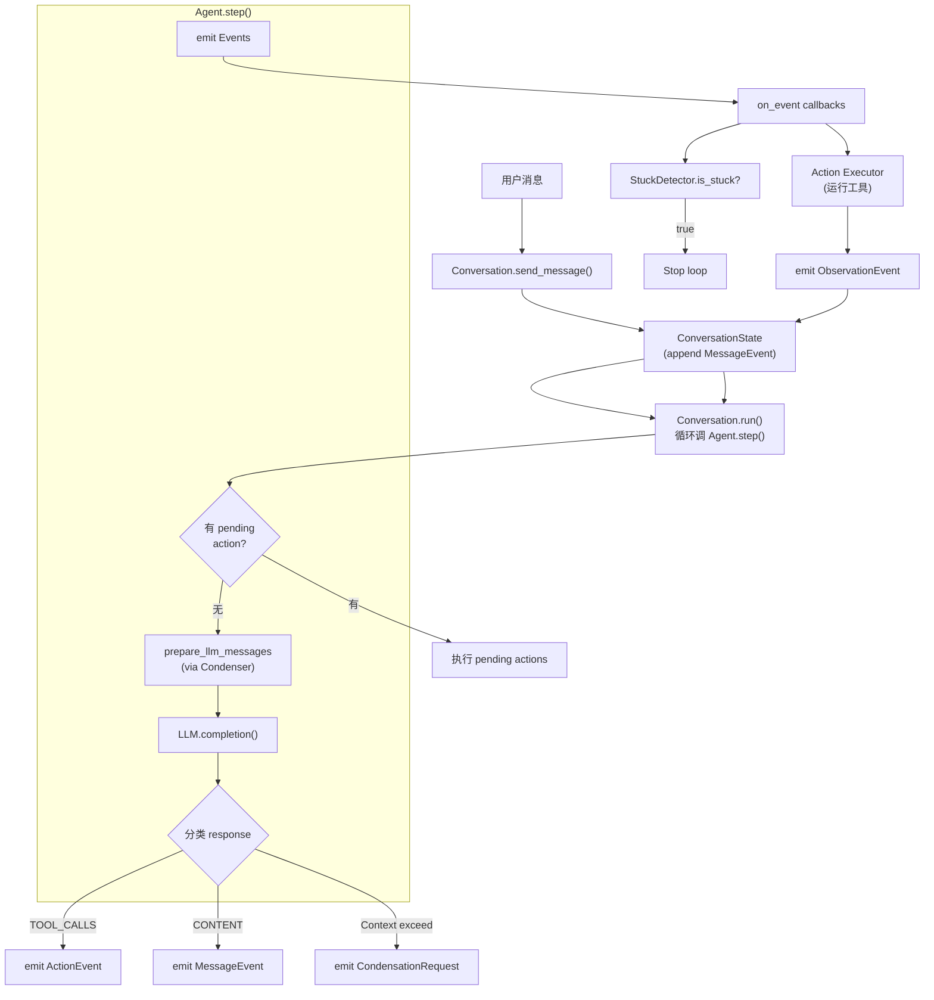
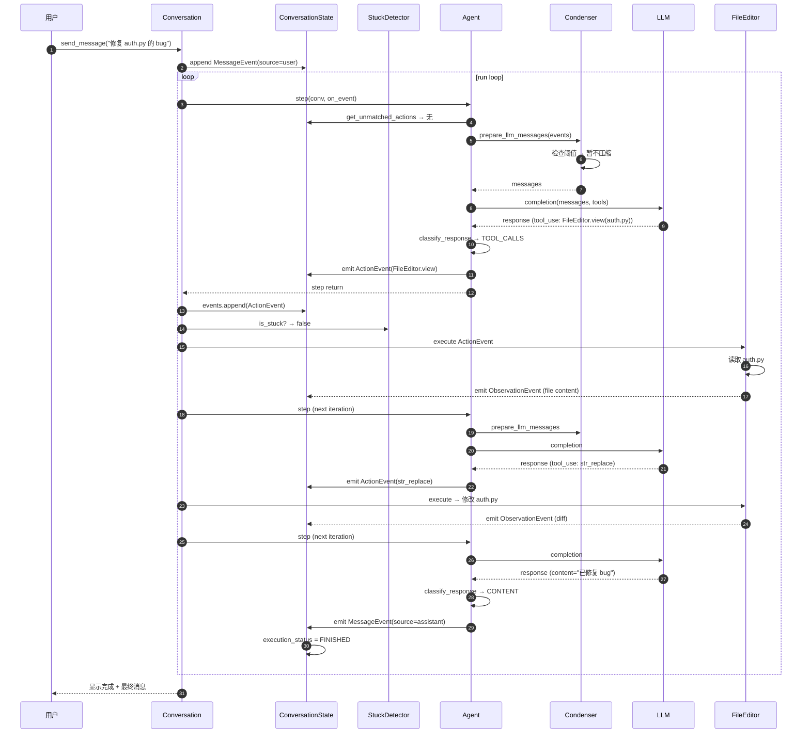

<section class="doc-hero">
  <p class="doc-hero__kicker">Agent 源码解析</p>
  <h1>OpenHands 源码剖析</h1>
  <p class="doc-hero__lead">OpenHands（前身 OpenDevin）2024 年初开源时打着"开源版 Devin"的旗号，到 2026 年它在 SWE-bench Verified 上的分数已经做到 77.6%——和闭源系统几乎持平。它的设计哲学是"事件驱动 + 模块化"：Agent 不是 while loop 直接调工具，而是 emit Action 事件，由独立的 executor 产生 Observation 事件。这套架构让 OpenHands 区别于 Aider/Claude Code 的命令式风格，是研究 Agent 自主性边界最好的开源样本。</p>
  <div class="doc-hero__meta" aria-label="本文信息">
    <span>仓库：OpenHands/OpenHands · 75k+ star · MIT</span>
    <span>核心 SDK：OpenHands/software-agent-sdk</span>
    <span>本文覆盖：Agent.step、Event/Action/Observation、StuckDetector、Condenser、FileEditor</span>
  </div>
</section>

> **资料来源声明**：本文基于 2026 年中 OpenHands 主仓库 [OpenHands/OpenHands](https://github.com/OpenHands/OpenHands)（75k+ star）和它在 2025 年拆出的核心包 [OpenHands/software-agent-sdk](https://github.com/OpenHands/software-agent-sdk) 的真实源码（已 clone 到本地分析）。所有文件路径、类名、行号、函数签名都直接来自仓库。OpenHands 是 MIT 开源、Python 实现，本文展示的代码都标注了精确路径。

## 为什么读 OpenHands 源码

读完 [Aider 源码剖析](./aider) 和 [Claude Code 源码剖析](./claude-code) 之后，可能会觉得"编程 Agent 大概就那样"——主循环 + 工具集 + Reflexion。OpenHands 颠覆这个直觉的方式是：**它的 Agent 几乎不"运行"**。

```
Aider/Claude Code：
  Agent.run() → while True: 调 LLM → 解析 → 执行工具 → 检查结果 → 继续

OpenHands V1 SDK：
  Agent.step() → 准备 messages → 调 LLM → emit Event → 返回（不再循环）
  Conversation.run() → 反复调 step()，把 Event 路由给 callbacks 和 executors
```

这个差异看似小，影响巨大——OpenHands 的 Agent 是**无状态的事件生产者**，状态全在 Conversation 里。这让它能：

- 持久化任意时刻的对话状态到磁盘
- 跨进程恢复（云端 worker 跑一半被 kill，重启从最近 event 继续）
- 多个观察者订阅事件流（UI、日志、metric、人工 reviewer）
- 用 callback 实现 confirmation mode（人工审批中途介入）

读源码能回答的深层问题：

```
- 为什么 OpenHands 在 SWE-bench 上能压过 Aider 几个百分点？
- 事件驱动架构和 Claude Code 的 AsyncGenerator 有什么本质区别？
- StuckDetector 怎么检测 Agent "卡住" 的？4 种 stuck pattern 各是什么？
- Condenser 的多级 pipeline 怎么工作？和 Aider 的后台 summarize 有什么区别？
- FileEditor 有 undo_edit 命令——这个能力 Claude Code 都没有，怎么实现的？
- subagent / delegate 工具怎么做多 Agent 协作？
```

## 仓库总览：两套代码库

OpenHands 在 2025 年做了一次大重构——把 Agent 核心逻辑从主仓库拆到独立的 SDK 仓库。读源码必须知道**两套代码库的分工**：

### 主仓库：`OpenHands/OpenHands`（75k+ star）

```
OpenHands/                      # 主仓库
├── frontend/                    # React 前端（GUI 应用）
├── openhands/                   # 后端服务 + Local GUI
│   ├── server/                  # FastAPI 服务（REST + WebSocket）
│   │   ├── app.py
│   │   ├── listen.py            # WebSocket 事件流
│   │   └── ...
│   ├── analytics/
│   └── app_server/
├── enterprise/                  # 企业版（SaaS 部署）
├── containers/                  # Docker 镜像定义
└── README.md
```

主仓库现在主要是：
- **Local GUI**：用户在本地跑的 React + FastAPI 应用
- **Cloud 部署**：app.all-hands.dev 的实现
- **Enterprise 功能**：多用户、SSO、Slack/Jira/Linear 集成

**核心 Agent 逻辑已经不在这里**——这是 2025 年开发者的常见困惑。

### SDK 仓库：`OpenHands/software-agent-sdk`（核心）

```
software-agent-sdk/              # SDK 仓库
├── openhands-sdk/                # ★ 核心 SDK 包
│   └── openhands/sdk/
│       ├── agent/                # Agent 实现
│       │   ├── agent.py          # (1264 行) Agent 主类
│       │   ├── base.py           # (842 行) AgentBase 抽象基类
│       │   ├── parallel_executor.py
│       │   ├── critic_mixin.py
│       │   └── response_dispatch.py
│       ├── conversation/         # ★ 对话状态机
│       │   ├── conversation.py
│       │   ├── stuck_detector.py # (320 行) 检测 Agent 卡住
│       │   ├── state.py          # ConversationState
│       │   ├── event_store.py    # 事件持久化
│       │   └── cancellation.py
│       ├── event/                # ★ Event 类型定义
│       │   ├── base.py           # Event 基类
│       │   ├── llm_convertible/  # ActionEvent / ObservationEvent / MessageEvent
│       │   ├── condenser.py
│       │   └── ...
│       ├── context/              # 上下文管理
│       │   ├── condenser/        # ★ 多种 Condenser 实现
│       │   │   ├── base.py
│       │   │   ├── llm_summarizing_condenser.py
│       │   │   ├── pipeline_condenser.py
│       │   │   └── no_op_condenser.py
│       │   ├── view/             # View（条件化的事件子集）
│       │   ├── skills/
│       │   └── prompts/
│       ├── llm/                  # LLM 抽象（基于 LiteLLM）
│       ├── mcp/                  # MCP client
│       ├── subagent/             # 子 Agent 调度
│       ├── security/             # 安全策略
│       ├── hooks/                # 用户 Hook
│       └── extensions/           # 扩展点
├── openhands-tools/              # ★ 工具实现
│   └── openhands/tools/
│       ├── file_editor/          # Anthropic-style str_replace
│       ├── terminal/             # Bash 工具
│       ├── browser_use/          # 浏览器 Agent
│       ├── glob/                 # 文件模式匹配
│       ├── grep/                 # 内容搜索
│       ├── task_tracker/         # TODO 管理
│       ├── apply_patch/          # diff 应用
│       ├── delegate/             # 子任务委派
│       ├── preset/               # 预设配置
│       └── ...
├── openhands-agent-server/       # 远程 Agent 服务（FastAPI）
└── openhands-workspace/          # 工作区抽象（容器、远程机器）
```

**读源码顺序**：先看 `openhands-sdk/openhands/sdk/agent/agent.py` 的 `step()` 方法，再看 `conversation/conversation.py` 的 run loop，最后看 `event/` 里的事件类型。这三块串起来就是 OpenHands 的灵魂。

## 整体架构：事件驱动



理解这张图的三个关键点：

**1. Agent 不直接运行工具**

`Agent.step()` 调 LLM 后只 **emit Event**（`ActionEvent`），就返回了。具体执行 action（跑 bash、改文件）的是独立的 executor，executor 完成后 emit `ObservationEvent` 放回事件流。

**2. ConversationState 是事件日志**

所有交互（用户消息、Agent 决策、工具调用、工具结果、condensation 触发、人工审批、stuck 检测）都是 `Event`，按发生顺序追加到 `ConversationState.events`。这个日志可以序列化到磁盘、跨进程恢复、回放给新订阅者。

**3. 多个 callbacks 订阅同一个事件流**

UI 显示、日志记录、metric 收集、StuckDetector、人工审批 prompt——都是 `on_event` callback。它们看到同样的 Event 序列，但行为各异。这是事件驱动架构的核心收益。

接下来逐模块拆。

## 模块 1：Agent.step() —— 单步状态机

**职责**：OpenHands Agent 的最小执行单元。不是 loop，是一次"取当前状态 → 调 LLM → emit 事件"。

**关键文件**：`openhands-sdk/openhands/sdk/agent/agent.py`（1264 行）

### 1.1 类层次

```python
# openhands-sdk/openhands/sdk/agent/agent.py:284
class Agent(CriticMixin, ResponseDispatchMixin, AgentBase):
    """
    The Agent class provides the core functionality for running AI agents that can
    interact with users and execute tools.
    """
```

`Agent` 继承自三个：

- `AgentBase`（`agent/base.py:100`）—— 抽象接口，定义 system prompt 构建、tool 注册、init_state 等共用方法
- `ResponseDispatchMixin` —— 根据 LLM 响应类型分发到不同处理器
- `CriticMixin`（`agent/critic_mixin.py`）—— 集成"critic" 模型（让另一个 LLM 评估当前回复是否值得保留）

这种 mixin 组织让"加新能力"很灵活——你给 Agent 加 ACP（Agent Communication Protocol）支持，就再继承 `ACPAgent`（`agent/acp_agent.py`）。

### 1.2 step() 完整逻辑

`step()` 是真正的核心方法。把它的简化版完整放出来——大概 130 行（原代码加上注释更长）：

```python
# openhands-sdk/openhands/sdk/agent/agent.py:555
def step(
    self,
    conversation: LocalConversation,
    on_event: ConversationCallbackType,
    on_token: ConversationTokenCallbackType | None = None,
) -> None:
    state = conversation.state

    # 1. 处理 pending action（confirmation mode）
    pending_actions = ConversationState.get_unmatched_actions(state.events)
    if pending_actions:
        logger.info(
            "Confirmation mode: Executing %d pending action(s)",
            len(pending_actions),
        )
        self._execute_actions(conversation, pending_actions, on_event)
        return

    # 2. 检查最后一条用户消息是否被 UserPromptSubmit hook 拦截
    if state.last_user_message_id is not None:
        reason = state.pop_blocked_message(state.last_user_message_id)
        if reason is not None:
            logger.info(f"User message blocked by hook: {reason}")
            state.execution_status = ConversationExecutionStatus.FINISHED
            return

    # 3. Condenser 决定该塞什么 messages
    _messages_or_condensation = prepare_llm_messages(
        state.events, condenser=self.condenser, llm=self.llm
    )

    # 4. 如果 condenser 觉得现在该压缩，emit CondensationRequest
    if isinstance(_messages_or_condensation, Condensation):
        on_event(_messages_or_condensation)
        return

    _messages = _messages_or_condensation

    # 5. 调 LLM
    try:
        llm_response = make_llm_completion(
            self.llm,
            _messages,
            tools=list(self.tools_map.values()),
            on_token=on_token,
        )
    except FunctionCallValidationError as e:
        # LLM 生成了 malformed function call
        error_message = MessageEvent(
            source="user",
            llm_message=Message(role="user", content=[TextContent(text=str(e))]),
        )
        on_event(error_message)
        return
    except LLMMalformedConversationHistoryError as e:
        # provider 拒绝当前 messages 结构（如 tool_use/tool_result 配对错乱）
        if self.condenser is not None and self.condenser.handles_condensation_requests():
            state.rebuild_view()
            on_event(CondensationRequest())
            return
        raise e
    except LLMContextWindowExceedError as e:
        # context 爆了，触发 condensation
        if self.condenser is not None and self.condenser.handles_condensation_requests():
            on_event(CondensationRequest())
            return
        self._log_context_window_exceeded_warning()
        raise e

    # 6. 分类 response 类型并 dispatch
    message: Message = llm_response.message
    response_type = classify_response(message)

    match response_type:
        case LLMResponseType.TOOL_CALLS:
            self._handle_tool_calls(message, llm_response, conversation, state, on_event)
        case LLMResponseType.CONTENT:
            self._handle_content_response(message, llm_response, conversation, state, on_event)
        case LLMResponseType.REASONING_ONLY | LLMResponseType.EMPTY:
            self._handle_no_content_response(message, llm_response, conversation, state, on_event)
```

逐段拆设计要点。

### 1.3 Pending actions 与 confirmation mode

**第 1 步**是 OpenHands 区别于其他 Agent 的核心。当用户开启 confirmation mode 时，工作流是：

```
turn 1: 用户："修复 auth bug"
        → Agent emit ActionEvent(Bash command="ls src/auth/")
        → 不立即执行，等待用户确认
        → step() 返回

turn 2: 用户确认 (or 拒绝)
        → step() 看到 pending_actions（未配对的 Action）
        → 执行它们 → emit ObservationEvent
        → step() 再次返回

turn 3: step() 看到 ObservationEvent 接上了 Action
        → 进入正常流程，调 LLM 生成下一步
```

`get_unmatched_actions()` 的判断逻辑是"找出有 ActionEvent 但没有配对 ObservationEvent 的 Action"。这种"事件配对"模型是事件驱动架构的优雅之处——状态全在 event 序列里，不需要单独的 `is_pending_confirmation` flag。

### 1.4 UserPromptSubmit Hook 拦截

**第 2 步**实现了用户消息的 pre-flight 检查。用户可以注册 `UserPromptSubmit` hook，hook 返回"block + reason"就阻止整个 step 执行：

```python
# 简化示例
def block_dangerous_prompt(event: MessageEvent) -> BlockReason | None:
    if "ignore previous instructions" in event.content.lower():
        return BlockReason(reason="Prompt injection detected")
    return None

agent.hooks.user_prompt_submit.append(block_dangerous_prompt)
```

这是个安全机制——比 Claude Code 的 Permission Mode 更前置（在 Agent 决策之前就拦掉）。`pop_blocked_message()` 从 state 取出 hook 写入的 block reason，确保不重复拦截。

### 1.5 LLM 错误的三段式恢复

**第 5 步**的三个 except 是 OpenHands 工程上的精彩处理：

- **`FunctionCallValidationError`** —— LLM 生成的 tool call 参数不符合 schema。OpenHands 把错误当作 user message 喂回去（让 LLM 自己看到错误并修正），不抛异常
- **`LLMMalformedConversationHistoryError`** —— provider 报告 messages 结构错乱（如 tool_use 没配 tool_result）。这通常是事件流恢复时的 bug。OpenHands 不抛错，而是触发 `CondensationRequest`——重新基于 view 构建消息，绕过 bad state
- **`LLMContextWindowExceedError`** —— context 爆了。同样触发 condensation 而不是直接失败

这三种错误对应的恢复策略都是"**emit 一个 event，让循环继续**"——不破坏事件流的完整性。这是事件驱动架构的另一个收益：错误也是事件，统一的处理路径。

### 1.6 Response 分类与 dispatch

**第 6 步**用 `classify_response()` 把 LLM 响应分四类：

| Response Type | 含义 | 处理函数 |
|---|---|---|
| `TOOL_CALLS` | LLM 输出了 tool_use | `_handle_tool_calls` → emit ActionEvent |
| `CONTENT` | 纯文本回复 | `_handle_content_response` → emit MessageEvent |
| `REASONING_ONLY` | 只有 reasoning（o3/Sonnet thinking），没有可见输出 | `_handle_no_content_response` → 提示用户或重试 |
| `EMPTY` | 完全空响应 | 同上，通常是 provider 故障 |

`ResponseDispatchMixin` 提供这套分类逻辑。把 dispatch 从 step() 里抽出来，让 Agent 子类（如 ACPAgent、CriticAgent）能 override 处理函数。

## 模块 2：Conversation 与事件流

**职责**：管理整个对话的事件日志、调用 Agent.step()、把 events 分发给 callbacks。

**关键文件**：`openhands-sdk/openhands/sdk/conversation/conversation.py`、`state.py`、`event_store.py`

### 2.1 Conversation.run()

简化版的 run loop（基于实际代码结构推断）：

```python
def run(self) -> None:
    while not self.state.is_terminal():
        # 跑一步
        self.agent.step(self, on_event=self._handle_event)

        # 检查 stuck
        if self.stuck_detector.is_stuck():
            self.state.execution_status = ConversationExecutionStatus.STUCK
            break

        # 检查是否完成
        if self.state.execution_status == ConversationExecutionStatus.FINISHED:
            break
```

`_handle_event` 是事件分发器——把新 event append 到 `state.events`，调用所有注册的 callbacks（UI、日志、executor）。

### 2.2 事件持久化

`ConversationState.events` 在内存里是 list，磁盘上是 JSONL：

```
sessions/abc123/
├── events.jsonl          # 每行一个 event 的 JSON
├── state.json            # 当前状态快照（events 之外的 metadata）
└── lock                  # FIFO lock for concurrent access
```

`event_store.py` 处理 append-only 写入。每个 event 写入就 fsync——崩了恢复时只丢最后一行。

JSONL 格式的好处和 Claude Code 一样：append-only 写、流式读、可观测。但 OpenHands 走得更远——**它把"event 序列"作为 Agent 的唯一真实状态**，State 对象只是 event 序列的派生 view。这种"event sourcing"设计让 Conversation 可以：

- 从任意 event 重放
- 跨机器迁移（拷贝 events.jsonl 到另一台机器继续）
- 多 view 派生（同一份 events 渲染给不同 UI）

### 2.3 ResourceLockManager

`conversation/resource_lock_manager.py` 和 `fifo_lock.py` 处理并发——同一个 Conversation 不能被两个 step() 同时操作。OpenHands 的 cloud 部署里，一个用户可能在多个 tab 里发消息，lock 保证事件流的因果序。

## 模块 3：StuckDetector —— 检测 Agent 卡住

**职责**：识别 Agent 进入死循环或重复无效操作的模式。这是 OpenHands 独特的安全机制——Aider、Claude Code 都没有。

**关键文件**：`openhands-sdk/openhands/sdk/conversation/stuck_detector.py`（320 行）

### 3.1 四种 stuck 模式

```python
# openhands-sdk/openhands/sdk/conversation/stuck_detector.py:24
class StuckDetector:
    """Detects when an agent is stuck in repetitive or unproductive patterns.

    This detector analyzes the conversation history to identify various stuck patterns:
    1. Repeating action-observation cycles
    2. Repeating action-error cycles
    3. Agent monologue (repeated messages without user input)
    4. Repeating alternating action-observation patterns
    5. Context window errors indicating memory issues
    """
```

每种模式的含义：

**模式 1：Action-Observation 重复**

```
Action: Bash("ls src/")  → Observation: 文件列表
Action: Bash("ls src/")  → Observation: 同样的文件列表
Action: Bash("ls src/")  → ...
```

Agent 反复跑同一个命令拿同样结果。`_is_stuck_repeating_action_observation()` 实现。

**模式 2：Action-Error 重复**

```
Action: Edit("foo.py", old="bar", new="baz") → Error: bar not found
Action: Edit("foo.py", old="bar", new="baz") → Error: bar not found
```

Agent 反复试同一个失败操作。`_is_stuck_repeating_action_error()` 实现。

**模式 3：Monologue（自言自语）**

```
Agent message: "Let me think about this..."
Agent message: "OK so I need to..."
Agent message: "Actually let me reconsider..."
```

Agent 一直在自己说话，没产生任何 Action 或 Observation。`_is_stuck_monologue()` 实现。

**模式 4：Alternating Pattern**

```
Action A → Observation X
Action B → Observation Y
Action A → Observation X
Action B → Observation Y
```

两个动作来回切换，没有进展。

### 3.2 实现的关键设计

```python
# openhands-sdk/openhands/sdk/conversation/stuck_detector.py:62
def is_stuck(self) -> bool:
    """Check if the agent is currently stuck.

    Note: To avoid materializing potentially large file-backed event histories,
    only the last MAX_EVENTS_TO_SCAN_FOR_STUCK_DETECTION events are analyzed.
    If a user message exists within this window, only events after it are checked.
    Otherwise, all events in the window are analyzed.
    """
    events = list(self.state.events[-MAX_EVENTS_TO_SCAN_FOR_STUCK_DETECTION:])

    # Only look at history after the last user message
    last_user_msg_index = next(
        (
            i
            for i in reversed(range(len(events)))
            if isinstance(events[i], MessageEvent) and events[i].source == "user"
        ),
        -1,
    )
    if last_user_msg_index != -1:
        events = events[last_user_msg_index + 1 :]
    # ...
```

两个值得注意的细节：

**(a) 只检查最近 N 个 event**——`MAX_EVENTS_TO_SCAN_FOR_STUCK_DETECTION` 是常量上限。这是性能考虑——长对话的 events 可能上千个，每次都全扫太慢。

**(b) 用户消息后重新计数**——如果用户在中途插话了，stuck 计数清零。因为用户的介入可能改变了任务方向，之前的"重复"可能不算 stuck。这种细节体现了"stuck 是相对用户最近指令的"，不是绝对的重复。

`StuckDetectionThresholds` 用 dataclass 暴露所有阈值（action_observation、action_error、monologue、alternating_pattern），用户可以调。默认值是经验调出来的——太松会让 stuck Agent 浪费 token，太严会让正常长任务被误判。

### 3.3 与 Aider max_reflections 的对比

Aider 用 `max_reflections=3` 硬限制重试次数，简单粗暴但够用。OpenHands 用 StuckDetector 是质的升级：

| 维度 | Aider max_reflections | OpenHands StuckDetector |
|---|---|---|
| 触发条件 | 计数到 3 | 检测语义模式 |
| 精度 | 真 stuck / 假 stuck 都会触发 | 只在真 stuck 时触发 |
| 适应性 | 长任务不友好（早早停） | 长任务 OK，模式不重复就不触发 |
| 实现复杂度 | 5 行 | 320 行 |

Claude Code 完全没有 stuck 检测——它依赖用户主动中断。OpenHands 的自主性目标（autonomous Agent）让 stuck 检测成为必需——没有用户在线，必须自己识别 stuck 并停。

## 模块 4：Condenser —— 多级上下文压缩

**职责**：在 context 接近上限或对话过长时压缩历史。OpenHands 的 Condenser 比 Aider 的"后台 summarize"和 Claude Code 的"自动 compaction" 都更精细——它是个可组合的 pipeline。

**关键文件**：`openhands-sdk/openhands/sdk/context/condenser/`

### 4.1 Condenser 类层次

```
CondenserBase（abstract）                         # base.py:16
├── PipelinableCondenserBase                       # base.py:79
│   ├── RollingCondenser（abstract）               # base.py:107
│   │   └── LLMSummarizingCondenser               # llm_summarizing_condenser.py:37
│   └── (其他 condenser)
├── PipelineCondenser                              # pipeline_condenser.py:7
└── NoOpCondenser                                  # no_op_condenser.py:7
```

四种类型对应四种使用场景：

| Condenser | 用途 |
|---|---|
| `NoOpCondenser` | 不压缩，全量保留。用于调试或短对话 |
| `LLMSummarizingCondenser` | LLM 摘要早期 events |
| `RollingCondenser` | "滚动窗口"基类——保留首 N 个 + 尾 M 个 events |
| `PipelineCondenser` | 组合多个 condenser 串行跑 |

### 4.2 LLMSummarizingCondenser 详解

最常用的 condenser，看它的关键参数：

```python
# openhands-sdk/openhands/sdk/context/condenser/llm_summarizing_condenser.py:37
class LLMSummarizingCondenser(RollingCondenser):
    """LLM-based condenser that summarizes forgotten events."""

    llm: LLM
    max_size: int = Field(default=240, gt=0)
    max_tokens: int | None = None

    keep_first: int = Field(default=2, ge=0)
    """Minimum number of events to preserve at the start of the view. The first
    `keep_first` events in the conversation will never be condensed or summarized.
    """

    minimum_progress: float = Field(default=0.1, gt=0.0, lt=1.0)
    """Minimum fraction of events that must be condensed (0.0-1.0). If fewer than
    this proportion of events would be forgotten, condensation is treated as an error.
    Default 0.1 means at least 10% of events must be condensed.
    """

    hard_context_reset_max_retries: int = Field(default=5, gt=0)
    """Number of attempts to perform hard context reset before raising an error."""

    hard_context_reset_context_scaling: float = Field(default=0.8, gt=0.0, lt=1.0)
    """When performing hard context reset, if the summarization fails, reduce the max
    size of each event string by this factor and retry.
    """
```

四个参数的工程意义：

**(a) `keep_first=2`** —— 永远保留前 2 个 event。通常是 system message + 第一条用户消息。这两个是"任务定义"，绝对不能丢

**(b) `max_size=240`** —— 当 events 超过 240 个就触发压缩

**(c) `minimum_progress=0.1`** —— 压缩必须至少干掉 10% 的 events，否则判定为"压缩失败"（避免每次只压一两个 event 反复触发）

**(d) `hard_context_reset_*`** —— 如果第一次压缩仍然爆 context，按 0.8 的系数缩小每个 event 字符串再试，最多 5 次。这是个防御性兜底——遇到极端长 event（如全文 dump）时保证 condenser 能给出结果

### 4.3 触发条件

```python
# openhands-sdk/openhands/sdk/context/condenser/llm_summarizing_condenser.py:85
def get_condensation_reasons(
    self, view: View, agent_llm: LLM | None = None
) -> set[Reason]:
    """Determine the reasons why the view should be condensed."""
    reasons = set()

    # Reason 1: Unhandled condensation request. The view handles the detection of
    # these requests while processing the event stream.
    if view.unhandled_condensation_request:
        reasons.add(Reason.REQUEST)

    # Reason 2: Token limit is provided and exceeded.
    if self.max_tokens and agent_llm:
        total_tokens = get_total_token_count(view.events, agent_llm)
        if total_tokens > self.max_tokens:
            reasons.add(Reason.TOKENS)

    # Reason 3: View exceeds maximum size in number of events.
    if len(view) > self.max_size:
        reasons.add(Reason.EVENTS)

    return reasons
```

三种触发：**显式请求**（Agent.step 因为 LLM 报错 emit `CondensationRequest`）、**token 数超限**、**event 数超限**。多个原因可以同时触发，condenser 用 `set[Reason]` 收集——便于日志记录"为什么这次触发了压缩"。

### 4.4 PipelineCondenser

```python
# openhands-sdk/openhands/sdk/context/condenser/pipeline_condenser.py:7
class PipelineCondenser(CondenserBase):
    # 多个 condenser 串行跑
    condensers: list[PipelinableCondenserBase]

    def condense(self, view: View, agent_llm: LLM | None = None) -> View | Condensation:
        # 简化版：每个 condenser 依次 condense，结果传给下一个
        for condenser in self.condensers:
            result = condenser.condense(view, agent_llm)
            if isinstance(result, Condensation):
                return result
            view = result
        return view
```

这套 pipeline 让用户能组合不同策略：

```
PipelineCondenser([
    RollingCondenser(keep_first=2, max_size=100),     # 先保留首尾
    LLMSummarizingCondenser(...),                     # 再 LLM 摘要中间
])
```

可组合的 condenser 是 OpenHands 比 Aider 和 Claude Code 都更先进的设计——它把"上下文压缩"做成了 first-class 概念，而不是 hard-coded 在主循环里的一段逻辑。

## 模块 5：FileEditor —— 带 undo 的精确编辑

**职责**：OpenHands 的文件编辑工具。和 Claude Code 的 Edit 类似但多了 `undo_edit` 命令。

**关键文件**：`openhands-tools/openhands/tools/file_editor/definition.py`、`editor.py`、`impl.py`

### 5.1 命令集

```python
# openhands-tools/openhands/tools/file_editor/definition.py:29
class FileEditorAction(Action):
    """Schema for file editor operations."""

    command: CommandLiteral = Field(
        description="The commands to run. Allowed options are: `view`, `create`, "
        "`str_replace`, `insert`, `undo_edit`."
    )
    path: str = Field(description="Absolute path to file or directory.")
    file_text: str | None = Field(
        default=None,
        description="Required parameter of `create` command, with the content of "
        "the file to be created.",
    )
    old_str: str | None = Field(
        default=None,
        description="Required parameter of `str_replace` command containing the "
        "string in `path` to replace.",
    )
    new_str: str | None = Field(
        default=None,
        description="Optional parameter of `str_replace` command containing the "
        "new string (if not given, no string will be added). Required parameter "
        "of `insert` command containing the string to insert.",
    )
    insert_line: int | None = Field(
        default=None,
        ge=0,
        description="Required parameter of `insert` command. The `new_str` will "
        "be inserted AFTER the line `insert_line` of `path`.",
    )
    view_range: list[int] | None = Field(
        default=None,
        description="Optional parameter of `view` command when `path` points to a "
        "file. If none is given, the full file is shown. ...",
    )
```

五个命令：

| Command | 作用 |
|---|---|
| `view` | 读文件（带可选 view_range 行号范围） |
| `create` | 创建新文件 |
| `str_replace` | 精确字符串替换（同 Claude Code 的 Edit） |
| `insert` | 在指定行后插入文本 |
| `undo_edit` | **撤销上次对该文件的编辑** |

`undo_edit` 是这个工具的核心差异化。Claude Code 的 Edit 没有 undo，撤销靠 git。OpenHands 提供工具级 undo——Agent 自己可以决定"我刚才那次改不对，撤了重来"。

### 5.2 undo_edit 的实现

`editor.py:46` 的 `FileEditor` 类内部维护一个"文件历史栈"：

```python
# 实际代码在 editor.py，简化版本：
class FileEditor:
    def __init__(self):
        self._file_history: dict[Path, list[str]] = {}  # path → 历史内容栈

    def str_replace(self, path: Path, old_str: str, new_str: str):
        content = read_file(path)
        # 替换前把原内容压栈
        self._file_history.setdefault(path, []).append(content)
        new_content = content.replace(old_str, new_str, 1)
        write_file(path, new_content)

    def undo_edit(self, path: Path):
        history = self._file_history.get(path, [])
        if not history:
            raise ToolError("No edit history for this file")
        previous = history.pop()
        write_file(path, previous)
```

每次 `str_replace`/`insert` 都把旧内容压栈，`undo_edit` 弹栈恢复。栈是 per-file 的，每个文件独立。

**为什么这套设计有价值**：

- **不依赖 git**：在没有 git 仓库的工作目录也能 undo
- **细粒度**：可以 undo 单个文件的最后一次编辑，不影响其他文件
- **Agent 自主**：Agent 决定改了之后发现不对，可以自己撤销，不需要用户介入

代价是 in-memory 历史栈在进程重启后丢失。OpenHands 的 cloud 场景有更复杂的持久化策略（events.jsonl 重放时重建历史），这里不展开。

### 5.3 与 Anthropic 工具 schema 的兼容

注意 FileEditorAction 的命令集（`view`/`create`/`str_replace`/`insert`/`undo_edit`）**完全照搬自 Anthropic 公开的 `str_replace_editor` 工具规范**——Anthropic 在 2024 年公开了这个内部工具的 schema 用于多模型 benchmark。OpenHands 直接采用，让它能无缝兼容 Anthropic 训练数据里学过这个工具的 Claude 模型。

这是开源 Agent 的常见智慧——**不发明新工具，复用厂商规范的工具**。模型在训练里见过的工具用起来成功率最高。

## 模块 6：Tools 概览

`openhands-tools/openhands/tools/` 下的工具集（除 FileEditor 之外）：

| 工具 | 作用 |
|---|---|
| `terminal/` | Bash 工具，支持长驻 shell + 异步任务 |
| `browser_use/` | 浏览器自动化（基于 [browser-use](https://github.com/browser-use/browser-use)） |
| `glob/` | 文件模式匹配 |
| `grep/` | 内容搜索（ripgrep backend） |
| `task_tracker/` | TODO 管理（类似 Claude Code 的 TodoWrite） |
| `apply_patch/` | 应用 unified diff |
| `delegate/` | ★ 委派子任务给 subagent |
| `task/` | 任务定义 |
| `tom_consult/` | "Theory of Mind" 咨询工具 |
| `planning_file_editor/` | 规划专用的文件编辑器 |
| `preset/` | 预设配置（pre-bundled tool sets for common use cases） |

值得展开的是 **delegate/**——这是 OpenHands 多 Agent 的核心机制。

### 6.1 delegate 工具

`delegate` 工具让一个 Agent 派生子 Agent 处理子任务：

```python
# 简化的调用语义
delegate(
    task="Review the security implications of changes in src/auth/*",
    agent_name="security-reviewer",  # 已注册的 subagent 配置
)
```

实现上和 Claude Code 的 `Task` 工具一样——递归启动一个新的 `Conversation`，子 Conversation 的 events 不进入父对话。完成后返回最终消息给父 Agent。

不同于 Claude Code 的是 OpenHands 把 subagent 做成了独立模块（`openhands-sdk/openhands/sdk/subagent/`），可以注册多种 subagent 配置（不同 LLM、不同 system prompt、不同 tool 集），通过 `agent_name` 调度。这种"subagent registry"设计让多 Agent 协作更结构化。

## 关键执行流程：从用户消息到文件落盘

把所有模块串起来，跟一次真实请求：



注意流程里几个关键的设计体现：

- **每步只走一次 LLM**：Agent.step() 不内部循环，外层 Conversation.run() 反复调
- **Action 与 Observation 分离**：Agent 只 emit Action，Tool 单独 emit Observation
- **State 是 event 序列**：所有状态变化都通过追加 event 实现
- **Stuck 检测在每轮间隙**：循环里随时可以判断 stuck 并停下

## 工程亮点：可借鉴的设计

### 亮点 1：事件溯源（Event Sourcing）作为 Agent 状态模型

OpenHands 把 Agent 的所有状态变化建模为 append-only 的 event 序列。State 是 event 序列的派生 view。这套设计来自 DDD/CQRS 的 event sourcing pattern。

**为什么聪明**：

- **可恢复**：进程崩了重启，从 events.jsonl 重放就能恢复完整状态
- **可观测**：多个 callback 订阅同一 event 流，UI/log/metric 各取所需
- **可调试**：任何 bug 都可以回放整个 event 序列重现
- **可迁移**：events.jsonl 拷贝到另一台机器继续

**怎么借鉴**：做长跑 / 需要持久化 / 需要多观察者的 Agent 系统，考虑 event sourcing 而非传统 state object。

### 亮点 2：Agent.step() 不内循环

把"loop"从 Agent 抽出来给 Conversation。Agent 只负责"一次决策 + emit events"，循环控制权在外层。

**为什么聪明**：让 Agent 可以被各种"外部驱动器"调度——同步 run、异步 async run、按需 step、cloud worker 调度，都用同一个 Agent。

**怎么借鉴**：写 Agent 时把"决策逻辑"和"循环控制"分开。Agent 接口设计成 `step(state) -> events`，而不是 `run(input) -> output`。

### 亮点 3：StuckDetector 语义识别 stuck

不是简单计数，而是识别四种语义模式（action-observation 重复、action-error 重复、monologue、alternating）。

**为什么聪明**：长任务不会被误停（只要模式不重复），真的 stuck 时会准确触发。

**怎么借鉴**：做自主 Agent 时一定要有 stuck 检测。简单的"max_turns 上限"对长任务很不友好。基于模式的检测精度高得多。

### 亮点 4：Condenser 作为 first-class 概念

把"上下文压缩"做成可组合的 pipeline，而不是 hard-coded 在主循环里。多种 condenser 互相独立、互相组合。

**为什么聪明**：不同场景需要不同压缩策略——研究 Agent 想保留所有细节、生产客服想激进压缩。pipeline 让用户能针对场景选配。

**怎么借鉴**：长 context Agent 一定要把压缩策略抽象成可替换的组件。一个 `condense(view) -> view` 接口足以建模所有压缩策略。

### 亮点 5：工具级 undo

FileEditor 提供 `undo_edit` 命令，不依赖 git。

**为什么聪明**：(a) 让 Agent 能自主"试错 → 撤销"，不需要用户介入；(b) 在没有 git 的工作目录也能用

**怎么借鉴**：写修改文件的 Agent 工具时，per-tool 维护一个 in-memory 历史栈，提供 undo 操作给 Agent。让 Agent "敢于尝试"——知道改错了能撤回。

### 亮点 6：错误转事件，不抛异常

LLM 出错（FunctionCallValidationError、ContextWindowExceededError）时，OpenHands 把错误包装成 event 注入事件流，循环继续。

**为什么聪明**：错误处理路径和正常路径统一，不需要单独的 retry 逻辑。所有"复活"行为都是"emit 一个 event"。

**怎么借鉴**：事件驱动架构里，把所有可恢复的错误转成 event 让循环继续。只有真正不可恢复的（auth error、out of credits）才往上抛。

### 亮点 7：复用厂商工具规范

FileEditor 的命令集照搬 Anthropic 的 `str_replace_editor` 规范，不发明新工具。

**为什么聪明**：模型在训练里见过的工具用起来成功率最高。开源 Agent 与其发明新工具，不如复用厂商规范。

**怎么借鉴**：设计 Agent 工具时，先看 Anthropic/OpenAI 的公开工具规范有没有现成的。能复用就复用，发明新工具是最后选择。

## 局限与坑

### 局限 1：事件驱动的学习曲线

第一次读 OpenHands 源码的人经常困惑——"Agent.step() 怎么不返回结果？"、"Action 谁执行的？"。事件驱动架构对习惯命令式编程的开发者有学习成本。

**Workaround**：先理解 ConversationState.events 是真实数据源，所有"状态查询"都是查这个序列。把 Agent 当作"emit event 的纯函数"理解。读 `openhands-sdk/openhands/sdk/agent/agent.py` 之前先读 `event/` 目录熟悉所有 Event 类型。

### 局限 2：双仓库结构让贡献门槛高

Agent 核心在 software-agent-sdk，UI 在 OpenHands 主仓库。修一个端到端 bug 可能要同时改两个仓库 + 两个 PR。这让新 contributor 困惑。

**Workaround**：先决定"我要改的是 SDK 还是 GUI"，然后只 clone 对应仓库。看 docs.openhands.dev 的开发指南确定属于哪一层。

### 局限 3：Condenser 配置不当导致信息丢失

`minimum_progress=0.1` 默认值在某些场景下太激进——10% events 被摘要后，可能丢失关键决策的细节。

**Workaround**：长任务 / 关键决策频繁的场景，把 `minimum_progress` 调低（如 0.05），让 condenser 更保守。或者在关键决策时让 Agent 把"决定理由"写入 `task_tracker`（持久化外部记忆，不依赖 condenser 保留对话历史）。

### 局限 4：StuckDetector 偶尔误判

某些合法的长任务（如批量处理 100 个相似文件，每个文件的 Action/Observation 都长得像）会被误判为 alternating pattern stuck。

**Workaround**：(a) 调高 `StuckDetectionThresholds.alternating_pattern` 阈值；(b) 把批量任务拆成多个 Agent 调用，每个用户消息后 stuck 计数清零；(c) 完全禁用某个 stuck 模式（设阈值为极大）

### 局限 5：FileEditor 的 undo 栈不持久

进程重启后 `_file_history` 丢失，无法 undo 重启前的编辑。

**Workaround**：依赖 events.jsonl 重放机制重建栈——OpenHands cloud 部署有这套机制，本地 GUI 没有。本地用户应该 commit + git 作为长期 undo 兜底。

## 延伸阅读

不读源码的人最大的损失是 OpenHands 的论文和 docs.openhands.dev 的设计文档——比代码注释解释得更系统：

- **核心文件**（按推荐阅读顺序）：
  - `openhands-sdk/openhands/sdk/agent/agent.py` —— 1264 行的核心。重点看 `step()`（行 555）、`_handle_tool_calls`、错误处理三段
  - `openhands-sdk/openhands/sdk/conversation/stuck_detector.py` —— 完整 320 行，看四种 stuck pattern 的判断逻辑
  - `openhands-sdk/openhands/sdk/context/condenser/llm_summarizing_condenser.py` —— condenser 的核心实现
  - `openhands-tools/openhands/tools/file_editor/definition.py` 和 `editor.py` —— FileEditor 的 schema 与 undo 实现
  - `openhands-sdk/openhands/sdk/event/llm_convertible/` —— 所有事件类型定义

- **官方资料**：
  - [OpenHands 论文 (arXiv 2511.03690)](https://arxiv.org/abs/2511.03690) —— 2025 年技术报告，包含 SWE-bench 77.6 的实验设计
  - [OpenHands docs](https://docs.openhands.dev) —— 用户和开发者文档
  - [OpenHands SDK docs](https://docs.openhands.dev/sdk) —— SDK 专门文档，看 Architecture 和 Event 章节

- **相关概念**：
  - 本站 [编程 Agent 通用模式](../vertical/coding-agent) —— OpenHands 是"自主 Agent"路线的代表
  - 本站 [Claude Code 源码剖析](./claude-code) —— 对比"命令式 + AsyncGenerator" vs "事件驱动 + step()"两种范式
  - 本站 [Aider 源码剖析](./aider) —— 对比"文本协议（SEARCH/REPLACE）" vs "工具协议（tool_use）"两种交互模式
  - 本站 [Agent 记忆架构](../agent/memory-arch) —— event sourcing 是 Agent 长期记忆的天然实现

- **对比阅读**：
  - [SWE-Agent](https://github.com/SWE-agent/SWE-agent)（普林斯顿）—— 学术派编程 Agent，看怎么针对 SWE-bench 做端到端优化
  - [Cline](https://github.com/cline/cline) —— VSCode 插件版编程 Agent，对比 IDE 集成路线
  - [LangGraph](https://github.com/langchain-ai/langgraph) —— event-driven 状态机的另一种实现，看 LangGraph 的 Checkpointer 和 OpenHands 的 EventStore 的设计差异

- **架构基础**：
  - [Event Sourcing pattern (Martin Fowler)](https://martinfowler.com/eaaDev/EventSourcing.html) —— 理解 OpenHands 事件溯源设计的理论基础
  - [The Reactive Manifesto](https://www.reactivemanifesto.org/) —— 事件驱动架构的设计原则，OpenHands 几乎每条都符合
