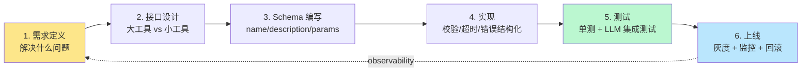

<section class="doc-hero">
  <p class="doc-hero__kicker">工具调用</p>
  <h1>自定义工具开发实战</h1>
  <p class="doc-hero__lead">写一个工具不是定义一个 Python 函数那么简单。从"模型该不该用、什么时候用"到"调错参数怎么 debug、上线后怎么灰度"——本文把六个阶段串起来，给你一份能直接抄的端到端工作流。</p>
  <div class="doc-hero__meta" aria-label="本文信息">
    <span>适合阶段：Agent 生产化</span>
    <span>核心：需求 → 设计 → schema → 实现 → 测试 → 上线</span>
    <span>面试重点：从工具开发讲到工程素养</span>
  </div>
</section>

> **本文边界**：这是工具调用专题的"集大成"文章。schema 字段细节请看 [Schema 设计](./schema-design)；错误返回结构看 [错误处理](./error-handling)；隔离执行环境看 [沙箱](./sandbox);  跨进程协议看 [MCP](./mcp)；并发触发看 [并行调用](./parallel)。本文聚焦把这些拼到一个可落地的开发流程里。

## 面试官想考什么

读完这篇你要能正面回答下面这些题。每题后面括号里是面试官真正想看你答出什么。

<div class="interview-grid">
  <div>
    <strong>一个工具能力很大，是拆成多个小工具还是合并成一个大工具？怎么判断？</strong>
    <span>考工具粒度设计——是否理解"模型选择负担 vs 参数膨胀"的取舍。</span>
  </div>
  <div>
    <strong>怎么测试 LLM 是否能正确使用你的工具？单元测试够吗？</strong>
    <span>考"LLM 集成测试"的概念——是否做过评估集驱动的工具开发。</span>
  </div>
  <div>
    <strong>schema 改动后线上 agent 不兼容，怎么处理？</strong>
    <span>考工具版本管理——deprecate / 兼容期 / 双跑策略。</span>
  </div>
  <div>
    <strong>工具上线后发现模型 60% 调错参数，你怎么 debug？</strong>
    <span>考观测 + 归因能力——能不能从 trace 反推 schema 问题。</span>
  </div>
  <div>
    <strong>本地函数 / HTTP API wrapper / MCP server——同一个工具这三种形态选哪个？</strong>
    <span>考工具形态的工程权衡：跨进程、跨语言、跨团队的边界。</span>
  </div>
  <div>
    <strong>工具内部要不要带状态？比如分页 cursor、session id 这种？</strong>
    <span>考有状态 vs 无状态工具的取舍。</span>
  </div>
  <div>
    <strong>工具描述（description）怎么写模型才知道什么时候该用？</strong>
    <span>考 prompt 与 schema 的交界——description 是给模型读的，不是给同事读的。</span>
  </div>
  <div>
    <strong>上线后怎么知道这个工具到底有没有被正确使用？要埋哪些点？</strong>
    <span>考工具可观测性——调用频次、参数分布、错误率、回放能力。</span>
  </div>
</div>

---

## 为什么"工具开发"值得单独讲

很多人写工具是这样的：

```python
@tool
def search(q: str):
    return google.search(q)
```

一行 docstring 都没有，类型只有一个 `str`，错误直接 raise——然后扔给模型让它"自己想办法用"。

跑起来很快会出三类问题：

1. **模型不知道什么时候该用**——同一个问题有时调用、有时不调用，行为随机
2. **模型经常调错参数**——把整段用户问题塞进 `q`，或者把日期写成 `"明天"` 这种自然语言
3. **工具炸了 agent 也跟着炸**——raise 出去直接打断整个 agent loop，没有重试、没有降级

这些问题的根因都不在"函数本身"，而在工具开发的**上游决策没有做好**：需求定义、参数粒度、schema 表达、错误语义。一旦上游错了，下游再怎么优化模型 prompt 也救不回来。

这篇文章把工具开发拆成 **六个阶段**，每个阶段都有明确的产出物和验收标准。这套流程不是凭空发明的——观察 Claude Code、Cursor、各类 MCP server 的工具实现，能看到它们都隐式地走过这六步，只是没有人系统地写出来。



下面逐阶段拆。

---

## 阶段 1：需求定义

工具开发的第一个错误，是从"我有一个 Python 函数"开始想，而不是从"模型需要什么能力"开始想。

正确的需求定义要回答三个问题：

| 问题 | 错误写法 | 正确写法 |
|---|---|---|
| 这个工具解决什么？ | "搜索 GitHub" | "当用户问'有什么开源的 X 库'时，让模型能列出按 star 数排序的候选" |
| 模型什么时候该用？ | "需要的时候" | "用户问题里包含'开源/库/repo/项目推荐'关键词，且当前 context 没有现成答案" |
| 模型怎么知道该用？ | （没想过） | description 里给出**典型触发问题**和**反例**，让模型在 schema 阶段就能识别 |

实战经验：把"什么时候该用"写成 **2 个正例 + 1 个反例** 放进 description，比抽象描述功能有用得多。模型从 description 学到的不是"这个工具叫 search_github_repos"，而是"看到 X 类问题就调这个"。

> **检查清单**：需求定义完成的标志是——把工具名 + description 拿给一个不懂代码的人看，他能说出"这个工具是给什么场景用的"。如果他答"不知道、好像是搜索什么的"，回去重写。

---

## 阶段 2：接口设计

需求清楚后，下一个决策是**接口的形状**。这一步最容易翻车的有三个问题。

### 问题 A：一个大工具 vs 多个小工具

假设你要做 GitHub 集成，能搜 repo、搜 issue、搜 PR、搜代码。两种思路：

```python
# 思路 1：一个大工具
def github_search(
    type: Literal["repo", "issue", "pr", "code"],
    query: str,
    filters: dict
): ...

# 思路 2：四个小工具
def search_github_repos(query, language, sort): ...
def search_github_issues(query, repo, state): ...
def search_github_prs(query, repo, status): ...
def search_github_code(query, repo, path): ...
```

**怎么选**：看 **filters 字段在不同 type 下是不是完全不同**。如果是（issue 的 `state` 和 repo 的 `language` 完全不重叠），强行合并成一个工具会让模型困惑——它要先选 type，再去回忆"这个 type 下哪些 filters 是有效的"。拆开反而更清晰，每个工具的 schema 自带"做什么 + 用什么参数"的强提示。

经验法则：

- **参数集合差异 > 50%** → 拆开
- **行为差异 > 70%（成功/失败语义不同）** → 拆开
- **仅仅是返回字段不同，参数完全一样** → 合并，用 type 区分
- **工具数 > 30** → 强烈考虑合并，避免触发模型的"工具选择疲劳"

> Anthropic 在 [Claude 工具使用最佳实践](https://docs.anthropic.com/en/docs/tool-use) 里有一句话："tools should be self-contained and have clear, non-overlapping responsibilities"。重叠的工具是 schema 设计的头号灾难——模型每次都要猜"该用哪个"。

### 问题 B：参数粒度

```python
# 粗粒度
def search(filters: dict): ...   # filters = {...任意 key...}

# 细粒度
def search(query: str, language: str, sort: str, limit: int): ...
```

粗粒度看似"灵活"，实际是把"参数验证"的责任推给了模型。模型经常会发明字段（`{"lang": "py"}` 而不是 `{"language": "python"}`），或者填错值类型。

**铁律**：能用具体字段就别用 dict。dict 只在参数完全开放、且你能容忍模型自由发挥的场景（比如代理 SQL 这种）才用。

### 问题 C：要不要带状态

```python
# 无状态版
def list_files(path: str, page: int = 1) -> list: ...

# 有状态版（带 cursor）
def list_files_start(path: str) -> Cursor: ...
def list_files_next(cursor: Cursor) -> list: ...
```

有状态工具的坑：cursor 本身要序列化进 LLM 的 messages，模型可能不知道这是不透明 token、试图"猜"下一个 cursor。而且 cursor 过期、cursor 漂移、cursor 跨 session 失效都是真实问题。

**建议**：默认无状态。除非性能/资源必须用 cursor（比如分页 100 万条），否则一律用 page + page_size 这种显式分页。`page` 是个数字，模型不会出错；`cursor` 是 opaque string，模型会试图编造。

---

## 阶段 3：Schema 编写

需求和接口定下来，Schema 就是把这俩翻译成 JSON Schema。这部分细节在 [Schema 设计](./schema-design) 里全讲了，这里只强调三个**容易在工具开发流程里被忽略的点**：

1. **description 不是注释，是 prompt** —— 它会被拼进 system prompt 给模型看。写 description 时换上"模型读者"的视角：模型看到这句话能不能判断要不要调？参数怎么填？
2. **enum 比 string 安全** —— 凡是值域有限的字段（sort、status、type、language），全部用 enum。string 就是给模型留漏洞。
3. **required 字段最小化** —— 每多一个 required，模型每次调用都多一次"我必须想出这个参数"的负担。能给默认值就给。

实战时一个特别有用的检查：把 schema 拿给 [Anthropic 官方 schema validator](https://docs.anthropic.com/en/api/messages) 或 OpenAI 的 strict mode 跑一遍，能挡掉 80% 的语法问题。剩下 20% 的"语义"问题靠下面的 LLM 集成测试。

---

## 阶段 4：实现

函数实现阶段最常见的反模式是**"快乐路径思维"**——只想"成功了返回什么"，不想"出错了返回什么"。

工业级工具实现必须覆盖这 6 件事：

| # | 关注点 | 落地手段 |
|---|---|---|
| 1 | 参数校验 | Pydantic / dataclass + 显式 ValueError，错误信息说人话 |
| 2 | 超时控制 | 所有 IO 都要 timeout，never block forever |
| 3 | 错误结构化 | 永远 return error，不要 raise——让模型有机会自我修正 |
| 4 | 日志埋点 | 入参、出参、耗时、错误码全打 |
| 5 | 幂等性 | 同样参数调两次结果一致（写操作要更小心） |
| 6 | 副作用隔离 | 写操作必须有 dry-run 或 confirm 机制 |

错误处理的具体结构（return 还是 raise、错误信息怎么写）在 [错误处理](./error-handling) 里详细展开。这里只记一条：**能让模型重试的错误，return 一个清楚的 error**；不能让模型重试的错误（鉴权失败、系统故障），让上层 agent loop catch 后停。

---

## 阶段 5：测试（重点）

这是绝大多数团队做得最差的一步。

**单元测试**只能告诉你"函数本身没 bug"。但工具的真正用户不是你的测试代码，是 LLM。**LLM 用得对不对，单测一点都测不出来**。

完整的工具测试应该分三层：

### Layer 1：单元测试（基础）

测函数本身：参数校验、边界值、错误处理。和普通 Python 函数一样。

### Layer 2：Schema 一致性测试

测 schema 和实现是否同步。最容易踩的坑：改了实现忘了改 schema，或者改了 schema 忘了改实现。

```python
def test_schema_matches_impl():
    schema_params = set(SCHEMA["parameters"]["properties"].keys())
    impl_params = set(inspect.signature(impl).parameters.keys())
    assert schema_params == impl_params, "schema 和实现的参数不一致"
```

### Layer 3：LLM 集成测试（关键）

用真实 LLM 调用这个工具，看它能不能正确使用。这是判断工具开发是否合格的**唯一硬指标**。

做法：准备一个评估集，每条数据是 `(用户输入, 期望工具调用, 期望参数范围)`。跑评估时观察：

- **trigger rate**：该调用工具的场景里，模型实际调用的比例（漏调率）
- **wrong-tool rate**：调用了不该调的工具（误调率）
- **param accuracy**：调用了对的工具，但参数填对的比例
- **slot fill rate**：可选参数被合理填充的比例（评估 description 引导效果）

下面的实战代码会演示这个完整 setup。

---

## 阶段 6：上线

工具上线和 prompt 上线一样要走灰度——但有几个**工具特有的**注意事项：

1. **新工具上线先小流量**：5% 的请求开放，观察被调用频次、错误率、用户满意度
2. **新工具必须有 deprecate path**：上线第一天就要想好"如果这个工具不行，怎么下"
3. **schema 变更走 minor version**：兼容性变更（加 optional 字段）可以热更，break 变更（删字段、改类型）必须新版本号
4. **监控埋点至少包含**：调用次数、p50/p95 延迟、按错误码分组的失败率、参数取值分布

观测体系的设计原则见 [可观测性](../engineering/observability)。

---

## 实战：从零开发 search_github_repos

下面是一个完整的工具开发例子，把六个阶段串起来。

**需求**：当用户问"有什么开源的 Python LLM 框架"这类问题时，让 Agent 能搜出 GitHub 上按 star 数排序的候选 repo。

**接口设计**：单一职责工具，不和 issue/code 搜索合并。参数细粒度。无状态分页。

**实现 + Schema + 集成测试**：

```python
import os, time, logging, requests
from typing import Optional, Literal, TypedDict
from pydantic import BaseModel, Field, ValidationError

log = logging.getLogger(__name__)

# ============ 1. Schema（给 LLM 看的） ============
SCHEMA = {
    "name": "search_github_repos",
    "description": (
        "Search public GitHub repositories. Use this when the user asks about "
        "open-source libraries, projects, or frameworks. "
        "Good examples: 'open-source LLM frameworks', 'Python RAG libraries on GitHub'. "
        "Do NOT use for: searching code inside a known repo, searching issues, or fetching "
        "a specific repo by full name."
    ),
    "input_schema": {
        "type": "object",
        "properties": {
            "query": {"type": "string", "description": "Keywords, e.g. 'rag framework'."},
            "language": {"type": "string", "description": "Optional ISO programming language name, e.g. 'python'."},
            "sort": {"type": "string", "enum": ["stars", "updated"], "default": "stars"},
            "limit": {"type": "integer", "minimum": 1, "maximum": 30, "default": 10},
        },
        "required": ["query"],
        "additionalProperties": False,
    },
}

# ============ 2. Pydantic 校验模型 ============
class Args(BaseModel):
    query: str = Field(min_length=1, max_length=200)
    language: Optional[str] = None
    sort: Literal["stars", "updated"] = "stars"
    limit: int = Field(default=10, ge=1, le=30)

class Repo(TypedDict):
    full_name: str
    stars: int
    description: str
    url: str

# ============ 3. 实现 ============
def search_github_repos(**kwargs) -> dict:
    """返回 {ok, data, error} 三选一结构,永不 raise."""
    t0 = time.monotonic()
    try:
        args = Args(**kwargs)
    except ValidationError as e:
        log.warning("schema_validation_failed", extra={"err": str(e)})
        return {"ok": False, "error": {"code": "INVALID_ARGS", "message": str(e)}}

    q = args.query + (f" language:{args.language}" if args.language else "")
    try:
        r = requests.get(
            "https://api.github.com/search/repositories",
            params={"q": q, "sort": args.sort, "per_page": args.limit},
            headers={"Authorization": f"Bearer {os.getenv('GH_TOKEN', '')}"},
            timeout=10,  # 永远要 timeout
        )
    except requests.Timeout:
        return {"ok": False, "error": {"code": "UPSTREAM_TIMEOUT", "message": "GitHub timed out, retry later."}}
    except requests.RequestException as e:
        return {"ok": False, "error": {"code": "UPSTREAM_ERROR", "message": str(e)}}

    if r.status_code == 403 and "rate limit" in r.text.lower():
        return {"ok": False, "error": {"code": "RATE_LIMITED", "message": "GitHub rate limit hit, wait 60s."}}
    if not r.ok:
        return {"ok": False, "error": {"code": "HTTP_" + str(r.status_code), "message": r.text[:200]}}

    data: list[Repo] = [
        {"full_name": it["full_name"], "stars": it["stargazers_count"],
         "description": (it.get("description") or "")[:200], "url": it["html_url"]}
        for it in r.json().get("items", [])
    ]
    log.info("tool_call_ok", extra={"tool": "search_github_repos", "args": kwargs,
                                   "result_count": len(data), "latency_ms": int((time.monotonic()-t0)*1000)})
    return {"ok": True, "data": data}

# ============ 4. LLM 集成测试 ============
EVAL_SET = [
    # (user_input, should_call, expected_query_contains, expected_language)
    ("有什么开源的 Python LangChain 替代品?", True, "langchain", "python"),
    ("帮我搜一下 rust 写的 LLM 推理框架", True, "llm", "rust"),
    ("今天天气怎么样?", False, None, None),               # 反例:不该调
    ("帮我看一下 langchain-ai/langchain 这个 repo 的 issue", False, None, None),  # 反例:该用 issue 工具
]

def run_llm_eval(llm_client) -> dict:
    metrics = {"trigger_correct": 0, "param_correct": 0, "total_should_call": 0}
    for user_input, should_call, q_sub, lang in EVAL_SET:
        resp = llm_client.messages.create(
            model="claude-opus-4-5", max_tokens=512,
            tools=[SCHEMA], messages=[{"role": "user", "content": user_input}],
        )
        called = any(b.type == "tool_use" and b.name == SCHEMA["name"] for b in resp.content)
        if called == should_call:
            metrics["trigger_correct"] += 1
        if should_call:
            metrics["total_should_call"] += 1
            tu = next(b for b in resp.content if b.type == "tool_use")
            if q_sub in tu.input.get("query", "").lower() and \
               (lang is None or tu.input.get("language", "").lower() == lang):
                metrics["param_correct"] += 1
    metrics["trigger_rate"] = metrics["trigger_correct"] / len(EVAL_SET)
    metrics["param_accuracy"] = metrics["param_correct"] / max(metrics["total_should_call"], 1)
    return metrics
```

这段代码每一行都不是装饰——它示范了六个阶段的全部产物：

- **Schema 的 description** 写了正例和反例（阶段 1 的需求 + 阶段 3 的 schema）
- **Pydantic + Literal + Field 范围** 把校验下沉到声明式（阶段 4 的参数校验）
- **timeout、错误结构化、return 不 raise**（阶段 4 的实现规范）
- **log.info / log.warning 带 extra**（阶段 6 的监控埋点）
- **EVAL_SET 含正反例 + run_llm_eval 算 trigger_rate / param_accuracy**（阶段 5 的 LLM 集成测试）

**怎么用这个评估集驱动开发**：第一次跑 trigger_rate 可能 0.5，说明 description 写得不够明确——回去改 description，再跑，看分数能否提升到 0.9+。改 schema 比改函数容易，跑评估比上线后改 prompt 便宜。

---

## 工具的三种形态：本地函数 / HTTP API / MCP server

同一个 `search_github_repos` 能力，有三种实现形态：

| 形态 | 部署位置 | 适合场景 | 缺点 |
|---|---|---|---|
| 本地 Python 函数 | 和 Agent 同进程 | 单语言、单团队、内部工具 | 跨语言不行、跨进程隔离不了崩溃 |
| HTTP API wrapper | 独立服务 | 跨语言、需要独立扩缩容、多 Agent 共享 | 多一层网络延迟、要管鉴权 |
| MCP server | 独立进程 + 标准协议 | 跨 Agent / 跨厂商 / 第三方工具 | 协议层有开销、生态新 |

判断顺序：

1. **只你自己 Agent 用 + 同语言 + 调用频繁** → 本地函数
2. **多个 Agent / 服务共用 + 你自己控制** → HTTP API
3. **要给别人（包括别的厂商的 Agent）用 + 要标准化** → MCP server

[MCP](./mcp) 协议的本质就是"把工具调用从 Agent 进程里搬出去、用标准化协议跨进程通信"——本地函数和 HTTP API 是 MCP 之前的两种过渡形态。在 Claude Code / Cursor 这种"通用 IDE Agent"里，MCP 是事实标准；在内部业务 Agent 里，本地函数仍然是性价比最高的。

实战做法：**核心实现写成纯函数**，然后用薄壳分别包装成三种形态。

```python
# 核心实现（纯函数）
def search_github_repos_core(**kwargs) -> dict: ...

# 形态 1: Anthropic tool
ANTHROPIC_TOOL = {"name": "...", "input_schema": ..., "fn": search_github_repos_core}

# 形态 2: FastAPI endpoint
@app.post("/tools/search_github_repos")
def http_endpoint(args: Args):
    return search_github_repos_core(**args.dict())

# 形态 3: MCP server tool
mcp_server.add_tool("search_github_repos", search_github_repos_core, SCHEMA)
```

一份核心逻辑、三种暴露方式。这种"内核 + 外壳"的设计是工具开发能跨形态复用的关键。

---

## 版本管理：schema 改了已有 Agent 怎么办

这是工具上线后最头疼的问题之一——尤其在 MCP server 这种"我控制工具、别人控制 Agent"的场景。

**改动分两类**：

1. **兼容改动**：加 optional 字段、放宽 enum、新增可选 sort 选项。这类直接发布，不用通知调用方。
2. **break 改动**：删字段、改字段类型、改 required 列表、改 default 行为。这类必须走流程。

**break 改动的标准流程**：

1. **N - 1 版本**：现有版本，记为 v1
2. **N 版本**：新版本 v2 上线，同时保留 v1。tool name 改成 `search_github_repos_v2`，老 name 仍可用但 description 加 `[DEPRECATED, use v2]`
3. **过渡期**（通常 1-3 个月）：监控 v1 调用量，给依赖方推送迁移通知
4. **N + 1 版本**：v1 调用量降到阈值（如 < 1%）后正式下线

绝对不能做的事：

- **不通知就改 schema** —— 在线 Agent 立刻报错或行为漂移
- **改 tool name 但不留旧名** —— 已经在跑的 Agent 调不到工具，整个 loop 卡死
- **改 default 值但不改 version** —— 行为静默漂移，最难 debug 的事故类型

这套版本管理本质上和 [HTTP API 版本管理](https://www.rfc-editor.org/rfc/rfc9110) 是一个套路——把工具当成对外 API 来运营，而不是"内部函数"。

---

## 实战案例：观察 Claude Code 和 Cursor 的工具风格

不需要去看源码，从公开行为就能反推它们的工具设计原则。

### Claude Code 的 Bash 工具

Claude Code 的 `Bash` 工具单一职责：执行一行 shell 命令。它没有做成"shell session 工具"（会话状态、cd 持久化），而是每次调用都是独立的一行命令——**因为有状态会让模型困惑**。文件操作分开给 `Read` / `Write` / `Edit` 三个工具，而不是统一一个 `file_operation(type, path, content)`——**因为参数集合完全不同**。

这两个决策正好对应阶段 2 的"无状态优先"和"参数差异大则拆开"。

### Cursor 的 Apply 工具

Cursor 的代码修改工具叫 `apply`，输入是 `(file_path, old_string, new_string)`。它**没有**做成 `edit_file(path, line_start, line_end, new_content)`——因为基于行号的编辑在 LLM 频繁出错（数错行）。基于 `old_string` 匹配则模型只需要"复述要替换的内容"，错误率显著降低。

这是阶段 2 的"参数粒度"决策——不是把所有"可能有用"的参数都暴露给模型，而是选模型**最容易填对**的那个表达方式。

> 这种"为模型设计接口"和"为人类设计接口"的差别是工具开发最核心的认知差。给人类用的 API 追求灵活、强类型；给模型用的工具追求**模型容易填对**——有时候反而要选"看起来不那么严谨"的设计。

---

## 常见陷阱

### 陷阱 1：测试只覆盖快乐路径

**现象**：单元测试全 pass，上线发现模型经常调出 `INVALID_ARGS` 错误。

**根因**：单测都是"传对参数测返回值"，没有人测"模型会传什么样的奇怪参数"。

**修法**：测试用例必须包含：

- 参数类型错（`limit: "ten"` 而不是 `10`）
- 参数范围错（`limit: 9999`）
- 必需字段缺失
- 多余字段（`{"q": "...", "Query": "..."}`)
- enum 值错（`sort: "stars_desc"`）

每一类都对应模型真实会犯的错。

### 陷阱 2：缺少 LLM 集成测试

**现象**：所有单测过，schema 校验过，上线后发现 trigger_rate 只有 30%——大量该调用的场景模型没调用。

**根因**：函数 OK、schema OK，但 description 写得模型读不懂。这种问题只有用真实 LLM 跑评估集才能发现。

**修法**：上文实战代码里的 `run_llm_eval` 是必须组件。每次 description / schema 改动都要重跑。

### 陷阱 3：schema 和实现不同步

**现象**：schema 里 required 字段是 `["query"]`，实现里 `query` 默认值 `""`——某些情况下模型不传也能跑，但跑出意外结果。

**根因**：schema 和实现分别在两个地方维护，改一边忘改另一边。

**修法**：

- 用 Pydantic 模型作为单一真相源，从 Pydantic 反生成 JSON Schema（`model_json_schema()`）
- 或者把 schema 一致性测试加到 CI（上文 Layer 2）
- LangChain 的 `@tool` 装饰器、Pydantic-AI 的 ToolDef 都是这个思路的实现

### 陷阱 4：错误直接 raise

**现象**：工具内部 `raise ValueError("query too long")`，Agent loop catch 不住直接退出。或者更糟，catch 住了但没有把错误信息传给模型，模型一脸懵地继续。

**根因**：工具开发者用"函数思维"——出错就抛异常。但 Agent 场景下，工具是给模型用的，错误要让**模型能读懂并自我修正**。

**修法**：永远 return 一个结构化错误对象，不要 raise。详见 [错误处理](./error-handling)。

### 陷阱 5：忘了 timeout

**现象**：某次上游 API 卡住，整个 Agent loop 挂了几分钟，用户等到崩溃。

**根因**：HTTP 调用、子进程、文件读写——任何 IO 都可能卡。`requests.get(url)` 不带 timeout 会**永远等下去**。

**修法**：所有 IO 必须带 timeout。子进程必须有 kill 机制。复杂工具用 [沙箱](./sandbox) 隔离。

### 陷阱 6：没有版本管理

**现象**：周二下午改了 schema 删了一个废弃字段，周三早上一堆线上 Agent 报错——它们都还在用老 schema。

**根因**：把工具当内部代码改，没意识到工具是**对外接口**。

**修法**：任何 break 改动走上面"版本管理"那节的流程。schema 改动必须留 changelog。

### 陷阱 7：description 写给同事不是写给模型

**现象**：description 写"Search GitHub repos via REST API v3"。看起来很专业，但模型读完根本不知道"什么时候该用"。

**根因**：description 在 prompt 里——它是 prompt 工程的一部分，不是 API 文档。详见 [Prompt 模板工程化](../prompt/templates) 的相关讨论。

**修法**：description 第一句话回答"做什么"，第二句话回答"什么时候用"（带例子），第三句话回答"什么时候不要用"（带反例）。三句话内说完。

---

## 与单纯写 function 的区别

| 维度 | 普通 Python 函数 | LLM 工具 |
|---|---|---|
| 接口契约方 | 你的同事 | LLM 模型 |
| 错误处理 | raise + 调用方 catch | return 结构化 error |
| 类型系统 | 给静态分析用 | 给模型 grounding 用 |
| 文档目的 | 给同事看的 docstring | 给模型读的 description |
| 测试目标 | 函数本身正确 | 函数 + 模型能正确使用 |
| 版本管理 | 内部接口可自由改 | 等同对外 API |
| 部署 | 跟服务一起 | 可能要灰度 / 监控 / 回滚 |

意识到"工具不是函数、是给 LLM 用的 API"是工具开发观念的最大跃迁。

---

## 面试题深度解析

### Q: 工具粒度怎么定——一个大工具还是多个小工具？

**30 秒版本**：核心判据是**参数集合的差异度** + **行为语义的差异度**。两者都高，拆开；两者都低，合并；只有返回字段不同的，合并用 type 区分。Anthropic 官方建议"工具职责互不重叠"——重叠的工具会让模型在选择上消耗大量 reasoning。再叠加经验法则：工具总数尽量控制在 30 以内，超过会触发选择疲劳。Claude Code 的 Bash/Read/Write/Edit 拆开就是典型——参数完全不重叠，所以不强行合并成 file_op。

**追问**：那一个 agent 配 50+ 工具该怎么办？
两个手段。第一，**分层 / 检索式工具暴露**——根据当前任务先用 LLM 选 top-5 相关工具暴露给主推理，参考 RAG 的思路但作用对象是工具集。第二，**namespace 折叠**——把 `github_*` 这一类合成一个 `github` 大工具用 `action` 字段路由，前提是这些 action 参数集合差异不大。Cursor 的工具数不到 20，Claude Code 也类似——它们在 design 阶段就把工具数限制住了，而不是事后做折叠。

**追问**：什么时候是"差异度"判断的反例？
有种情况看似差异大但应该合并：**底层是同一个资源**。比如读文件和写文件，参数完全不同但都操作 file system——如果工具实现是 wrap 一个统一的 fs api 客户端，分两个工具反而让客户端的复用难看。这种判断要看实现成本和模型清晰度的 trade-off。一般原则：**模型清晰度优先于实现简洁度**——模型是更稀缺的资源，工具实现重构一下问题不大。

### Q: 怎么测试 LLM 是否能正确使用你的工具？

**30 秒版本**：分三层。Layer 1 单元测试测函数本身；Layer 2 schema 一致性测试，确保 schema 和实现的参数列表一致（用反射对比）；Layer 3 LLM 集成测试，准备 `(user_input, should_call, expected_args)` 评估集，用真实 LLM 跑出 trigger_rate（漏调率）/ wrong_tool_rate（误调率）/ param_accuracy（参数准确率）/ slot_fill_rate（可选参数填充率）。**Layer 3 是判断工具开发合格的硬指标**——前两层都过、Layer 3 < 80% 仍不能上线。每次 description 或 schema 改动都必须重跑 Layer 3。

**追问**：评估集怎么构造，需要多大？
最小 20 条，覆盖：(1) 应该调用的核心场景 ×5；(2) 应该调用但难判断的边缘场景 ×3；(3) 完全不该调用的反例 ×5；(4) 应该调用别的工具的"近似场景" ×3；(5) 含拼写错误或非正式表达的真实用户输入 ×4。来源最好是**真实用户日志**抽样脱敏，不要靠想象编造——编造的 query 都是工整书面语，和真实流量分布对不上。

**追问**：trigger_rate 上不去怎么办？
debug 顺序：(1) 检查 description——是不是没写"什么时候用"的正例；(2) 检查 system prompt 里有没有"什么时候考虑用工具"的引导；(3) 看模型 reasoning（如果用 Claude extended thinking 或 OpenAI o1）——模型如果说"用户的问题不需要外部信息"，那是模型对工具用途的误解，回去改 description；(4) 实在不行就在 system prompt 里显式 enumerate "遇到 X 类问题考虑用 search_github_repos"。description 是首选，因为它是 schema 的一部分会进所有调用；system prompt 是 fallback。

### Q: 工具上线后发现模型 60% 调错参数，怎么 debug？

**30 秒版本**：核心是**从 trace 反推到 schema 问题**。第一步，从 observability 拉出最近 N 次失败调用的 `(用户输入, 模型生成的参数, 错误码)`；第二步，按错误码分组——`INVALID_ARGS` 一类、`VALIDATION_FAIL` 一类、参数语义错（调通了但结果不对）一类；第三步，看每一类的模式：是某个字段模型总填错（schema 字段名歧义）？是某个 enum 值模型总自己发明？是 required 字段模型经常漏（description 没提示）？根据模式回头改 schema——大概率不是改实现。

**追问**：参数错的常见模式有哪些？
四类最典型。(1) **字段名近似但不一致**——模型填 `lang` 你要 `language`，改 enum 或加 alias；(2) **enum 值发明**——模型填 `sort: "popularity"` 你只接受 `stars`/`updated`，要么扩 enum 要么在 description 里明确"sort 只能是 X 或 Y"；(3) **格式漂移**——日期填 "明天" 而不是 ISO 字符串，在 description 里给一个具体例子；(4) **必需字段缺失**——把 optional 字段 description 写成"和 X 一起使用"暗示了必需性。这些都是 schema 层的修正点，不要去改实现。

**追问**：怎么持续监控这种问题不让它复发？
两件事。(1) 把"参数填错率"做成持续指标——每天看一次，超过阈值（比如 5%）就触发 alert；(2) 把上面的"近似错误模式"做成 [LLM-as-judge](../engineering/llm-judge) 的检测器——专门用一个小模型扫近期调用，发现"调用了正确工具但参数语义可疑"的 case，人工 review。这两件事在 [可观测性](../engineering/observability) 那篇文章里有更系统的设计。

### Q: 本地函数 / HTTP API / MCP server 三种实现选哪种？

**30 秒版本**：决策树——只你自己 Agent 用 + 同语言 + 调用频繁，本地函数；多个 Agent / 服务共用 + 你自己控制全部消费方，HTTP API；要给别人（包括别的厂商的 Agent）用 + 想被生态发现，MCP server。MCP 不是更先进，是**跨边界**——它解决"我控制工具、别人控制 Agent"的协议化问题。如果消费方都是你自己的代码，引入 MCP 反而增加协议层开销和调试复杂度。实战建议：**核心逻辑写成纯函数**，三种形态用薄壳分别包装，按需切换。

**追问**：MCP 相比 HTTP API 的核心增量是什么？
三点。(1) **标准化的 tool discovery**——MCP server 暴露 `list_tools` 接口，调用方不用提前知道 schema；(2) **统一的 transport 抽象**——支持 stdio / SSE / WebSocket 多种传输，HTTP API 只有 HTTP；(3) **生态约定的能力扩展**——resources、prompts、sampling 等，是 HTTP API 不会自带的协议层语义。如果只是"让工具跨进程"，HTTP API 完全够；要"让工具被任意 MCP 兼容的 Agent 即插即用"才用 MCP。

**追问**：调用频繁的场景 MCP 比本地函数慢多少？
本地函数调用是纳秒级，MCP stdio 一次往返是毫秒级（序列化 + IPC + 反序列化），相差 6 个数量级。如果工具被 Agent 每秒调用上百次（比如 Agent loop 里频繁查数据库），MCP 的开销可能反客为主。但**正常 Agent 场景下，单次工具调用前后已经有数百毫秒的 LLM 推理时间**，MCP 增加几毫秒可以忽略。所以"MCP 比本地慢"这个事在大部分场景下不是问题——除非你的 Agent loop 设计本身有问题（比如对工具的循环重复调用）。

---

## 延伸阅读

- **官方文档：Anthropic Tool Use Overview** ([docs.anthropic.com/en/docs/tool-use](https://docs.anthropic.com/en/docs/tool-use))
  Anthropic 的工具使用最佳实践，包含 description 写法、错误处理、并行调用的官方建议。读它的"Best practices"章节最有用——里面的反例都是真实产品里见过的坑。

- **官方文档：OpenAI Function Calling Guide** ([platform.openai.com/docs/guides/function-calling](https://platform.openai.com/docs/guides/function-calling))
  OpenAI 的 strict mode 文档值得读——它把"schema 一致性"做成了 API 层强约束，能学到一种工业级的做法。

- **官方规范：Model Context Protocol** ([modelcontextprotocol.io](https://modelcontextprotocol.io/))
  MCP 协议规范。读 Architecture 和 Tools 两章就能理解 MCP 怎么把工具开发标准化。本站 [MCP 详解](./mcp) 里有更深的对比。

- **博客：Anthropic - Building Effective Agents** ([anthropic.com/research/building-effective-agents](https://www.anthropic.com/research/building-effective-agents))
  Anthropic 工程团队写的 Agent 设计原则，里面对工具设计有大段讨论——尤其"Tool descriptions are prompts"的观点和本文阶段 1 / 阶段 3 的判断完全一致。

- **源码:LangChain @tool 装饰器** ([langchain-ai/langchain](https://github.com/langchain-ai/langchain) 的 `libs/core/langchain_core/tools/`)
  看 `BaseTool` 类怎么从 Pydantic 反生成 JSON Schema、怎么处理参数校验——这是"schema 和实现单一真相源"的工业级实现参考。

- **配套阅读**：
  - [Function Calling 基础](./function-calling) — 工具调用的底层协议机制
  - [Schema 设计](./schema-design) — 本文阶段 3 的字段级深挖
  - [错误处理](./error-handling) — 本文阶段 4 的错误结构化深挖
  - [沙箱执行](./sandbox) — 本文阶段 4 的隔离方案深挖
  - [并行调用](./parallel) — 本文阶段 4 的并发优化深挖
  - [MCP 协议](./mcp) — 本文工具形态章节的跨进程方案
  - [Prompt 模板工程化](../prompt/templates) — description 作为 prompt 的工程管理
  - [可观测性](../engineering/observability) — 本文阶段 6 的监控埋点深挖
