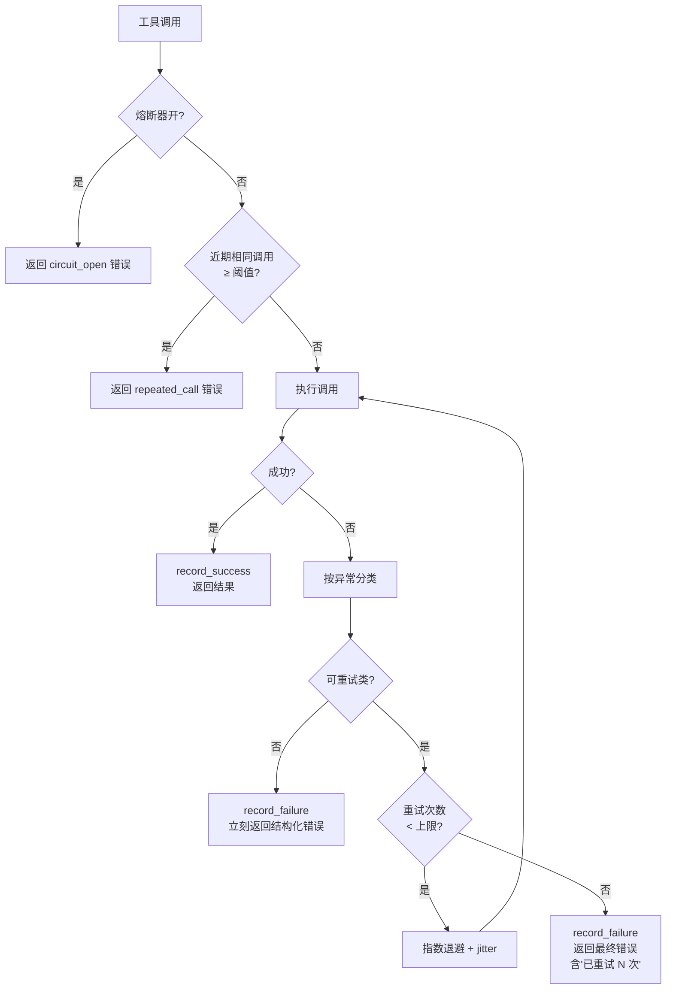

<section class="doc-hero">
  <p class="doc-hero__kicker">工具调用</p>
  <h1>工具调用的错误处理与重试</h1>
  <p class="doc-hero__lead">工具会失败，但 Agent 不能跟着崩——失败模式分类、重试策略、降级、给模型看的错误信息怎么写。</p>
  <div class="doc-hero__meta" aria-label="本文信息">
    <span>适合阶段：生产 Agent 必读</span>
    <span>核心：分类失败 + 结构化反馈</span>
    <span>面试重点：重试策略 + 死循环防护</span>
  </div>
</section>

## 面试官想考什么

读完这篇你要能正面回答下面这些题。每题后面括号里是面试官真正想看你答出什么。

<div class="interview-grid">
  <div>
    <strong>给模型看的 error message 和给开发者看的 log 区别在哪？为什么不能复用？</strong>
    <span>考受众意识——模型需要"怎么修"，开发者需要"完整堆栈"，混用会双输。</span>
  </div>
  <div>
    <strong>tool 调用失败该不该重试？你按什么判断？</strong>
    <span>考能不能按错误类别决策——区分瞬时错误、确定性错误、需要人工介入的错误。</span>
  </div>
  <div>
    <strong>怎么防止模型反复调失败的工具陷入死循环？</strong>
    <span>考工程化思维——硬上限、循环检测、参数相同检测三层防护。</span>
  </div>
  <div>
    <strong>401 / 429 / 500 各自该怎么处理？</strong>
    <span>考具体 HTTP 错误码到 Agent 行为的映射——不是所有 5xx 都该重试。</span>
  </div>
  <div>
    <strong>让框架强制重试 vs 让模型自己决定重试，各有什么适用场景？</strong>
    <span>考对"控制权"的理解——延迟敏感时框架重试，需要语义判断时让模型决定。</span>
  </div>
  <div>
    <strong>Circuit breaker 在 LLM Agent 里怎么用？</strong>
    <span>考分布式系统经验能不能迁移过来——保护后端服务 + 给模型清晰的"该换路了"信号。</span>
  </div>
  <div>
    <strong>tool 失败时返回 fallback 值还是直接告诉模型不可用，怎么选？</strong>
    <span>考降级策略的辨析——静默 fallback 容易让模型基于错数据继续推理。</span>
  </div>
  <div>
    <strong>上游 tool 的错误结果会污染下游 Agent 的判断吗？怎么隔离？</strong>
    <span>考多 Agent 错误传染问题，结合上下文污染的概念。</span>
  </div>
</div>

---

## 为什么"让工具自己抛异常"是错的

先看一段写得很自然但在 Agent 里就是定时炸弹的代码：

```python
@tool
def get_user_orders(user_id: str) -> list[dict]:
    response = requests.get(f"https://api.shop.com/users/{user_id}/orders")
    response.raise_for_status()
    return response.json()["orders"]
```

看起来没问题。但接到 Agent 里实际跑起来，会出现这样的场景：

```
User: 帮我查一下张三最近的订单，然后取消其中没发货的
Assistant: [tool_call: get_user_orders(user_id="zhangsan")]
Tool: HTTPError: 401 Unauthorized
```

然后呢？Agent 框架抛出 HTTPError，整个 turn 中断。用户看到的是一坨堆栈。

换个写法，把异常吞掉，返回空：

```python
try:
    return get_user_orders(user_id)
except Exception:
    return []
```

更糟。模型看到 `[]`，得出结论"张三没有订单"，然后回复"张三没有订单，无需取消"。**错误信息消失了，模型基于错数据生成了自信的回答**——这是比直接崩溃更危险的失败。

正确写法是：错误不消失，但变成模型能理解的结构化信号：

```python
{
    "status": "error",
    "error_type": "auth_failed",
    "message": "API token 已过期。请引导用户重新授权后再调用此工具。",
    "retryable": False
}
```

模型看到这个就知道：(1) 失败了 (2) 失败原因是认证 (3) 不要重试，要让用户授权。

这是工具错误处理的第一性原理：**错误信息要保留，但要翻译成模型能据此做出正确决策的格式**。下面几节系统讲怎么做。

---

## 工具失败的六类原因

不分类的"统一重试三次"是生产事故的常见源头。先看清楚有哪些失败模式，再讨论策略。

### 类型 1：参数不合法 (Validation Error)

模型生成的工具参数不符合 schema——类型错、必填缺失、枚举值不对、格式不对。

```python
# 工具签名: send_email(to: str, subject: str, body: str)
# 模型调用:
send_email(to=["alice@example.com", "bob@example.com"], subject="hi")
# 错误: to 应该是 str 不是 list；body 必填但缺失
```

特征：**确定性失败**——同样参数再试 100 次结果一样。重试无意义，必须让模型修改参数。

### 类型 2：外部服务挂掉 (External Service Failure)

工具背后的 HTTP API、数据库、第三方 SaaS 返回 5xx，或者直接连不上。

```
ConnectionError: Failed to connect to api.payment-provider.com:443
ReadTimeout: HTTPSConnectionPool timed out
HTTPError: 503 Service Unavailable
```

特征：**瞬时失败大概率**——等几秒可能就恢复。这类是 retry 的主要受益者。

### 类型 3：超时 (Timeout)

工具响应过慢。可能是真的服务慢，也可能是网络抖动，也可能是请求太重。

```python
result = web_scraper.fetch(url, timeout=10)
# TimeoutError after 10s
```

特征：**部分是瞬时的**（网络抖动），**部分是确定性的**（请求本身太重，比如让 LLM 总结 100MB PDF）。区分这两种需要看历史调用记录。

### 类型 4：权限不足 (Permission Denied)

工具能调用，但当前身份没有访问目标资源的权限。

```
HTTP 403 Forbidden: User 'agent-bot' is not allowed to delete production tables
```

特征：**确定性失败**。重试只会把日志撑满。需要的是：要么换权限更高的身份（HITL），要么换个不需要这权限的实现路径。

### 类型 5：业务规则拒绝 (Business Rule Violation)

调用成功了，但业务规则不允许。

```python
result = cancel_order(order_id="ORD-123")
# {"success": False, "reason": "Order already shipped, cannot cancel"}
```

特征：**重试无意义**，模型需要换思路（比如改成"申请退货"而不是"取消订单"）。**注意这类常常以 HTTP 200 + 业务错误码返回**——不是抛异常，容易被框架当成成功放过去。

### 类型 6：速率限制 (Rate Limit)

调用太频繁被限流。

```
HTTP 429 Too Many Requests
Retry-After: 60
```

特征：**瞬时但需要等待**。简单 retry 会撞墙，必须按 `Retry-After` 头退避。如果是按 token 限流（OpenAI / Anthropic API 常见），还要把 token 用量算进退避策略。

---

## 六类错误的处理策略对比

| 错误类型 | 重试？ | 谁来重试 | 给模型的提示 | 典型 HTTP 码 |
|---|---|---|---|---|
| 参数不合法 | 不重试 | 让模型改参数 | 列出哪个字段错了 + 期望格式 | 400 / 422 |
| 外部服务挂掉 | 重试 | 框架重试（指数退避） | 如重试都失败：告知模型考虑替代工具 | 502 / 503 / 504 |
| 超时 | 谨慎重试 | 框架重试 1-2 次 | 提示模型可能要拆小任务 | 408 / 504 |
| 权限不足 | 不重试 | 触发 HITL 或换路径 | 明确说"无权访问"，建议换工具 | 401 / 403 |
| 业务规则拒绝 | 不重试 | 模型自己决定换思路 | 把 reason 原文传给模型 | 200 + 业务码 |
| 速率限制 | 重试 | 框架按 Retry-After 等待 | 等待中无需告诉模型；耗尽预算才上报 | 429 |

这张表是这篇文章的"骨"。后面所有代码、所有讨论都是围绕怎么实现它展开。

---

## 错误的两种受众：开发者 vs 模型

这是工具错误处理里最容易混淆、也最影响实际效果的一点。

**给开发者看的日志**应该包含：
- 完整堆栈
- 请求参数（含 PII 脱敏）
- 上下游 trace ID
- 时间戳、机器名、版本号
- 内部错误码

**给模型看的 tool_result** 应该包含：
- 一句话说失败了
- 失败的**类别**（让模型决策）
- **怎么修**（让模型有下一步）
- 可选：是否值得重试

这两者完全是不同形态。看一个对比：

```python
# 给开发者的日志（写入 ELK / Datadog）
logger.error(
    "Tool call failed",
    extra={
        "tool": "create_invoice",
        "params": {"customer_id": "C-987", "amount": 1500.0, "currency": "USD"},
        "trace_id": "abc-123-def",
        "error": "ValidationError: amount exceeds customer credit limit of 1000.0",
        "stack": traceback.format_exc(),
        "duration_ms": 234,
        "upstream_status": 422,
    }
)

# 同一个错误，给模型的 tool_result
return {
    "status": "error",
    "error_type": "business_rule_violation",
    "message": "客户 C-987 的信用额度为 $1000，本次开票金额 $1500 超出上限。",
    "suggested_action": "可以拆分为多张发票，每张不超过 $1000；或先调用 raise_credit_limit 工具申请提额。",
    "retryable": False
}
```

注意几个差异：
- 日志里有 trace_id，模型看不需要（它处理不了，给了反而占 context）
- 日志保留原始数字，模型 message 翻译成自然语言
- 给模型多了 `suggested_action`——这是关键，让模型有下一步动作
- `retryable: False` 明确告诉模型别在这里耗着

**反例**：很多团队偷懒，直接把异常 `str(e)` 塞给模型：

```python
except Exception as e:
    return f"Error: {e}"
```

模型看到 `"Error: HTTPError: 500 Internal Server Error"`——能干什么？只能瞎猜要不要重试。它通常会重试 3-5 次，每次都失败，整个 turn 烧掉一堆 token，最后给用户回复"我尝试了多次都失败了"。

---

## 怎么给模型写"好的" error message

四个要素，按重要性排序：

**1. 失败原因（必须）** —— 用自然语言说清楚为什么失败，不是异常类名。

```
❌ "ValidationError"
✅ "参数 amount 必须为正数，收到 -100"
```

**2. 怎么修（高优先级）** —— 给模型一个可执行的下一步。

```
❌ "Invalid order_id"
✅ "订单号 ORD-1234 不存在。请先用 search_orders 查找正确的订单号。"
```

**3. 是否值得重试（可选但有用）** —— 显式告诉模型，省得它自己瞎判断。

```python
{"retryable": True, "retry_after_seconds": 30}  # 速率限制
{"retryable": False, "reason": "permission"}     # 权限错误
```

**4. 备选方案（高级）** —— 列出可以替代的工具或方法。

```
"无法访问生产数据库。可以尝试：(1) 用 query_replica 查只读副本 (2) 让用户授权"
```

[Anthropic 的 tool_result 设计指南](https://docs.anthropic.com/en/docs/build-with-claude/tool-use) 里专门强调了这一点：tool_result 的 content 字段应该是"模型能据此采取下一步动作的信息"，不是技术日志。OpenAI 的 function calling 文档也有类似说法。

---

## 重试策略：什么时候重试、怎么退避

重试不是"失败了再试一次"这么简单。生产里要回答三个问题：(1) 该不该重试 (2) 重试几次 (3) 重试间隔多长。

### 该不该重试：按错误类别决策

```python
RETRYABLE_ERRORS = {
    "timeout",
    "external_service_unavailable",  # 5xx
    "rate_limit",
    "network_error",
}

NON_RETRYABLE_ERRORS = {
    "validation_error",        # 400 / 422
    "permission_denied",       # 401 / 403
    "business_rule_violation", # 200 + 业务错
    "not_found",               # 404（多数情况）
}
```

注意 404 的微妙性：如果是"资源不存在"，重试无意义；但如果是"刚创建的资源还没在副本上同步"，重试可能成功。这种 case 通常需要业务侧给个标记。

### 退避策略：三种模式

**Immediate retry**（立即重试）：仅适合"明显是瞬时网络抖动"的场景。生产里很少单独用——容易引发雪崩。

**Exponential backoff**（指数退避）：每次失败等待时间翻倍，常配合 jitter（随机扰动）避免多个调用同时重试。

```python
import random
import time

def exponential_backoff_delay(attempt: int, base: float = 1.0, cap: float = 60.0) -> float:
    """指数退避 + 全量 jitter（AWS 推荐写法）"""
    raw = min(cap, base * (2 ** attempt))
    return random.uniform(0, raw)

# attempt=0: 0-1s
# attempt=1: 0-2s
# attempt=2: 0-4s
# attempt=3: 0-8s
```

为什么要 jitter？10 个 Agent 同时撞到限流，都按 `1, 2, 4` 秒重试，会形成同步重试浪潮，又一起撞墙。加 jitter 把它们打散。

**Circuit breaker**（熔断器）：一段时间内失败率超阈值就暂时不再调用该工具。

```
关闭(Closed): 正常调用
       ↓ 连续 N 次失败 (e.g. 5)
打开(Open): 拒绝所有调用，直接返回错误
       ↓ 过了冷却期 (e.g. 30s)
半开(Half-Open): 放一个请求试探
       ↓ 成功 → 关闭；失败 → 重新打开
```

熔断器在 LLM Agent 里的价值：**不光保护后端服务，更重要的是给模型一个清晰信号"这个工具暂时坏了，换路"**。如果没有熔断，模型可能在一个挂掉的工具上反复重试，烧光 token。

---

## 让模型自己决定重试 vs 框架强制重试

这是个真实存在的设计选择，没有银弹。

**框架强制重试**适合：
- 明确瞬时的错误（429、503、网络超时）
- 延迟敏感场景（用户等结果）
- 模型不需要知道重试细节的场景

```python
@retry(max_attempts=3, on=[Timeout, RateLimitError])
def search_web(query: str) -> str:
    ...
```

模型看到的就是"成功 + 结果"或"重试都失败了"，中间过程透明。

**让模型自己决定**适合：
- 错误需要语义判断（比如"是不是该换个 query"）
- 重试要改参数才有意义（不是相同请求）
- 多步任务，重试这一步可能不如换条路

```
Tool: search_orders(query="zhangsan")
Result: {"error": "未找到订单。用户名 'zhangsan' 可能太宽泛。", "suggestion": "尝试加上时间范围或邮箱"}

Assistant Thought: 好，我应该问用户要更具体的信息，或者换个搜索词
Tool: search_orders(query="zhangsan", email="zhang@example.com")
```

实际工程里通常是**两层结合**：框架处理"无脑可重试"的（网络/限流），把"需要换思路才能成功"的留给模型。

---

## 死循环检测：硬性防线

最危险的失败模式不是工具崩，是**模型不知道自己在循环**。

```
Step 1: search_user("alice") → 用户不存在
Step 2: search_user("alice") → 用户不存在
Step 3: search_user("alice") → 用户不存在
...
Step 25: search_user("alice") → 用户不存在
```

模型可能在每步 thought 里都"觉得这次会不一样"，实际上参数完全相同。这种循环烧 token、卡 latency、最终触发 max_steps 强制终止——用户看到的就是"Agent 转半天没结果"。

三层防护：

**1. 硬步数上限**：单次任务总步数硬上限（Claude Code 默认 25 步）。到了就停，不管什么状态。

**2. 相同调用检测**：检测连续 N 步是否调用了完全相同的 (tool, params)。

```python
def detect_repeated_call(history, threshold=3):
    """检测最近 threshold+1 步是否都是相同调用"""
    if len(history) < threshold:
        return False
    recent = history[-threshold-1:]
    keys = [(s.tool, hashable(s.params)) for s in recent]
    return len(set(keys)) == 1  # 全相同
```

发现后强制中断，给模型一个明确的 error：

```python
{
    "status": "error",
    "error_type": "repeated_call_blocked",
    "message": f"你已经用相同参数调用 {tool} 三次了，结果都一样。请换一个思路。",
    "retryable": False
}
```

**3. 连续失败计数**：同一工具连续 N 次返回 error，对该工具熔断。

这三层缺一不可。只有硬步数上限会让模型在最后一步前一直烧；只有相同调用检测挡不住"每次改一个字符"的伪不同调用。

---

## 降级策略：fallback 值 vs 报错

工具失败了，给模型返回什么？两种选择：

**返回 fallback 值（静默降级）**：

```python
def get_weather(city: str) -> dict:
    try:
        return real_api.fetch(city)
    except Exception:
        return {"city": city, "temp": "unknown", "condition": "unknown"}
```

危险。模型可能基于 `"temp": "unknown"` 编出"今天温度未知，建议穿外套"这种伪推理。**用户根本不知道下面的工具挂了**。

**直接报错（明确降级）**：

```python
def get_weather(city: str) -> dict:
    try:
        return real_api.fetch(city)
    except Exception as e:
        return {
            "status": "error",
            "error_type": "external_service_unavailable",
            "message": f"天气服务暂时不可用：{type(e).__name__}",
            "suggested_action": "可以告知用户稍后重试，或建议查看其他天气来源"
        }
```

模型能做出"告诉用户工具挂了"的响应，用户能感知失败。

什么时候用 fallback？只有这两种 case：
- **fallback 值在业务上有意义**（不是占位）。比如缓存里有 5 分钟前的天气，可以用，但要在结果里标注"数据可能过时 5 分钟"。
- **失败可以完全静默**（比如 metrics 上报失败不影响主流程，记 log 就行，不要进入 tool_result 干扰模型）。

通用原则：**不要骗模型**。让它清楚知道发生了什么，比给它一个看似正常的假数据好得多。

---

## 实战：一个生产级 tool wrapper

下面是一个把这篇里所有要点串起来的实现——retry、circuit breaker、结构化 error、循环检测、给模型友好的反馈。

```python
import time
import random
import logging
from dataclasses import dataclass, field
from enum import Enum
from typing import Callable, Any
from collections import defaultdict

logger = logging.getLogger(__name__)


class ErrorType(str, Enum):
    VALIDATION = "validation_error"
    EXTERNAL_UNAVAILABLE = "external_service_unavailable"
    TIMEOUT = "timeout"
    PERMISSION = "permission_denied"
    BUSINESS_RULE = "business_rule_violation"
    RATE_LIMIT = "rate_limit"
    REPEATED_CALL = "repeated_call_blocked"
    CIRCUIT_OPEN = "tool_temporarily_disabled"


RETRYABLE = {ErrorType.EXTERNAL_UNAVAILABLE, ErrorType.TIMEOUT, ErrorType.RATE_LIMIT}


@dataclass
class CircuitBreaker:
    failure_threshold: int = 5
    cooldown_seconds: float = 30.0
    failures: int = 0
    opened_at: float | None = None

    def is_open(self) -> bool:
        if self.opened_at is None:
            return False
        if time.time() - self.opened_at > self.cooldown_seconds:
            # 半开试探：清零，让下一次调用通过
            self.opened_at = None
            self.failures = 0
            return False
        return True

    def record_success(self):
        self.failures = 0
        self.opened_at = None

    def record_failure(self):
        self.failures += 1
        if self.failures >= self.failure_threshold:
            self.opened_at = time.time()


class ToolWrapper:
    """生产级 tool wrapper：retry + breaker + 结构化错误 + 循环检测"""

    def __init__(self, max_attempts: int = 3, repeat_threshold: int = 3):
        self.max_attempts = max_attempts
        self.repeat_threshold = repeat_threshold
        self.breakers: dict[str, CircuitBreaker] = defaultdict(CircuitBreaker)
        self.call_history: list[tuple[str, str]] = []  # (tool, params_hash)

    def _hash_params(self, params: dict) -> str:
        import json
        return json.dumps(params, sort_keys=True, default=str)

    def _is_repeated(self, tool: str, params_hash: str) -> bool:
        recent = self.call_history[-self.repeat_threshold:]
        return len(recent) >= self.repeat_threshold and all(
            (t, h) == (tool, params_hash) for t, h in recent
        )

    def _classify(self, exc: Exception) -> ErrorType:
        """异常 → 错误类型映射；实际项目应替换为业务自定义异常"""
        name = type(exc).__name__
        if "Validation" in name or "ValueError" in name:
            return ErrorType.VALIDATION
        if "Timeout" in name:
            return ErrorType.TIMEOUT
        if "RateLimit" in name or "429" in str(exc):
            return ErrorType.RATE_LIMIT
        if "Permission" in name or "403" in str(exc) or "401" in str(exc):
            return ErrorType.PERMISSION
        return ErrorType.EXTERNAL_UNAVAILABLE

    def _backoff(self, attempt: int) -> float:
        return random.uniform(0, min(60.0, 2 ** attempt))

    def _build_error(self, error_type: ErrorType, message: str,
                     suggested_action: str = "") -> dict:
        return {
            "status": "error",
            "error_type": error_type.value,
            "message": message,
            "suggested_action": suggested_action,
            "retryable": error_type in RETRYABLE,
        }

    def call(self, tool_name: str, fn: Callable, params: dict) -> dict:
        params_hash = self._hash_params(params)
        self.call_history.append((tool_name, params_hash))

        # 1. 循环检测：同样调用第 N 次直接挡
        if self._is_repeated(tool_name, params_hash):
            return self._build_error(
                ErrorType.REPEATED_CALL,
                f"工具 {tool_name} 在最近 {self.repeat_threshold} 步内被用相同参数调用了多次，结果都一样。",
                "请换一个参数组合，或者考虑当前思路是否走得通。",
            )

        # 2. 熔断器：工具最近频繁失败时直接报错
        breaker = self.breakers[tool_name]
        if breaker.is_open():
            return self._build_error(
                ErrorType.CIRCUIT_OPEN,
                f"工具 {tool_name} 最近故障频繁，已临时停用 {breaker.cooldown_seconds:.0f} 秒。",
                "考虑使用替代工具，或告知用户稍后重试。",
            )

        # 3. 带退避的重试
        last_exc = None
        for attempt in range(self.max_attempts):
            try:
                result = fn(**params)
                breaker.record_success()
                return {"status": "ok", "data": result}
            except Exception as exc:
                last_exc = exc
                err_type = self._classify(exc)
                logger.error(
                    "tool_call_failed",
                    extra={"tool": tool_name, "attempt": attempt,
                           "error": str(exc), "params": params},
                )
                # 不可重试的错误立刻返回
                if err_type not in RETRYABLE:
                    breaker.record_failure()
                    return self._build_error(
                        err_type,
                        self._human_message(err_type, exc),
                        self._suggested_action(err_type),
                    )
                # 可重试的等一下再试
                if attempt < self.max_attempts - 1:
                    time.sleep(self._backoff(attempt))

        # 4. 重试都用完了，给模型一个明确终态
        breaker.record_failure()
        err_type = self._classify(last_exc)
        return self._build_error(
            err_type,
            f"{self._human_message(err_type, last_exc)}（已重试 {self.max_attempts} 次）",
            "考虑使用替代工具，或告知用户当前服务不可用。",
        )

    def _human_message(self, t: ErrorType, exc: Exception) -> str:
        return {
            ErrorType.VALIDATION: f"参数不合法：{exc}",
            ErrorType.TIMEOUT: "工具调用超时。",
            ErrorType.EXTERNAL_UNAVAILABLE: "后端服务暂时不可用。",
            ErrorType.PERMISSION: "当前身份没有访问该资源的权限。",
            ErrorType.RATE_LIMIT: "调用频率超过限制。",
            ErrorType.BUSINESS_RULE: f"业务规则拒绝：{exc}",
        }.get(t, str(exc))

    def _suggested_action(self, t: ErrorType) -> str:
        return {
            ErrorType.VALIDATION: "检查参数 schema，修正后再调用。",
            ErrorType.PERMISSION: "考虑换权限更高的身份，或换条不需要此权限的路径。",
            ErrorType.BUSINESS_RULE: "改用其他符合业务规则的方案。",
        }.get(t, "")
```

使用示例：

```python
wrapper = ToolWrapper()

# 在 Agent loop 里
def agent_step(model, history, tools):
    response = model.chat(history)
    if response.tool_calls:
        for call in response.tool_calls:
            result = wrapper.call(call.name, tools[call.name], call.params)
            history.append({"role": "tool", "content": result})
    return response
```

这个 wrapper 的核心设计点：
- **错误结构稳定**：所有失败返回同样的字段结构（status/error_type/message/suggested_action/retryable），模型可以学到一致的反应模式
- **重试在 wrapper 内消化**：可重试错误模型看不到，只看到最终结果；不可重试错误立刻上报
- **熔断和循环检测在工具调用之前**：避免无意义的实际调用
- **日志和 tool_result 分开**：开发者看 logger 里的完整堆栈，模型看 message 里的人话

40-60 行的版本写不下所有细节（这里 130 行），但核心三件套——重试 + 熔断 + 结构化错误——抓住就够用。

---

## 多 Agent 失败传染

工具失败不只是单 Agent 的问题，在多 Agent 系统里它会**传染**。

经典场景：研究 Agent 调用搜索工具失败，返回空结果给写作 Agent，写作 Agent 在没有任何源材料的情况下"硬写"——它不知道上游失败了，以为是真的搜不到。

```
[Researcher Agent]
search_papers("transformer attention") → ERROR: API key expired
（错误被吞掉，向 Writer Agent 输出："未找到相关论文"）

[Writer Agent]
（基于"未找到论文"开始编内容）
→ 输出一篇看起来权威实则全是幻觉的报告
```

这本质上是 [上下文污染](../context/pollution) 的一种特殊形态——**错误作为"事实"进入下游 Agent 的 context，污染整条链路**。pollution 文章里讲的"Agent A 的错误结论写入共享 context，B/C/D 都基于此推理"，工具失败是这种污染最常见的源头。

两层防护：

**1. 错误显式传播**：上游 Agent 收到 tool error 后，要在向下游汇报时**保留错误信号**，不是 fallback 成"无结果"。

```python
# 反例
researcher_output = {"papers": []}  # 工具挂了，但下游不知道

# 正确
researcher_output = {
    "status": "partial_failure",
    "papers": [],
    "errors": [{"tool": "search_papers", "reason": "auth_failed"}],
    "confidence": "low"
}
```

**2. 下游 Agent 显式检查**：Writer Agent 的 system prompt 里应该有"如果上游标记 confidence: low 或有 errors，不要硬写，要明确告知用户"。

工业界这块做得最系统的是 LangGraph——它的 `Send` 机制让 Agent 间通信走结构化消息，错误是一等公民而不是被吞掉的副作用。

---

## 真实案例：编程 Agent 怎么处理 build / test 失败

build 失败和 test 失败本质上就是工具失败的一种——只不过这个"工具"是 `npm run build` 或 `pytest`。看几个真实 Agent 的处理思路。

### Claude Code 的策略

观察 Claude Code 处理 build 失败的实际行为：

1. **不静默吃错**：把完整的错误输出原样返回（不截断、不总结）
2. **分类失败类型**：是编译错（语法）、是依赖错（缺包）、还是测试错（断言）——直接影响下一步动作
3. **限制重试**：同一个错连续修不好两次就停下来问用户，不会无限改下去

特别关键的一点：错误输出**原文**返回比"AI 总结的错误"更好。因为模型对原始错误更敏感（训练数据里见过大量），总结后反而丢信息。

### Cursor 的 Agent 模式

Cursor 在 Agent 模式（Composer）里跑 build 后的处理：

1. 失败时把 stderr 全文塞回 context，不做加工
2. 让模型自己决定是修代码还是修配置（不强制重试）
3. 如果一次修改后仍然失败，会显式提示"建议交给用户"

注意 Cursor 不做"自动重试改完再 build"——他们的判断是：**重复失败的根因往往不是瞬时错，而是模型理解错了问题**。再 build 一次不会变好，让模型先 reflect 才有用。

### Aider 的处理

[Aider](https://github.com/Aider-AI/aider) 的源码里有个明确策略：每次 build/test 失败，把错误作为"new context"，要求模型在下一轮 commit 必须**减少**失败数。如果连续两轮失败数不减少，自动停止并告诉用户"我可能陷入了死胡同"。

这种"失败数监控"是循环检测的一种业务形态——不光看是不是相同调用，还看"是不是真的在进步"。

---

## 错误处理 vs 相邻概念

| 概念 | 关注点 | 范围 |
|---|---|---|
| **工具错误处理** | 工具调用本身的失败 | 本文 |
| **[Reflexion](../agent/reflexion)** | 失败后的反思学习 | 跨任务、长期 |
| **[Self-correction](../agent/self-correction)** | 模型自己识别并修正错误 | 推理层 |
| **[Observability](../engineering/observability)** | 整体可观测性 | 系统级监控 |
| **[Parallel error handling](./parallel)** | 并行调用的特殊处理 | 并发场景 |

辨析要点：
- 工具错误处理是**事中**——失败发生那一刻怎么响应
- Reflexion / Self-correction 是**事后**——基于失败修正策略
- Observability 是**事后 + 长期**——失败趋势分析

三者层次不同但要配合：tool wrapper 把错误变成结构化信号（事中），模型基于信号自我纠错（事中），失败被 trace 系统记录用于后续 reflection 和监控（事后）。

---

## 错误处理决策流



这张图是 tool wrapper 的状态机骨架。生产里几乎所有变体都是在这个骨架上加细节（比如 429 走 Retry-After 而不是指数退避、5xx 但 idempotent=False 的请求不重试等等）。

---

## 容易踩的坑

### 陷阱 1：吞掉错误返回 fallback

最常见、危害最大。前面讲过：

```python
try:
    return real_call(...)
except Exception:
    return None  # 或 [] 或 {}
```

模型基于 `None` 编出自信的错误回答，用户毫不知情。**任何 fallback 都要在 result 里明确标注"这是降级数据"**，让模型有机会感知。

### 陷阱 2：error message 太短，模型无从下手

```python
return {"error": "failed"}
return {"error": "500"}
return {"error": str(e)}  # 通常输出 "HTTPError"
```

模型看到这些只能瞎猜要不要重试。**至少要有：失败类型 + 一句人话原因 + 建议的下一步**。三者缺一个，模型的决策质量都会显著下降。

### 陷阱 3：无限重试或太激进重试

```python
@retry(max_attempts=10)  # 太多
@retry(retry_on=Exception)  # 啥都重试
```

10 次重试 = 10 倍 API 费用 + 10 倍延迟。对 LLM 调用尤其致命——模型 thinking 一次几秒，重 10 次用户已经走了。**生产里 max_attempts 通常 2-3，并且只重试明确瞬时类的错误**。

### 陷阱 4：失败被压缩摘要丢掉

长 session Agent 会做 context 压缩，压缩 prompt 经常这么写：

```
保留：(1) 用户原始目标 (2) 已完成的关键操作 (3) 当前状态
丢弃：失败尝试、中间 thinking、重复调用
```

注意"丢弃失败尝试"——压缩后模型看不到"我之前试过 X 工具失败了"，下次又会试一遍同样的 X 工具。**压缩时要保留"已知失败"的简短摘要**，不是全删。

### 陷阱 5：HTTP 200 + 业务错误码被当成功

```python
# 后端返回 200 但 body 里 success=False
response = requests.post(url, json=data)
return response.json()  # 直接返回，没检查 success
```

模型看到的是"工具调用成功，返回数据"，但数据里 `success: False`——模型可能没注意到这个字段，基于错误结果继续推理。**业务层成功失败要在 wrapper 层显式提升为"调用失败"**。

### 陷阱 6：开发者日志和 tool_result 混着写

```python
return {"error": f"trace_id={trace}: HTTPError at line 234, ..."}
```

trace_id 对模型没意义，反而占 context、引诱模型生成无关内容。**两个受众的内容必须分开生成**。

### 陷阱 7：没有按错误类型分类的统一处理

```python
@retry(max_attempts=3)
def call_tool(...):
    ...
```

不分错误类型一律重试，对参数错误（确定性失败）也试 3 次——纯浪费。**重试策略必须建立在分类基础上**。

---

## 面试题深度解析

### Q: 给模型看的 error message 和给开发者看的 log 区别在哪？

**30 秒版本**：受众不同，所以信息密度和形态完全不同。开发者要**完整堆栈 + trace_id + 参数 + 时间戳**——这些用来事后排查。模型要**人话失败原因 + 下一步动作建议 + 可选的"是否重试"提示**——这些用来当场决策。混用会双输：开发者拿到的是简化版没法 debug，模型拿到的是技术细节做不出决策。生产里两个出口分别构建：异常进来后一份写到 logger 完整记录，另一份转成结构化 dict 返回模型——共享异常对象，但 format 完全不同。

**追问**：为什么模型看堆栈反而不行？
两个原因。一是堆栈占大量 token，挤掉 context 里更重要的内容。二是堆栈会诱发模型"瞎猜"——它看到 `requests.exceptions.ConnectionError`，可能开始解释 ConnectionError 是什么、要不要换 HTTP 库这种和当前任务无关的内容。给模型简洁的"网络不可用"+"建议告知用户重试"反而能让它聚焦正确动作。Anthropic 的 tool use 文档明确建议 tool_result 内容要"actionable to the model"，不是 raw error。

**追问**：那 trace_id 完全不给模型吗？
通常不给。例外是：(1) 业务流程里 trace_id 本身是工单号，用户后续要用；(2) 多 Agent 协作，下游 Agent 需要这个 ID 关联上游产出。这两种 case 把 trace_id 放在结构化字段里（`{"reference_id": "..."}`），不要混进 message 文本——模型容易当成噪音忽略。

### Q: 怎么防止模型反复调失败的工具陷入死循环？

**30 秒版本**：三层防护，缺一不可。**第一层硬步数上限**——任务总步数硬上限（Claude Code 默认 25），到了直接停。**第二层相同调用检测**——连续 N 步 (tool, params) 完全一致就强制中断，给模型一个明确的"你在循环"信号。**第三层熔断器**——单工具连续失败 N 次就临时停用，强迫模型走替代路径。光有第一层会让模型"在最后一步前一直烧"；光有第二层挡不住"每次改一个无关字符"的伪不同调用；光有第三层不能处理"成功但拿不到想要的结果"的场景。三层都加上才能兜住。

**追问**：那"每次改一个字符"的循环怎么挡？
两种思路。一是**语义级去重**——用 embedding 算近似相似度，不是字符串完全相等。但这成本高、阈值难调。二是**进度检测**——观察"任务相关性"是不是在下降。Aider 用的方法是看每次失败后 test 失败数是不是减少，连续两轮不减就停。语义级太重、进度检测需要业务定义"进度"——通常生产里就接受"字符完全相同"的检测覆盖 80%，剩下用步数上限兜底。

**追问**：模型被挡下来后怎么让它优雅终止？
关键是给它"明确知道发生了什么"的错误。不要返回 `"max_steps_reached"` 这种纯技术消息，要返回类似`"你在最近 3 步用相同参数调用了 search_user，结果都一样。这条路走不通，请告诉用户你尝试了什么并请求更多信息"`。配合 system prompt 里有"遇到 repeated_call_blocked 时要总结现状求助用户"的指令，模型就能正确结束 turn 而不是继续乱试。

### Q: 401 / 429 / 500 各自该怎么处理？

**30 秒版本**：**401 (Unauthorized) 不重试**——token 错了再重试 100 次也是错。需要：要么换 token，要么走 HITL 让用户重新授权。**429 (Rate Limit) 谨慎重试**——必须看 `Retry-After` 头，不能用通用退避（Retry-After 可能说要等 60 秒，你按 2/4/8 秒退避会一直撞墙）。**500 (Internal Server Error) 通常可重试**——但要区分是真瞬时还是后端确定性挂掉。SLA 视角：5xx 中 502/503/504 重试价值最大（明确是网关/上游问题），500 价值次之（可能是后端确定性 bug），501（未实现）完全不该重试。

**追问**：429 的 Retry-After 怎么和 token 限流配合？
OpenAI/Anthropic 是 token 级别限流，比 request 限流复杂。Retry-After 头给的等待时间假设你下次请求 token 量差不多。如果你重试时请求体不变 OK，但如果你打算重试时塞更多内容（比如带上失败的 tool result），等同时间可能还会撞限。生产做法：除了按 Retry-After 等，还要按"我们的预估 token 用量 vs API 的 TPM 配额"做本地令牌桶——这样能在请求出去之前就挡掉。Anthropic 官方 SDK 的 `RateLimiter` 就是这种思路。

**追问**：500 重试时怎么避免重复扣费/重复创建资源？
关键是**幂等性**。GET 通常天然幂等，可以放心重试。POST/PUT 危险——重试可能创建两个订单。两种保护：(1) 客户端在每个请求带 Idempotency-Key header，后端识别相同 key 直接返回之前的结果（Stripe API 标准做法）；(2) wrapper 层维护一个"已成功但响应超时"的标记，遇到重试先查后端是不是已经成功了再决定。LLM tool wrapper 应该把工具标注 `idempotent: bool`，非幂等的 5xx 不自动重试，而是返回错误让模型决定（"我刚才创建订单超时了，但订单可能已经创建成功——要不要查一下"）。

### Q: Circuit breaker 在 LLM Agent 里怎么用？

**30 秒版本**：经典熔断器（Closed / Open / Half-Open 三态）直接搬过来用，但有 LLM 特色的两点：(1) **熔断状态要变成"模型能理解的信号"**——返回 `error_type: tool_temporarily_disabled` + 建议替代工具，而不是抛异常让 Agent 崩；(2) **粒度建议按工具 + 参数模式分**——比如 `search_docs` 整体没事，但 `search_docs(category="legacy")` 这个特定参数路径一直挂，可以只熔断这个分支，不影响其他调用。熔断器的价值不只是保护后端服务（防止 N 个 Agent 同时撞挂掉的 API），更重要是给模型一个**明确的"换路"信号**——没有熔断时模型可能在挂掉的工具上耗 5-10 步才放弃。

**追问**：熔断的阈值和冷却时间怎么定？
没有银弹，但有原则。**阈值**看错误成本：调用 OpenAI API 这种高成本的 3 次失败就该熔断；本地缓存查询失败 50 次也不心疼。**冷却时间**看下游服务的典型恢复时间：常见外部 API 30-60 秒；数据库故障要分钟级；偶发限流可以更短。生产里建议先用 5 次失败 + 30 秒冷却作为默认，观察一周指标再调。Hystrix 那套理论的核心是"快速失败 + 系统恢复时间"——LLM Agent 里要额外考虑"模型走替代路径的认知成本"，所以熔断要比传统微服务更激进一些。

**追问**：熔断器和重试怎么配合？
顺序是 **熔断器检查 → 重试循环 → 失败计数回到熔断器**。具体流程：调用时先看熔断器是不是 Open，是就直接返回；不是就进入带退避的重试循环；重试都失败了，把这次失败上报给熔断器累加失败计数；如果累加后超阈值就触发熔断。这样熔断器统计的是"经过重试都救不回来的失败"，更准确。常见错误是熔断器直接统计每次重试失败——3 次重试都失败被算成 3 次失败，熔断器很容易被误触发。

---

## 延伸阅读

- **Anthropic Tool Use 官方文档** ([docs.anthropic.com/en/docs/build-with-claude/tool-use](https://docs.anthropic.com/en/docs/build-with-claude/tool-use))
  专门有一节讲 tool_result 怎么写。读它是为了理解"actionable error message"在官方设计哲学里的位置——不是补丁，是 contract 的一部分。

- **OpenAI Function Calling Guide** ([platform.openai.com/docs/guides/function-calling](https://platform.openai.com/docs/guides/function-calling))
  OpenAI 视角的错误返回最佳实践。和 Anthropic 对比着看能感受到两家的细节差异——OpenAI 更倾向把错误放在 content 字符串里，Anthropic 更倾向用结构化字段。

- **AWS Architecture Blog — Exponential Backoff and Jitter** ([aws.amazon.com/blogs/architecture/exponential-backoff-and-jitter](https://aws.amazon.com/blogs/architecture/exponential-backoff-and-jitter/))
  退避策略的经典文章。Marc Brooker 用数学讲清楚为什么 jitter 比没 jitter 好，full jitter 比 equal jitter 好。Agent retry 直接套用。

- **Martin Fowler — CircuitBreaker** ([martinfowler.com/bliki/CircuitBreaker.html](https://martinfowler.com/bliki/CircuitBreaker.html))
  熔断器模式的经典定义。读它是为了把分布式系统的成熟模式迁移到 Agent，不要重新发明轮子。

- **GitHub: Aider — auto-test / auto-lint 实现** ([github.com/Aider-AI/aider](https://github.com/Aider-AI/aider))
  搜 `auto_test` 看 Aider 怎么处理 test 失败循环。重点看"连续失败数不减少就停"这个简单但有效的逻辑——比复杂的语义检测更可靠。

- **GitHub: LangGraph Error Handling** ([langchain-ai.github.io/langgraph/how-tos/tool-calling-errors](https://langchain-ai.github.io/langgraph/how-tos/tool-calling-errors/))
  LangGraph 把 ToolNode 的错误处理做成了一等公民。读它的源码（`langgraph/prebuilt/tool_node.py`）了解工业级实现的细节，比如错误怎么传回 messages 流。

- **博客: Hugging Face — How Open Models Handle Tool Failures** ([huggingface.co/blog](https://huggingface.co/blog))
  开源模型生态对 tool error 的处理通常比闭源弱。读它了解小模型在错误恢复上的能力边界，影响你选模型时的判断。

- **配套阅读**：[Function Calling 规范](./function-calling)——错误处理的前提是工具定义；[并行工具调用](./parallel)——并行场景的错误处理特殊性（partial failure）；[Reflexion](../agent/reflexion)——失败后的反思机制；[Self-correction](../agent/self-correction)——模型自我纠错；[Observability](../engineering/observability)——错误的长期监控；[上下文污染](../context/pollution)——错误怎么进入并污染下游 context。
