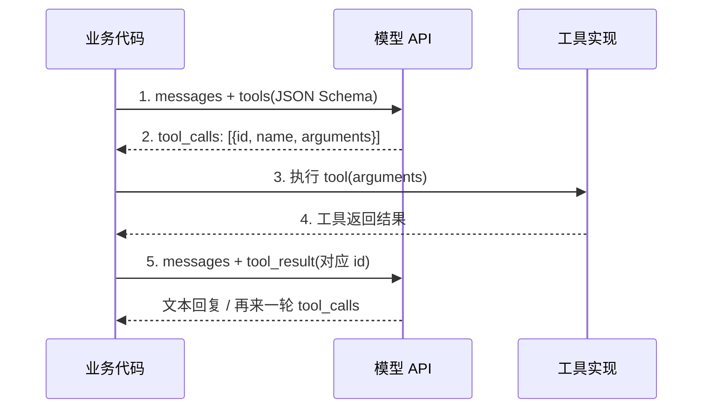

<section class="doc-hero">
  <p class="doc-hero__kicker">工具调用</p>
  <h1>Function Calling 函数调用规范</h1>
  <p class="doc-hero__lead">让模型不再"假装"调用工具——它真正吐出一段结构化 JSON，你的业务代码拿到 JSON 执行，结果再喂回去。这是 ReAct 文本范式的工程化版本。</p>
  <div class="doc-hero__meta" aria-label="本文信息">
    <span>适合阶段：Agent 入门 / 生产</span>
    <span>核心链路：模型 → tool_call → 业务执行 → tool_result → 继续生成</span>
    <span>面试重点：三家协议差异 + 与 ReAct 的关系</span>
  </div>
</section>

> **本文边界**：聚焦 **LLM API 层的 function calling 协议**——三家厂商的消息格式、tool_choice 语义、并行调用回传、错误反馈。schema 字段怎么写更不易踩坑见 [Tool Schema 设计](./schema-design)；跨进程标准化协议见 [MCP](./mcp)；并行 tool_calls 的编排细节见 [并行工具调用](./parallel)；prompt 层面的 ReAct 见 [ReAct Prompt 模式](../prompt/react)。

## 面试官想考什么

读完这篇你要能正面回答下面这些题。每题后面括号里是面试官真正想看你答出什么。

<div class="interview-grid">
  <div>
    <strong>function calling 和 ReAct prompt 是什么关系？</strong>
    <span>考你能不能把"文本范式"和"工程化协议"讲清——不要回答成两件无关的事。</span>
  </div>
  <div>
    <strong>OpenAI / Anthropic / Google 三家 tool_call 的消息格式差异在哪？</strong>
    <span>考真实用过几家 SDK——能讲出 tool_calls 数组 vs content block、role 字段差异等细节。</span>
  </div>
  <div>
    <strong>tool_choice 的 auto / required / 指定工具名 / none 分别是什么语义？</strong>
    <span>考对 API 细节的掌握，是不是只用过默认值。</span>
  </div>
  <div>
    <strong>为什么对齐良好的模型 function calling 仍然可能调错参数？</strong>
    <span>考底层原理——模型生成 JSON 的本质仍是 token 预测，不是结构化约束。</span>
  </div>
  <div>
    <strong>并行返回多个 tool_calls，怎么把多个结果同时回传？顺序重要吗？</strong>
    <span>考工程细节，tool_call_id 配对、消息顺序约束。</span>
  </div>
  <div>
    <strong>tool_result 写得不好会怎样影响下一轮？</strong>
    <span>考工程经验——返回噪声、过长、结构不一致的实际后果。</span>
  </div>
  <div>
    <strong>function calling 底层依赖什么标准？为什么是 JSON Schema 而不是别的？</strong>
    <span>考底层认知——JSON Schema Draft 7+、模型对 schema 的"训练"程度。</span>
  </div>
  <div>
    <strong>什么场景下应该退回 ReAct 文本 prompt，不用原生 function calling？</strong>
    <span>考辨析能力——模型支持度、可解释性、可控性的权衡。</span>
  </div>
</div>

---

## 为什么需要原生 function calling

2023 年 6 月之前，让 LLM 调用工具基本只有一条路——把工具描述塞进 prompt，让模型按约定格式输出文本，再用正则把"工具名 + 参数"抠出来。这就是 [ReAct Prompt 模式](../prompt/react) 走过的路。

它能跑，但工业生产里有几个永远修不完的伤口：

```text
模型输出（理想）：
Action: search("OpenAI GPT-4o 发布日期")

模型输出（现实）：
Action: search('OpenAI 的 GPT-4o' 发布日期)        ← 引号嵌套，正则崩
Action: 我会调用 search 来查询 GPT-4o ...          ← 多了一句话，正则崩
Action：search("...")                              ← 全角冒号，正则崩
{"name": "search", "args": {"q": "GPT-4o"}}        ← 模型擅自给了 JSON，正则崩
```

每个 corner case 都要再加一条正则规则——业务代码里堆满 `try/except` 还总有遗漏。这是**协议层的脆弱**，不是 prompt 写得不够好的问题。

OpenAI 在 2023-06-13 推出 function calling（[发布说明](https://openai.com/index/function-calling-and-other-api-updates/)）的本质是：**把"工具调用"从 prompt 约定升级成 API 字段**。模型直接吐出一个独立的结构化字段 `tool_calls`，不再混在自然语言里。Anthropic 在 2024-04 跟进 tool use（[发布博客](https://www.anthropic.com/news/tool-use-ga)），Google Gemini 同期也跟上。现在所有主流 API 都把 function calling 当作一等公民——这是 2024 后所有 Agent 框架的默认底座。

> **一句话定位**：function calling 是 ReAct 文本范式的工程化——同样的"模型生成 → 工具执行 → 结果回灌"循环，但把脆弱的文本解析换成了模型直接产生结构化 JSON 的 API 字段。

---

## 一次完整调用是 5 步循环

很多人对 function calling 的误解是"模型自己会调工具"。**模型从不调工具**——它只产生"我想调这个工具、参数是什么"的 JSON，工具一直由你的业务代码执行。完整循环长这样：



五个动作：

1. **第一次请求**：把工具列表（带 JSON Schema 的参数定义）和用户消息一起发给模型
2. **模型决策**：返回 `tool_calls` 字段——可能 0 个（不需要工具，直接答）、1 个、或多个（并行调用）
3. **业务执行**：你的代码 dispatch 到对应函数，传入模型给的参数，得到结果
4. **结果格式化**：包装成 `tool_result` 消息（带上 `tool_call_id` 配对）
5. **第二次请求**：把 user message + assistant message（含 tool_calls）+ tool_result 一起发回去，模型基于结果继续生成

这个循环可能走多轮——模型看了第一个工具结果后可能要求再调另一个工具，再回灌，再决策。**Agent 的本质就是这个循环跑到模型说"不需要再调工具了"为止**——详见 [Agent ReAct 模式](../agent/react-pattern)。

---

## 三家协议详细对比

虽然概念一样，三家 API 的具体消息格式差异不小。混着用过的人都被卡过——下面拆开看。

### OpenAI（Chat Completions / Responses API）

OpenAI 是 function calling 的发明者，**最早期叫 `function_call`（单个），2023 年底升级为 `tools` + `tool_calls`（数组）支持并行**。现在的标准格式：

```json
// 请求
{
  "model": "gpt-4o",
  "messages": [{"role": "user", "content": "北京和上海今天温差多少？"}],
  "tools": [{
    "type": "function",
    "function": {
      "name": "get_weather",
      "description": "查询指定城市的当前温度（摄氏度）",
      "parameters": {
        "type": "object",
        "properties": {"city": {"type": "string"}},
        "required": ["city"]
      }
    }
  }],
  "tool_choice": "auto"
}

// 模型返回
{
  "role": "assistant",
  "content": null,
  "tool_calls": [
    {"id": "call_abc", "type": "function",
     "function": {"name": "get_weather", "arguments": "{\"city\":\"北京\"}"}},
    {"id": "call_def", "type": "function",
     "function": {"name": "get_weather", "arguments": "{\"city\":\"上海\"}"}}
  ]
}

// 回传工具结果（每个 tool_call_id 对应一条 tool role 消息）
{"role": "tool", "tool_call_id": "call_abc", "content": "12"}
{"role": "tool", "tool_call_id": "call_def", "content": "18"}
```

注意 `arguments` 是**字符串**而非对象——这是为了流式传输方便（边生成边发），用之前要 `json.loads`。OpenAI 2024 后推出的 **Strict Mode**（`"strict": true`）会用受限解码强制模型输出符合 schema 的 JSON，几乎杜绝参数格式错误（细节见 [Tool Schema 设计](./schema-design)）。

### Anthropic（Messages API）

Claude 的 tool use 用 **content block** 结构——一条 assistant message 的 `content` 是一个数组，里面可以混 text block 和 tool_use block：

```json
// 请求
{
  "model": "claude-3-5-sonnet-20241022",
  "messages": [{"role": "user", "content": "北京和上海今天温差多少？"}],
  "tools": [{
    "name": "get_weather",
    "description": "查询指定城市的当前温度（摄氏度）",
    "input_schema": {
      "type": "object",
      "properties": {"city": {"type": "string"}},
      "required": ["city"]
    }
  }]
}

// 模型返回
{
  "role": "assistant",
  "content": [
    {"type": "text", "text": "我需要查两个城市的温度。"},
    {"type": "tool_use", "id": "toolu_01A", "name": "get_weather",
     "input": {"city": "北京"}},
    {"type": "tool_use", "id": "toolu_01B", "name": "get_weather",
     "input": {"city": "上海"}}
  ],
  "stop_reason": "tool_use"
}

// 回传工具结果（一条 user message 里塞多个 tool_result block）
{
  "role": "user",
  "content": [
    {"type": "tool_result", "tool_use_id": "toolu_01A", "content": "12"},
    {"type": "tool_result", "tool_use_id": "toolu_01B", "content": "18"}
  ]
}
```

几个细节差异要记住：

- **参数字段叫 `input`**，不是 `arguments`，而且是真正的 **JSON 对象**，不需要二次解析
- **结果用 `user` role 包装**，不是独立的 `tool` role——这是 OpenAI 用户常踩的坑
- **多个并行调用的结果合并在一条 user message 里**，不是分多条
- Claude 经常会在 tool_use 之前先输出一段 text block 作为"自然语言思考"——这就是隐式的 [ReAct Thought](../prompt/react)

### Google Gemini

Gemini 的术语是 **function_declarations**，消息结构又是另一套：

```json
// 请求
{
  "contents": [{"role": "user", "parts": [{"text": "北京今天温度？"}]}],
  "tools": [{
    "function_declarations": [{
      "name": "get_weather",
      "description": "查询指定城市的当前温度",
      "parameters": {
        "type": "object",
        "properties": {"city": {"type": "string"}},
        "required": ["city"]
      }
    }]
  }],
  "tool_config": {"function_calling_config": {"mode": "AUTO"}}
}

// 模型返回
{
  "role": "model",
  "parts": [
    {"functionCall": {"name": "get_weather", "args": {"city": "北京"}}}
  ]
}

// 回传工具结果
{
  "role": "user",
  "parts": [
    {"functionResponse": {"name": "get_weather",
                          "response": {"temperature": 12}}}
  ]
}
```

差异点：

- **role 用 `model` 而不是 `assistant`**
- 消息体叫 `parts`，每个 part 可以是 text / functionCall / functionResponse
- **functionResponse 用 `name` 配对**，不是 ID——这意味着多个并行调用同名工具时容易混淆（Gemini 后续版本加入了 `id` 字段缓解）
- `tool_config.mode` 的可选值是 `AUTO` / `ANY` / `NONE`，名称和 OpenAI 不同但语义对齐

### 一张表对照

| 维度 | OpenAI | Anthropic | Google Gemini |
|---|---|---|---|
| **协议名** | tools / tool_calls | tools / tool_use | function_declarations / functionCall |
| **schema 字段名** | `parameters` | `input_schema` | `parameters` |
| **assistant role 名** | `assistant` | `assistant` | `model` |
| **工具结果 role** | `tool`（独立 role） | `user`（普通 user message） | `user` |
| **参数字段** | `arguments`（**字符串**） | `input`（**对象**） | `args`（对象） |
| **配对方式** | `tool_call_id` | `tool_use_id` | 早期靠 `name`，新版加 `id` |
| **多结果回传** | 多条 tool message | 一条 user message 含多 block | 一条 user message 含多 part |
| **tool_choice** | `auto` / `required` / `none` / `{type:"function",function:{name}}` | `tool_choice: {type:"auto"\|"any"\|"tool", name}` | `mode: AUTO\|ANY\|NONE` + `allowed_function_names` |
| **强制 schema 输出** | Strict Mode（`strict: true`） | 无独立开关，靠训练保证 | `response_schema`（响应结构化） |
| **并行 tool_calls** | 默认支持，可 `parallel_tool_calls: false` 关掉 | 默认支持，可 `disable_parallel_tool_use: true` | 默认支持 |
| **思维链/Thought** | 隐式，不暴露 | tool_use 之前的 text block 是自然语言"思考" | 隐式 |

> 这张表的细节非常容易考——一个真正接过多家 API 的工程师能脱口而出 `tool_use_id` vs `tool_call_id`，没用过的人面试时一律答"差不多"。

---

## tool_choice 的四种语义

三家都支持控制"是否必须调工具"，但 enum 命名差异大。语义上对齐成四类：

| 行为 | OpenAI | Anthropic | Gemini |
|---|---|---|---|
| 让模型自己决定 | `"auto"`（默认） | `{"type":"auto"}` | `mode: AUTO` |
| 必须调任一工具 | `"required"` | `{"type":"any"}` | `mode: ANY` |
| 必须调指定工具 | `{"type":"function","function":{"name":"X"}}` | `{"type":"tool","name":"X"}` | `mode: ANY` + `allowed_function_names:["X"]` |
| 禁用所有工具 | `"none"` | 不传 tools 即可 | `mode: NONE` |

什么时候用 `required` / `any`：
- **结构化抽取场景**：用户消息已经明确是"抽信息"，直接强制走某个 schema，避免模型啰嗦解释
- **必须走工具校验的业务**：例如金融下单，模型不允许"凭印象"答价格，强制走 `get_price` 工具

什么时候用 **指定工具名**：
- **流程分阶段**：第一轮强制走 `plan`，第二轮才解锁 `execute`——典型 Plan-Execute Agent

什么时候用 `none`：
- 给模型一份工具列表"让它知道有这些能力"，但本轮明确禁止调——例如让它总结上一轮 tool_result，避免它又开始 tool 调用

---

## 同一个任务，OpenAI vs Anthropic SDK 实战

下面是一个能跑的对比示例。任务：**查询北京和上海当前温度，给出温差**。两个工具：`get_weather` 和 `compute_diff`。两家 SDK 完整跑完循环。

```python
# pip install openai anthropic
import json
from openai import OpenAI
from anthropic import Anthropic

# ====== 共用：工具实现（业务代码） ======
def get_weather(city: str) -> float:
    # 真实场景调外部天气 API，这里 mock
    return {"北京": 12.0, "上海": 18.0}.get(city, 20.0)

def compute_diff(a: float, b: float) -> float:
    return abs(a - b)

TOOL_IMPL = {"get_weather": get_weather, "compute_diff": compute_diff}

# 工具 schema，遵循 JSON Schema Draft 7
TOOLS_SCHEMA = [
    {
        "name": "get_weather",
        "description": "查询指定城市的当前温度，单位摄氏度",
        "parameters": {
            "type": "object",
            "properties": {"city": {"type": "string", "description": "城市名"}},
            "required": ["city"],
        },
    },
    {
        "name": "compute_diff",
        "description": "计算两个数的绝对差值",
        "parameters": {
            "type": "object",
            "properties": {"a": {"type": "number"}, "b": {"type": "number"}},
            "required": ["a", "b"],
        },
    },
]


# ====== OpenAI 实现 ======
def run_openai(question: str):
    client = OpenAI()
    # 包装成 OpenAI tools 格式
    tools = [{"type": "function", "function": t} for t in TOOLS_SCHEMA]
    messages = [{"role": "user", "content": question}]

    while True:
        resp = client.chat.completions.create(
            model="gpt-4o", messages=messages, tools=tools, tool_choice="auto",
        )
        msg = resp.choices[0].message
        messages.append(msg.model_dump(exclude_none=True))

        # 没有 tool_calls，循环结束
        if not msg.tool_calls:
            return msg.content

        # 处理每个 tool_call（可能多个并行调用）
        for call in msg.tool_calls:
            fn = TOOL_IMPL[call.function.name]
            args = json.loads(call.function.arguments)  # arguments 是字符串
            result = fn(**args)
            messages.append({
                "role": "tool",
                "tool_call_id": call.id,
                "content": str(result),
            })


# ====== Anthropic 实现 ======
def run_anthropic(question: str):
    client = Anthropic()
    # 包装成 Anthropic tools 格式（字段名是 input_schema）
    tools = [{"name": t["name"], "description": t["description"],
              "input_schema": t["parameters"]} for t in TOOLS_SCHEMA]
    messages = [{"role": "user", "content": question}]

    while True:
        resp = client.messages.create(
            model="claude-3-5-sonnet-20241022",
            max_tokens=1024, tools=tools, messages=messages,
        )
        messages.append({"role": "assistant", "content": resp.content})

        if resp.stop_reason != "tool_use":
            # 取出 text block 作为最终回复
            return next(b.text for b in resp.content if b.type == "text")

        # 收集所有 tool_use block,生成对应的 tool_result block
        tool_results = []
        for block in resp.content:
            if block.type == "tool_use":
                fn = TOOL_IMPL[block.name]
                result = fn(**block.input)  # input 是对象,不用 json.loads
                tool_results.append({
                    "type": "tool_result",
                    "tool_use_id": block.id,
                    "content": str(result),
                })
        # 多个结果合并在一条 user message 里
        messages.append({"role": "user", "content": tool_results})


if __name__ == "__main__":
    q = "北京和上海现在温差多少摄氏度？"
    print("OpenAI:    ", run_openai(q))
    print("Anthropic: ", run_anthropic(q))
```

复制粘贴就能跑（前提是设置 `OPENAI_API_KEY` / `ANTHROPIC_API_KEY`）。读这段代码时重点看几处：

- **循环结构是一样的**——`while True` 直到模型不再返 tool_call。这就是 Agent 主循环的最小骨架
- **三处差异都体现了**：字段名 `parameters` vs `input_schema`、参数字符串 vs 对象、结果用 `tool` role vs `user` role 多 block
- **schema 本体几乎可以复用**——所以中间层（如 LangChain）能用同一份 `BaseTool` 抽象适配多家，关键就是这层"参数定义"是共通的 JSON Schema

---

## 底层标准就是 JSON Schema

三家协议表面分裂，底层都依赖 **JSON Schema Draft 7+**（[官方规范](https://json-schema.org/)）。这是 1990 年代就有的 RFC 标准，OpenAPI / Swagger / form validation 都建在上面——LLM 厂商选它**不是发明，是借用**。

```json
{
  "type": "object",
  "properties": {
    "city": {"type": "string", "description": "城市的中文名"},
    "unit": {"type": "string", "enum": ["celsius", "fahrenheit"]},
    "date": {"type": "string", "format": "date"}
  },
  "required": ["city"]
}
```

为什么是 JSON Schema 而不是别的：

- **训练语料丰富**——GitHub 上无数 OpenAPI / JSON Schema 样本，模型预训练时已大量见过
- **可机器校验**——业务代码可以用 `jsonschema` / `ajv` 在执行工具前再做一次校验，拦住模型偶发的 schema 偏离
- **生态成熟**——Pydantic、Zod、TypeBox 都能从类型反推 schema，工程链路天然衔接

但要意识到：**模型生成 JSON 本质仍是 token-by-token 预测**，不是先有 AST 再序列化。即使有完美的 schema，模型仍然可能写出 `"city": "Beijing"` 时漏掉引号、把 `enum` 之外的值塞进来。OpenAI 的 **Strict Mode** 和 Anthropic 的 Claude 3.5 **训练专项**都是工程化的缓解，但都不是 100%。这就是为什么生产代码里**调工具前必须 schema 校验 + 异常分支** —— 详见 [Tool Schema 设计](./schema-design)。

---

## 框架的封装层

直接用裸 SDK 写 Agent 主循环没问题，但工具一多就很冗长。主流框架做的事都是**把"工具 schema 定义 + 主循环执行"封装掉**，差异在抽象姿势：

| 框架 | 封装方式 | 风格 |
|---|---|---|
| **LangChain** | `@tool` 装饰器或 `BaseTool` 子类 + `bind_tools(tools)` 挂到 LLM | 显式注册，多 provider 适配层 |
| **Anthropic SDK** | 原生 `tools=[...]` 传 dict，或配合 `pydantic` 类型生成 | 贴近 API，零黑盒 |
| **OpenAI SDK** | 同上 + Strict Mode + `response_format` 结构化输出 | 贴近 API |
| **Pydantic AI** | `@agent.tool` 装饰器 + 函数签名自动反推 schema | 类型驱动，最少样板 |
| **LangGraph** | tools 作为 node 接到图上，主循环用 `ToolNode` | 显式状态机，多步可控 |
| **Anthropic Tool Use SDK + Computer Use** | 一组预定义工具（bash / editor / computer） | 高级 Agent 能力封装 |

简单看几段对比：

```python
# LangChain — 装饰器风格
from langchain_core.tools import tool
from langchain_openai import ChatOpenAI

@tool
def get_weather(city: str) -> float:
    """查询城市当前温度（摄氏度）"""
    return ...

llm = ChatOpenAI(model="gpt-4o").bind_tools([get_weather])
# 之后 llm.invoke(messages) 返回的 AIMessage 已经包含 tool_calls
```

```python
# Pydantic AI — 类型驱动
from pydantic_ai import Agent

agent = Agent("openai:gpt-4o", system_prompt="...")

@agent.tool_plain
def get_weather(city: str) -> float:
    """查询城市当前温度（摄氏度）"""
    return ...

result = agent.run_sync("北京温度？")
# 主循环、schema 反推、回灌全自动
```

底层都是同一套 function calling API。**框架解决的是"开发者体验"，不是模型能力**——出问题时记得回到原始 API 调试。

---

## 容易踩的坑

### 坑 1：tool_call_id 配对错误，模型直接报错

**现象**：第二次请求时模型 API 返回 `400: tool_call_id 'xxx' not found in previous message`。

**根因**：OpenAI / Anthropic 都要求 **每个 tool_call_id 必须有对应的 tool_result**，而且 **必须紧跟在产生这个 tool_call 的 assistant message 之后**。常见错误：业务代码并行调用三个工具，但只有两个返回成功，第三个 timeout 直接丢了——结果回传时少了一条，API 拒收。

**修法**：
- 失败也要返回 tool_result，content 写 `"ERROR: timeout"`，让模型有机会决定换路
- 严格按 tool_calls 数组顺序生成 tool_result 列表
- 不要把多轮的 tool_result 跨 assistant message 混着塞

### 坑 2：模型调用了未声明的工具

**现象**：你只在 tools 里声明了 `get_weather`，但模型返回 `tool_calls[0].name = "search_web"`。

**根因**：(1) 模型从训练数据里"记得"有 `search_web` 这种常见工具，看到合适的场景就尝试调用；(2) prompt 里用文本方式提到过其他工具名，模型混淆；(3) 多轮对话里上一轮的工具被卷进了模型的注意力但没传给本轮。

**修法**：
- 业务代码 dispatch 前先校验 `name in tool_map`，未知工具返回 `tool_result: "工具 'search_web' 不存在，可用工具: [get_weather]"`，让模型重试
- 不要在 system prompt 里用自然语言列工具名，避免模型"看着名字猜"
- OpenAI 的 Strict Mode 在某些版本会强制白名单，可以一起开

### 坑 3：tool_result 写成自然语言，下一轮模型瞎编

**现象**：tool_result 返回 `"温度是 12 度，今天天气不错"`——下一轮模型基于"今天天气不错"展开自由发挥，但其实工具压根没说这句话。

**根因**：tool_result 的内容会直接被模型当作"权威事实"——模型对 tool_result 的信任度高于一般 user message。如果业务代码自作主张拼了一句解释，模型会把解释也当成事实。

**修法**：
- tool_result 内容**只返回结构化数据**（JSON 字符串或纯数值），不要带解释性自然语言
- 如果工具本身就返回非结构化文本（如搜索结果），用明确的 schema 包一层：`{"results": [...], "source": "..."}`
- 长结果做摘要时，明确标 `"summary": "..."`，让模型知道这是二次加工

### 坑 4：参数 schema 写得太松，模型乱填

**现象**：schema 里 `"city": {"type": "string"}` 没限定，模型填了 `"city": "首都"` 或者 `"city": "BJ"`，工具实现接收到完全无法处理。

**根因**：JSON Schema 只校验**类型**，不校验**语义**。`"首都"` 是合法字符串，schema 不会拦。

**修法**：
- 用 `enum` 列举合法值：`{"type": "string", "enum": ["北京","上海","广州",...]}`——这是最强的约束
- 用 `description` 明确告诉模型可接受的格式：`"description": "城市的中文标准名，如 '北京' '上海'"`
- 业务代码在执行前做二次校验，失败时**通过 tool_result 反馈给模型**而不是抛异常
- 更系统的 schema 规范见 [Tool Schema 设计](./schema-design)

### 坑 5：并发 tool_calls 把同一个 ID 用了两次

**现象**：业务代码自己生成 `tool_call_id`（错误做法）或把不同模型返回的 id 混到同一轮，导致结果回传时模型理解错乱。

**根因**：tool_call_id 是**模型生成时分配的**，业务代码只能透传，不能自造。两轮的 id 不能跨轮复用。

**修法**：
- 永远从模型响应里取 id 透传回去，不要自己造
- 不同对话/线程的状态严格隔离
- 详细的并行调用编排见 [并行工具调用](./parallel)

### 坑 6：流式响应里 arguments 边解析边崩

**现象**：streaming 模式下，每次拿到的 chunk 里 `arguments` 是 `"{\"ci"` 这种不完整 JSON，直接 `json.loads` 抛异常。

**根因**：OpenAI 的 `arguments` 是字符串，stream 时**逐 token 拼接**，中间状态不是合法 JSON。

**修法**：
- 累积所有 chunk 直到 `finish_reason == "tool_calls"`，再统一解析
- 或用 streaming-aware JSON parser（如 `partial-json`）做容错解析
- Anthropic 的 streaming 类似——用 `input_json_delta` 累积

---

## 与相关概念的区别

| 概念 | 边界 |
|---|---|
| **ReAct prompt** | 文本范式：通过 prompt 约定 `Thought / Action / Observation` 三段式，业务代码用正则解析 |
| **Function calling** | 协议范式：模型直接吐 `tool_calls` 字段，业务代码拿 JSON 执行，无解析层 |
| **JSON Schema** | function calling 的**参数定义底层标准**——三家协议都用它描述工具入参 |
| **Structured Output** | 让模型按 schema 输出**最终结果**（非工具调用），用于结构化抽取 |
| **MCP** | **跨进程**的工具协议——工具实现独立于 LLM API，多 Agent 共享 |
| **Code Interpreter** | 一种特殊的 function call：工具就是 Python 沙箱，参数就是代码字符串 |
| **Agent 主循环** | 把 function calling 循环跑到收敛的**编排层**——可加 plan / reflect / memory |

**function calling vs MCP**：function calling 是 LLM API 字段；MCP 是工具服务跨进程协议。一个 MCP server 可以同时被 OpenAI 和 Claude 的 function calling 消费——MCP 是工具侧的标准化，function calling 是模型侧的标准化。详见 [MCP 跨进程协议](./mcp)。

**function calling vs Structured Output**：两者都依赖 JSON Schema，但 Structured Output 只用于**最终输出**（如抽取实体），不触发循环；function calling 用于**动作**，触发"执行 → 回灌 → 继续"循环。OpenAI 的 `response_format: {type: "json_schema"}` 是前者，`tools` + `tool_choice` 是后者。

**function calling vs ReAct**：

| 维度 | ReAct prompt | Function calling |
|---|---|---|
| 协议层 | 文本约定 | API 字段 |
| 解析 | 业务代码正则 | API 直接给 JSON |
| 思考过程 | 显式 `Thought:` | 隐式 / Claude 的 text block |
| 并行 | 不支持 | 原生支持 |
| 失败模式 | 文本解析崩 | 参数 schema 偏离 |
| 适用模型 | 任何能跟随 prompt 的模型 | 训练过 tool use 的模型 |

**什么时候退回 ReAct prompt**：
- 用的是**未训练过 function calling 的模型**——小模型、未对齐的开源模型、特殊领域微调过的模型
- 需要**可审计的思考过程**——金融、医疗，每一步 `Thought` 要留底
- 中间还要插入**业务规则解析**——例如要求模型在每一步附加 confidence 分数

**主流场景下原生 function calling 已是默认**——LangChain / LangGraph 的 Agent 实现都基于它，但 prompt 里仍然鼓励模型"先思考再调用"，是 function calling + ReAct 思想的混合体。

---

## 面试题深度解析

### Q: function calling 和 ReAct prompt 是什么关系？

**30 秒版本**：function calling 是 ReAct 文本范式的**工程化升级**。同样的"模型生成调用意图 → 业务代码执行 → 结果回灌 → 继续"循环，但把脆弱的"文本 Action 行 + 正则解析"换成了"API 直接吐结构化 JSON"。ReAct 是 prompt 层的解决方案，function calling 是 API 层的解决方案；前者通用但脆弱，后者依赖模型训练但稳定。两者底层循环结构一致——所以掌握 ReAct 思想之后再学 function calling 几乎零成本，反过来不行。

**追问 1**：那是不是有了 function calling，ReAct 就过时了？
没有。ReAct 作为**协议**在淡化，作为**思想**还在所有地方活着。第一，原生 function calling 需要模型训练支持，小模型 / 老开源模型仍然只能走 ReAct prompt。第二，Claude 的 tool_use response 里几乎总有一段 text block 作为"Thought"——这就是模型自己保留下来的 ReAct 习惯。第三，复杂多步 Agent 仍然鼓励"显式 Thought"做可观测性，LangGraph 的 ReAct agent 就是 function calling + 显式 reasoning。

**追问 2**：那能不能给个具体的"何时选哪个"决策树？
三步：(1) 模型支持 function calling？不支持 → ReAct prompt，结束。(2) 任务需要可审计的思考过程？是 → function calling + 强制 prompt "先输出思考再调用"。(3) 都不是 → 直接 function calling 默认配置。**95% 的生产场景走 (3)，4% 走 (2)，1% 走 (1)**。

### Q: 三家 API 的 tool_call 格式差异在哪？

**30 秒版本**：核心差异四点。**第一**，字段命名：OpenAI `tools[].function.parameters`、Anthropic `tools[].input_schema`、Gemini `tools[].function_declarations[].parameters`——schema 本体几乎一样，包装层不同。**第二**，参数类型：OpenAI 的 `arguments` 是 JSON 字符串（流式友好但要二次解析），Anthropic 的 `input` 是对象，Gemini 的 `args` 是对象。**第三**，结果回传：OpenAI 用独立 `tool` role 多条消息，Anthropic 用一条 `user` role 多 block，Gemini 用 `user` role 多 part。**第四**，并行配对：OpenAI / Anthropic 都用 ID（`tool_call_id` vs `tool_use_id`），Gemini 早期靠 name 现在补 ID。**助记**：JSON Schema 是公共底座，包装是各家发明。

**追问 1**：为什么 OpenAI 选字符串、Anthropic 选对象？
工程考量不同。OpenAI 的 arguments 是字符串是为了**流式传输**——可以边生成边发，前端边接边解析；坏处是非流式场景也要 `json.loads` 一次。Anthropic 选对象是因为 Messages API 是**非流式优先**设计的（流式 API 是后加的），对象更符合人的直觉。两者都没"更对"——是产品取舍。

**追问 2**：如果要写一个 multi-provider 抽象层，怎么做？
中间用统一的 ToolCall 数据结构：`{id, name, args(dict)}`。Provider adapter 负责双向转换：(1) 入参：把统一 schema 转成各家格式；(2) 响应：把各家 tool_calls 抠出来转成统一结构；(3) 回灌：把统一的 tool_result 转回各家格式。LangChain 的 `BaseChatModel.bind_tools` 就是这个抽象层。坑点：错误处理、stream 处理、并行控制——这些都是各家细节差异最大的地方，抽象层往往退化到最小公分母。

### Q: 为什么对齐良好的模型 function calling 仍可能调错参数？

**30 秒版本**：因为模型生成 JSON 的本质仍是 **token 预测**，不是"先有 AST 再序列化"。模型一个 token 一个 token 输出，schema 只在训练时通过样本影响概率分布，运行时不强制约束（除非用 Strict Mode 这种受限解码）。所以 enum 之外的值、漏字段、类型错误（数字写成字符串）都可能发生——特别是当 schema 复杂、嵌套深、字段描述模糊时，错误率显著上升。这也是为什么生产代码必须在执行 tool 前做 jsonschema validate，并且失败要通过 tool_result 反馈给模型，让它有机会重试。

**追问 1**：那 OpenAI Strict Mode / Anthropic 的 100% Schema Conform 是什么原理？
OpenAI 的 Strict Mode 是**受限解码**——在每一步 token 生成时，根据当前 JSON 状态用 FSM 限制下一个合法 token 集合，模型必须从这个子集采样。代价是 schema 准备阶段要花十几秒做"编译"，所以新 schema 第一次调用会慢；同一个 schema 的后续调用走 cache 不慢。Anthropic 没公开同样的机制，靠的是大量 tool use 训练 + 微调让模型"自然"按 schema 输出。两者都不是 100%——Strict Mode 仍可能在 enum 之外的角落出错，但比默认模式好一两个数量级。

**追问 2**：那如何在不开 Strict Mode 时降低错误率？
四招：(1) **schema 写得严**——多用 enum、format、pattern；(2) **description 给清楚**——告诉模型每个字段什么时候用、不要写什么；(3) **少嵌套**——一层 object 比多层嵌套错误率低；(4) **few-shot 在 prompt 里给一两个正确调用示例**——模型对样本极敏感。详细的 schema 设计法见 [Tool Schema 设计](./schema-design)。

### Q: 并行 tool_calls 怎么处理结果回传？

**30 秒版本**：核心规则——**每个 tool_call_id 必须有对应 tool_result，必须紧跟在产生它的 assistant message 之后**。OpenAI 是每个结果一条 `tool` role 消息，Anthropic 是所有结果合并到一条 `user` role message 里多个 tool_result block。**实战要点**：(1) 业务代码并行执行后**必须等所有结果都拿到**再一次性回传，不能边拿边发；(2) 失败也要返回 tool_result，content 写错误信息，让模型决定怎么办；(3) 顺序按模型返回的 tool_calls 数组顺序——多数 SDK 不强制但保持一致更稳妥。详细编排见 [并行工具调用](./parallel)。

**追问 1**：那能不能流式回传——拿到一个工具结果就先发，剩下的等？
不能。两家协议都要求**一次请求里 tool_calls 和 tool_results 必须一一对应、批量回传**。如果想流式给前端展示中间状态，可以在业务层把多个工具的中间结果先 stream 出去，但发给 LLM 的下一次请求**仍然必须等齐**。这是协议约束。

**追问 2**：如果其中一个工具特别慢，把整体卡住了怎么办？
两个方向：(1) **业务侧 timeout**——慢工具给个上限（如 30s），超时返回 `tool_result: "TIMEOUT"`，让模型基于其他工具的结果先答；(2) **拆开对话**——慢工具不放进 function calling 循环，用 async 任务异步触发，结果落地后再单独通知用户。生产 Agent 常见做法是后者，把超过 10s 的工具全部走 async pipeline，function calling 主循环只放快工具。

### Q: tool_result 写得不好会怎样影响下一轮？

**30 秒版本**：三种典型坏写法对应三种典型坏后果。(1) **混了解释性自然语言**（"温度是 12 度，今天不错"）→ 模型把"今天不错"当事实瞎编下文。(2) **太长**（搜索返回 5000 字塞进去）→ context window 爆炸、关键信息被淹没、注意力分散。(3) **结构不一致**（这轮返 JSON 下轮返字符串）→ 模型理解错乱，可能把 JSON 当文本字面输出给用户。**正确做法**：返回稳定 schema 的结构化数据，超长结果先做摘要并显式标 summary，错误用 `{"error": "...", "code": ...}` 格式而非 `"failed"` 一句话。

**追问**：那 tool_result 里能不能放给用户看的 UI 内容（如 markdown 表格）？
最好不要。tool_result 是给**模型**消费的，不是给用户。如果想给用户展示富内容，业务层在 tool 执行后**直接渲染给前端**，tool_result 里只放给模型的结构化摘要。两套数据流分开——给用户的 UI 和给模型的事实，否则模型会把 UI 内容也当事实，可能复述、可能误解。这是生产 Agent 的常见架构错误。

---

## 延伸阅读

- **OpenAI 官方文档：Function calling** ([platform.openai.com/docs/guides/function-calling](https://platform.openai.com/docs/guides/function-calling))
  function calling 的源头文档，必读。**为什么读**：里面的 Strict Mode、parallel_tool_calls、流式细节是官方最权威的解释，所有二手资料都源于此。

- **Anthropic 官方文档：Tool use with Claude** ([docs.anthropic.com/en/docs/build-with-claude/tool-use/overview](https://docs.anthropic.com/en/docs/build-with-claude/tool-use/overview))
  Claude 的 tool use 设计，含 content block 结构详解。**为什么读**：和 OpenAI 文档对照读，能彻底搞懂"为什么 Anthropic 把 tool_result 放在 user role"——是 Messages API 一致性设计的延伸。

- **Google Gemini 官方文档：Function calling** ([ai.google.dev/gemini-api/docs/function-calling](https://ai.google.dev/gemini-api/docs/function-calling))
  Gemini 协议细节 + tool_config 的 mode 配置说明。**为什么读**：Gemini 字段名最不一样，写 multi-provider 代码时这一份必须翻一遍。

- **论文：ReAct — Synergizing Reasoning and Acting** ([arxiv.org/abs/2210.03629](https://arxiv.org/abs/2210.03629))
  Yao et al. 2022。**为什么读**：理解 function calling 从哪里来——ReAct 是它的精神前身，看 HotpotQA 实验数据能直观感受到"加 Thought 一步"带来多少提升，这种思想直接渗透到现代 function calling 的 system prompt 设计里。

- **论文：Toolformer** ([arxiv.org/abs/2302.04761](https://arxiv.org/abs/2302.04761))
  Schick et al. 2023，Meta。**为什么读**：另一条技术路线——把工具调用直接训进模型而不是 prompt 工程。读它能理解"现代 GPT-4o / Claude 的 tool use 为什么开箱即用"——本质是训练数据里有大量类似格式的样本。

- **JSON Schema 官方规范** ([json-schema.org/specification](https://json-schema.org/specification))
  Draft 2020-12 是当前版本，function calling 主要用 Draft 7 兼容子集。**为什么读**：搞懂 `oneOf` / `anyOf` / `format` / `pattern` / `enum` 这些字段的精确语义——schema 写得严密直接决定模型出错率。

- **博客：Anthropic — Building Effective Agents** ([anthropic.com/research/building-effective-agents](https://www.anthropic.com/research/building-effective-agents))
  **为什么读**：Anthropic 关于 Agent 设计的核心立场——优先用简单 prompt + tool use 循环，少用复杂框架。这是当前业界"loop over tool calls"路线的代表性论述。

- **LangChain 文档：Tool calling** ([python.langchain.com/docs/concepts/tool_calling](https://python.langchain.com/docs/concepts/tool_calling))
  **为什么读**：看 multi-provider 抽象层怎么做——`bind_tools` 背后的 adapter 模式是工业级 LLM SDK 设计的范本，自己造轮子前先看它。

- **配套阅读**：[ReAct Prompt 模式](../prompt/react)（前身）｜ [Tool Schema 设计](./schema-design)（参数描述最佳实践）｜ [MCP 跨进程协议](./mcp)（工具侧的标准化）｜ [并行工具调用](./parallel)（多 tool_calls 编排）｜ [Tool 错误处理](./error-handling)（失败的恢复策略）｜ [Agent ReAct 模式](../agent/react-pattern)（Agent 主循环编排层）。
