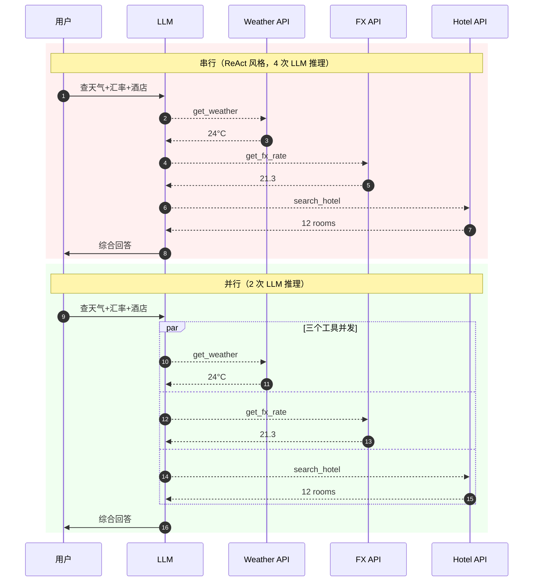

<section class="doc-hero">
  <p class="doc-hero__kicker">工具调用</p>
  <h1>并行工具调用</h1>
  <p class="doc-hero__lead">用户问"对比 A 和 B"，模型本可以一次发起两个 tool_calls 同时跑——串行就是把延迟翻倍交给用户。</p>
  <div class="doc-hero__meta" aria-label="本文信息">
    <span>适合阶段：进阶 / 生产</span>
    <span>核心：一次响应多个 tool_calls + 并发执行</span>
    <span>面试重点：ID 配对、依赖判断、部分失败处理</span>
  </div>
</section>

## 面试官想考什么

读完这篇你要能正面回答下面这些题。每题后面括号里是面试官真正想看你答出什么。

<div class="interview-grid">
  <div>
    <strong>模型怎么决定要不要并行调用？是规则还是训练出来的？</strong>
    <span>考你能不能讲清"并行决策"不是 prompt 能强控的。</span>
  </div>
  <div>
    <strong>OpenAI / Anthropic / Google 三家的并行 function calling 协议有什么差别？</strong>
    <span>考三家 API 细节，能不能讲出 tool_calls 数组 vs content block 的区别。</span>
  </div>
  <div>
    <strong>并行 tool_calls 的 ID 配对是怎么实现的？返回顺序错了会怎样？</strong>
    <span>考协议本质，ID 是配对锚点不是顺序锚点。</span>
  </div>
  <div>
    <strong>并行调用中一个工具失败了怎么办？要全部回滚吗？</strong>
    <span>考部分失败的工程处理，不是非黑即白的答案。</span>
  </div>
  <div>
    <strong>怎么强制模型不要并行？怎么强制并行？</strong>
    <span>考 parallel_tool_calls 参数的存在与边界。</span>
  </div>
  <div>
    <strong>asyncio.gather 一个 task 抛异常会怎样？怎么避免拖垮整个 batch？</strong>
    <span>考 Python 并发的细节，return_exceptions 的用法。</span>
  </div>
  <div>
    <strong>模型把"先建文件夹再写文件"这种有依赖的操作并行调了，怎么办？</strong>
    <span>考反模式识别，依赖判断的责任在哪里。</span>
  </div>
  <div>
    <strong>实测并行能省多少延迟？什么场景收益最大？</strong>
    <span>考工程感觉，能给具体数字。</span>
  </div>
</div>

---

## 为什么需要并行工具调用

考虑一个真实的旅行助手场景。用户问：

> "我下周三从北京飞东京，那天东京天气怎么样？汇率多少？酒店帮我看看有没有空房？"

模型要调三个工具：`get_weather("Tokyo", "2025-06-04")`、`get_fx_rate("CNY", "JPY")`、`search_hotel("Tokyo", "2025-06-04")`。这三个调用之间**没有任何依赖关系**——汇率不影响天气、天气不影响酒店搜索。

**串行版本**（ReAct 风格，一次只能一个 Action）：

```
turn 1: Thought + Action: get_weather(...)  → 等待 1.2s → Observation
turn 2: Thought + Action: get_fx_rate(...)  → 等待 0.4s → Observation
turn 3: Thought + Action: search_hotel(...) → 等待 2.1s → Observation
turn 4: Thought + Answer
总延迟 = 1.2 + 0.4 + 2.1 + 4 次 LLM 推理（每次约 0.8s）≈ 6.9s
```

**并行版本**（模型一次返回 3 个 tool_calls）：

```
turn 1: 模型生成 3 个 tool_calls
       → 三个工具同时跑，max(1.2, 0.4, 2.1) = 2.1s
turn 2: 模型生成 Answer
总延迟 = 2.1 + 2 次 LLM 推理 ≈ 3.7s
```

省了 **46% 的端到端延迟**——而且省的越多用户感知越强（用户对 1s 内的差异敏感度低，对 3s+ 的等待非常敏感）。这就是为什么 OpenAI 在 2023 年 11 月 DevDay 推出 parallel function calling 时，把它作为"开发者体验提升"的核心特性之一。

延迟之外还有一个不那么明显的收益：**减少 LLM 推理次数**。串行 3 个工具需要 4 次完整推理（每次都要把全部历史和 tool result 喂回模型），并行只需 2 次。在 GPT-4 级别的模型上，每次推理 input 部分 5-10K token，4 次 → 2 次省的 token 不是小数。

> 串行的本质问题在 [ReAct 模式](../prompt/react)里已经讲清楚——三段式约定了"单步只能一个 Action"。并行 function calling 是 ReAct 的现代扩展：把"一步一个动作"放宽成"一步多个独立动作"，但保留"动作之间有依赖时仍然串行"的语义。

---

## 协议怎么设计：一次响应多个 tool_calls

并行的本质是**让一次模型响应里能携带多个工具调用**。三家 API 走了不同的设计路径，但都解决同样的问题。

### OpenAI：tool_calls 数组

OpenAI 的 assistant message 里有一个 `tool_calls` 字段，**它本身就是数组**——单工具时长度为 1，并行时长度大于 1。每个 tool_call 有独立的 `id`：

```json
{
  "role": "assistant",
  "content": null,
  "tool_calls": [
    {
      "id": "call_abc123",
      "type": "function",
      "function": {"name": "get_weather", "arguments": "{\"city\": \"Tokyo\"}"}
    },
    {
      "id": "call_def456",
      "type": "function",
      "function": {"name": "get_fx_rate", "arguments": "{\"from\": \"CNY\", \"to\": \"JPY\"}"}
    },
    {
      "id": "call_ghi789",
      "type": "function",
      "function": {"name": "search_hotel", "arguments": "{\"city\": \"Tokyo\"}"}
    }
  ]
}
```

返回结果时，**每个 tool_call 的结果是一条独立的 message**，通过 `tool_call_id` 配对：

```json
[
  {"role": "tool", "tool_call_id": "call_abc123", "content": "Tokyo: 24°C, sunny"},
  {"role": "tool", "tool_call_id": "call_def456", "content": "1 CNY = 21.3 JPY"},
  {"role": "tool", "tool_call_id": "call_ghi789", "content": "12 hotels available"}
]
```

**顺序无关**——只要 ID 配对正确，messages 数组里 tool 消息的顺序可以任意。

控制开关：请求里加 `parallel_tool_calls: false` 强制串行（一次只返回一个 tool_call）。`true` 是默认值。

### Anthropic：多个 tool_use content block

Anthropic 的 message 内容本来就是 **content blocks 数组**（不像 OpenAI 那样 content 是单一字符串）。所以"并行"在 Claude 这里是自然的：assistant message 的 content 里可以包含多个 `tool_use` block：

```json
{
  "role": "assistant",
  "content": [
    {"type": "text", "text": "我并行查询三个信息。"},
    {
      "type": "tool_use",
      "id": "toolu_01ABC",
      "name": "get_weather",
      "input": {"city": "Tokyo"}
    },
    {
      "type": "tool_use",
      "id": "toolu_01DEF",
      "name": "get_fx_rate",
      "input": {"from": "CNY", "to": "JPY"}
    },
    {
      "type": "tool_use",
      "id": "toolu_01GHI",
      "name": "search_hotel",
      "input": {"city": "Tokyo"}
    }
  ]
}
```

返回时所有 `tool_result` block 必须放在**同一条 user message** 里（这是和 OpenAI 最大的协议差异）：

```json
{
  "role": "user",
  "content": [
    {"type": "tool_result", "tool_use_id": "toolu_01ABC", "content": "Tokyo: 24°C"},
    {"type": "tool_result", "tool_use_id": "toolu_01DEF", "content": "1 CNY = 21.3 JPY"},
    {"type": "tool_result", "tool_use_id": "toolu_01GHI", "content": "12 hotels"}
  ]
}
```

如果你把三个 tool_result 拆成三条 user message 发回去，Claude 会报错。这个坑很多人踩。

控制开关：Anthropic 默认就会并行调用（当模型判断可以的时候）。要禁用并行，在 tool_choice 里加 `"disable_parallel_tool_use": true`。

### Google Gemini：functionCalls 数组

Gemini 的 candidate 响应里直接给一个 `functionCalls` 数组（部分 SDK 也暴露成 part 列表）：

```json
{
  "candidates": [{
    "content": {
      "parts": [
        {"functionCall": {"name": "get_weather", "args": {"city": "Tokyo"}}},
        {"functionCall": {"name": "get_fx_rate", "args": {"from": "CNY", "to": "JPY"}}}
      ]
    }
  }]
}
```

Gemini 的 function call **没有显式 ID 字段**——这是它和前两家最大的差别。配对靠**顺序 + 函数名**：返回 `functionResponse` 时按相同顺序和函数名给回去。这种设计对开发者来说更易写错（顺序错乱就崩），所以 Google 的官方 SDK 内部帮你维护顺序，但裸调 REST 要小心。

### 三家对比表

| 维度 | OpenAI | Anthropic | Google Gemini |
|---|---|---|---|
| **承载结构** | `tool_calls` 数组字段 | `content` 里多个 `tool_use` block | `parts` 里多个 `functionCall` |
| **ID 字段** | `id`（如 `call_xxx`） | `id`（如 `toolu_xxx`） | 无显式 ID，靠顺序+函数名 |
| **结果回传** | 每个 tool_call 一条 tool message | 一条 user message 包多个 tool_result | 一组 functionResponse parts |
| **最大并行数** | 实测可到 10+，无硬上限文档 | 实测可达 10+，无硬上限文档 | 同上 |
| **默认是否并行** | 默认开启 | 默认开启 | 默认开启 |
| **强制串行** | `parallel_tool_calls=false` | `tool_choice.disable_parallel_tool_use=true` | 无直接开关，靠 prompt 约束 |
| **strict mode** | `strict: true` 可禁用并行（早期版本） | — | — |
| **配对要求** | tool_call_id 一一对应，顺序无关 | tool_use_id 一一对应，必须在同一 message | 顺序+函数名匹配 |

三家都是 2023 年 11 月 - 2024 年初推出并行支持。底层思路相同——**让响应能携带多个独立调用**——但把它放在协议的哪一层差别很大。OpenAI 把它做成一等公民字段，Anthropic 复用了 content block 数组结构，Gemini 走最简单的 parts 列表。

---

## 模型怎么决定要不要并行

这是面试常问的"哲学题"。先说结论：**并行决策是模型在训练中学到的，没有明确开关让你控制具体策略**。

训练侧 OpenAI/Anthropic 在 RLHF 阶段喂过大量"用户问题 → 多个独立调用"的示例，模型学会识别"这几个动作彼此独立可以同时做"。但模型不是规则系统——它是基于概率判断的。同一个问题，温度参数稍微一变可能就从并行变成串行。

经验上模型容易并行的信号：
- 用户一句话里有明显的多个并列子问题（"查 A 和 B"、"对比 X 和 Y"、"分别帮我..."）
- 工具描述里相互独立（function 名字不同领域、参数无重叠）
- system prompt 明确鼓励并行（"For multiple independent tasks, call tools in parallel"）

模型容易串行的信号：
- 用户表述有时序词（"先...再..."、"然后"、"接着"）
- 工具之间在过去对话中出现过依赖关系（A 的输出是 B 的输入）
- function 名字本身暗示顺序（`create_folder` + `write_file`）

**强制并行**做不到。即使你在 prompt 里写"请并行调用"，模型仍可能根据它对任务的理解输出单个 tool_call。

**强制串行**做得到——三家都有相应开关。生产里通常在以下场景强制串行：
- 工具之间有依赖你不想交给模型判断
- 工具内部状态有冲突（如两个调用都要写同一个文件）
- 调试期想看清模型每一步的决策过程

---

## 串行 vs 并行的时序差异



省的是**两份成本**：(1) 工具执行从 sum 变成 max；(2) LLM 推理次数从 n+1 次降到 2 次。

---

## 实战：用 asyncio 并发执行 + ID 配对 + 错误处理

下面是生产可用的 OpenAI 并行 function calling demo。重点在三件事：**正确解析多 tool_calls、并发执行、按 ID 配对回传结果**。

```python
import asyncio
import json
import os
from openai import AsyncOpenAI

client = AsyncOpenAI(api_key=os.environ["OPENAI_API_KEY"])

# 模拟三个工具——分别有不同延迟，演示并行的价值
async def get_weather(city: str, date: str) -> str:
    await asyncio.sleep(1.2)  # 假设 1.2s 网络延迟
    return f"{city} on {date}: 24°C, sunny"

async def get_fx_rate(src: str, dst: str) -> str:
    await asyncio.sleep(0.4)
    return f"1 {src} = 21.3 {dst}"

async def search_hotel(city: str, date: str) -> str:
    await asyncio.sleep(2.1)
    if city == "":  # 演示参数错误时的失败
        raise ValueError("city is required")
    return f"{city} on {date}: 12 hotels available"

# 工具注册表——异步函数即可
TOOLS = {
    "get_weather": get_weather,
    "get_fx_rate": get_fx_rate,
    "search_hotel": search_hotel,
}

TOOL_SCHEMAS = [
    {"type": "function", "function": {
        "name": "get_weather",
        "description": "Get weather for a city on a specific date",
        "parameters": {"type": "object", "properties": {
            "city": {"type": "string"}, "date": {"type": "string"}
        }, "required": ["city", "date"]},
    }},
    {"type": "function", "function": {
        "name": "get_fx_rate",
        "description": "Get exchange rate from src currency to dst currency",
        "parameters": {"type": "object", "properties": {
            "src": {"type": "string"}, "dst": {"type": "string"}
        }, "required": ["src", "dst"]},
    }},
    {"type": "function", "function": {
        "name": "search_hotel",
        "description": "Search available hotels in a city on a specific date",
        "parameters": {"type": "object", "properties": {
            "city": {"type": "string"}, "date": {"type": "string"}
        }, "required": ["city", "date"]},
    }},
]

async def execute_one(tool_call) -> dict:
    """执行单个 tool_call——必须返回带 tool_call_id 的结果，否则配不上。"""
    name = tool_call.function.name
    try:
        args = json.loads(tool_call.function.arguments)
        fn = TOOLS.get(name)
        if fn is None:
            content = f"ERROR: unknown tool {name}"
        else:
            content = await fn(**args)
    except json.JSONDecodeError as e:
        # 模型偶尔会输出非法 JSON——必须当作工具失败回传，不能让整个 batch 崩
        content = f"ERROR: invalid arguments JSON: {e}"
    except Exception as e:
        # 工具本身抛错（业务逻辑、网络、参数）也要捕获——告诉模型而不是抛给上游
        content = f"ERROR: {type(e).__name__}: {e}"
    return {
        "role": "tool",
        "tool_call_id": tool_call.id,  # 关键：配对锚点
        "content": str(content),
    }

async def run_agent(question: str) -> str:
    messages = [
        {"role": "system", "content": "You can call multiple tools in parallel when they are independent."},
        {"role": "user", "content": question},
    ]
    for step in range(5):  # 最多 5 轮 tool 调用
        resp = await client.chat.completions.create(
            model="gpt-4o",
            messages=messages,
            tools=TOOL_SCHEMAS,
            # parallel_tool_calls=True,  # 默认就是 True，写出来强调
        )
        msg = resp.choices[0].message
        messages.append(msg.model_dump(exclude_none=True))

        if not msg.tool_calls:
            return msg.content  # 模型给出了最终答案

        # 关键：用 asyncio.gather 真正并发执行所有 tool_calls
        # return_exceptions=True → 单个 task 抛错不影响其它任务的执行
        results = await asyncio.gather(
            *[execute_one(tc) for tc in msg.tool_calls],
            return_exceptions=False,  # 我们在 execute_one 里已捕获，这里不会有异常逃出来
        )
        messages.extend(results)  # 顺序无关，但每条都有 tool_call_id 配对

    return "exceeded max steps"

if __name__ == "__main__":
    import time
    start = time.time()
    ans = asyncio.run(run_agent(
        "我下周三从北京飞东京，那天东京天气怎么样？人民币兑日元汇率多少？酒店有空房吗？"
    ))
    print(f"\nAnswer: {ans}\nElapsed: {time.time() - start:.2f}s")
```

这段代码三个工程要点：

**1. `asyncio.gather` 才是真并发**。如果你写 `for tc in tool_calls: result = await execute_one(tc)`——这是串行，跟没并行一样。`gather(*tasks)` 同时启动所有任务、并发等待。

**2. `execute_one` 内部把所有异常吞掉**变成 ERROR 字符串。理由后面"失败处理"小节展开——这是并行场景的关键设计。

**3. `tool_call_id` 必须原样回填**。错位的代价是模型把"汇率"的结果当成"天气"——后续推理全错。

实测延迟（gpt-4o + 三个工具，工具延迟 1.2/0.4/2.1s）：
- 串行：6.5s（每次推理 0.7s + 工具 sum 3.7s）
- 并行：4.0s（两次推理 1.4s + 工具 max 2.1s）
- **省 38%**

工具越多、单工具延迟差异越大，并行收益越显著。我见过的最极端案例：12 个独立 RAG 查询并行（每个 1-3s），从 22s 降到 3.5s，省 84%。

---

## 并行场景的失败处理

并行最难的不是怎么发起，而是**一个失败时怎么办**。三种策略：

### 策略 A：部分失败照常回传，让模型决定

把失败的 tool_call 也包装成一条 `tool` message（content 写错误信息），和成功的一起喂回模型。模型看到"weather 成功、fx 成功、hotel 失败"会自己判断要不要重试、或者基于现有信息回答用户。

这是**最常见的生产策略**。原因：
- 实现简单（用上面的 `execute_one` try/except 模式）
- 模型有上下文，比你的硬编码逻辑更灵活
- 部分结果对用户也有价值（"汇率和天气是这样，酒店暂时查不到"）

```python
# 在 messages 里这样回传
[
    {"role": "tool", "tool_call_id": "call_1", "content": "Tokyo: 24°C"},
    {"role": "tool", "tool_call_id": "call_2", "content": "1 CNY = 21.3 JPY"},
    {"role": "tool", "tool_call_id": "call_3", "content": "ERROR: hotel API timeout after 5s"},
]
```

### 策略 B：全部回滚

适用于"几个调用其实是一个原子操作的多个 part"的场景。比如：模型并行调了 `transfer_from(A, 100)` + `transfer_to(B, 100)`——任何一个失败都要回滚另一个。

但这种情况其实**说明工具设计有问题**：原子操作不该拆成两个调用让模型并行。正确做法是设计一个 `transfer(A, B, 100)` 工具，把原子性收在工具内部。

### 策略 C：失败重试 + 拒绝继续

对幂等读操作（GET 类）：单个失败可以重试 1-2 次再降级。对写操作：失败就停下，明确告诉模型"操作 X 失败，不再继续"，让它走错误处理路径。

```python
async def execute_one_with_retry(tool_call) -> dict:
    for attempt in range(3):
        try:
            return await execute_one_impl(tool_call)
        except (TimeoutError, ConnectionError) as e:  # 只重试瞬时错误
            if attempt == 2:
                return {"role": "tool", "tool_call_id": tool_call.id,
                        "content": f"ERROR after 3 retries: {e}"}
            await asyncio.sleep(0.5 * (2 ** attempt))  # 指数退避
        except ValueError as e:  # 参数错不重试
            return {"role": "tool", "tool_call_id": tool_call.id,
                    "content": f"ERROR: {e}"}
```

具体的重试策略、超时、熔断设计见 [错误处理与重试](./error-handling)。本文只强调一个点：**并行场景下重试要小心放大效应**——如果三个调用都失败重试 3 次，实际上你打了 9 次后端请求，下游 API 可能直接被你限流。

### asyncio.gather 的陷阱

```python
# ❌ 错误用法：return_exceptions=False（默认）
results = await asyncio.gather(t1, t2, t3)
# 如果 t1 抛异常：
#   - gather 立即返回那个异常
#   - 但 t2 和 t3 仍在后台跑（gather 并不会自动取消它们！）
#   - 你失去了 t2/t3 的结果（即使它们成功）
#   - 同时 t2/t3 还在烧后端资源
```

```python
# ✅ 推荐用法 1：return_exceptions=True
results = await asyncio.gather(t1, t2, t3, return_exceptions=True)
# 任何 task 的异常都被打包成结果元素，不会中断其它 task
# results = [result_of_t1, ExceptionInstance, result_of_t3]
# 你需要遍历检查每个 result 是不是 Exception 实例
```

```python
# ✅ 推荐用法 2：在每个 task 内部 try/except
# 像本文 execute_one 那样，让异常变成业务结果（content=ERROR）
# gather 收到的全是正常结果，逻辑最清晰
results = await asyncio.gather(*[execute_one(tc) for tc in tool_calls])
```

生产代码我推荐用法 2——把错误处理逻辑收在工具执行层，gather 调用层就不用关心异常分支。

---

## 容易踩的坑

### 陷阱 1：tool_call_id 错位

**现象**：模型给出的答案看起来"颠倒"——它说"东京今天 12 间空房"、"汇率是 24°C"。
**根因**：你在并发执行后用 `for idx, result in enumerate(results)` 重新组装时，按工具调用顺序填了 id，而不是从 tool_call 自带的 id 取。
**修法**：永远用 `tool_call.id` 作为 `tool_call_id`，不要自己生成。本文示例代码里 `execute_one` 直接读 `tool_call.id` 就是为了避免这类错误。

### 陷阱 2：Anthropic 把 tool_results 拆成多条 user message

**现象**：调 Anthropic API 报 `tool_result block(s) provided when previous message does not contain any tool_use blocks` 或类似错误。
**根因**：Anthropic 协议要求**所有 tool_result 必须在同一条 user message 的 content 数组里**。OpenAI 习惯（每个 tool_call_id 一条 tool message）直接搬过来就会崩。
**修法**：换成 Anthropic 协议时统一打包：

```python
# Anthropic 风格
messages.append({
    "role": "user",
    "content": [
        {"type": "tool_result", "tool_use_id": r["id"], "content": r["content"]}
        for r in results
    ],
})
```

### 陷阱 3：模型把有依赖的操作并行调了

**现象**：用户让"在 /tmp/x 下建个文件夹叫 y、把 hello 写进 y/a.txt"。模型一次返回两个 tool_calls：`mkdir("/tmp/x/y")` + `write_file("/tmp/x/y/a.txt", "hello")`。并行执行 → write_file 在 mkdir 完成前跑，崩。
**根因**：模型对工具语义的依赖判断不可靠——尤其当工具描述里没说清"必须先建文件夹"。
**修法**：
- **首选：让工具自己处理依赖**（`write_file` 内部自动 mkdir -p）。这把"依赖判断"从模型移到代码，可靠性提升一个数量级。
- 其次：在 system prompt 里加约束"文件系统操作必须严格串行"。但这是 best-effort，模型仍可能违反。
- 再次：对涉及写操作的工具，在请求里设 `parallel_tool_calls=false`。代价是丢失其它独立工具的并行收益。

### 陷阱 4：模型把"本该一次调用"的拆成多次并行

**现象**：用户问"查 user_1、user_2、user_3 的信息"。模型并行调了 `get_user(1)` + `get_user(2)` + `get_user(3)`——每次都打一次后端。
**根因**：工具设计粒度太细。如果你的工具是 `get_user(id)`，模型只能这样调。
**修法**：为批量操作设计 `get_users(ids: list[str])`——一次调用解决。把"批量优化"从模型移到工具语义。一个经验法则：**任何"按 ID 查"的工具都应该同时提供 `get_x(id)` 和 `get_xs(ids)` 两个版本，让模型自然选后者**。

### 陷阱 5：并发限流被打爆

**现象**：本地测试一切正常，上线后下游 API 频繁返回 429 Rate Limit。
**根因**：单用户并行 5 个工具看似不多，但 100 个并发用户 × 5 工具 = 500 QPS 同时打到下游。下游 API 没准备好。
**修法**：在工具层加 **semaphore 限流**：

```python
WEATHER_SEM = asyncio.Semaphore(50)  # 全局最多 50 个并发 weather 调用

async def get_weather_limited(city, date):
    async with WEATHER_SEM:
        return await get_weather(city, date)
```

或者用 token bucket / leaky bucket 库（如 `aiolimiter`）。关键认知：**并行 function calling 让前端用户感受不到延迟，但后端的并发压力是实打实增加的**——容量规划要按"用户数 × 平均并行度"算。

### 陷阱 6：把 asyncio.gather 用在同步代码上

**现象**：写了个并发版本，实测延迟和串行一样。
**根因**：工具函数是同步的（普通 `def`，不是 `async def`），`asyncio.gather` 调度它们时实际只能一个个跑。
**修法**：
- 工具本身用 async HTTP 库（`httpx.AsyncClient`、`aiohttp`），不要用 `requests`
- 必须用同步代码时，用 `asyncio.to_thread`（Python 3.9+）或 `loop.run_in_executor` 把它丢到线程池

```python
# 同步函数想并发，用 to_thread 包装
result = await asyncio.to_thread(sync_function, *args)
```

---

## 反模式总结

| 反模式 | 表象 | 根因 |
|---|---|---|
| 模型并行了有依赖的工具 | mkdir+write 同时跑，write 崩 | 工具语义不收依赖，模型判断不可靠 |
| 把批量拆成多次单独调用 | 5 个 get_user 调用替代 1 个 get_users | 工具粒度设计太细 |
| tool_call_id 错位 | 模型输出张冠李戴 | 自己生成 id 而不是用 tool_call.id |
| gather 无 return_exceptions | 一个 task 失败拖死整个 batch | 默认行为是 fail-fast |
| 同步工具放进 asyncio.gather | 实测延迟和串行一样 | 阻塞调用没有真正并发 |
| 并发限流被打爆 | 上线后下游 429 | 没有 semaphore，并发度随用户线性放大 |

---

## 并行 vs 串行：什么时候选哪个

| 场景 | 推荐 | 理由 |
|---|---|---|
| 用户问题里有多个独立子问题（"查 A 和 B"） | 并行 | 延迟收益最明显 |
| 工具间有显式依赖（A 的输出做 B 的输入） | 串行 | 并行会拿到错数据 |
| 涉及写操作的多步流程 | 串行 | 副作用顺序敏感 |
| 大量同类查询（多个 RAG / 多个 user 查询） | 并行（且工具应该是 batch 版） | 延迟省得最多 |
| Debug 期 / 可解释性需求 | 串行 | 每步 Thought 独立可读 |
| 模型并行准确率不高（小模型、未对齐模型） | 串行 | 减少模型判断负担 |
| 下游 API 限流紧张 | 串行 + 全局限流 | 控制并发度 |

更高维度的工具调用错误处理策略（重试、降级、熔断）见 [错误处理与重试](./error-handling)。工具协议层的基础参考 [Function Calling 规范](./function-calling)，跨服务工具调用的标准化见 [MCP 协议详解](./mcp)。Agent 架构层面如何把并行工具纳入主循环见 [Agent ReAct 模式](../agent/react-pattern)。

---

## 面试题深度解析

### Q: 模型怎么决定要不要并行调用？是规则还是训练？

**30 秒版本**：训练。OpenAI/Anthropic 在 RLHF 阶段喂过大量"独立任务并行调用"的样本，模型在 token 级别学会了在适当时机一次性输出多个 tool_call。这不是规则系统——你不能在 prompt 里写"必须并行"来强制，模型仍会根据它对任务的理解决定。但你可以加引导（"For multiple independent tasks, you may call tools in parallel"），实测能显著提升并行率。**强制并行做不到，强制串行做得到**（`parallel_tool_calls=false` / `disable_parallel_tool_use=true`）。

**追问 1**：那一个 prompt 调用三次，并行/串行的输出可能不一样吗？
可能。温度参数不为 0 时，每次输出的 tool_calls 数量都可能不同。生产里如果你强依赖某种行为（比如想统计性能），要么 `temperature=0` 锁定，要么 evaluate 多次取概率分布。

**追问 2**：那能不能 fine-tune 自己的模型来更激进地并行？
可以。开源模型（Qwen、Llama）只要喂"用户问题 → 多 tool_call 输出"的训练样本，并行倾向会提升。但要小心**过度并行**——模型可能把有依赖的工具也并行了。这是为什么 OpenAI/Anthropic 在训练数据上下了功夫平衡。

### Q: 并行 tool_calls 的 ID 配对是怎么实现的？返回顺序错了会怎样？

**30 秒版本**：每个 tool_call 在生成时就被分配一个唯一 ID（`call_xxx` for OpenAI、`toolu_xxx` for Anthropic）。返回结果时用 `tool_call_id` 字段把结果绑到 tool_call 上。**顺序无关**——模型在拼装 message 历史时是按 ID 找对应结果，不是按位置。你可以把汇率结果放第一条、天气放第二条，只要 ID 对得上就 OK。但 Anthropic 有个额外约束：所有 tool_result 必须在**同一条 user message** 的 content 数组里，不能拆成多条 message。

**追问**：那如果我故意把 ID 串了（call_1 的 tool_call_id 填了 call_2 的内容），模型会怎样？
模型会把"call_1 工具应该返回的内容"和"call_2 实际返回的内容"绑错——后续推理基于错绑的数据，输出错答案。这种错误最难 debug，因为协议层不会报错（ID 字符串本身有效），只是语义错位。这是为什么我在示例代码里反复强调"用 tool_call.id 原样回填"——避免在中间环节生成新 ID。

### Q: 并行中一个工具失败了怎么办？

**30 秒版本**：生产里最常见的是**部分失败照常回传**——把失败的 tool_call 也包装成一条 tool message（content 写错误信息），和成功结果一起喂回模型。模型有上下文，会决定要不要重试、降级、还是基于部分结果回答。**回滚策略**只适用于"几个调用本质是一个原子操作"的场景，但这通常说明工具设计有问题——原子性应该收在单个工具内部，而不是让模型并行触发多个调用再回滚。

**追问 1**：怎么避免一个失败拖死整个 batch？
两个层面：(1) asyncio 层用 `return_exceptions=True` 或者在每个 task 内部 try/except，**不要让异常逃出 gather**；(2) 业务层不要"全有或全无"——并行的本质就是"独立调用同时跑"，独立意味着部分失败应该是常态。

**追问 2**：那如果失败的是"必要数据"（比如汇率没拿到，用户根本不能回答）？
让模型自己判断。在错误信息里写清楚"FX rate unavailable, please ask user to retry or use cached rate"，模型读到这个会决定下一步——可能是道歉、可能是重试、可能是基于部分信息回答。这比硬编码"必要数据失败 → 直接报错给用户"灵活得多。但如果业务确实有硬约束（金融交易），那应该在工具层级别就强制串行 + 严格校验，不要靠并行。

### Q: asyncio.gather 一个 task 抛异常会怎样？

**30 秒版本**：默认行为（`return_exceptions=False`）下 gather 立即返回第一个异常，但**其它 task 仍在后台跑**——gather 不会自动取消它们。结果是你丢失了其它 task 的结果，同时它们仍在烧后端资源。这是 Python 异步编程的经典坑。解决方法两个：(1) `gather(..., return_exceptions=True)`，让异常变成结果元素之一，遍历时检查是不是 Exception 实例；(2) 在每个 task 内部 try/except 把异常变成业务结果（如本文 execute_one 模式）——gather 收到的全是正常结果，逻辑最清晰。

**追问**：那要真正取消其它 task 怎么办？
用 `asyncio.TaskGroup`（Python 3.11+）——它的语义是"一个失败就取消所有同组任务"。对于"要么全成要么全不成"的场景比 gather 合适。但对于工具调用场景，通常你不希望全部取消——部分结果有价值。所以 gather + return_exceptions 是更常见的选择。

```python
# TaskGroup 写法（Python 3.11+）
async with asyncio.TaskGroup() as tg:
    tasks = [tg.create_task(execute_one(tc)) for tc in tool_calls]
# 任一失败 → 其它自动取消 → 整个 TaskGroup 抛 ExceptionGroup
```

---

## 延伸阅读

- **官方文档：OpenAI Function Calling** ([platform.openai.com/docs/guides/function-calling](https://platform.openai.com/docs/guides/function-calling))
  完整的 `parallel_tool_calls` 参数说明、tool_call_id 协议、strict mode 行为。生产里调 OpenAI 之前必读。

- **官方文档：Anthropic Tool Use** ([docs.anthropic.com/en/docs/build-with-claude/tool-use](https://docs.anthropic.com/en/docs/build-with-claude/tool-use))
  Claude 并行调用的 content block 设计、`disable_parallel_tool_use` 参数、所有 tool_result 同一条 user message 的强约束。

- **官方文档：Google Gemini Function Calling** ([ai.google.dev/gemini-api/docs/function-calling](https://ai.google.dev/gemini-api/docs/function-calling))
  Gemini 的 functionCalls/functionResponses 协议、无 ID 配对的设计选择。理解三家协议差异必读。

- **OpenAI DevDay 2023 — Parallel Function Calling announcement** ([openai.com/index/new-models-and-developer-products-announced-at-devday](https://openai.com/index/new-models-and-developer-products-announced-at-devday/))
  原始发布博客。把并行 function calling 作为"开发者体验提升"的旗舰特性，理解产品哲学。

- **Python docs: asyncio.gather** ([docs.python.org/3/library/asyncio-task.html#asyncio.gather](https://docs.python.org/3/library/asyncio-task.html#asyncio.gather))
  `return_exceptions` 参数的精确语义、异常时其它 task 行为。生产并发代码必读的官方说明。

- **Python docs: asyncio.TaskGroup** ([docs.python.org/3/library/asyncio-task.html#asyncio.TaskGroup](https://docs.python.org/3/library/asyncio-task.html#asyncio.TaskGroup))
  Python 3.11+ 的 structured concurrency 实现，"一失败全取消"语义。对原子组操作更合适。

- **博客：Anthropic — How to use tools with Claude** ([anthropic.com/news/tool-use-ga](https://www.anthropic.com/news/tool-use-ga))
  Anthropic tool use GA 公告，含 Claude 在并行决策上的训练经验讨论。

- **配套阅读**：[Function Calling 规范](./function-calling) — 单工具协议的基础；[错误处理与重试](./error-handling) — 重试/降级/熔断通用策略；[MCP 协议详解](./mcp) — 跨服务工具调用标准；[ReAct Prompt 模式](../prompt/react) — "单步一个 Action"的串行起点；[Agent ReAct 模式](../agent/react-pattern) — Agent 主循环如何整合并行工具。
