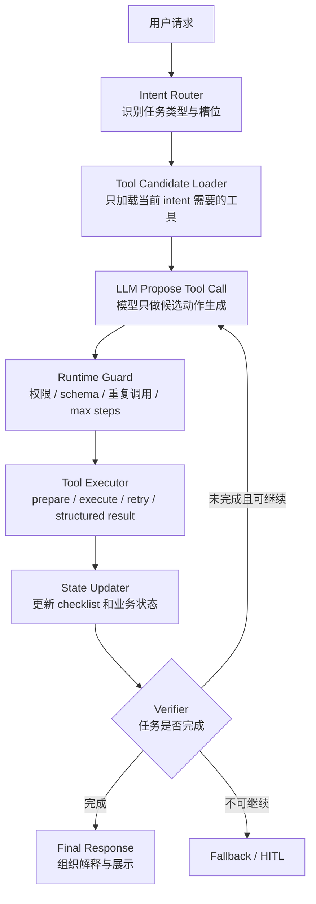

<section class="doc-hero">
  <p class="doc-hero__kicker">匿名真实面经</p>
  <h1>工具调用死循环面试深挖：别只答 max_steps</h1>
  <p class="doc-hero__lead">Agent 一直调工具，不是模型“笨”，通常是你把太多决策权塞进了同一个 loop。</p>
  <div class="doc-hero__meta" aria-label="本文信息">
    <span>适合阶段：Agent 工程师 / 平台面</span>
    <span>核心能力：Tool Routing · State Machine · Loop Guard · Verifier</span>
    <span>脱敏原则：只保留工程方法，不保留项目细节</span>
  </div>
</section>

> 工具调用死循环的表象是“模型重复调用”，根因往往是工具集过大、决策边界混乱、状态不可见、终止条件缺失。

> **本文边界**：这篇是面试追问型文章，聚焦“为什么 Agent 在工具调用阶段反复绕圈，以及怎么从架构上切断”。函数调用协议见 [Function Calling](./function-calling)，schema 写法见 [工具 Schema 设计](./schema-design)，工具失败和重试见 [错误处理与重试](./error-handling)，长周期外层循环见 [Loop Engineering](../engineering/loop-engineering)，单 Agent 运行环境见 [Agent Harness](../engineering/harness)。

> **脱敏说明**：本文来自多场 Agent 工程面试里反复出现的工具调用追问。文中不出现公司名、产品名、用户规模、业务指标、内部系统名；案例统一改写成通用“业务工具型 Agent”。

## 面试官想考什么

这组问题考的不是你会不会调 `tools=[...]`，而是你有没有把 Agent 当成一个会失控的生产系统来设计。

<div class="interview-grid">
  <div>
    <strong>你遇到过 Agent 工具调用死循环吗？根因是什么？</strong>
    <span>考你是否只会怪模型，还是能讲出工具选择空间、状态和终止条件。</span>
  </div>
  <div>
    <strong>为什么加 max_steps 不能算真正修复？</strong>
    <span>考你能不能区分“保险丝”和“根因修复”。</span>
  </div>
  <div>
    <strong>工具很多时，为什么不能一次性全塞给模型？</strong>
    <span>考 context engineering：工具召回、按意图加载、namespace 和候选集裁剪。</span>
  </div>
  <div>
    <strong>哪些逻辑应该让模型决定，哪些应该下沉到代码？</strong>
    <span>考确定性边界：日期、卡片、枚举、权限、业务状态不该靠模型猜。</span>
  </div>
  <div>
    <strong>怎么检测“同一个工具同一组参数反复调用”？</strong>
    <span>考工程实现：tool_call fingerprint、状态更新、no-progress detector。</span>
  </div>
  <div>
    <strong>工具调用 loop 和 LangGraph 的递归限制是什么关系？</strong>
    <span>考框架知识：recursion limit 是最后防线，条件边和 END 才是正常终止机制。</span>
  </div>
  <div>
    <strong>如果工具返回 200 但业务失败，为什么也会导致 loop？</strong>
    <span>考 tool_result 设计：业务错误要结构化暴露，而不是伪装成成功数据。</span>
  </div>
  <div>
    <strong>如果现在重做这套工具调用架构，你会怎么设计？</strong>
    <span>考平台抽象：router、registry、executor、guard、trace、eval 能不能串成闭环。</span>
  </div>
</div>

## 为什么“多写两句 prompt”救不了死循环

面试里最常见的浅回答是：

```text
我们会在 prompt 里告诉模型不要重复调用工具，并设置 max_steps，超过次数就停止。
```

这句话没有错，但只能说明你给 loop 加了刹车。刹车不是方向盘。

看一个通用化后的 trace：

```text
User: 帮我记录今天的指标 150/95，再看最近两周趋势。

Step 1  model -> call record_metric(value="150/95", date="today")
        tool  -> {"success": true, "record_id": "r_001"}

Step 2  model -> call get_metric_trend(period="30d")
        tool  -> {"success": true, "trend": "stable", "period": "30d"}

Step 3  model -> call get_metric_trend(period="14d")
        tool  -> {"success": true, "trend": "stable", "period": "14d"}

Step 4  model -> call render_trend_card(card_type="metric_trend")
        tool  -> {"success": true, "card_id": "c_001"}

Step 5  model -> call get_metric_trend(period="14d")
        tool  -> {"success": true, "trend": "stable", "period": "14d"}

Step 6  runtime -> max_steps reached, forced stop
```

表面看是模型在 Step 5 “又调了一遍”。真正的问题有四个：

- `record_metric`、`get_metric_trend`、`render_trend_card` 混在同一个工具候选集里，模型同时负责“办事”和“展示”。
- `period` 到底用 14 天还是 30 天，系统没有在槽位层确定，模型每轮都可能重猜。
- `render_trend_card` 本来是 UI 决策，却被包装成模型可选工具，扩大了选择空间。
- runtime 没有维护 checklist：指标已记录、趋势已获取、卡片已生成，模型看不到“任务已经可以结束”。

所以修复不应该从“再写一条不要重复调用工具”开始，而应该从 **loop 的控制权** 开始：哪些事由模型 propose，哪些事由代码 decide，哪些状态由 runtime 记账。

## 工具调用死循环的五个根因

| 根因 | 线上表现 | 真正要改的层 |
|---|---|---|
| 工具候选集过大 | 模型在相似工具之间来回选 | tool routing / 按意图召回 |
| 决策边界混乱 | 同一轮既调业务工具又选 UI 卡片 | 状态机分层 / 确定性下沉 |
| tool_result 低信号 | 工具明明失败，模型以为可继续 | 结构化返回 / 错误语义 |
| 状态不可见 | 已完成的步骤被重复执行 | runtime state / checklist |
| 终止条件模糊 | 模型不知道什么时候该停 | verifier / conditional edge / max steps |

这五类里，只有最后一类能被 `max_steps` 部分兜住。前四类如果不改，`max_steps` 只会把“无限循环”变成“固定失败”。

## 修法一：把工具调用当成状态机，而不是聊天

工具调用 loop 的核心不是 while 循环，而是状态流转。



面试里可以压成一句话：

```text
我会把工具调用看成状态机：模型只负责提出下一步工具调用，runtime 负责权限、去重、状态更新和终止判断。
```

Anthropic 在 *Building Effective Agents* 里把 agent 描述成“LLM 基于环境反馈使用工具的循环”，同时强调要有停止条件和工具设计；LangGraph 文档也把 loop 的正常终止放在 conditional edge 和 `END` 上，而不是单靠 recursion limit。这两点合起来，就是生产 Agent 的底线：**循环可以开放，终止必须可控**。

## 修法二：按意图加载工具，不要把工具仓库倒进 context

一次性塞 30 个工具给模型，常见后果不是“模型更强”，而是“模型更犹豫”。

```text
坏工具集：
[
  record_metric, update_metric, get_metric, get_metric_trend,
  render_card, render_chart, search_article, send_message,
  summarize_history, get_user_profile, get_plan, create_task,
  ...
]

好工具集（已识别为 metric_record_and_review）：
[
  record_metric,
  get_metric_trend,
  get_user_metric_profile
]
```

工具裁剪不是为了省 token，省 token 只是顺带收益。核心收益是降低选择熵：相似工具少了，模型更容易稳定选中正确动作。

Anthropic 的工具定义文档建议详细写清工具何时使用、何时不使用、参数含义和限制；同一份文档也提醒，相关动作可以合并，跨服务工具要 namespace，避免选择歧义。到 MCP 规模更大的场景，Anthropic 后续又提出用代码执行或 tool search 做 progressive disclosure：不要把所有工具定义一次性压进上下文，而是让 agent 按需发现。

面试答法：

```text
如果工具数量超过十几个，我不会让模型直接在全量工具集里选。
先做 intent routing，再按 intent 加载小工具集；更大规模时做 tool search 或按 namespace 分层加载。
这样减少 token，也减少相似工具互相干扰。
```

## 修法三：确定性逻辑下沉到代码

工具调用死循环最隐蔽的一类根因，是把不该由模型决定的东西包装成工具。

| 决策 | 应该放哪里 | 为什么 |
|---|---|---|
| 今天到最近两周的日期区间 | 代码 | 日期计算是确定性逻辑，模型会受自然语言歧义影响 |
| `period` 合法枚举 | schema / slot validator | 不该让模型在 `14d`、`2w`、`two_weeks` 间摇摆 |
| 是否展示趋势卡片 | 代码 / UI policy | 只要 trend_result 存在就能确定，不需要模型自由选择 |
| 工具权限 | runtime guard | 模型不能决定自己有没有权限 |
| 失败后是否重试 | executor / retry policy | 瞬时错误和确定性错误需要不同策略 |
| 最终解释语气 | 模型 | 这才是模型擅长的开放文本组织 |

这条在面试里很加分，因为它把“模型能力问题”拉回了工程边界：

```text
我不会让模型决定所有事。模型负责理解和表达；确定性计算、权限、卡片、枚举、终止条件由代码掌握。死循环很多时候就是因为这些边界没切开。
```

OpenAI 的 Structured Outputs 文档把 function calling 和 response schema 分开讲：连结构化输出都要区分“调用工具”和“组织响应”，更不用说业务系统里的权限、UI、状态流转。这些都不应该混在一个自由 loop 里。

## 修法四：给 loop 加真正的 guard

`max_steps` 只是第一层。一个生产可用的 loop guard 至少要做四件事：

| Guard | 检测什么 | 触发后怎么做 |
|---|---|---|
| Step limit | 超过最大轮数 | fallback 或 human-in-the-loop |
| Same-call detector | 同一 tool + args 重复调用 | 阻断并告诉模型已有结果 |
| No-progress detector | 多轮没有新增 state | 停止继续工具调用，转最终回答或兜底 |
| Terminal checklist | 必要状态都满足 | 强制进入 final response |

下面是一段可直接运行的最小实现。它不用任何外部库，演示“模型重复调用同一工具时，runtime 怎么在执行前拦住”。

```python
from __future__ import annotations

from dataclasses import dataclass, field
from typing import Any, Callable
import json


@dataclass(frozen=True)
class ToolCall:
    name: str
    args: dict[str, Any]


@dataclass
class ToolResult:
    ok: bool
    data: dict[str, Any] = field(default_factory=dict)
    error_type: str | None = None
    message: str = ""


@dataclass
class LoopState:
    intent: str
    allowed_tools: set[str]
    done: set[str] = field(default_factory=set)
    seen_calls: set[str] = field(default_factory=set)
    no_progress_rounds: int = 0


def fingerprint(call: ToolCall) -> str:
    payload = json.dumps(call.args, ensure_ascii=False, sort_keys=True)
    return f"{call.name}:{payload}"


class LoopGuard:
    def __init__(self, max_steps: int = 6, max_no_progress: int = 2) -> None:
        self.max_steps = max_steps
        self.max_no_progress = max_no_progress

    def check_before_execute(self, step: int, call: ToolCall, state: LoopState) -> ToolResult | None:
        if step > self.max_steps:
            return ToolResult(False, error_type="step_limit", message="工具调用超过上限，停止继续执行。")

        if call.name not in state.allowed_tools:
            return ToolResult(False, error_type="tool_not_allowed", message=f"{call.name} 不在当前意图允许的工具集里。")

        key = fingerprint(call)
        if key in state.seen_calls:
            return ToolResult(False, error_type="duplicate_call", message=f"重复调用被拦截：{key}")

        if state.no_progress_rounds >= self.max_no_progress:
            return ToolResult(False, error_type="no_progress", message="连续多轮没有新增任务状态，停止工具调用。")

        state.seen_calls.add(key)
        return None


class ToolRuntime:
    def __init__(self, tools: dict[str, Callable[[dict[str, Any]], ToolResult]]) -> None:
        self.tools = tools
        self.guard = LoopGuard()

    def route(self, user_text: str) -> LoopState:
        if "记录" in user_text and "趋势" in user_text:
            return LoopState(
                intent="record_and_review_metric",
                allowed_tools={"record_metric", "get_metric_trend"},
            )
        return LoopState(intent="fallback", allowed_tools=set())

    def run(self, user_text: str, policy: Callable[[str, LoopState], ToolCall]) -> str:
        state = self.route(user_text)
        if not state.allowed_tools:
            return "当前请求没有匹配到可执行工具，转人工或给出澄清问题。"

        for step in range(1, self.guard.max_steps + 2):
            if {"metric_recorded", "trend_loaded"} <= state.done:
                return "任务完成：指标已记录，趋势已获取，可以生成最终回复。"

            call = policy(user_text, state)
            blocked = self.guard.check_before_execute(step, call, state)
            if blocked:
                return f"停止工具调用：{blocked.error_type}，{blocked.message}"

            before = set(state.done)
            result = self.tools[call.name](call.args)
            if not result.ok:
                return f"工具失败：{result.error_type}，{result.message}"

            if call.name == "record_metric":
                state.done.add("metric_recorded")
            if call.name == "get_metric_trend":
                state.done.add("trend_loaded")

            state.no_progress_rounds = 0 if state.done != before else state.no_progress_rounds + 1

        return "停止工具调用：step_limit。"


def record_metric(args: dict[str, Any]) -> ToolResult:
    required = {"value", "date"}
    if not required <= args.keys():
        return ToolResult(False, error_type="validation_error", message="缺少 value 或 date。")
    return ToolResult(True, data={"record_id": "r_001"})


def get_metric_trend(args: dict[str, Any]) -> ToolResult:
    if args.get("period") != "14d":
        return ToolResult(False, error_type="validation_error", message="当前场景只允许 period=14d。")
    return ToolResult(True, data={"trend": "stable", "period": "14d"})


def normal_policy(_: str, state: LoopState) -> ToolCall:
    if "metric_recorded" not in state.done:
        return ToolCall("record_metric", {"value": "150/95", "date": "today"})
    return ToolCall("get_metric_trend", {"period": "14d"})


def repeating_policy(_: str, __: LoopState) -> ToolCall:
    return ToolCall("record_metric", {"value": "150/95", "date": "today"})


if __name__ == "__main__":
    runtime = ToolRuntime(
        tools={
            "record_metric": record_metric,
            "get_metric_trend": get_metric_trend,
        }
    )
    print(runtime.run("记录今天的指标 150/95，并看最近两周趋势", normal_policy))
    print(runtime.run("记录今天的指标 150/95，并看最近两周趋势", repeating_policy))
```

这段代码的重点不是模拟一个聪明模型，而是把 runtime 的责任边界写清楚：

- `route()` 先把全量工具集裁成当前 intent 的候选集。
- `LoopGuard` 在执行前做权限、步数、重复调用、无进展检测。
- `LoopState.done` 是 checklist，满足后直接结束，不再问模型“要不要继续”。
- 工具返回 `ToolResult`，业务失败不会伪装成成功。
- 第二次运行会模拟模型重复提出同一个工具调用，guard 在执行前阻断。

这比事后看 trace 再骂模型可靠得多。

## 修法五：用 trace 和 eval 证明“真的修好了”

面试官很可能追问：

```text
你怎么证明死循环问题改善了？只看线上少报错吗？
```

不要只答“观察线上稳定了”。更好的方式是：

| 指标 | 看什么 | 为什么 |
|---|---|---|
| 平均工具轮数 / P95 工具轮数 | 每个 intent 平均调用几次工具 | 死循环会先体现在尾部轮数上 |
| duplicate tool_call rate | 同一 tool + args 重复率 | 直接量化重复调用 |
| tool candidate size | 每轮暴露给模型的工具数量 | 验证工具裁剪有没有生效 |
| task completion pass rate | checklist 是否完成 | 防止“少调工具”导致任务没办成 |
| fallback rate | 被 guard 拦截后有多少进入兜底 | guard 过严会误杀 |
| case-level regression | 老 badcase 是否重新失败 | 修一个 loop 不该引入别的退化 |

如果已经有可观测平台，就把这些挂到 trace/span 上；没有也可以先在日志里记录 `trace_id`、`intent`、`allowed_tools`、`tool_call`、`tool_args_hash`、`tool_result.status`、`done_state`、`stop_reason`。

面试表达：

```text
我会把死循环从一个主观现象变成指标：P95 工具轮数、重复 tool_call rate、guard stop_reason、completion pass rate。修完进入回归集，看老 case 有没有 pass->fail。
```

这和 [Agent 线上质量治理](../engineering/agent-quality-interview) 是同一条线：trace 负责复盘，eval 负责证明，badcase 负责沉淀。

## 容易踩的坑

### 坑一：把 max_steps 当修复方案

**现象**：线上不再无限跑，但用户经常收到“处理失败，请稍后再试”。

**根因**：`max_steps` 只是在循环失控后切断，并没有减少相似工具、没有补状态、没有设置完成条件。

**修法**：保留 `max_steps`，同时补 tool routing、same-call detector、terminal checklist。面试里要说“max_steps 是保险丝，不是修复”。

### 坑二：把 UI 展示也做成模型工具

**现象**：模型在业务工具和卡片工具之间来回切，调完数据又去调卡片，调完卡片又回头查数据。

**根因**：UI policy 本来可以由代码根据结构化结果决定，却被塞进模型选择空间。

**修法**：让模型输出结构化业务结果，前端或后端 renderer 根据结果决定卡片类型。只有真正需要模型判断的展示文案才交给模型。

### 坑三：工具返回太像自然语言

**现象**：工具失败后返回“查询失败了哦”，模型不知道该重试、澄清、换工具还是终止。

**根因**：tool_result 没有错误类型、可重试标记、业务状态。模型只能从一句话里猜。

**修法**：统一返回 `{ok, error_type, retryable, user_action, data}`。错误处理细节见 [工具错误处理](./error-handling)。

### 坑四：把 200 + 业务失败当成功

**现象**：工具返回 HTTP 200，但 `success=false`，模型继续基于空数据或错误状态推理。

**根因**：executor 只看 HTTP 状态，不看业务状态。业务拒绝、权限不足、参数无效都被包装成“成功调用”。

**修法**：工具执行层必须解析业务码。`success=false` 要进入 error branch，而不是把原始 body 直接丢给模型。

### 坑五：工具越拆越细

**现象**：工具越来越多，模型调错率上升，schema 再怎么写都不稳。

**根因**：工具粒度过细，模型需要在一堆相邻动作里做微小选择。选择空间爆炸后，description 再详细也会互相干扰。

**修法**：把高内聚动作合并成一个工具，用 `action` 或清晰 enum 表达子动作；跨领域工具用 namespace；全量工具上来前先做 tool search。

### 坑六：只修 prompt，不改 eval

**现象**：本次 badcase 好了，下次换模型或改 schema 又回来了。

**根因**：死循环 case 没进入回归集，修复没有被固化成测试。

**修法**：每个 loop badcase 都保存为 `(input, expected_tools, forbidden_repeats, expected_stop_reason)`，发布前跑 case-level diff。

## 与相邻概念的区别

| 概念 | 解决的问题 | 和本文的关系 |
|---|---|---|
| Function Calling | 模型如何结构化提出工具调用 | 协议层；协议正确不代表 loop 可控 |
| Tool Schema | 工具怎么描述给模型 | schema 清楚能降低误选，但不能替代状态机 |
| Error Handling | 工具失败后怎么返回、重试、降级 | 处理单次失败；本文处理多轮选择发散 |
| LangGraph Recursion Limit | 图执行超过步数怎么报错 | 防线；真正终止靠 conditional edge 和 END |
| MCP | 工具和上下文的标准接入协议 | MCP 让工具变多，反而更需要工具发现和裁剪 |
| Workflow vs Agent | 固定路径和自主路径怎么取舍 | 工具死循环常见于自主性开太大 |

这一节是面试高频区。可以这样答：

```text
function calling 只是让模型能结构化说“我要调工具”，但没有保证它会调对、会停。
schema 能降低误用，error handling 能处理失败，loop guard 才负责多轮过程不失控。
```

## 面试题深度解析

### Q1：为什么 max_steps 不能算真正修复？

**30 秒版本**：`max_steps` 是保险丝，只能防止无限烧钱。真正修复要减少模型犯错机会：缩小工具候选集、补状态、明确终止条件、把确定性逻辑下沉。

**追问 1：那 max_steps 还要不要？**  
要。生产系统必须有硬上限，但它应该是最后防线。正常路径应该靠 checklist 或条件边结束，而不是每次撞到上限。

**追问 2：怎么设置 max_steps？**  
按 intent 分层。查询类 2-3 步，写入 + 查询类 4-6 步，复杂多工具任务可以更高，但要有 token、时间、重复调用三类独立限制。

### Q2：工具很多时怎么设计？

**30 秒版本**：不要全塞。先按 intent、用户状态、权限和场景做 tool routing，只给模型当前需要的一小组工具；工具规模更大时用 namespace、tool search 或 progressive disclosure。

**追问 1：会不会 route 错导致工具缺失？**  
会，所以 router 也要进 eval。低置信度 route 可以给澄清问题，或加载一个“安全补充工具集”，但不要直接退回全量工具。

**追问 2：工具该合并还是拆分？**  
看模型要不要做微小选择。相邻 CRUD 可以合并成一个带 `action` 的工具；语义差很远、权限不同、副作用不同的动作要拆开。

### Q3：哪些东西应该下沉到代码？

**30 秒版本**：确定性的、可校验的、有权限风险的，都下沉到代码。模型负责理解和表达；日期、枚举、卡片选择、权限、重试、终止条件由 runtime 控制。

**追问 1：下沉太多会不会退化成 workflow？**  
会，所以要看场景。高风险、强 SOP 的任务应该更 workflow；开放探索任务可以给 agent 更多自主性。关键不是 agent 越自主越高级，而是自主性要服务任务。

**追问 2：模型还剩什么价值？**  
模型擅长处理自然语言、意图归纳、参数候选生成和解释文本。把确定性逻辑拿走，不是削弱模型，而是让模型只做它擅长的部分。

### Q4：怎么证明修复有效？

**30 秒版本**：用 trace + eval。trace 记录每轮工具、参数、结果、状态；eval 看 P95 工具轮数、重复调用率、completion pass rate、guard stop_reason 和 case-level regression。

**追问 1：只有线上日志，没有 Langfuse 怎么办？**  
先用结构化日志也可以。关键字段是 `trace_id`、`intent`、`allowed_tools`、`tool_call`、`args_hash`、`done_state`、`stop_reason`。平台不是前提，数据结构才是前提。

**追问 2：重复率下降但 completion 也下降怎么办？**  
说明 guard 可能过严。要同时看任务完成率，不能只追求少调工具。好的修复是“少绕圈但不少办事”。

### Q5：为什么这不是单纯模型选型问题？

**30 秒版本**：更强模型会降低误选概率，但架构给了它过大的选择空间，强模型也会不稳定。拆层、裁剪工具、状态机和 verifier 是跨模型有效的。

**追问 1：换模型还要不要跑评估？**  
要。新模型可能更会用工具，也可能更激进地多调工具。固定评估集能看出 intent、tool args、completion、loop rate 的变化。

**追问 2：面试里怎么表达得不甩锅？**  
说“模型能力影响上限，runtime 决定下限”。这句话能把责任边界说清：模型重要，但生产稳定性不能全押在模型自觉上。

## 延伸阅读

- [Anthropic: Building Effective Agents](https://www.anthropic.com/engineering/building-effective-agents)  
  为什么读：这篇把 workflow 和 agent 的边界讲得很清楚，也明确提到 agent 需要环境反馈、停止条件和工具设计。

- [Anthropic: Tool use with Claude](https://platform.claude.com/docs/en/agents-and-tools/tool-use/overview)  
  为什么读：官方解释 Claude 什么时候决定调用工具、client tool 和 server tool 的差异，以及 tool use loop 怎么跑。

- [Anthropic: Define tools](https://platform.claude.com/docs/en/agents-and-tools/tool-use/define-tools)  
  为什么读：工具描述、namespace、返回高信号结果这些原则，是降低工具误选和循环发散的基础。

- [Anthropic: Writing effective tools for agents](https://www.anthropic.com/engineering/writing-tools-for-agents)  
  为什么读：从工具选择、namespace、工具响应、token 效率讲到 eval，适合补“工具不是越多越好”的工程证据。

- [Anthropic: Code execution with MCP](https://www.anthropic.com/engineering/code-execution-with-mcp)  
  为什么读：当 MCP 工具数量变成几百上千时，为什么要按需加载工具、用代码执行环境过滤中间结果，这篇给了真实架构方向。

- [OpenAI: Function calling](https://platform.openai.com/docs/guides/function-calling)  
  为什么读：看清模型只是生成结构化工具调用，真正执行仍在业务代码；strict schema 能解决格式问题，但不解决 loop 终止问题。

- [OpenAI: Using tools](https://platform.openai.com/docs/guides/tools)  
  为什么读：官方把 web search、MCP、tool search、function calling 放在同一套工具体系里，适合理解“工具访问”已经不只是函数调用。

- [LangGraph: GRAPH_RECURSION_LIMIT](https://docs.langchain.com/oss/python/langgraph/errors/GRAPH_RECURSION_LIMIT)  
  为什么读：递归限制错误就是图没有正常命中终止条件的典型信号，很适合和 `max_steps` 一起讲。

- [LangGraph: Graph API recursion limit](https://docs.langchain.com/oss/python/langgraph/graph-api#recursion-limit)  
  为什么读：官方说明 recursion limit 是 super-step 上限，生产里要用条件边和 END 来表达正常终止。

- 配套阅读：[工具 Schema 设计](./schema-design)、[错误处理与重试](./error-handling)、[Agent Harness](../engineering/harness)、[Agent 线上质量治理](../engineering/agent-quality-interview)  
  为什么读：schema、error、harness、eval 是同一条链上的四个点，单看任何一个都解释不了完整的工具调用稳定性。
