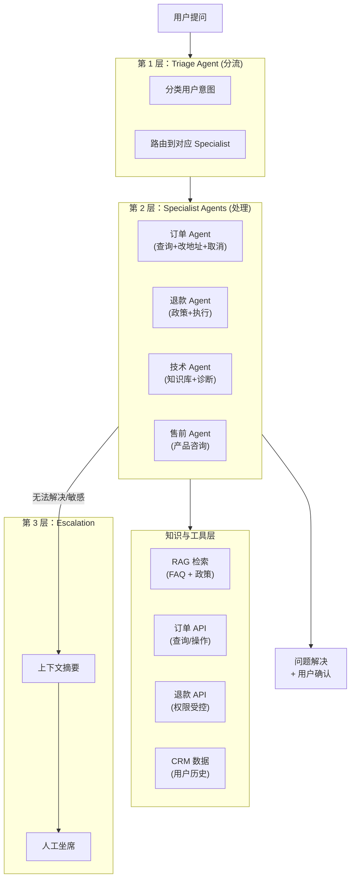

<section class="doc-hero">
  <p class="doc-hero__kicker">垂直 Agent</p>
  <h1>客服 Agent</h1>
  <p class="doc-hero__lead">2024 年 Klarna 宣布 AI 客服替代 700 个全职人工、处理 2/3 的客服请求，让市场认识到客服可能是 LLM 应用第一个跑出 ROI 的垂直场景。客服 Agent 不是"会聊天的 ChatGPT"——它是分流路由、知识检索、订单查询、退款执行、人工升级的多 Agent 协作系统。本文讲清楚它的核心架构、SLA 设计、失败模式、以及为什么 OpenAI Agents SDK 的 Handoff 模型几乎就是为这个场景设计的。</p>
  <div class="doc-hero__meta" aria-label="本文信息">
    <span>适合阶段：进阶 / 落地</span>
    <span>核心链路：Classify → Retrieve → Act → Escalate</span>
    <span>面试重点：分流策略 + Handoff vs Tool + 人工升级 SLA</span>
  </div>
</section>

> **本文边界**：聚焦客服 Agent 的工程架构和落地模式。多 Agent 协作的通用原理见 [多 Agent 编排](../multi-agent/patterns)；OpenAI Agents SDK 的 Handoff 实现见 [OpenAI Agents SDK](../frameworks/openai-agents-sdk)；客服场景的 RAG 设计见 [RAG 章节](../rag/)。

## 面试官想考什么

读完这篇你要能正面回答下面这些题。每题后面括号里是面试官真正想看你答出什么。

<div class="interview-grid">
  <div>
    <strong>为什么客服是 LLM 应用第一个跑出 ROI 的赛道？什么场景特性让它适合？</strong>
    <span>考产品判断——任务边界清晰、有现成知识库、用户期望容忍度高（已习惯传统客服延迟）、ROI 可量化（替代人力 = 直接节省成本）。</span>
  </div>
  <div>
    <strong>客服 Agent 的标准架构是分流 → 处理 → 升级，为什么不是单 Agent + 大 prompt？</strong>
    <span>考多 Agent 必要性——客服任务的子类型差异大（订单 / 技术 / 投诉），单 Agent prompt 会膨胀且各类问题相互干扰，分流是健康多 Agent 的代表场景。</span>
  </div>
  <div>
    <strong>客服 Agent 的"人工升级"什么时候触发？怎么交接才不让用户重复一遍问题？</strong>
    <span>考 HITL 设计——升级触发条件（失败次数、敏感关键词、低置信度）+ 上下文摘要传递给人工坐席。</span>
  </div>
  <div>
    <strong>客服 Agent 怎么避免"乱承诺"？比如答应退款但实际无权操作。</strong>
    <span>考权限隔离——Agent 能"查"和"建议"，但"执行"动作（退款、改地址）走严格的工具权限，避免幻觉造成业务事故。</span>
  </div>
  <div>
    <strong>客服 Agent 的成功率怎么评估？是看 CSAT 还是 deflection rate？</strong>
    <span>考评估指标——deflection rate（不需要人工的比例）+ CSAT（用户满意度）+ FCR（一次解决率）+ AHT（处理时长），任何单一指标都误导。</span>
  </div>
  <div>
    <strong>Klarna 说 AI 客服处理 2/3 请求，剩下 1/3 为什么不行？</strong>
    <span>考边界认知——剩下的是高情感（投诉抱怨）、高复杂度（跨系统问题）、高风险（涉及金钱争议）场景，模型能力 + 法规 + 风险都还不允许全自动。</span>
  </div>
  <div>
    <strong>多语言客服 Agent 怎么做？翻译 + 调用同一 Agent 还是 per-语言 Agent？</strong>
    <span>考多语言架构——主流是"模型直接处理多语言 + per-语言知识库 + per-语言 prompt"，避免翻译损耗。</span>
  </div>
  <div>
    <strong>客服 Agent 在生产里最常见的失败模式是什么？怎么治？</strong>
    <span>考生产经验——幻觉政策、循环重试、用户挫败感、个性化失败、合规漏洞。</span>
  </div>
</div>

---

## 为什么客服是 LLM 应用最先跑通的赛道

2023-2024 年 LLM 应用百花齐放但大多数还在烧投资人钱。客服是个例外——一批产品已经在赚钱：

```
Klarna（2024）：AI 客服处理 2/3 请求 → 替代 ~700 全职 → 估计节省 $4000 万/年
Shopify Inbox（2023+）：百万商家的售前自动应答
Intercom Fin（2023）：每解决 1 个问题向商家收 $0.99，营收过亿
Decagon（2024 起）：B2B 客服 Agent，多个独角兽客户
Ada（早期）：纯 LLM 客服平台，估值 12 亿美元
```

为什么客服先跑通？四个特性的合力：

**(1) 任务边界清晰**

客服请求 80% 是结构化问题：
- 订单查询（"我的订单到哪了"）
- 政策咨询（"你们的退货政策是什么"）
- 简单操作（"帮我改一下收货地址"）
- 基础技术问题（"App 打不开怎么办"）

这些任务有明确的输入输出 + 可验证的答案，比"陪我聊天"或"帮我决策投资"这类开放任务好做得多。

**(2) 已有现成知识库**

任何运营了几年的公司都有：
- FAQ 文档
- 政策手册
- 历史工单
- 产品文档

这些是 RAG 的天然燃料。客服 Agent 不需要"造知识"——它需要的是"用好已有知识"。

**(3) 用户期望容忍度高**

传统人工客服的体验本来就糟——等 30 分钟、被转接 3 次、坐席读脚本不解决问题。这个低基线让 AI 客服很容易超越："立即响应 + 解决 70% 问题"对很多用户已经是惊喜了。

**(4) ROI 可量化**

```
原成本：100 个客服 × $5000/月 = $500K/月
AI 替代 70% → 还需 30 个客服 = $150K/月
AI 成本：$20K/月（API + 人力维护）
净节省：$500K - $150K - $20K = $330K/月
```

CFO 看得懂的数字。这是 LLM 应用罕见地能直接对应到 P&L 的场景。其他应用（编程 Agent、Deep Research）的 ROI 都难量化——节省了员工时间但员工没被裁，省的钱去哪了？

---

## 标准架构：分流 → 处理 → 升级

主流客服 Agent 产品（Intercom Fin、Decagon、Ada、自建的 Klarna 等）的内部架构高度一致——三层结构：



逐层拆解。

### 第 1 层：Triage Agent（分流）

**职责**：理解用户意图，路由到对应的专家 Agent。

```python
triage_agent = Agent(
    name="Triage",
    instructions="""You are the first responder for customer support.
    Classify the user's intent and route to the appropriate specialist:
    - Order/shipping issues → Order Specialist
    - Refund/return requests → Refund Specialist  
    - Product technical issues → Tech Specialist
    - Pre-sale product questions → Sales Specialist
    
    If the intent is unclear, ask ONE clarifying question.
    If the user is angry or expressing strong negative emotions, route to human.
    """,
    handoffs=[order_agent, refund_agent, tech_agent, sales_agent, human_agent],
)
```

**关键设计**：

**(1) Triage Agent 不解决问题**

它只做分类 + 路由，不直接回答业务问题。这个分工让 Triage 的 prompt 简短 + 决策清晰。如果 Triage 也开始回答业务问题，它的 prompt 会膨胀，分类准确率反而下降。

**(2) 模糊意图主动澄清**

用户说"我有个问题" → Triage 不应该乱猜，而是问"是关于订单还是产品？" 一轮澄清让分流准确率从 70% 提升到 95%+。

**(3) 情感识别提前升级**

用户开骂或多次表达不满 → 直接 handoff 给人工，不要让 AI 继续触怒用户。这是 Klarna 等产品的实践——情感识别比业务能力优先。

### 第 2 层：Specialist Agents（处理）

每个 Specialist 是个独立 Agent，配套该领域的工具和知识：

```python
# 订单 Agent 示例
order_agent = Agent(
    name="Order Specialist",
    instructions="""You handle order and shipping queries.
    
    For "Where's my order?":
      1. Call lookup_order(order_id)
      2. Explain status + ETA in plain English
      3. If late, proactively offer compensation per policy
    
    For "Change my address":
      1. Verify identity (last 4 of card or email confirmation)
      2. Call update_address only if status is 'pre-shipment'
      3. If already shipped, explain why can't change + offer redirect to carrier
    
    NEVER make promises beyond policy. If unsure, hand off to Refund Specialist or Human.
    """,
    tools=[lookup_order, update_address, retrieve_shipping_policy],
    handoffs=[refund_agent, human_agent],
)

# 退款 Agent 示例
refund_agent = Agent(
    name="Refund Specialist",
    instructions="""You handle refunds and returns.
    
    Process:
      1. Check eligibility (within 30-day window? unused? has receipt?)
      2. If eligible and amount < $100: process refund directly
      3. If amount >= $100 or edge case: get user confirmation + escalate to human
    
    NEVER process refund without explicit user confirmation + eligibility check.
    """,
    tools=[check_refund_eligibility, process_refund, retrieve_refund_policy],
    handoffs=[human_agent],
)
```

**关键设计**：

**(1) 每个 Agent 工具集严格限制**

订单 Agent 只有"订单相关工具"，没有退款执行权限（退款必须走 Refund Agent）。这种权限隔离防止 Agent 越权操作。

**(2) Specialist 之间也能 handoff**

订单问题里如果用户其实想退款，订单 Agent 可以 handoff 给退款 Agent。**handoff 是双向、网状的**，不只是 Triage → Specialist 单向。

**(3) 政策硬编码 + 政策检索分离**

简单政策（"30 天退货窗口"）硬编码在 prompt 里。复杂/经常变的政策（如不同产品类目的具体规则）放知识库，让 Agent 检索。

### 第 3 层：Escalation（升级）

**职责**：把 AI 处理不了的情况无缝交给人工。

```python
async def escalate_to_human(conversation: Conversation) -> EscalationResult:
    # 1. 生成对话摘要给人工坐席
    summary = await llm.summarize(
        conversation.messages,
        focus="What does the user want? What has been tried? Why escalating?"
    )
    
    # 2. 提取关键信息（用户 ID、订单号、已尝试的方案）
    metadata = extract_metadata(conversation)
    
    # 3. 路由到合适的坐席（按队列、技能、语言）
    agent = await route_to_agent_queue(
        skills=metadata.required_skills,
        language=metadata.user_language,
        priority=metadata.priority,
    )
    
    # 4. 把 conversation + summary + metadata 全部推到坐席界面
    await push_to_agent_ui(agent_id=agent.id, conversation=conversation, 
                          summary=summary, metadata=metadata)
    
    return EscalationResult(agent_id=agent.id, estimated_wait_minutes=agent.queue_depth)
```

**核心 UX 设计：上下文不丢**

最大的"AI 客服反人类"体验是——AI 没处理好，转人工后用户要重新讲一遍问题。这是糟糕的设计。专业的升级流程：

1. **摘要传递**：人工坐席看到对话历史 + 一段 AI 生成的摘要（"用户的订单 ORD-123 延迟 3 天，要求加急或退款。AI 已查询订单状态显示在中转，已说明不能加急。用户对解释不满。"）
2. **结构化信息**：订单号、用户身份等结构化数据直接显示在坐席面板，不用从对话里找
3. **AI 助手伴随**：坐席接管后，AI 不消失而是变成坐席的副驾——帮她快速调用工具、起草回复

Intercom Fin、Decagon 都这么做——这是体验和效果的核心区分。

**升级触发条件**：

| 触发器 | 例子 |
|---|---|
| 失败次数 | 同一意图被 Specialist 处理 2-3 次仍未解决 |
| 情感识别 | 用户多次使用负面情绪词（"很差""气死了""投诉"） |
| 敏感关键词 | "诉讼""媒体""退款超过 $500" |
| 显式请求 | 用户直接说"转人工" |
| 低置信度 | Specialist 自己不确定时主动 escalate |
| 法规要求 | 涉及医疗、法律建议、贷款审批等强监管场景 |

---

## 用 OpenAI Agents SDK 实现一个完整客服系统

为什么强调 OpenAI Agents SDK？因为它的 **Handoff 原语就是为客服场景设计的**。三个核心概念（Agent、Handoff、Guardrail）完美对应客服三层架构。

```python
# pip install openai-agents
from agents import Agent, Runner, function_tool, input_guardrail, GuardrailFunctionOutput
from pydantic import BaseModel
import asyncio

# ============== 工具定义 ==============
@function_tool
def lookup_order(order_id: str, user_id: str) -> dict:
    """根据订单号查询订单状态。"""
    # 模拟：实际调订单系统 API
    return {
        "order_id": order_id,
        "status": "in_transit",
        "estimated_delivery": "2026-06-10",
        "user_id": user_id,
    }

@function_tool
def update_address(order_id: str, new_address: str) -> str:
    """修改订单收货地址。仅 pre-shipment 状态可改。"""
    return f"Address updated for {order_id} to {new_address}"

@function_tool
def check_refund_eligibility(order_id: str) -> dict:
    """检查订单是否符合退款政策。"""
    return {"eligible": True, "max_amount": 100, "reason": "Within 30-day window"}

@function_tool
def process_refund(order_id: str, amount: float, reason: str) -> str:
    """处理退款。amount 必须 ≤ 100，否则需 escalate。"""
    if amount > 100:
        raise ValueError("Amount exceeds AI auto-approval limit. Must escalate to human.")
    return f"Refund of ${amount} processed for {order_id}. Reason: {reason}"

@function_tool
def retrieve_policy(query: str) -> str:
    """从知识库检索相关政策。"""
    # 实际是 RAG 调用
    return f"[Policy excerpt relevant to: {query}]"

# ============== Specialist Agents ==============
order_agent = Agent(
    name="Order Specialist",
    instructions="""You handle order and shipping queries.
    Use lookup_order to check status. For address changes, only allow if pre-shipment.
    If user is angry or asking for refund, hand off to refund_agent.""",
    tools=[lookup_order, update_address, retrieve_policy],
)

refund_agent = Agent(
    name="Refund Specialist",
    instructions="""You handle refunds. Always check eligibility first.
    For refunds > $100 OR complex cases, hand off to human.""",
    tools=[check_refund_eligibility, process_refund, retrieve_policy],
)

tech_agent = Agent(
    name="Tech Specialist",
    instructions="Answer technical product questions using the knowledge base.",
    tools=[retrieve_policy],  # 复用 retrieve_policy 当 RAG 接口
)

human_agent = Agent(
    name="Human Handoff",
    instructions="Generate a summary for the human agent and route the conversation.",
    tools=[retrieve_policy],
)

# ============== Input Guardrail ==============
class EmotionCheck(BaseModel):
    is_angry: bool
    reason: str

emotion_checker = Agent(
    name="Emotion Checker",
    instructions="Detect if the user is expressing strong anger or distress.",
    output_type=EmotionCheck,
)

@input_guardrail
async def detect_anger(ctx, agent, input_data):
    result = await Runner.run(emotion_checker, input_data)
    return GuardrailFunctionOutput(
        output_info=result.final_output,
        tripwire_triggered=result.final_output.is_angry,
    )

# ============== Triage Agent ==============
triage = Agent(
    name="Triage",
    instructions="""You are the first responder. Classify and route:
    - Order/shipping → Order Specialist
    - Refund/return → Refund Specialist
    - Technical issues → Tech Specialist
    
    If intent unclear, ask ONE clarifying question.
    If anger detected (via guardrail), route to human.""",
    handoffs=[order_agent, refund_agent, tech_agent, human_agent],
    input_guardrails=[detect_anger],
)

# 设置 Specialists 互相之间和到 human 的 handoff
order_agent.handoffs = [refund_agent, human_agent]
refund_agent.handoffs = [human_agent]
tech_agent.handoffs = [human_agent]

# ============== 运行 ==============
async def handle_customer(message: str):
    result = await Runner.run(triage, message)
    print(f"Final response: {result.final_output}")
    print(f"Agent path: {[item.agent.name for item in result.new_items]}")

asyncio.run(handle_customer("我的订单 ORD-123 都过了一周了还没到，气死我了，要么加急要么退款！"))
```

这 80 行代码就是一个完整可用的客服 Agent 系统——分流、专家处理、情感识别升级、工具权限隔离全部到位。

**OpenAI Agents SDK 为什么是客服的最佳选择**：

1. **Handoff 是一等公民**：不像 LangChain 要用 conditional edges 模拟，直接 `handoffs=[...]` 就行
2. **Guardrail 并行执行**：情感识别和主流程并发跑，不增加延迟
3. **Tracing 内置**：每次对话的完整 trace 自动记录，调试和审计都方便
4. **代码极简**：同等功能在 LangGraph 里要 200+ 行

如果你做客服 Agent，OpenAI Agents SDK 是 2025-2026 年最合适的框架。代价是锁定 OpenAI 模型。

---

## 评估指标体系：不能只看 deflection rate

客服 Agent 的成功要看一组指标，单一指标都会误导：

| 指标 | 定义 | 目标 | 注意 |
|---|---|---|---|
| **Deflection Rate** | AI 解决的比例（不需要人工） | 50-80% | 单看这个会鼓励"伪装解决"（用户不满但走了） |
| **CSAT** | 用户满意度评分 | ≥ 4/5 | AI 客服的 CSAT 通常比人工低 0.3-0.5 分 |
| **FCR (First Contact Resolution)** | 一次性解决率 | ≥ 60% | 衡量真正解决而非来回踢皮球 |
| **AHT (Average Handle Time)** | 平均处理时长 | < 5 min | AI 的优势——不必比人工快但要稳定 |
| **Escalation Rate** | 升级到人工的比例 | 20-40% 健康 | 太低 → AI 在硬撑；太高 → AI 没用 |
| **Resolution Cost** | 单次解决成本 | $0.10-1 | AI 的核心 ROI 来源 |
| **Brand Voice Score** | 是否符合品牌语调 | LLM judge 评估 | 客服是品牌一线，调性很重要 |

**Klarna 公开的数据（2024）**：

- Deflection: 67%
- AHT: 2 分钟（vs 人工 11 分钟）
- CSAT: 与人工持平
- Resolution Cost: 估计降低 70%+

但 Klarna 的指标也被同行质疑——CSAT 的统计方式（自报告 vs 强制评分）、deflection 的定义（首次解决 vs 包含后续重新联系）这些都影响数据。**评估客服 Agent 不能信单一来源的 PR 数字**。

---

## 容易踩的坑

**坑 1：幻觉政策**

- **现象**：Agent 答应"我们支持 60 天无理由退货"，实际是 30 天
- **根因**：政策没放知识库，Agent 凭"训练数据中常见做法"猜测
- **修法**：
  - 所有政策写入 RAG 知识库，明确指令"任何政策回答必须先 retrieve_policy"
  - PostToolUse Hook 检测包含"退款""退货""保修"等关键词的回复，验证是否引用了 retrieve_policy 工具
  - 政策类回答末尾自动加引用链接（用户可点击查看原文）

**坑 2：用户重复一遍问题（升级断层）**

- **现象**：AI 处理 3 分钟，无解 → 转人工 → 人工坐席问"您好，请问您的问题是？"
- **根因**：升级时上下文没传递
- **修法**：见前面"Escalation"章节——必须传摘要 + 完整对话 + 结构化元数据给坐席界面

**坑 3：循环重试（用户挫败感）**

- **现象**：AI 重复同样的回答 3 次（"请检查您的订单号是否正确"），用户气炸
- **根因**：Agent 没识别"我已经说过我的订单号正确"这种用户反复表达
- **修法**：
  - max_turns 兜底（同一 Agent 内 3 轮无进展强制 escalate）
  - 情感监控 Guardrail（连续负面情绪触发 escalate）
  - 自反思（Agent 自己 check"我是不是在重复"）

**坑 4：合规漏洞**

- **现象**：用户问"我能不能用这个产品治糖尿病？" Agent 给了医疗建议
- **根因**：训练数据让模型倾向于"有帮助地回答"，但医疗、法律、金融建议是强监管
- **修法**：
  - Input Guardrail 识别医疗/法律/金融关键词，强制 disclaimer
  - 这些领域必须升级到合规审核过的人工

**坑 5：个性化失败**

- **现象**：VIP 客户来咨询，AI 用对普通客户的"模板回答"打发，VIP 投诉到 CEO
- **根因**：Agent 没接 CRM，不知道用户是 VIP
- **修法**：
  - Triage 阶段就调 lookup_user(user_id) 获取用户 tier、历史价值、过往工单
  - 把用户元数据注入到 Specialist 的 context
  - VIP / 高价值客户直接走人工或专属高级 Agent

**坑 6：跨渠道断层**

- **现象**：用户在网页上问了一半切到 App，对话历史丢了，又得重头讲
- **根因**：Agent 状态绑在 channel，没有跨渠道 unified user identity
- **修法**：用统一的用户 ID（如手机号、邮箱、登录态）做 session key，跨渠道共享对话历史

**坑 7：测试覆盖不足上线翻车**

- **现象**：上线第一天就有用户问出"训练时没见过"的边缘问题，Agent 大幅幻觉
- **根因**：测试集是 happy path，没有边缘案例
- **修法**：
  - 离线评估时用历史工单池做回放（拿真实历史问题让 Agent 答，对比真实坐席回答）
  - Shadow mode 上线（AI 跑但不发给用户，对比人工回答找偏差）
  - 灰度发布（先 5% 流量，监控指标稳定后扩量）

---

## 面试题深度解析

**Q1: 为什么客服是 LLM 应用第一个跑出 ROI 的赛道？**

- **30 秒版本**：四个特性合力——任务边界清晰（80% 是结构化问题）+ 已有知识库（FAQ/政策/历史工单是天然 RAG 燃料）+ 用户期望容忍度高（传统客服基线低）+ ROI 可量化（直接对应到节省人力成本）。其他 LLM 应用要么任务太开放、要么 ROI 难量化，客服是少有的"上线就能算清楚每月省多少钱"的场景。
- **追问：那为什么不是销售？销售岗位人力成本也很高。** 销售有几个特性让 LLM 难做：(1) 销售的核心是"建立信任和关系"，AI 在情感连接上仍弱；(2) 销售的成功依赖个性化和长期跟进，AI 的 context 管理跨多天/多周仍不可靠；(3) 销售失败成本高（错过一个大单 = 损失几万），AI 出错风险大。客服是反过来——失败也就重新一次或转人工，风险可控。
- **追问：未来客服 AI 的天花板在哪？能 100% 替代人工吗？** 短期内不会 100%。剩下 20-30% 需要人工的场景集中在：(1) 强情感诉求（用户要的不是答案是被听到）、(2) 跨系统复杂问题（账户被盗 + 退款 + 投诉同时存在）、(3) 高风险决策（大额退款、法律纠纷）、(4) 法规要求人工（医疗、贷款审批）。这部分天花板由"用户接受度 + 法规"决定，技术上能进步但不会完全消失。

**Q2: 客服 Agent 的"分流→处理→升级"为什么不是单 Agent？**

- **30 秒版本**：分工让每个 Agent 的 prompt 短、决策清晰。单 Agent 要做所有事的话 prompt 会膨胀（订单 + 退款 + 技术 + 售前 + 升级判断），各类问题相互干扰。这是健康多 Agent 的代表场景——三个角色的 context 边界天然清晰，符合"多 Agent 收益 > 协调开销"的判断标准。
- **追问：那为什么不分得更细？比如订单 Agent 再拆"查询 Agent"、"修改 Agent"、"取消 Agent"？** 过度分拆反而糟糕。一个用户的真实意图经常是混合的——"我要查订单状态，如果延迟就取消" 这种跨子任务的请求要在多个 Agent 间反复 handoff，体验和性能都下降。Specialist 粒度的合适标准是"一个 Agent 能完整处理一个用户意图的所有相关操作"。
- **追问：Triage 能不能用 fine-tuned 小模型代替？** 能而且应该。Triage 任务是文本分类——意图固定（5-10 个类）、决策路径短。用 fine-tuned BERT 或小 LLM 替代大模型 Triage，延迟降低 10x + 成本降低 100x。生产级客服 Agent 系统常这么做——Triage 用小模型，Specialist 用大模型。

**Q3: 人工升级时怎么交接才不让用户重复问题？**

- **30 秒版本**：三件事——(1) 把完整对话历史 + AI 生成的摘要传给坐席界面；(2) 提取结构化元数据（订单号、用户 ID、已尝试方案）直接显示，坐席不用从对话里找；(3) AI 不消失而是变成坐席的副驾，帮她快速调工具、起草回复。这套设计是 Intercom Fin、Decagon 等专业产品的标配。
- **追问：升级摘要会不会失真？比如 AI 漏掉了关键信息？** 会。这就是为什么除了摘要还要给坐席完整对话历史，让她能验证摘要、补充细节。最佳实践是"摘要在上、详情在下"——坐席先看摘要快速 onboard，需要时下钻看原对话。
- **追问：那能不能让 AI 在升级前先问用户'还有什么想补充'？** 能但要小心。这种问题会让用户觉得 AI 在拖延——"赶快转人工就行，别再问了"。更好的做法是 AI 在 escalate 前主动总结自己理解的核心问题给用户确认："您是要 X，对吗？" 用户确认后再升级。这种"先对齐后升级"既保证准确又不显得磨蹭。

**Q4: 客服 Agent 在生产里最常见的失败模式是什么？**

- **30 秒版本**：(1) 幻觉政策——AI 答应了实际不支持的条款；(2) 上下文断层——升级人工后用户要重复问题；(3) 循环重试——同样的回答说三遍；(4) 合规漏洞——医疗/法律建议越权；(5) 个性化失败——对 VIP 客户用模板回答。每个失败对应明确的缓解（RAG + Hook 验证、摘要传递、max_turns + 情感监控、Guardrail 拦截、CRM 集成）。
- **追问：哪个最难治？** 幻觉政策。即使把所有政策放 RAG，Agent 在某些情况下仍会"自由发挥"（比如政策不覆盖的边缘情况，模型按"通常做法"猜测）。技术缓解（Hook 验证、引用强制）能减少但不能消除。最终保险是合规审查 + 关键决策人工兜底。这也是为什么大额退款、敏感操作必须人工——不是 AI 做不了，是错了赔不起。
- **追问：怎么提前发现这些失败模式？** Shadow mode + 离线评估。上线前用历史工单池让 Agent 跑一遍，对比真实坐席的回答找差异。差异大的样本人工 review，识别 Agent 的系统性偏差，针对性改 prompt/工具/RAG。这套"用历史数据训练 + 评估 + 迭代"的流程是专业客服 AI 产品的核心壁垒——不是模型多强，是 evaluation harness 多扎实。

---

## 延伸阅读

- **Klarna AI 客服公告** [klarna.com/international/press/klarna-ai-assistant-handles-two-thirds-of-customer-service-chats](https://www.klarna.com/international/press/klarna-ai-assistant-handles-two-thirds-of-customer-service-chats-in-its-first-month/) — 2024 年的官方公告，少有的公开实战数据
- **Intercom Fin 工程博客** [intercom.com/blog/fin-ai-engineer-build](https://www.intercom.com/blog/) — Intercom 团队多篇关于 Fin 工程化的文章，特别是"deflection rate vs CSAT"的取舍讨论
- **Decagon 案例研究** [decagon.ai](https://decagon.ai) — B2B 客服 Agent 代表，看他们的客户案例（Eventbrite、Substack、Notion）
- **OpenAI Agents SDK Customer Service 示例** [github.com/openai/openai-agents-python](https://github.com/openai/openai-agents-python/tree/main/examples) — examples 目录里有完整的客服 multi-agent 实现
- **本站 [OpenAI Agents SDK 深度剖析](../frameworks/openai-agents-sdk)** — Handoff 模型对客服场景为什么是最合适抽象
- **本站 [多 Agent 编排模式](../multi-agent/patterns)** — 分流/路由是经典的多 Agent 模式之一
- **本站 [RAG 基础](../rag/basics)** — 客服 Agent 的知识库依赖 RAG，是必要前置
- **Building a chatbot that's a delight to talk to**（Intercom 工程博客）— 客服 Agent 的体验设计要点，比技术细节更重要的产品判断
