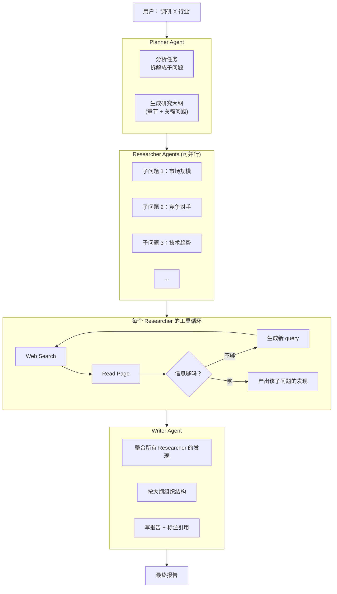

<section class="doc-hero">
  <p class="doc-hero__kicker">垂直 Agent</p>
  <h1>Deep Research Agent</h1>
  <p class="doc-hero__lead">2025 年 2 月 OpenAI 发布 Deep Research，把"问 ChatGPT 一个问题"升级到"派 ChatGPT 花 30 分钟做研究"。同月 Anthropic 上线 Research、Google 推 Gemini Deep Research、Perplexity 也跟进了 Pro Search。这是 2025-2026 年 Agent 赛道增长最快的形态——它不只是更长的 RAG，是把"信息工作"的交互范式从"实时回答"变成"异步任务"。</p>
  <div class="doc-hero__meta" aria-label="本文信息">
    <span>适合阶段：进阶 / 产品理解</span>
    <span>核心链路：Plan → Search → Synthesize → Report</span>
    <span>面试重点：和 RAG 的本质差异 + Planner-Researcher 架构 + reasoning model 角色</span>
  </div>
</section>

> **本文边界**：聚焦 Deep Research 作为一类 Agent 形态的设计模式。RAG 的基础见 [RAG 章节](../rag/)；多 Agent 协作机制见 [多 Agent 编排](../multi-agent/patterns)；reasoning model 的能力边界见 [推理参数](../llm/inference-params)。

## 面试官想考什么

读完这篇你要能正面回答下面这些题。每题后面括号里是面试官真正想看你答出什么。

<div class="interview-grid">
  <div>
    <strong>Deep Research 和普通 RAG 有什么本质区别？不就是"检索多几次"吗？</strong>
    <span>考对架构差异的理解——RAG 是单次检索 + 单次生成，Deep Research 是多轮规划 + 数十次检索 + 长链推理，本质是"任务"vs"问答"的差异。</span>
  </div>
  <div>
    <strong>OpenAI Deep Research 跑一次要 5-30 分钟，为什么这么慢？慢有价值吗？</strong>
    <span>考"长链推理"价值的判断——长时长 ≠ 浪费，对应的是从十几个源整合信息、做多轮 self-correction，简单 RAG 做不到。</span>
  </div>
  <div>
    <strong>Deep Research 用的是 reasoning model（o3/Claude Opus Thinking）还是普通 model？为什么？</strong>
    <span>考模型选型——reasoning model 的"思考时间换性能"和 Deep Research"长跑换深度"是同源策略，不用 reasoning model 跑不出深度。</span>
  </div>
  <div>
    <strong>OpenAI、Anthropic、Google、Perplexity 的 Deep Research 哪个更强？衡量标准是什么？</strong>
    <span>考产品评估能力——不能只看"我用着哪个顺手"，要拆解维度（来源多样性、引用准确性、推理深度、报告结构）。</span>
  </div>
  <div>
    <strong>Deep Research 的核心架构是 Planner-Researcher-Writer 三角，为什么不是单个大 Agent？</strong>
    <span>考多 Agent 分工的合理性——三个角色的 context 边界天然清晰，不属于"为多 Agent 而多 Agent"的反模式。</span>
  </div>
  <div>
    <strong>Deep Research 的引用准确性怎么保证？为什么还是会幻觉？</strong>
    <span>考"引用 ≠ 正确"的认知——Agent 会"看到"内容然后转述时仍出错；幻觉来自总结环节而非检索环节。</span>
  </div>
  <div>
    <strong>Deep Research 在哪些场景明显比普通搜索强？哪些场景反而更糟？</strong>
    <span>考用例边界——综述、调研、对比适合 Deep Research；时效新闻、定义类查询、快速验证用普通搜索更好。</span>
  </div>
  <div>
    <strong>自己做一个 Deep Research，最简单的实现路径是什么？</strong>
    <span>考端到端工程感——LangGraph/Anthropic SDK + Tavily/Brave 搜索 + reasoning model + 报告生成，少 200 行能做出基础版。</span>
  </div>
</div>

---

## 为什么 Deep Research 是 2025 年的爆款

先看用户的真实痛点。下面这个场景，2024 年用任何 LLM 产品都不好解决：

```
你：我要评估是否投资某家半导体设备公司。
   帮我做一份调研——市场地位、竞争对手、技术壁垒、最近三年财报趋势、
   关键风险（地缘政治、客户集中度、技术路线）、估值合理性。

ChatGPT 2024（GPT-4）：根据我的训练数据……（数据可能截止 2023 年）
              （罗列几个表面观察，没有引用、没有数据、不深入）
              
普通 RAG 系统：检索几个相关网页 → 拼到 prompt → 生成回答
              （检索精度有限，回答平铺不深，对比维度不全）
              
你的真实需求：花两小时读 30 份资料 + 财报 + 行业报告，整理出一份 5 页报告
            ——但你没两小时
```

Deep Research 解决的就是这个空白：**用 Agent 把"两小时的信息工作"压缩到 30 分钟的异步等待**。

2025 年 2 月 OpenAI 把这个产品推出后，让人意外的是用户接受度极高——尽管要等 5-30 分钟。原因是它把交互范式从"实时问答"切换成了"异步任务"：

```
实时问答模式：
  用户必须坐在屏幕前等 → 5 秒没回复就焦虑 → 体验 = 速度
  
异步任务模式：
  用户提需求 → 关掉页面去做别的 → 半小时后回来看报告 → 体验 = 质量
```

这个范式切换才是 Deep Research 真正颠覆的东西——它把 LLM 应用的"产品定位"从"会聊天的搜索引擎"变成"虚拟分析师"。

---

## Deep Research 和 RAG 的本质区别

很多人第一反应："这不就是 RAG 跑久一点吗？" —— 这个理解错得离谱。两者的架构差异是质变：

| 维度 | 普通 RAG | Deep Research |
|---|---|---|
| 触发方式 | 用户问一句，立刻回答 | 用户提任务，异步执行几分钟到几十分钟 |
| 检索次数 | 1-3 次 | 数十次到上百次 |
| 检索策略 | 单次 query embedding | Agent 自己生成 query、根据结果调整下一轮搜索 |
| 推理深度 | 1 次 LLM 调用生成回答 | 多轮规划 + 反思 + 整合 + 改写 |
| 引用结构 | 通常 5-10 个来源 | 通常 20-50+ 个来源 |
| 输出形式 | 一段答案 | 结构化报告（标题/小节/引用列表） |
| 模型 | 通用 chat 模型 | reasoning model（o3/Claude Thinking） |
| 用户期望 | 速度 + 准确 | 深度 + 全面 + 可追溯 |

最关键的差异在于**"用户期望的产品价值"完全不同**。RAG 是"快速给一个有依据的答案"，Deep Research 是"做一份调研"。后者的 KPI 不是延迟，是报告质量。

理解这个差异之后，所有架构选择就顺理成章：

- 用 reasoning model 而非 chat 模型——任务复杂度需要更深的推理
- 用 Planner-Researcher 分工而非单 Agent——研究的复杂度需要显式规划
- 长跑而非快回答——质量值得用时间换
- 大量引用而非紧凑回答——可追溯比简洁更重要

---

## 核心架构：Planner-Researcher-Writer 三角

主流 Deep Research 产品（OpenAI、Anthropic、Google、Perplexity）的内部架构高度收敛到同一套模式——Planner、Researcher、Writer 三个角色协作：



逐层拆解每个角色。

### Planner Agent

**职责**：把用户的高层需求拆成可以独立检索的子问题，输出一份"研究大纲"。

输入：`"评估 X 公司的投资价值"`

输出（伪代码）：

```json
{
  "outline": [
    {"section": "公司概况", "subQuestions": ["主营业务是什么？", "成立时间和发展阶段？"]},
    {"section": "市场地位", "subQuestions": ["市场份额？", "前 3 大竞争对手？", "差异化定位？"]},
    {"section": "财务表现", "subQuestions": ["近 3 年营收 / 利润？", "毛利率 / 现金流？"]},
    {"section": "技术壁垒", "subQuestions": ["核心技术？", "专利布局？", "研发投入占比？"]},
    {"section": "风险因素", "subQuestions": ["地缘政治风险？", "客户集中度？", "替代技术？"]},
    {"section": "估值分析", "subQuestions": ["当前市盈率？", "与同行比较？", "未来增长预期？"]}
  ]
}
```

**关键设计**：Planner 不做检索——它只做规划。这个分工让 Planner 能用最强的 reasoning model（o3、Claude Opus Thinking），花相对多的 token 把"问题理解透"，然后把"信息收集"的脏活交给 Researcher。

OpenAI Deep Research 的实现里 Planner 阶段甚至会**先和用户澄清需求**——你提了模糊问题，它先反问"你更关心 X 还是 Y 角度？" 这个澄清环节让后续 30 分钟不会跑偏。这是把"对齐意图"显式建模为产品环节。

### Researcher Agents

**职责**：针对每个子问题，做多轮搜索 + 阅读 + 评估，产出该子问题的"发现集"。

```python
# 简化的 Researcher 主循环
async def researcher(sub_question: str) -> list[Finding]:
    findings = []
    search_queries = [generate_initial_query(sub_question)]
    
    for round in range(MAX_ROUNDS):
        for query in search_queries:
            # 1. 搜索
            results = await web_search(query, num=10)
            
            # 2. 评估每个结果
            for url, snippet in results:
                if is_relevant(snippet, sub_question):
                    # 3. 读取全文
                    content = await read_page(url)
                    # 4. 提取关键信息
                    extracted = await extract_findings(content, sub_question)
                    findings.extend(extracted)
        
        # 5. 评估：是否已经回答了 sub_question？
        evaluation = await evaluate_completeness(findings, sub_question)
        if evaluation.complete:
            break
        
        # 6. 没回答完，生成下一轮 query
        search_queries = await generate_followup_queries(
            sub_question, findings, evaluation.gaps
        )
    
    return findings
```

注意几个关键设计：

**(a) 多 Researcher 并行**

不同子问题之间没有依赖，可以同时跑。一份调研拆出 6 个子问题，并行跑 6 个 Researcher，整体耗时接近单个 Researcher（被最慢的限制）。这是 Deep Research 能在 30 分钟内完成本来 2 小时工作的核心。

**(b) Researcher 内部是 agentic loop**

Researcher 不是"一次搜索就完事"。它会：搜 → 评估 → 不够 → 改 query → 再搜 → 整合。每个 Researcher 内部就是个完整的 ReAct loop。

**(c) 让 LLM 评估完整度而非规则判断**

何时停止当前 Researcher？不是"搜了 5 次就停"，而是让 LLM 评估"我现在找到的信息是否回答了 sub_question？还有什么 gap？" 这种动态决策让 Researcher 在简单子问题上 2 次搜索就停，在复杂子问题上跑到 10+ 次。

### Writer Agent

**职责**：拿到所有 Researcher 的 findings 集合，按 Planner 制定的大纲写成最终报告。

```python
async def writer(outline: Outline, findings_by_section: dict[str, list[Finding]]) -> Report:
    report = Report(title=outline.title)
    
    for section in outline.sections:
        findings = findings_by_section[section.id]
        
        # 关键：让 LLM 看着 findings 写内容，每个 claim 必须有引用
        section_text = await llm.generate(
            prompt=f"""Write the section '{section.name}' based on these findings.
            CRITICAL: Every factual claim must have a citation like [1], [2] referring to the findings.
            
            Findings:
            {format_findings(findings)}
            """,
            model="claude-opus-thinking",  # 用 reasoning model 写报告
        )
        
        report.add_section(section.name, section_text)
    
    # 最后整理引用列表
    report.citations = collect_all_citations(report)
    return report
```

**Writer 的两个关键设计**：

**(a) 用 reasoning model**

Writer 不只是"把 findings 拼起来"，它要做综合、对比、推理（"A 数据和 B 数据矛盾，更可能 X 因为..."）。这种综合性写作用普通 chat 模型生成的东西通常浅，reasoning model 能写出明显更深的内容。

**(b) 强制引用**

system prompt 里反复强调"every factual claim must have a citation"。即使这样，Agent 仍会偶尔编引用——这就是后面会讲的"引用准确性"问题。

---

## Deep Research 的核心技术：Reasoning Model

为什么所有主流 Deep Research 产品都用 reasoning model（OpenAI o3、Anthropic Claude Thinking、Google Gemini Thinking、DeepSeek R1）而不是普通 chat 模型？

回顾 reasoning model 的本质——它在生成最终答案前会做"内部思考"（不展示给用户的链式推理），用更多 token 换更好的答案。这种"token 换性能"的策略和 Deep Research"时间换深度"完全同源。

具体到 Deep Research 的每个环节，reasoning model 的价值：

| 环节 | 普通模型问题 | reasoning model 价值 |
|---|---|---|
| Planner | 拆出的子问题过浅、覆盖不全 | 深度思考问题维度，拆得更全面 |
| Researcher | 评估完整度时容易"满足现状"提前结束 | 反思 gap，主动发现"还需要查什么" |
| Writer | 综合多源信息时容易"罗列而非推理" | 真正做对比、推理、洞察 |

OpenAI 的 Deep Research 用的是 o3（其变体）。Anthropic 的 Research 用的是 Claude Opus + extended thinking。Perplexity 的 Pro Search 用 DeepSeek R1 或 Claude（用户可选）。这种统一选择不是巧合——是"任务难度需要 reasoning"的工程实证。

代价：reasoning model 比普通模型贵 5-10 倍、慢 5-10 倍。但 Deep Research 是按"次"收费/限额的（OpenAI Pro 用户每月 100 次），不按延迟收费——成本可以分摊到用户的使用习惯里。

---

## 主流产品对比

四个主要玩家，每家的差异化：

| 产品 | 平均跑时 | 模型 | 来源类型 | 报告长度 | 独家能力 |
|---|---|---|---|---|---|
| **OpenAI Deep Research** | 5-30 分钟 | o3 变体 | Web + 论文 | 5-30 页 | 启动前澄清需求 |
| **Anthropic Research** | 1-10 分钟 | Claude Opus + thinking | Web + 用户上传 | 3-10 页 | 集成 Google Drive、能读 Gmail |
| **Google Gemini Deep Research** | 5-15 分钟 | Gemini 2.5 Pro Thinking | Web | 5-15 页 | 在 Google Drive 直接输出 doc |
| **Perplexity Pro Search** | 30 秒 - 5 分钟 | 多模型可选 | Web + 学术库 | 中等 | 速度快、引用界面好 |

差异主要在四个维度：

**(1) 跑时长 vs 深度**

OpenAI 跑最久（最多 30 分钟），相应深度最深、引用最多。Perplexity 跑最快（30 秒级），适合"半深"研究。Anthropic 居中。差异背后是产品定位——OpenAI 把 Deep Research 定位为"虚拟分析师"，Perplexity 是"加强版搜索"。

**(2) 数据源**

只有 Anthropic 能读你的私人数据（Google Drive、Gmail）——这是它的差异化武器。需要"调研我们公司的某事"时只有 Anthropic 能做。

OpenAI 的 Deep Research 在浏览能力上最强——能模拟用户操作下拉菜单、登录、点击按钮访问深层页面（动态网页）。这是其他家做不到的（背后是 OpenAI 的 Operator/Computer Use 模型）。

**(3) 报告风格**

OpenAI 的报告偏学术——结构严谨、引用规范、行文正式。
Anthropic 的报告偏商业——观点鲜明、有 takeaway、行文流畅。
Google 的报告偏中性——结构清晰但相对刻板。
Perplexity 的报告偏速记——简洁、要点突出。

哪种更好取决于场景。

**(4) 引用准确性**

各家都吹自己引用最准，但实际使用下来：

- Anthropic 的引用是真的指向原文具体段落（点击能跳转到原文那段）
- OpenAI 的引用准确率高但有时是"该 URL 大概讲了这事"的弱关联
- Google 的引用相对宽泛
- Perplexity 的引用界面最好（侧边栏可以快速跳到原文）但准确率参差

如果你的场景对引用准确性要求极高（学术研究、法律调研），目前 Anthropic 是最好选择。

---

## 用 Claude Agent SDK 自己做一个简易 Deep Research

```python
from claude_agent_sdk import ClaudeAgentSDK, AgentOptions, tool
from anthropic import Anthropic
import anyio
import asyncio

# Tavily 搜索 API（也可以用 Brave / Serper / Exa）
async def web_search(query: str) -> list[dict]:
    """搜索网页"""
    # 调 Tavily API
    return [{"url": "...", "title": "...", "snippet": "..."}, ...]

async def read_page(url: str) -> str:
    """读取网页正文"""
    # 用 Anthropic 内置 WebFetch 或 trafilatura 提取正文
    return "..."

async def deep_research(topic: str):
    sdk = ClaudeAgentSDK()
    
    # ============== Phase 1: Planner ==============
    planner_options = AgentOptions(
        model="claude-opus-4-7",         # 用 Opus 做 planning
        system_prompt="You are a research planner. Break the user's research request into 4-8 specific sub-questions that together cover the topic comprehensively.",
        allowed_tools=[],                  # Planner 不需要工具
        max_turns=3,
    )
    
    outline = await sdk.run_to_completion(
        prompt=f"Plan research for: {topic}",
        options=planner_options
    )
    sub_questions = parse_sub_questions(outline.final_text)
    
    # ============== Phase 2: Researchers (并行) ==============
    async def researcher(sub_q: str) -> str:
        researcher_options = AgentOptions(
            model="claude-sonnet-4-6",      # Researcher 用 Sonnet（性价比高）
            system_prompt=f"""You are a researcher investigating: '{sub_q}'.
            Use web_search and read_page to find information.
            Run multiple search rounds—if your initial search isn't enough, refine the query.
            Stop when you have comprehensive findings.
            Output a JSON list of findings, each with content + source URL.""",
            allowed_tools=["web_search", "read_page"],
            max_turns=15,
        )
        result = await sdk.run_to_completion(prompt=sub_q, options=researcher_options)
        return result.final_text
    
    # 并行跑所有 sub_questions
    findings = await asyncio.gather(*[researcher(q) for q in sub_questions])
    
    # ============== Phase 3: Writer ==============
    writer_options = AgentOptions(
        model="claude-opus-4-7",          # Writer 用 Opus + thinking
        system_prompt="""You are writing a research report. 
        CRITICAL: Every factual claim must cite a source from the findings using [N] notation.
        Organize the report by the original sub-questions.
        Be analytical—compare findings, identify patterns, draw conclusions.""",
        allowed_tools=[],
        max_turns=5,
    )
    
    findings_block = "\n\n".join(f"### Findings for: {q}\n{f}" for q, f in zip(sub_questions, findings))
    
    report = await sdk.run_to_completion(
        prompt=f"Topic: {topic}\n\nFindings:\n{findings_block}\n\nWrite the report.",
        options=writer_options
    )
    
    return report.final_text

if __name__ == "__main__":
    report = anyio.run(deep_research, "评估 X 半导体设备公司的投资价值")
    print(report)
```

这 60 行代码就是一个可用的 Deep Research 雏形。生产化还需要：
- 搜索 API 接入（Tavily、Brave、Exa 等）
- 网页正文提取的鲁棒性（trafilatura + readability 双保险）
- Researcher 的反思 loop（评估 findings 完整度）
- 引用回链验证（生成的引用能否真的跳到原文）
- 用户澄清环节（启动前 1-2 轮对齐）

商业产品的差距主要在这些工程细节上，不在核心架构。**核心架构非常简单**——这就是为什么 2025 年市面上出现了几十个"自建 Deep Research"的开源项目。

---

## 关键工程问题：引用准确性

Deep Research 的核心可信度依赖**引用**——用户看完报告会点引用验证。但所有产品都遇到同一个问题：**引用可能是对的，但内容描述可能错**。

```
原文："X 公司 Q3 营收 5 亿美元，同比下降 12%"
报告："X 公司 Q3 营收增长强劲，达 5 亿美元 [1]"
                                            ↑
                            引用指向原文（URL 正确）
                            但描述错了（说成了增长）
```

这是 LLM 在 summarization 环节的幻觉——不是检索错了，是总结时把"下降"读成了"增长"。引用机制只保证 URL 真实，不保证转述准确。

**主流缓解策略**：

**(1) Citation verification（引用验证环节）**

在 Writer 之后加一个 Verifier Agent：拿着生成的报告，对每个引用做"事实回查"——把引用对应的原文段落和报告里的描述给 LLM，问"报告里的描述是否准确反映了原文？"

```python
async def verify_citation(report_claim: str, source_text: str) -> Verification:
    prompt = f"""Original source:
    {source_text}
    
    Report claim:
    {report_claim}
    
    Is the report claim accurate? If not, what's the actual content?"""
    
    return await llm.evaluate(prompt)
```

Verifier 发现不一致就让 Writer 修改。代价：报告生成时间增加 30-50%。

**(2) 引用粒度更细**

普通 Deep Research 引用整个 URL（"看这篇文章"）。更先进的做法是引用具体段落（"这篇文章的第 3 段第 2 句"）。Anthropic 的 Research 在这块做得最好——它的引用能精确跳转到原文段落，且 prompt 强调"引用必须指向原文的具体陈述，不能泛指文章"。

**(3) 主张-证据匹配**

要求每个 claim 至少有 2 个独立来源支持。如果只有 1 个来源，标记为"单一来源"提醒用户。这是学术研究的标准做法，开始被 Deep Research 产品采用。

---

## 容易踩的坑（产品使用 + 开发自建）

### 产品使用层面

**坑 1：用 Deep Research 查实时新闻**

- **现象**：问"今天 X 公司发生了什么"，Deep Research 跑 10 分钟返回了昨天甚至上周的信息
- **根因**：Deep Research 优化的是"深度调研"，搜索的网页通常是文章、报告、综述——这些有滞后。真正的实时新闻在 Twitter、新闻 RSS、官方公告里
- **修法**：实时信息用普通搜索引擎或 Perplexity 普通模式。Deep Research 用于"对一段时间的事件做深度分析"

**坑 2：用 Deep Research 查事实定义**

- **现象**：问"什么是 RAG？"，Deep Research 跑 5 分钟生成 10 页报告
- **根因**：定义类问题 LLM 直接就能答，跑 Deep Research 是浪费
- **修法**：定义类查询用普通 chat、复杂综合性问题才用 Deep Research

**坑 3：把 Deep Research 报告直接当事实用**

- **现象**：把生成的报告复制到投资决策里，结果其中一个关键数据是错的（幻觉）
- **根因**：引用机制不保证转述准确，关键数据必须自己核对
- **修法**：对关键数据点（数字、人名、日期）必须点引用回查原文。Deep Research 是"高效率的草稿"，不是"最终结论"

### 开发自建层面

**坑 4：Researcher 跑无限循环**

- **现象**：某个子问题的 Researcher 跑了 30 轮还没停
- **根因**：LLM 评估"是否完整"时过于严格——总觉得还有 gap
- **修法**：硬性 max_turns 兜底（比如 15 轮），加上"递减收益检测"（连续 3 轮没新发现就强制结束）

**坑 5：并行 Researcher 把搜索 API 配额烧光**

- **现象**：6 个 Researcher 并行跑，每个发 20 次搜索，一次调研 120 次搜索请求，超过 Tavily 免费额度
- **根因**：并行规模没控制
- **修法**：用 semaphore 限制并发 Researcher 数量，单个 Researcher 内的搜索次数也设上限

**坑 6：网页正文提取在动态页面失败**

- **现象**：搜到了相关 URL，但读取时只拿到 "Please enable JavaScript" 或登录页
- **根因**：trafilatura 这类静态正文提取在 SPA、需要登录、有反爬的网站上挂
- **修法**：(a) 用 Playwright + 反检测插件，(b) 用 Anthropic Computer Use 模型操作，(c) 接受这些源拿不到、跳过

**坑 7：报告结构刻板**

- **现象**：每份报告都是同一个模板（背景/现状/挑战/展望），千篇一律
- **根因**：Planner 的 system prompt 给的太死，每次都套同样大纲
- **修法**：Planner prompt 强调"根据问题特点设计大纲"，给几个不同类型问题的示例（市场调研 vs 技术评估 vs 人物 profile）

---

## Deep Research 代表的是什么

最后讨论一个更宏观的问题——Deep Research 不只是一个新产品形态，它代表了 Agent 应用的一个重要范式转移：

**从"同步对话"到"异步任务"**

```
2023-2024 的 LLM 应用：用户和模型实时对话
2025+ 的 Agent 应用：用户委派任务，Agent 异步执行
```

这个范式转移背后是**信任的建立**——用户开始相信"Agent 跑 30 分钟会比我自己 2 小时跑得好"。这个信任之前不存在，因为 LLM 没法稳定跑那么久。Deep Research 通过 reasoning model + 多 Agent 架构 + 引用机制让这个信任变成可能。

**信任建立之后的下游影响**：

- **更长任务**：从 30 分钟到几小时——周报生成、产品调研、竞品监控
- **后台任务**：用户不在场也能跑——夜间扫数据、定期生成报告
- **复合任务**：研究 + 决策 + 执行——不只是"调研后告诉你"，是"调研后帮你订机票"

Deep Research 是这条路的第一步。OpenAI 把它和 Operator（Computer Use Agent）放在同一个产品线（ChatGPT Pro），战略上很清楚——异步、可执行、长任务的 Agent 是下一代的产品形态。

---

## 面试题深度解析

**Q1: Deep Research 和普通 RAG 有什么本质区别？**

- **30 秒版本**：架构差异是质变。普通 RAG 是"单次检索 + 单次生成"（latency-optimized），Deep Research 是"多 Agent 协作 + 数十次检索 + reasoning 综合"（quality-optimized）。前者的产品定位是"快速给有依据的答案"，后者是"做一份调研"。Deep Research 的 Planner-Researcher-Writer 三角分工、reasoning model 选型、引用结构都是为"调研产物"服务的，普通 RAG 完全做不到。
- **追问：那能不能把 Deep Research 看作"特别复杂的 RAG"？** 概念上勉强可以，工程上是误导。如果你用"加强版 RAG"的心态去做 Deep Research，会卡在三个地方：(1) 不知道何时停止检索（普通 RAG 检索完就生成，Deep Research 要 Agent 评估完整度），(2) 不知道怎么组织上百个 chunk（RAG 全塞 prompt，Deep Research 要 Writer 综合），(3) 不知道怎么保证深度（RAG 一次生成，Deep Research 用 reasoning + 反思）。把它当独立架构思考比作为 RAG 变体思考更有效。
- **追问：那 Agentic RAG 算 Deep Research 吗？** 是同一谱系上的不同点。Agentic RAG 强调"Agent 自己决定何时检索"，一般是单 Agent loop。Deep Research 是 Agentic RAG 的极限放大版——多 Agent + reasoning + 长时长 + 报告输出。可以把 Agentic RAG 当 Deep Research 的简化形态。

**Q2: Deep Research 的核心是 Planner-Researcher-Writer 三角，为什么不是单个大 Agent？**

- **30 秒版本**：三个角色的 context 边界天然清晰、职责互不重叠——这是健康多 Agent 的判断标准。Planner 只关心规划、Researcher 只关心检索、Writer 只关心写作，每个 Agent 的 context 不被其他角色的中间状态污染。这和"多 Agent 协作写代码"那种伪需求不一样——后者是为多 Agent 而多 Agent。
- **追问：那能不能 Planner 也兼任 Writer？规划的人写报告应该更连贯？** 理论上可以，实践上不行。Planner 阶段没看到 findings，写不出基于事实的报告；Writer 看到 findings 但不需要管规划（按已有大纲填内容）。两者的输入完全不同，硬要合并就要把所有 findings 在 Planner 阶段就塞 context——但那时 Researcher 还没跑，没有 findings。这是个时序依赖问题。
- **追问：Researcher 之间能不能互相通信？比如发现"市场规模"和"竞争对手"高度相关，互相补充信息？** 主流产品没这么做。因为通信会让并行变成串行，性能大降。trade-off 是少了点信息共享，但换来了 10 倍的并行速度。如果真要做，可以在 Writer 阶段做"跨 section 的对照"——Writer 看到所有 findings，能主动识别 cross-cutting 主题。

**Q3: Deep Research 用 reasoning model 而非普通 model，为什么？**

- **30 秒版本**：reasoning model 的"token 换性能"机制和 Deep Research 的"时间换深度"完全同源。普通 model 在三个环节都会拖后腿——Planner 拆出的子问题浅、Researcher 评估完整度时容易"满足现状"提前停、Writer 综合多源时只会罗列不会推理。reasoning model 在这三个环节都有明显改善。代价是慢 5-10 倍、贵 5-10 倍，但 Deep Research 不卡延迟（异步任务），这个代价可以承受。
- **追问：那为什么不每个环节都用最贵的 reasoning model？** 成本。完整跑一次 Deep Research 可能消耗 100-500 万 token，全部用 Opus + Thinking 单次成本 $5-30+。实际产品里 Planner 和 Writer 用顶级 reasoning model（任务复杂、调用次数少），Researcher 用次一级模型（任务相对结构化、并行调用多次）。这是经济学最优解。
- **追问：DeepSeek R1 等开源 reasoning model 能用吗？** 能。DeepSeek R1 的成本是 o3 的 ~1/10，推理质量在大多数 Deep Research 任务上够用。Perplexity 已经支持用户选 R1 跑 Pro Search。开源 reasoning model 是 2025-2026 年降低 Deep Research 成本的关键路径。

**Q4: Deep Research 在哪些场景明显比普通搜索强？哪些场景反而更糟？**

- **30 秒版本**：强的场景——综述类（"X 行业现状"）、对比类（"A 公司 vs B 公司"）、调研类（"Y 技术的演进路径"），这些需要整合多源信息 + 做推理。糟的场景——时效新闻（信息源滞后）、定义类（普通模型够用）、快速验证（30 分钟太慢）、个人偏好（"推荐一家好吃的餐厅"——不需要深度推理）。
- **追问：怎么判断一个查询适不适合用 Deep Research？** 三个判断维度：(1) 这个问题需要从几个源整合信息？1-2 个 → 普通搜索；5+ 个 → Deep Research；(2) 我需要"深度"还是"速度"？要等 30 分钟换深度划算吗？(3) 这个问题有没有"标准答案"？有 → 普通搜索；要做综合判断 → Deep Research。
- **追问：未来 Deep Research 的延迟会缩短到秒级吗？还会需要"异步"形态吗？** 部分会，部分不会。简单 Deep Research（5 个子问题、单层检索）可能压到 30 秒内——这就是 Perplexity Pro Search 的路线。但深度 Deep Research（20+ 子问题、多层检索、复杂综合）天然需要长时间——你不可能在 30 秒内读 50 篇文章再写 10 页报告，无论模型多快。所以"异步任务"形态会一直存在，只是单次任务的复杂度门槛会上升。

---

## 延伸阅读

- **OpenAI Deep Research 发布** [openai.com/index/introducing-deep-research](https://openai.com/index/introducing-deep-research/) — OpenAI 2025 年 2 月的官方公告，包含设计思路和早期 evaluation 数据
- **Anthropic Research 介绍** [anthropic.com/news/research](https://www.anthropic.com/news/research) — Anthropic 对自家 Research 产品的设计哲学阐述
- **Perplexity 工程博客** [perplexity.ai/hub](https://www.perplexity.ai/hub) — Perplexity 关于搜索 Agent 工程化的多篇文章，特别是引用机制的实现
- **GPT Researcher 开源项目** [github.com/assafelovic/gpt-researcher](https://github.com/assafelovic/gpt-researcher) — 流行的开源 Deep Research 实现，代码可读性高、是学习架构的好入口
- **本站 [Agentic RAG](../rag/agentic-rag)** — 理解 Deep Research 的 RAG 前身
- **本站 [多 Agent 编排模式](../multi-agent/patterns)** — Planner-Researcher-Writer 三角是经典的 orchestrator-workers 模式
- **本站 [Claude Agent SDK 深度剖析](../frameworks/claude-agent-sdk)** — 自建 Deep Research 时最快的工程路径
- **本站 [推理参数详解](../llm/inference-params)** — 理解 reasoning model 的"思考时间"机制是理解 Deep Research 的前置
