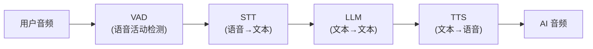
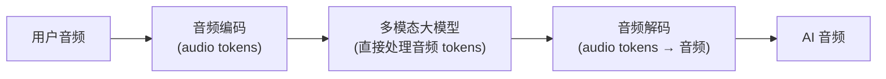
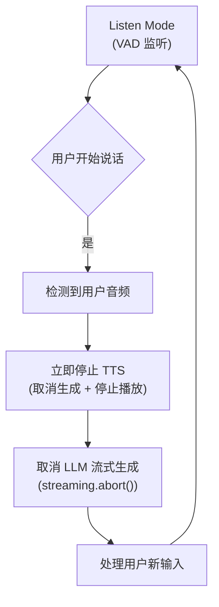

<section class="doc-hero">
  <p class="doc-hero__kicker">垂直 Agent</p>
  <h1>语音 Agent</h1>
  <p class="doc-hero__lead">2024 年 5 月 OpenAI 发布 GPT-4o 多模态版的实时语音模式，2024 年 10 月 Realtime API 上线，2025 年 Sesame 用"音色和情感都自然"的模型让市场重新认识"AI 语音可以是什么样"。语音 Agent 表面是"加个 STT 和 TTS"，本质是延迟工程 + 自然性建模 + 打断处理的综合挑战。本文讲清楚 cascading 架构和 speech-to-speech 端到端模型的本质差异、为什么 800ms 延迟是临界线、语音 Agent 在电话客服落地的真实卡点。</p>
  <div class="doc-hero__meta" aria-label="本文信息">
    <span>适合阶段：进阶 / 前沿</span>
    <span>核心链路：音频流入 → 理解 → 决策 → 音频流出</span>
    <span>面试重点：cascading vs end-to-end + 延迟工程 + barge-in 设计</span>
  </div>
</section>

> **本文边界**：聚焦语音 Agent 的架构演进和工程挑战。客服场景的落地见 [客服 Agent](./customer-service)；OpenAI Realtime API 见 [OpenAI Agents SDK](../frameworks/openai-agents-sdk)；多模态模型的能力边界见 [LLM 章节](../llm/models)。

## 面试官想考什么

读完这篇你要能正面回答下面这些题。每题后面括号里是面试官真正想看你答出什么。

<div class="interview-grid">
  <div>
    <strong>语音 Agent 的传统 cascading 架构（STT + LLM + TTS）有什么固有问题？</strong>
    <span>考延迟和信息损失——三段串联延迟累加（通常 2-4 秒）、语音情感/语速/停顿信息在转 text 时丢失。</span>
  </div>
  <div>
    <strong>GPT-4o 的"实时语音模式"和 cascading 架构本质区别在哪？</strong>
    <span>考端到端模型概念——GPT-4o 原生支持音频 token 的输入输出，不经过 text 中转，延迟和自然性都质变。</span>
  </div>
  <div>
    <strong>语音 Agent 的"800ms 延迟"为什么是关键临界线？</strong>
    <span>考人类对话感知——人类对话的自然轮换间隔约 200-500ms，超过 800ms 用户感觉"卡"，超过 1.5 秒感觉"AI 在思考"，严重伤害自然感。</span>
  </div>
  <div>
    <strong>Barge-in（打断）是什么？怎么实现的？</strong>
    <span>考实时音频系统设计——用户在 AI 说话时插话，系统要立即识别 + 停止 AI + 切到聆听模式，涉及 VAD、流式 STT、TTS 取消。</span>
  </div>
  <div>
    <strong>为什么语音 Agent 在客服电话场景的爆发比预期慢？</strong>
    <span>考工程现实——电话有 8kHz 采样率 + 编码失真 + 网络抖动，模型在录音棚级别音频上训练好，到电话场景效果暴跌。</span>
  </div>
  <div>
    <strong>Sesame 凭什么"重新定义"AI 语音？它做了什么不同？</strong>
    <span>考音色和情感生成——Sesame 用大型 Decoder 同时建模 acoustic features 和 semantic tokens，让韵律、停顿、笑声都自然，不是只"声音像人"。</span>
  </div>
  <div>
    <strong>语音 Agent 的成本和延迟怎么权衡？</strong>
    <span>考多模型组合架构——简单意图可以用小模型快速响应，复杂决策用大模型，关键是路由判断。</span>
  </div>
  <div>
    <strong>语音 Agent 的隐私和合规边界在哪？</strong>
    <span>考真实运营问题——通话录音的存储、双方知情同意、医疗/金融场景的特殊规定、声纹 ID 的滥用风险。</span>
  </div>
</div>

---

## 为什么语音 Agent 突然变成了热门赛道

2023 年的语音 Agent 还是"拼装"形态——你接 Deepgram 做 STT、调 GPT-4 生成回复、调 ElevenLabs 做 TTS——每段延迟相加 2-4 秒，且语音里的情感、停顿、笑声全部丢失。用过的人都觉得"像在和会延迟回答的机器人对话"。

2024 年 5 月 OpenAI 发布 GPT-4o 时，他们的 demo 让市场炸了——AI 能实时打断、能在你说一半时插话补充、能听出你的呼吸节奏调整自己的回复、笑声听起来真的像笑。这不是工程优化能达到的——这是范式切换。同年 10 月 Realtime API 让开发者能调这个能力。

之后一系列产品和模型集中涌现：

```
2024.05  OpenAI GPT-4o 多模态版（含原生语音）
2024.07  Hume EVI（情感感知语音 Agent）
2024.10  OpenAI Realtime API
2025.02  Sesame（音色和情感都被认为"突破"的模型）
2025+    Vapi、Retell、Bland、Synthflow（语音 Agent 平台层）
```

驱动这波爆发的原因：

**(1) 端到端语音模型出现**

GPT-4o 是第一个原生支持音频输入输出的大模型——不是把音频转 text 再处理，而是把音频本身作为模型的输入 token。这让"音频里的所有信息"（情感、语速、口音、停顿）都能被模型理解。

**(2) 延迟可以压到对话级**

GPT-4o 的端到端语音延迟约 250-500ms。这第一次让 AI 语音对话感觉"像人对话"而非"像机器"。

**(3) TTS 的最后一公里**

Sesame、ElevenLabs、PlayHT 等公司在 TTS 的"情感和韵律"上做出了质的突破。AI 声音不再是"标准播音腔"——能笑、能犹豫、能呈现喜怒哀乐。

**(4) 应用场景成熟**

电话客服、销售外呼、医疗问询、教育陪练——这些场景之前只能用人工或低质量 IVR，现在有了真正可用的 AI 替代方案。

---

## 两种架构：Cascading vs End-to-End

理解语音 Agent 必须先理解这两种架构的本质差异。

### Cascading 架构（传统）



代表实现：

- **STT**：Deepgram / Whisper / AssemblyAI
- **LLM**：GPT-4o text / Claude / Gemini
- **TTS**：ElevenLabs / Cartesia / PlayHT / 11Labs

总延迟链路：

| 阶段 | 延迟 | 说明 |
|---|---|---|
| VAD 检测说完 | 200-500ms | 等用户说完一句的判断（"end-of-turn detection"） |
| STT | 100-300ms | 流式 STT 已经能压得很低 |
| LLM | 500-2000ms | 第一个 token 时间（TTFT） |
| TTS | 100-500ms | 第一个音频块时间 |
| **总计** | **900-3300ms** | 用户感觉到"AI 开始说话"的时延 |

**Cascading 的根本问题**：

**(1) 延迟累加且不可压缩**

每一段都是独立模型独立调用，延迟相加。即使每段都优化到极致，总延迟也很难低于 1 秒。

**(2) 信息丢失**

```
用户音频："这个真的太！糟糕！了！" （重音、停顿、情绪）
  ↓ STT
文本："这个真的太糟糕了"
  ↓ LLM
文本回复："我理解您的失望..."
  ↓ TTS
音频：标准平静腔回复
```

情感信息在 STT 阶段就丢了。LLM 看到的只是 "这个真的太糟糕了" 这段平凡的文字。

**(3) 优化点分散**

要降总延迟，你要分别优化 STT、LLM、TTS。每家是不同公司不同 API，你只能做工程上的串联优化。

### End-to-End 架构（GPT-4o / Sesame）



**关键洞察**：模型直接读音频、直接生成音频。中间没有 text 中转。

**实现要点**：

**(1) 音频 tokenizer**

把音频转成 discrete tokens（类似文本 token 但是 audio token）。GPT-4o 用的是基于 Mel spectrogram + RVQ（Residual Vector Quantization）的 tokenizer，每秒 50-100 个 token。

**(2) Decoder-only Transformer**

和 GPT 一样的架构，但 vocabulary 包含 audio token + text token。同一个模型能"听"也能"说"。

**(3) 流式生成**

模型生成 audio token 时不需要等完整回复——首个 token 生成就能解码出音频片段播放。

**端到端的优势**：

- **延迟暴跌**：250-500ms（vs cascading 的 1-3 秒）
- **情感保留**：用户音频里的情感直接被模型"听到"，回复里也能带情感
- **副语言信号**：呼吸、笑声、犹豫这些都能传递

**代价**：

- **模型大**：端到端语音模型比纯 text 模型大 2-3 倍（要建模音频）
- **训练成本高**：需要大量 paired 音频数据
- **生态封闭**：你被绑定到模型供应商（OpenAI / Anthropic / Google），不能像 cascading 那样混搭

---

## 800ms：延迟的临界线

为什么"800ms"反复被提起？这是基于人类对话研究的临界线。

```
人类对话的"轮换间隔"：
  - 流畅对话：100-500ms
  - 思考一下：500-1000ms
  - 明显的停顿：1000-2000ms
  - 让人尴尬的沉默：>2000ms
```

AI 语音 Agent 的总响应延迟（从用户说完到 AI 开始回应）落在这些区间的体验差异：

| 延迟 | 感觉 |
|---|---|
| < 500ms | "和真人对话差不多" |
| 500-800ms | "稍慢但可接受" |
| 800-1500ms | "感觉是 AI" |
| > 1500ms | "卡顿，让人想结束对话" |

800ms 是商业可用的分水岭。这就是为什么所有语音 Agent 厂家都死磕这个数字。

**怎么压到 800ms 以下？**

延迟链路的逐项优化：

**(1) VAD 改造**

传统 VAD 是"等用户停 500ms 才认为说完"——这是延迟大头。优化：

- **预测式 VAD**：基于语义判断用户是否说完（如句子结构完整），不只看声音停顿
- **GPT-4o 的端到端 VAD**：模型自己判断该不该回话，不依赖外部 VAD

**(2) 流式 STT**

不等用户说完整句，边说边出文字。Deepgram Nova-2 的 partial result 延迟在 50-150ms。

**(3) Streaming LLM**

不等 LLM 生成完整回复，第一个 token 出来就送 TTS。要求 TTS 也支持流式输入。

**(4) Streaming TTS**

不等收到完整文本，按句/按词流式合成。ElevenLabs / Cartesia 的 streaming TTS 首字节延迟 100-300ms。

**(5) 推测性执行**

更激进：用户说一半时，AI 就开始基于"可能的完整意图"准备回复。如果用户后面没改主意，回复立刻就绪。

把这些都做到极致，cascading 架构能压到 1.2-1.5 秒——仍达不到 800ms。这是端到端模型的核心价值——它直接跳过中间所有阶段。

---

## Barge-in：让 AI 能被打断

人类对话中，对方说话时你能插嘴。AI 语音也必须支持，否则体验很糟：

```
用户："帮我订一张明天去北京的机票..."
AI："好的，我帮您查询明天去北京的机票。请问您希望什么时间起飞？早班、中班还是晚班？您对航空公司有偏好吗？是否需要靠窗座位？" 
     [AI 持续说，用户已经想打断 3 次了]

用户：[终于忍不住打断] "上午的就行！"
```

Barge-in（打断）就是让 AI 在用户开始说话时立即停止、切换到聆听模式。看似简单但工程上要处理多个细节：



**实现细节**：

**(1) Half-duplex vs Full-duplex**

```
Half-duplex（半双工）：要么 AI 说要么用户说，不能同时
Full-duplex（全双工）：双方能同时说话，AI 边听边能调整自己
```

主流语音 Agent 还是 half-duplex。Full-duplex 是 2024-2025 年的研究前沿（如 Moshi 模型）——但效果不稳。

**(2) 误打断**

用户的咳嗽、"嗯""啊"这种回应，不该触发打断。VAD 要能区分"真说话"和"附和音"。

**(3) 上下文保留**

打断后，AI 之前说了一半的内容要留在 context 里——用户可能基于此反应。比如：

```
AI："好的，明天有早班 7:30 的、中班 12:00 的、晚班..."
用户："早班！"
AI 应该知道用户选的是 7:30 那班，因为它说到这里被打断
```

context 不能完全丢，但也不能全保留（AI 还没说出来的话不算）。准确的做法是："已经发声的部分"保留，"还在 LLM 队列里没说的部分"丢弃。

---

## 主流产品和模型

| 产品/模型 | 架构 | 延迟 | 卖点 |
|---|---|---|---|
| **OpenAI Realtime API** | End-to-end（GPT-4o） | ~300ms | 端到端 + Function calling + 多语言 |
| **Sesame** | End-to-end | ~400ms | 音色和情感最自然 |
| **Hume EVI** | Cascading + 情感模型 | ~600ms | 情感识别和共情回应 |
| **Vapi** | 平台层（用上面这些模型） | 取决于配置 | 给开发者搭电话 Agent 的工具链 |
| **Retell AI** | 平台层 | 取决于配置 | 电话场景优化 |
| **Bland AI** | 平台层 | 取决于配置 | 销售外呼场景 |
| **Synthflow** | 平台层 | 取决于配置 | 多渠道（电话/网页/API） |

**几个判断维度**：

**(1) 模型 vs 平台**

OpenAI / Sesame / Hume 是模型层——你直接调 API。
Vapi / Retell / Bland / Synthflow 是平台层——他们用上面这些模型 + 加电话/会议/CRM 集成。

**(2) 端到端 vs Cascading**

端到端只有 OpenAI Realtime 和 Sesame（部分场景）。
Hume EVI 是 cascading + 情感增强。
平台层产品大多是 cascading（用 Deepgram + GPT/Claude + ElevenLabs）。

**(3) 电话场景优化**

电话语音是 8kHz 单声道 + 编码失真——和录音棚级别音频差远了。Vapi、Retell、Bland 这类专门做电话 Agent 的平台会对模型做电话场景微调。OpenAI Realtime 原生在电话上效果不如这些平台。

---

## 用 OpenAI Realtime API 做一个简单语音 Agent

```python
# pip install openai websockets
import asyncio
import websockets
import json
import base64

async def voice_agent():
    uri = "wss://api.openai.com/v1/realtime?model=gpt-4o-realtime-preview"
    headers = {
        "Authorization": "Bearer YOUR_API_KEY",
        "OpenAI-Beta": "realtime=v1"
    }
    
    async with websockets.connect(uri, extra_headers=headers) as ws:
        # 1. Session config
        await ws.send(json.dumps({
            "type": "session.update",
            "session": {
                "modalities": ["text", "audio"],
                "instructions": "You are a helpful customer service agent. Be concise and friendly.",
                "voice": "alloy",  # alloy, echo, fable, onyx, nova, shimmer
                "input_audio_format": "pcm16",
                "output_audio_format": "pcm16",
                "input_audio_transcription": {"model": "whisper-1"},
                "turn_detection": {
                    "type": "server_vad",          # 让服务器决定何时该回话
                    "threshold": 0.5,               # VAD 灵敏度
                    "prefix_padding_ms": 300,
                    "silence_duration_ms": 500,     # 等用户停 500ms 算说完
                },
                "tools": [
                    {
                        "type": "function",
                        "name": "lookup_order",
                        "description": "Look up an order by ID",
                        "parameters": {
                            "type": "object",
                            "properties": {"order_id": {"type": "string"}},
                            "required": ["order_id"]
                        }
                    }
                ]
            }
        }))
        
        # 2. 启动两个 task：录音上传 + 接收响应
        await asyncio.gather(
            audio_input_task(ws),      # 从麦克风读音频，base64 编码，每 100ms 发一次
            response_task(ws),          # 处理服务器发来的事件
        )

async def audio_input_task(ws):
    # 用 sounddevice 录音，分块发送
    import sounddevice as sd
    
    def callback(indata, frames, time, status):
        audio_b64 = base64.b64encode(indata.tobytes()).decode()
        asyncio.run_coroutine_threadsafe(
            ws.send(json.dumps({
                "type": "input_audio_buffer.append",
                "audio": audio_b64
            })),
            loop
        )
    
    loop = asyncio.get_event_loop()
    with sd.InputStream(samplerate=24000, channels=1, dtype='int16', callback=callback):
        while True:
            await asyncio.sleep(0.1)

async def response_task(ws):
    async for message in ws:
        event = json.loads(message)
        
        if event['type'] == 'response.audio.delta':
            # 收到一段音频，播放
            audio_bytes = base64.b64decode(event['delta'])
            play_audio(audio_bytes)
        
        elif event['type'] == 'response.audio_transcript.delta':
            # 收到 AI 说话的文字（用于显示字幕）
            print(event['delta'], end='', flush=True)
        
        elif event['type'] == 'response.function_call_arguments.done':
            # 模型决定调用工具
            result = await execute_tool(event['name'], json.loads(event['arguments']))
            await ws.send(json.dumps({
                "type": "conversation.item.create",
                "item": {
                    "type": "function_call_output",
                    "call_id": event['call_id'],
                    "output": result
                }
            }))
        
        elif event['type'] == 'input_audio_buffer.speech_started':
            # 用户开始说话 → 触发 barge-in
            await ws.send(json.dumps({"type": "response.cancel"}))

asyncio.run(voice_agent())
```

100 行左右就是个能跑的电话/语音 Agent——VAD、流式音频、工具调用、barge-in 都有了。这是 Realtime API 把工程复杂度抽象的价值。

---

## 容易踩的坑

**坑 1：电话场景下模型识别率暴跌**

- **现象**：在本地麦克风测试效果很好，接到真实电话后 STT 错误率翻倍
- **根因**：电话音频是 8kHz / μ-law 编码 / 网络抖动 + 丢包，模型在录音棚级别（24kHz / Opus）训练，迁移到电话掉精度
- **修法**：(a) 用电话专用 STT 模型（Deepgram Phone Call、AssemblyAI Best for Phone），(b) 在 prompt 里告诉 LLM"输入是电话语音可能有失真，需要时让用户重述"

**坑 2：误打断**

- **现象**：用户咳嗽、"嗯"了一下，AI 就停下来听
- **根因**：VAD 太灵敏，把 non-speech 当成 speech
- **修法**：调高 VAD 阈值；用更智能的 VAD 区分"真说话"和"附和音"

**坑 3：背景噪音让模型误以为有人说话**

- **现象**：餐厅、咖啡馆里用语音 Agent，AI 持续被环境音"打断"
- **根因**：环境音被 VAD 判定为人声
- **修法**：(a) 服务端 VAD 用更高阈值，(b) 用 noise suppression 前处理（RNNoise、Krisp）

**坑 4：方言/口音失败**

- **现象**：标准普通话/英语效果好，方言/重口音用户表现极差
- **根因**：训练数据主要来自标准发音
- **修法**：(a) 用多方言/口音的 STT（Deepgram、Azure 支持很多方言），(b) Realtime API 对部分方言天然弱，可能需要 fallback 到 cascading + 特化 STT

**坑 5：长对话延迟漂移**

- **现象**：对话刚开始延迟 400ms，跑了 10 分钟后变成 1.5 秒
- **根因**：context 累积，每次 LLM 调用 input tokens 变多，延迟变长
- **修法**：滚动窗口截断历史 + LLM 摘要压缩（Realtime API 也支持手动 truncate conversation）

**坑 6：合规和隐私**

- **现象**：客户对话被录音、声纹被存储 → 法务/合规审查不通过
- **根因**：很多国家/地区要求双方知情同意 + 录音存储有期限
- **修法**：(a) 通话开始时强制告知"本通话由 AI 处理且会被录音"，(b) 录音存储遵守 GDPR/CCPA 等法规，(c) 医疗/金融场景额外有 HIPAA/PCI 等要求

**坑 7：成本失控**

- **现象**：测试时跑了几小时通话，账单几百美元
- **根因**：Realtime API 按音频分钟收费，input + output 都计——一小时双向通话 ~$10
- **修法**：(a) 短任务用便宜的 cascading 架构，(b) 监控通话时长，(c) 计费模型要算清楚（每分钟 $0.06 input + $0.24 output 的级别）

---

## 面试题深度解析

**Q1: Cascading 架构和 End-to-End 架构本质区别？**

- **30 秒版本**：Cascading 是 STT + LLM + TTS 三个独立模型串联，中间用 text 传递信息——延迟累加（1-3 秒）+ 情感等副语言信号在 text 中转时丢失。End-to-end 是单个多模态模型直接处理 audio token，不经过 text——延迟可压到 300-500ms + 情感保留 + 副语言信号传递。代价是模型大、训练成本高、生态封闭（被绑定到模型供应商）。
- **追问：那 cascading 架构会被淘汰吗？** 短期不会。cascading 的优势是灵活组合——你可以用最便宜的 STT + 最强的 LLM + 最自然的 TTS，每段单独选。end-to-end 模型不能这么混搭。成本敏感场景（如大规模客服外呼）cascading 仍是主流。end-to-end 在追求"对话自然"的高端场景占优势。
- **追问：怎么判断哪种架构适合？** 三个判断维度：(1) 延迟要求多严？要 < 500ms → end-to-end；(2) 是否需要情感感知？需要 → end-to-end；(3) 成本要求多敏感？成本敏感且对话简单 → cascading。给个具体例子：高端 AI 同伴（如 Replika 升级版）选 end-to-end；电信公司大规模催收外呼选 cascading。

**Q2: 为什么 800ms 是延迟临界线？**

- **30 秒版本**：基于人类对话研究——人类对话的轮换间隔通常 100-500ms，超过 800ms 用户感觉"卡"，超过 1.5 秒感觉"AI 在思考"，严重伤害自然感。800ms 是"商业可用"和"明显是机器"的分水岭，所有语音 Agent 产品都死磕这个数字。
- **追问：那 GPT-4o 的 300ms 是怎么做到的？** 端到端模型直接跳过 cascading 的中间环节——没有"等用户说完 → STT → LLM 思考 → TTS 合成"的串行链，而是模型直接对 audio token 流做处理。OpenAI 的具体优化包括：(1) 流式 audio token 编码（每 20ms 出一批 token），(2) 模型对 audio token 做 streaming inference（不等完整音频），(3) audio token 解码也流式（生成一个 token 就播一段音频）。
- **追问：人类听到 AI 回应的延迟里，哪部分最难压？** End-of-turn detection——判断"用户说完了"。如果太敏感（200ms 静默就算说完），用户中间停顿喘气就被打断；太宽松（1 秒静默才算）延迟太大。GPT-4o 的 server VAD 默认 500ms silence_duration 是经验值。更先进的做法是"语义 VAD"——基于内容是否完整判断而不是声学静默，但这又会带来"用户话还没说完就开始处理"的风险。这是个 open problem。

**Q3: Barge-in 怎么实现？**

- **30 秒版本**：当 VAD 检测到用户开始说话（在 AI 还在说话期间），立即：(1) 停止 TTS 输出，(2) 取消 LLM 流式生成，(3) 把"AI 已说出"部分保留在 context，"未说出"丢弃，(4) 切到聆听模式处理新输入。Realtime API 有 `response.cancel` 事件专门干这事。
- **追问：怎么避免误触发 barge-in？** 三个层次：(1) VAD 阈值调高（避免环境音触发），(2) 区分"实质性说话"和"附和音"（嗯/啊这类不算说话），(3) 用语义判断——如果用户只说了一个字立即打断，可能是误触，等再多说几个字再确认。Sesame 的做法是把这种"附和音"模型化——它能识别"嗯嗯"是确认，"嗯？"是疑问，不同应对。
- **追问：full-duplex（全双工）和 half-duplex 的差异？** half-duplex 是任一方说话时另一方等待——AI 说完用户才能说，或用户说完 AI 才说（barge-in 是 half-duplex 的优化）。full-duplex 是双方能同时说，AI 边听边能做反应（如"嗯""明白"这种回应同时进行）。full-duplex 是 2024-2025 年研究前沿（Moshi 模型），效果还不稳。商业产品几乎全是 half-duplex + barge-in。

**Q4: 语音 Agent 在电话客服场景的爆发为什么比预期慢？**

- **30 秒版本**：技术 + 产品 + 业务三重壁垒。技术——电话音频是 8kHz + μ-law 编码 + 网络抖动，模型在录音棚级别音频上训练，到电话场景效果暴跌；产品——客服对话有大量上下文（用户身份、历史工单、CRM 数据），单纯"会聊天的语音"做不了真正的客服；业务——合规要求双方同意录音、医疗/金融场景特殊监管、企业客户对 AI 错处理的容忍度低。
- **追问：那 Klarna 这类公司的 AI 客服是怎么做的？** 大部分是文字而非语音——用户在 App/Web 上用文字 chat。文字客服规避了语音里的所有问题（音质、口音、打断）。语音 Agent 在电话场景的真正落地（Vapi、Retell、Bland 这些平台的客户）多是销售外呼、提醒类外呼、简单咨询，复杂客服仍以文字为主。
- **追问：未来电话语音 Agent 会替代多少人工坐席？** 短期（2026-2028）替代简单类——预约提醒、状态查询、单一问题。中期（2028-2030）能替代中等复杂度——多轮咨询、简单异议处理。长期始终保留人工的部分：情感诉求、跨系统复杂问题、监管要求人工。和文字客服的演进类似，但慢 2-3 年——语音的技术和合规壁垒都更高。

---

## 延伸阅读

- **OpenAI Realtime API 文档** [platform.openai.com/docs/guides/realtime](https://platform.openai.com/docs/guides/realtime) — Realtime API 的官方指南，包含事件协议、VAD 配置、function calling 集成
- **Sesame 技术博客** [sesame.com/research](https://www.sesame.com/research) — Sesame 公开的"为什么语音听起来自然"的技术解读，2025 年最重要的语音模型技术分享
- **Hume EVI** [hume.ai/products/empathic-voice-interface](https://www.hume.ai/products/empathic-voice-interface) — 情感感知语音 Agent 的代表，理解"非言语信息"的产品落地
- **Moshi 论文（full-duplex 研究）** [arxiv.org/abs/2410.00037](https://arxiv.org/abs/2410.00037) — Kyutai 实验室的 full-duplex 语音模型，前沿但效果还不稳
- **Deepgram 语音 Agent Stack** [deepgram.com/learn/voice-agent](https://deepgram.com/learn/voice-agent-architecture) — cascading 架构的工程化教程，理解每个环节的工程细节
- **Vapi 文档** [docs.vapi.ai](https://docs.vapi.ai) — 电话语音 Agent 平台层，看完整电话 Agent 怎么落地（含 CRM、telephony provider 集成）
- **本站 [客服 Agent](./customer-service)** — 语音 Agent 在客服场景的应用，两文搭配阅读
- **本站 [OpenAI Agents SDK 深度剖析](../frameworks/openai-agents-sdk)** — Realtime API 在 Agents SDK 里的集成方式
- **本站 [LLM 主流模型对比](../llm/models)** — GPT-4o、Gemini 等多模态模型的能力对比
