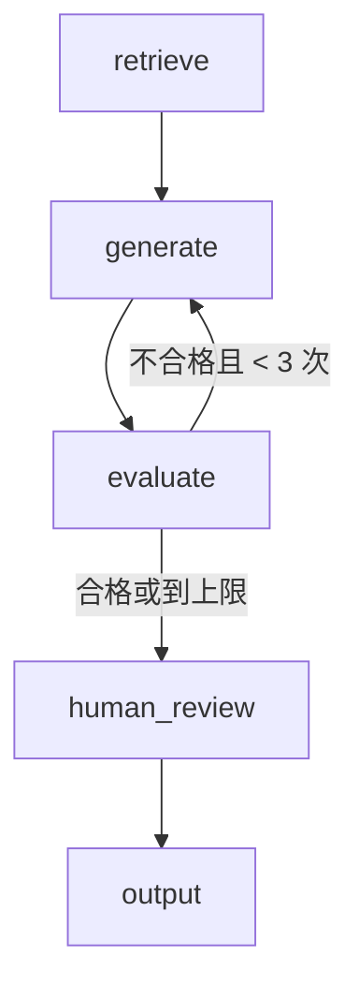

<section class="doc-hero">
  <p class="doc-hero__kicker">流程编排</p>
  <h1>LangGraph 深度解析</h1>
  <p class="doc-hero__lead">LangGraph 是 LangChain 团队推出的 Agent 编排框架，用有向图（节点 + 边）建模 LLM 应用的控制流。它的定位是"低层编排运行时"——不藏魔法，你完全控制每一步怎么走。Klarna、Lyft、Coinbase、LinkedIn 等 25+ 家企业在用。</p>
  <div class="doc-hero__meta" aria-label="本文信息">
    <span>适合阶段：实战 / 生产</span>
    <span>核心：StateGraph + Checkpointer + Human-in-the-Loop</span>
    <span>面试重点：为什么选 LangGraph + 和其他框架对比</span>
  </div>
</section>

> **本文边界**：聚焦 LangGraph 框架本身的核心概念和使用方法。编排模式的通用理论见 [编排模式](./patterns)；Workflow vs Agent 的边界见 [Workflow vs Agent](./workflow-vs-agent)；LangChain 生态全貌见 [LangChain 框架](../frameworks/langchain)；多 Agent 用 LangGraph 实现的案例见 [多 Agent 架构模式](../multi-agent/patterns)。

## 面试官想考什么

读完这篇你要能正面回答下面这些题。每题后面括号里是面试官真正想看你答出什么。

<div class="interview-grid">
  <div>
    <strong>LangGraph 和 LangChain 是什么关系？为什么不直接用 LangChain？</strong>
    <span>考你能不能讲清"LangChain 是工具层，LangGraph 是编排层"的定位差异。</span>
  </div>
  <div>
    <strong>LangGraph 的 StateGraph 里，State、Node、Edge 分别是什么？</strong>
    <span>考核心概念的理解——不是背定义，是能画出一个 graph 并解释数据怎么流转。</span>
  </div>
  <div>
    <strong>Checkpointer 解决什么问题？生产环境应该用哪种？</strong>
    <span>考对"状态持久化"的理解——checkpoint 不只是存档，还是 HITL 和 time-travel debugging 的基础。</span>
  </div>
  <div>
    <strong>LangGraph 怎么实现 Human-in-the-Loop？</strong>
    <span>考 interrupt + checkpoint + resume 的三步机制。</span>
  </div>
  <div>
    <strong>LangGraph vs CrewAI vs AutoGen，什么场景用哪个？</strong>
    <span>考框架选型判断力——不是"LangGraph 最好"，而是各自的 sweet spot。</span>
  </div>
  <div>
    <strong>LangGraph 的 Reducer 是什么？什么时候需要自定义 Reducer？</strong>
    <span>考对并行写入同一 state 字段时冲突处理的理解。</span>
  </div>
  <div>
    <strong>用 LangGraph 做一个 RAG + 条件路由的系统，画出 graph 结构。</strong>
    <span>考实战能力——能在白板上画出节点、边、条件边的完整 graph。</span>
  </div>
</div>

---

## 为什么需要 LangGraph

先看一个没有编排框架的 Agent 实现：

```python
messages = [{"role": "system", "content": "你是助手"}]
tools = [search, calculator]

while True:
    response = llm.chat(messages, tools=tools)
    if response.tool_calls:
        for call in response.tool_calls:
            result = execute_tool(call)
            messages.append({"role": "tool", "content": result})
    else:
        break  # 模型没调工具，认为完成了
```

这段代码能跑，但上生产会撞墙：

1. **没有状态持久化**——服务重启，对话丢失。用户等了 5 分钟的计算结果没了
2. **没有 human-in-the-loop**——Agent 决定执行一个高风险操作，你无法在中间暂停审批
3. **没有条件分支**——所有输入走同一条路，无法根据类型路由
4. **没有并行**——三个独立查询只能串行跑
5. **不可观测**——出了问题你不知道 Agent 走到了哪一步、为什么

LangGraph 的解决方案：把这个 while 循环变成一张**有向图**——节点是处理步骤，边是控制流，状态在图上流转，checkpoint 自动存档。

---

## 核心概念

### StateGraph：图的骨架

LangGraph 的核心数据结构是 `StateGraph`——一个以 TypedDict 为状态类型的有向图。

```python
from langgraph.graph import StateGraph, END
from typing import TypedDict, Annotated
from operator import add

class State(TypedDict):
    query: str
    messages: Annotated[list, add]  # Reducer：追加而不是覆盖
    result: str

graph = StateGraph(State)
```

三个核心概念：

**State（状态）**：一个 TypedDict，定义了图上流转的数据。每个节点读取 state、返回部分更新。不需要返回完整 state——只返回你要改的字段，LangGraph 自动 merge。

**Node（节点）**：一个 Python 函数，接收 state，返回 state 的部分更新。节点可以是确定性代码，也可以调用 LLM。

```python
def retrieve(state: State) -> dict:
    docs = vector_store.search(state["query"])
    return {"messages": [f"找到 {len(docs)} 条结果"]}

def generate(state: State) -> dict:
    response = llm.invoke(state["messages"])
    return {"result": response.content}

graph.add_node("retrieve", retrieve)
graph.add_node("generate", generate)
```

**Edge（边）**：定义节点之间的连接。三种类型：

```python
# 1. 普通边：A 完成后一定走 B
graph.add_edge("retrieve", "generate")

# 2. 条件边：根据函数返回值决定走哪
def route(state: State) -> str:
    if "代码" in state["query"]:
        return "code_gen"
    return "generate"

graph.add_conditional_edges("classify", route, {
    "code_gen": "code_generator",
    "generate": "generate",
})

# 3. 入口和出口
graph.set_entry_point("retrieve")
graph.add_edge("generate", END)
```

### Reducer：并行写入的冲突解决

当多个节点同时更新 state 的同一个字段时，需要 Reducer 决定怎么合并：

```python
class State(TypedDict):
    query: str
    # 没有 Reducer：后写覆盖先写
    result: str
    # 有 Reducer（add）：追加到列表
    messages: Annotated[list, add]
```

默认行为是**后写覆盖**。用 `Annotated[list, add]` 声明一个 Reducer 后，多个节点返回的 messages 会被追加到同一个 list 里，而不是互相覆盖。

什么时候需要自定义 Reducer？当并行的多个节点都往同一个字段写结果时——比如三个并行检索节点都返回 docs，你希望合并而不是覆盖。

### Checkpointer：状态持久化

Checkpointer 在每个节点执行后自动保存 state 快照。

```python
from langgraph.checkpoint.memory import MemorySaver       # 开发用
from langgraph.checkpoint.postgres import PostgresSaver    # 生产用

# 开发环境
app = graph.compile(checkpointer=MemorySaver())

# 生产环境
app = graph.compile(checkpointer=PostgresSaver(conn_string))
```

Checkpointer 给你三个能力：

1. **会话持久化**——用 thread_id 区分不同对话，服务重启不丢状态
2. **Human-in-the-Loop**——暂停执行等人工审核，审核完从断点恢复
3. **Time-travel debugging**——回放到任意历史节点，看当时的 state 是什么

```python
# 调用时传 thread_id
config = {"configurable": {"thread_id": "user-123"}}
result = app.invoke({"query": "帮我查一下订单"}, config)

# 同一个 thread_id 的后续调用能看到之前的 state
result = app.invoke({"query": "那退款呢"}, config)
```

### Human-in-the-Loop：interrupt + resume

LangGraph 的 HITL 基于 `interrupt()` 函数——在节点内暂停执行，等人工输入：

```python
from langgraph.types import interrupt, Command

def review_node(state: State) -> dict:
    decision = interrupt({
        "message": "以下内容即将发布，请审核",
        "content": state["draft"],
    })
    return {"approved": decision == "approve"}
```

调用方的恢复流程：

```python
# 第一次调用——执行到 review_node 后暂停
result = app.invoke({"query": "写一篇公告"}, config)
# result 会包含 interrupt 信息

# 人工审核后恢复
app.invoke(Command(resume="approve"), config)
```

关键工程细节：
- `interrupt()` 触发时，当前 state 已经被 checkpointer 存档
- 恢复可以在几秒后，也可以在几天后——只要 checkpointer 用的是持久存储
- 一个 graph 可以有多个 interrupt 节点

---

## 实战：从零搭一个 RAG Agent

把上面的概念串起来，搭一个完整的 RAG Agent：先检索、再生成、质量不合格就重来、合格后人工审核。

```python
from langgraph.graph import StateGraph, END
from langgraph.types import interrupt
from langgraph.checkpoint.memory import MemorySaver
from typing import TypedDict, Annotated
from operator import add

class RAGState(TypedDict):
    query: str
    docs: list[str]
    draft: str
    evaluation: dict
    attempts: int
    approved: bool

def retrieve(state: RAGState) -> dict:
    """检索相关文档"""
    docs = vector_store.similarity_search(state["query"], k=5)
    return {"docs": [d.page_content for d in docs]}

def generate(state: RAGState) -> dict:
    """基于检索结果生成回答"""
    context = "\n".join(state["docs"])
    response = llm.invoke(
        f"基于以下资料回答问题。\n资料：{context}\n问题：{state['query']}"
    )
    return {"draft": response.content, "attempts": state.get("attempts", 0) + 1}

def evaluate(state: RAGState) -> dict:
    """评估生成质量"""
    eval_response = llm.invoke(
        f"评估以下回答是否准确且完整，返回 JSON: "
        f'{{"pass": true/false, "reason": "..."}}\n'
        f"问题：{state['query']}\n回答：{state['draft']}"
    )
    return {"evaluation": parse_json(eval_response.content)}

def should_retry(state: RAGState) -> str:
    if state["evaluation"].get("pass"):
        return "review"
    if state["attempts"] >= 3:
        return "review"  # 强制进入审核
    return "regenerate"

def human_review(state: RAGState) -> dict:
    """人工审核节点"""
    decision = interrupt({
        "draft": state["draft"],
        "evaluation": state["evaluation"],
        "prompt": "审核这份回答，回复 approve 或 reject"
    })
    return {"approved": decision == "approve"}

def output_result(state: RAGState) -> dict:
    return {"draft": state["draft"] if state["approved"] else "回答未通过审核"}

# 构建 Graph
graph = StateGraph(RAGState)
graph.add_node("retrieve", retrieve)
graph.add_node("generate", generate)
graph.add_node("evaluate", evaluate)
graph.add_node("review", human_review)
graph.add_node("output", output_result)

graph.set_entry_point("retrieve")
graph.add_edge("retrieve", "generate")
graph.add_edge("generate", "evaluate")
graph.add_conditional_edges("evaluate", should_retry, {
    "regenerate": "generate",
    "review": "review",
})
graph.add_edge("review", "output")
graph.add_edge("output", END)

app = graph.compile(checkpointer=MemorySaver())
```

这个 graph 的控制流：



组合了四种编排模式：顺序（retrieve → generate → evaluate）、循环（evaluate 不合格 → generate）、条件（should_retry 的分支）、HITL（human_review 的 interrupt）。

---

## Streaming：实时输出

LangGraph 支持三种 streaming 模式：

```python
# 1. 节点更新流——每个节点完成时推送 state 变化
for event in app.stream({"query": "什么是 RAG"}, config, stream_mode="updates"):
    print(event)
    # {"retrieve": {"docs": [...]}}
    # {"generate": {"draft": "..."}}

# 2. Token 流——LLM 生成的每个 token 实时推送
for event in app.stream({"query": "什么是 RAG"}, config, stream_mode="messages"):
    print(event)  # 一个个 token 出来

# 3. 自定义流——在节点内用 StreamWriter 推送任意数据
from langgraph.types import StreamWriter

def generate(state: RAGState, writer: StreamWriter) -> dict:
    writer({"status": "开始生成..."})
    response = llm.invoke(...)
    writer({"status": "生成完成"})
    return {"draft": response.content}
```

生产环境通常用 `stream_mode="messages"` 让前端实时显示 LLM 的输出，同时用 `updates` 模式在后台追踪 Agent 进度。

---

## Subgraph：大图拆小图

当 graph 变复杂时，用 Subgraph 把局部逻辑封装成独立模块：

```python
# 子图：检索 + 重排
retrieval_graph = StateGraph(RetrievalState)
retrieval_graph.add_node("search", search_node)
retrieval_graph.add_node("rerank", rerank_node)
retrieval_graph.add_edge("search", "rerank")
retrieval_graph.set_entry_point("search")
retrieval_sub = retrieval_graph.compile()

# 父图把子图当成普通节点
main_graph = StateGraph(MainState)
main_graph.add_node("retrieval", retrieval_sub)  # 子图作为节点
main_graph.add_node("generate", generate_node)
main_graph.add_edge("retrieval", "generate")
```

Subgraph 的好处：
- 独立测试——子图可以单独 compile + invoke
- 状态隔离——子图有自己的 State，不污染父图
- 复用——同一个子图在多个父图中使用

---

## LangGraph vs 其他框架

| 维度 | LangGraph | CrewAI | AutoGen |
|------|-----------|--------|---------|
| 抽象层级 | 低层（你控制每条边） | 高层（定义角色和任务） | 中层（对话驱动） |
| 学习曲线 | 陡——要理解图论概念 | 平——角色 + 任务很直觉 | 中——对话模型易上手 |
| 控制粒度 | 最高——条件边、子图、interrupt | 中——框架管大部分流程 | 中——对话流自动管理 |
| 生产就绪 | 高——checkpoint、streaming、LangSmith | 中——快速原型好，生产需补课 | 高——微软企业级支持 |
| 最小代码 | ~50 行 | ~35 行 | ~40 行 |
| 最佳场景 | 需要精确控制流的复杂 Agent | 角色明确的团队协作 | 对话驱动的探索任务 |

### 选型建议

- **要精确控制每一步怎么走** → LangGraph。它不假设你的 Agent 应该长什么样，你画什么图它就跑什么。
- **角色和任务已经很清楚** → CrewAI。"产品经理写需求 → 工程师写代码 → 测试验证"这种场景，CrewAI 35 行代码就搞定。
- **探索性对话、多轮协作** → AutoGen。多个 Agent 自由对话、互相质疑、收敛到结论。
- **企业级 + 微软生态** → AutoGen（Azure 集成好）。
- **快速原型 → 生产** → LangGraph。虽然起步慢，但 checkpoint + streaming + observability 的组合在生产中省的时间远超学习成本。

---

## 容易踩的坑

### 坑 1：State 设计过于扁平

**现象**：所有数据塞进一个 State，字段越来越多（20+），节点之间互相干扰。

**根因**：没有按职责拆 State。一个"query_result"字段被三个不同节点用不同含义覆盖。

**修法**：(1) 按节点职责分 namespace（或用 Subgraph 隔离）；(2) 字段命名具体化——`search_results` 而不是 `results`；(3) 超过 10 个字段考虑拆 Subgraph。

### 坑 2：条件边返回值不在映射表里

**现象**：条件函数返回了 "other"，但 `add_conditional_edges` 的映射表里没有 "other"，直接报错。

**根因**：LLM 的分类输出不可控，可能返回意料之外的值。

**修法**：条件函数里加 fallback——不在预期值列表里就返回默认值。

```python
def route(state: State) -> str:
    category = state.get("category", "")
    if category in ("refund", "shipping"):
        return category
    return "default"  # 永远有 fallback
```

### 坑 3：生产用了 MemorySaver

**现象**：服务重启后所有用户的对话状态丢失。

**根因**：MemorySaver 把 checkpoint 存在进程内存里。

**修法**：生产用 `PostgresSaver`（推荐）或 `RedisSaver`。MemorySaver 只用于本地开发和测试。

### 坑 4：循环节点没设上限

**现象**：evaluate → generate 循环跑了 30 多轮，Token 账单爆了。

**根因**：条件边只检查 evaluation.pass，没检查 attempts。

**修法**：条件函数里永远加 `if state["attempts"] >= N: return "done"`。参考值：研究类 5-8 轮，生成类 3-5 轮。

### 坑 5：Subgraph 和父图的 State 不兼容

**现象**：Subgraph 作为节点嵌入后报 state key 找不到。

**根因**：Subgraph 的 State 和父图的 State 字段名不一致。LangGraph 需要手动映射或用共享字段。

**修法**：Subgraph 的入口和出口用和父图相同的字段名，或者用 wrapper 函数做显式映射。

---

## 面试题深度解析

### Q: LangGraph 和 LangChain 是什么关系？

**30 秒版本**：LangChain 是**工具层**——提供 LLM 接口、prompt template、document loader、vector store 等基础组件。LangGraph 是**编排层**——用图结构定义这些组件之间的调用顺序和控制流。类比：LangChain 是乐高积木，LangGraph 是拼装说明书。你可以单独用 LangChain（手写 while 循环编排），也可以单独用 LangGraph（不用 LangChain 的组件），但组合使用最常见。

**追问**：为什么 LangChain 团队要单独做 LangGraph，不在 LangChain 里加编排功能？
LangChain 早期有 `AgentExecutor`，但它是一个封装好的 while 循环——固定的"调用 LLM → 执行工具 → 回 LLM"流程，无法加条件分支、并行、子图。LangGraph 用图论重新设计，让开发者完全控制控制流，而不是被框架的 `AgentExecutor` 锁死。LangChain 官方 2025 年的建议是：**所有新 Agent 实现都用 LangGraph**。

### Q: LangGraph vs CrewAI vs AutoGen，什么场景用哪个？

**30 秒版本**：三个框架的 sweet spot 不同——LangGraph 适合需要精确控制流的生产 Agent（checkpoint + streaming + observability），CrewAI 适合角色明确的团队协作（最快上手，35 行代码），AutoGen 适合对话驱动的探索任务（微软企业级支持）。选型不是"哪个更好"，而是"你的场景需要多少控制粒度"——控制粒度需求高选 LangGraph，角色协作选 CrewAI，自由对话选 AutoGen。

**追问**：如果只能选一个框架学，选哪个？
LangGraph。理由：(1) 它是最底层的——理解了图编排，CrewAI 和 AutoGen 的内部逻辑你也能推出来；(2) 生产覆盖率最高——checkpoint、streaming、HITL 是生产必需，其他框架后补；(3) LangChain 生态最大——社区资源、教程、企业案例最多。

### Q: Checkpointer 解决什么问题？

**30 秒版本**：Checkpointer 在每个节点完成后自动保存 state 快照，给你三个能力——(1) **会话持久化**：thread_id 隔离不同对话，服务重启不丢状态；(2) **Human-in-the-Loop**：interrupt 暂停执行 → 人工审核 → resume 从断点恢复，中间可以跨天；(3) **Time-travel debugging**：回放到任意历史节点，查看当时的 state，定位 bug。生产环境用 PostgresSaver，本地开发用 MemorySaver。

---

## 延伸阅读

- **LangGraph 官方文档** ([langchain-ai.github.io/langgraph](https://langchain-ai.github.io/langgraph/))
  权威参考。重点看 Concepts 和 How-to Guides 两个板块。

- **LangChain Academy：Introduction to LangGraph** ([academy.langchain.com](https://academy.langchain.com/courses/introduction-to-langgraph))
  免费课程，覆盖 state management、memory、human-in-the-loop。从零上手的最佳路径。

- **LangGraph 官方仓库** ([github.com/langchain-ai/langgraph](https://github.com/langchain-ai/langgraph))
  MIT 协议开源。看 `examples/` 目录下的多 Agent 示例——特别是 multi-agent supervisor 和 plan-and-execute。

- **DataCamp：CrewAI vs LangGraph vs AutoGen** ([datacamp.com/tutorial/crewai-vs-langgraph-vs-autogen](https://www.datacamp.com/tutorial/crewai-vs-langgraph-vs-autogen))
  三大框架的横向对比，有代码示例和性能评测。选型时参考。

- **配套阅读**：[编排模式](./patterns) — LangGraph 实现的四种基础模式；[Workflow vs Agent](./workflow-vs-agent) — 什么时候该用 graph 编排 vs 让模型自主决定；[Agent 可观测性](../engineering/observability) — LangSmith + LangGraph 的 trace 集成；[多 Agent 架构模式](../multi-agent/patterns) — 用 LangGraph 实现 supervisor / hierarchical 拓扑。
