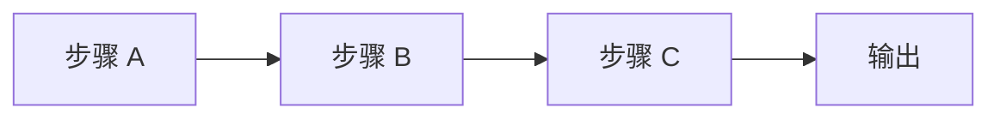
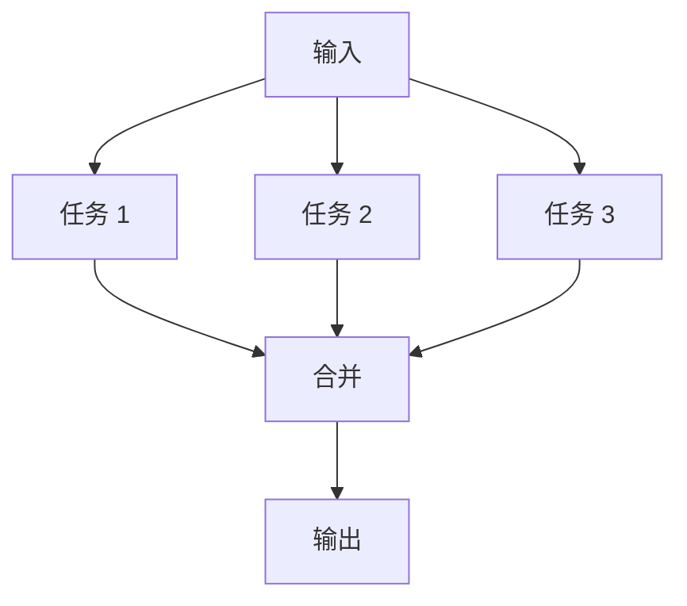
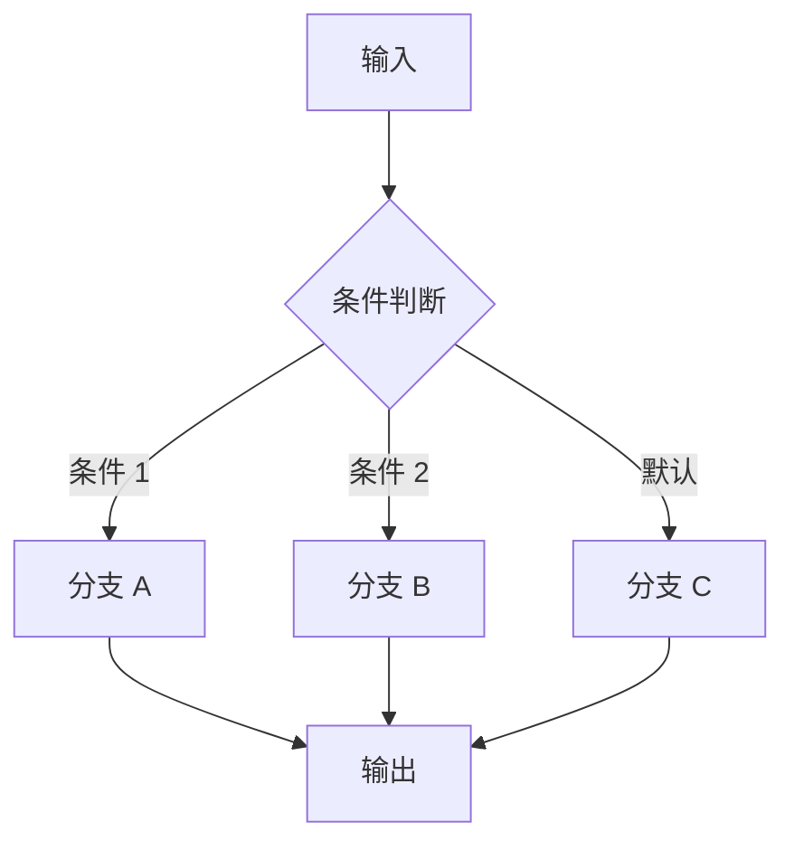
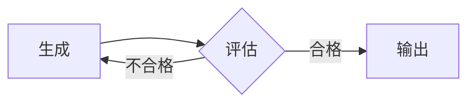
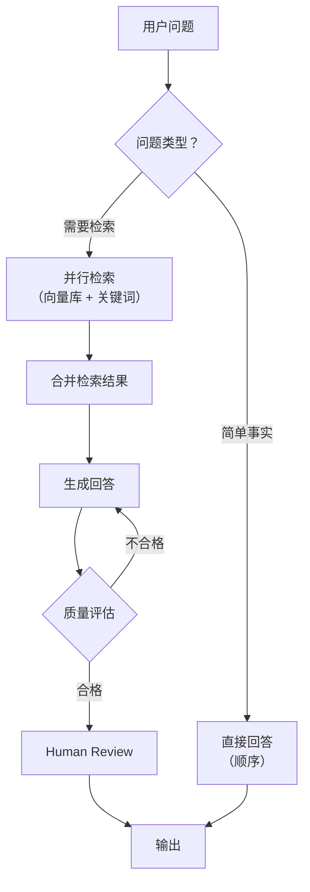

<section class="doc-hero">
  <p class="doc-hero__kicker">流程编排</p>
  <h1>编排模式（顺序 / 并行 / 条件 / 循环）</h1>
  <p class="doc-hero__lead">所有 LLM Workflow 和 Agent 系统的控制流都是四种基础模式的组合：顺序执行、并行扇出、条件分支、循环反馈。这篇讲清楚每种模式解决什么问题、什么场景用哪种、以及 Human-in-the-Loop 怎么嵌入。</p>
  <div class="doc-hero__meta" aria-label="本文信息">
    <span>适合阶段：基础 / 架构设计</span>
    <span>核心：四种控制流原语 + 组合</span>
    <span>面试重点：模式选型 + 组合设计</span>
  </div>
</section>

> **本文边界**：聚焦四种**控制流模式本身**。Workflow 和 Agent 的边界划分见 [Workflow vs Agent](./workflow-vs-agent)；用 LangGraph 实现这些模式见 [LangGraph 深度解析](./langgraph)；Anthropic 定义的五种 Workflow 模式（prompt chaining / routing / parallelization / orchestrator-workers / evaluator-optimizer）是本文四种基础模式的组合应用，详见 [Workflow vs Agent](./workflow-vs-agent)。

## 面试官想考什么

读完这篇你要能正面回答下面这些题。每题后面括号里是面试官真正想看你答出什么。

<div class="interview-grid">
  <div>
    <strong>四种编排模式分别解决什么问题？</strong>
    <span>考基础功——顺序解决步骤依赖、并行解决延迟、条件解决分支、循环解决迭代优化。</span>
  </div>
  <div>
    <strong>什么时候该用并行，什么时候必须串行？判断标准是什么？</strong>
    <span>考依赖关系分析——有数据依赖必须串行，无依赖才能并行。</span>
  </div>
  <div>
    <strong>循环模式怎么防止死循环？</strong>
    <span>考工程兜底——max_iterations、退出条件、超时、递减温度。</span>
  </div>
  <div>
    <strong>Human-in-the-Loop 该插在哪？怎么实现"暂停-恢复"？</strong>
    <span>考对 checkpoint + interrupt 机制的理解——不是所有位置都适合插人工审核。</span>
  </div>
  <div>
    <strong>Anthropic 的五种 Workflow 模式分别对应哪些基础编排模式的组合？</strong>
    <span>考能不能把高层模式拆解为底层原语——prompt chaining = 顺序，routing = 条件，等等。</span>
  </div>
  <div>
    <strong>一个复杂的 RAG + 生成 + 审核的管线，怎么用这四种模式组合？</strong>
    <span>考实战设计能力——不是背概念，而是能画出 graph。</span>
  </div>
</div>

---

## 为什么需要理解编排模式

不理解底层模式会发生什么？看一个反例。

某团队做了一个"文档生成管线"：先检索资料、再生成草稿、再翻译成三种语言、最后人工审核。他们的代码：

```python
# 反例：全串行
docs = search(query)           # 2s
draft = generate(docs)         # 3s
zh = translate(draft, "zh")    # 2s
ja = translate(draft, "ja")    # 2s
ko = translate(draft, "ko")    # 2s
review = human_review(zh, ja, ko)  # 等人
# 总延迟：2 + 3 + 2 + 2 + 2 = 11s（不含人工）
```

三个翻译之间没有依赖——完全可以并行。改成并行后：

```python
docs = search(query)           # 2s
draft = generate(docs)         # 3s
zh, ja, ko = await asyncio.gather(   # 2s（并行）
    translate(draft, "zh"),
    translate(draft, "ja"),
    translate(draft, "ko"),
)
review = human_review(zh, ja, ko)
# 总延迟：2 + 3 + 2 = 7s（省了 4s）
```

区别不大？如果翻译不是 3 种语言是 10 种呢？串行 20s vs 并行 2s。

**编排模式不是理论——它直接决定延迟、成本和用户体验。**

---

## 模式 1：顺序（Sequential）

最简单的模式：A 完成后执行 B，B 完成后执行 C。每步的输出是下步的输入。



### 什么时候用

- 步骤之间有数据依赖——B 需要 A 的输出
- 顺序本身有语义——比如"先查再写再改"，调换顺序会出错
- 每步之间需要校验 gate——A 的输出不合格就终止

### 代码骨架

```python
from typing import TypedDict
from langgraph.graph import StateGraph, END

class State(TypedDict):
    query: str
    docs: list[str]
    draft: str
    final: str

def retrieve(state: State) -> State:
    docs = vector_store.search(state["query"], top_k=5)
    return {"docs": docs}

def generate(state: State) -> State:
    draft = llm.invoke(f"基于以下资料写一段摘要：{state['docs']}")
    return {"draft": draft.content}

def polish(state: State) -> State:
    final = llm.invoke(f"润色以下文本，修正语法和表述：{state['draft']}")
    return {"final": final.content}

graph = StateGraph(State)
graph.add_node("retrieve", retrieve)
graph.add_node("generate", generate)
graph.add_node("polish", polish)
graph.add_edge("retrieve", "generate")
graph.add_edge("generate", "polish")
graph.add_edge("polish", END)
graph.set_entry_point("retrieve")
app = graph.compile()
```

### 在中间插入校验 gate

顺序模式的一个关键能力是**步间校验**——在 A 和 B 之间加一个检查点，不合格就提前退出：

```python
def quality_gate(state: State) -> str:
    """检查检索结果质量，不合格直接退出"""
    if len(state["docs"]) < 3:
        return "insufficient"
    return "proceed"

graph.add_conditional_edges("retrieve", quality_gate, {
    "proceed": "generate",
    "insufficient": END,  # 提前终止
})
```

这比在一个大 prompt 里让 LLM 自己判断"检索结果够不够"更可靠——条件判断用代码，不靠 LLM。

### 延迟特征

总延迟 = 所有步骤延迟之和。步骤越多越慢。如果某些步骤之间没有依赖，考虑切换到并行模式。

---

## 模式 2：并行（Parallel / Fan-out → Fan-in）

多个任务同时执行，全部完成后合并结果。



### 什么时候用

- 子任务之间**无数据依赖**——各自独立完成
- 需要降低延迟——N 个任务并行后延迟从 `N × T` 降到 `max(T1, T2, ..., TN)`
- 需要多视角——同一问题让多个模型 / 多个 prompt 分别回答，再聚合（voting）

### 两种并行策略

**Sectioning（分段）**：把一个大任务拆成独立子任务分别执行。

```python
import asyncio

async def multi_dimension_analysis(doc: str) -> dict:
    sentiment, entities, summary = await asyncio.gather(
        llm.ainvoke(f"分析情感倾向：{doc}"),
        llm.ainvoke(f"提取命名实体：{doc}"),
        llm.ainvoke(f"生成三句话摘要：{doc}"),
    )
    return {
        "sentiment": sentiment.content,
        "entities": entities.content,
        "summary": summary.content,
    }
```

**Voting（投票）**：同一任务执行多次，取多数一致的结果。

```python
async def vote_on_classification(text: str, n: int = 3) -> str:
    responses = await asyncio.gather(
        *[llm.ainvoke(f"分类以下文本为 positive/negative/neutral：{text}")
          for _ in range(n)]
    )
    labels = [r.content.strip() for r in responses]
    return max(set(labels), key=labels.count)  # 多数投票
```

### Fan-in 的三种聚合策略

并行的难点不在 fan-out（拆出去），而在 **fan-in（怎么合回来）**：

| 策略 | 做法 | 适用场景 |
|------|------|----------|
| 拼接 | 把所有结果拼成一个 list 交给下一步 | 多维度分析 |
| 投票 | 取多数一致的结果 | 分类、二选一判断 |
| LLM 汇总 | 用一次 LLM 调用把所有结果合成一个 | 需要自然语言总结 |

### 陷阱：假并行

有些看起来独立的任务其实有隐含依赖。比如：

```python
# 危险：task_b 可能修改了 task_a 要读的数据库
results = await asyncio.gather(
    task_a(state),  # 读数据库
    task_b(state),  # 写数据库
)
```

判断能不能并行的三个 litmus test：
1. **数据独立**——A 不读 B 的输出，B 不读 A 的输出？
2. **无副作用冲突**——A 和 B 不修改同一份数据？
3. **不依赖执行顺序**——先完成 A 还是先完成 B，最终结果一样？

三个都 yes → 安全并行。任一 no → 串行。

---

## 模式 3：条件（Conditional / Branching）

根据当前状态走不同的分支。



### 什么时候用

- 不同输入类型需要不同处理逻辑
- 某个步骤的结果决定后续走向
- 需要错误处理分支（成功走 A，失败走 B）

### 两种条件实现

**代码条件**——更快、更可靠，适合结构化判断：

```python
def route_by_length(state: State) -> str:
    if len(state["query"]) < 20:
        return "simple_answer"   # 短问题直接回答
    elif "代码" in state["query"] or "code" in state["query"].lower():
        return "code_gen"        # 代码类走代码生成
    else:
        return "research"        # 复杂问题走检索+生成

graph.add_conditional_edges("classify", route_by_length, {
    "simple_answer": "direct_llm",
    "code_gen": "code_generator",
    "research": "rag_pipeline",
})
```

**LLM 条件**——更灵活，适合语义判断：

```python
def llm_router(state: State) -> str:
    result = llm.invoke(
        f"把以下问题分类为 simple/code/research，只返回类别名：\n{state['query']}"
    )
    category = result.content.strip().lower()
    if category not in ("simple", "code", "research"):
        return "research"  # fallback
    return category
```

### 条件 vs Agent 路由

条件分支和 Agent 路由的区别：

| 维度 | 条件分支 | Agent 路由 |
|------|----------|-----------|
| 分支数 | 有限、已知 | 可以动态增加 |
| 分支后逻辑 | 每个分支是固定代码 | 模型自主决定下一步 |
| 可预测性 | 高——同一输入同一分支 | 低——取决于模型状态 |
| 适合场景 | 类别有限且处理逻辑固定 | 类别开放或处理逻辑复杂 |

经验法则：分支 ≤ 15 个用条件，> 15 个且持续增长考虑 Agent 路由。

---

## 模式 4：循环（Loop / Iteration）

执行一步后检查结果，不满意就重来，满意就退出。



### 什么时候用

- 有明确的质量标准可以自动评估
- 迭代确实能提升质量（不是所有任务都是）
- 能接受额外的延迟和 token 成本

### 代码骨架

```python
def generate_node(state: State) -> State:
    draft = llm.invoke(f"根据要求生成代码：{state['spec']}")
    return {"draft": draft.content, "attempts": state.get("attempts", 0) + 1}

def evaluate_node(state: State) -> State:
    eval_result = llm.invoke(
        f"评估代码是否满足要求，返回 JSON: {{'pass': bool, 'feedback': str}}\n"
        f"要求：{state['spec']}\n代码：{state['draft']}"
    )
    return {"evaluation": parse_json(eval_result.content)}

def should_continue(state: State) -> str:
    if state["evaluation"]["pass"]:
        return "done"
    if state["attempts"] >= 5:      # 硬上限
        return "done"               # 强制退出，返回最后一版
    return "retry"

graph.add_node("generate", generate_node)
graph.add_node("evaluate", evaluate_node)
graph.add_edge("generate", "evaluate")
graph.add_conditional_edges("evaluate", should_continue, {
    "retry": "generate",
    "done": END,
})
```

### 防死循环的四道防线

循环最危险的问题是不收敛——LLM 每次"改进"其实没变好，或者在两个版本之间来回切换。

1. **硬上限（max_iterations）**：不管评估结果如何，到次数就停。通常 3-5 次。
2. **退出条件宽松化**：不要追求完美——"基本满足"就过，不要等"完全满足"。
3. **温度递减**：每轮降低 temperature，让输出越来越确定性。
4. **变化检测**：如果连续两轮输出几乎相同（编辑距离 < 阈值），说明已经收敛，提前退出。

```python
def should_continue(state: State) -> str:
    if state["evaluation"]["pass"]:
        return "done"
    if state["attempts"] >= 5:
        return "done"
    # 变化检测
    if state.get("prev_draft") and edit_distance(state["draft"], state["prev_draft"]) < 10:
        return "done"  # 已经收敛，不再折腾
    return "retry"
```

---

## 模式组合：真实系统是四种模式的叠加

实际生产系统不会只用一种模式。看一个 RAG + 生成 + 审核的管线：



这个图用了全部四种模式：
- **条件**：根据问题类型路由
- **并行**：两路检索同时跑
- **顺序**：检索 → 合并 → 生成 → 评估
- **循环**：评估不合格重新生成

---

## Human-in-the-Loop：在哪插入人工审核

Human-in-the-Loop（HITL）不是独立的编排模式，而是嵌入到四种模式中的**中断点**。

### 该在哪里插

1. **高风险操作前**——执行退款、发邮件、修改数据库之前
2. **质量不确定时**——LLM 生成的内容要发布到外部时
3. **循环不收敛时**——迭代超过阈值后让人来判断

不该插的位置：
- 每个节点都插 → 变成了人工审批系统，不是自动化
- 中间纯计算节点 → 没有审核价值

### 实现：checkpoint + interrupt

LangGraph 的 HITL 实现基于 checkpoint 机制：

```python
from langgraph.types import interrupt

def human_review_node(state: State) -> State:
    """暂停执行，等待人工审核"""
    decision = interrupt({
        "draft": state["draft"],
        "question": "请审核这份草稿，回复 approve 或 revision + 修改意见"
    })
    return {"human_feedback": decision}

def after_review(state: State) -> str:
    if state["human_feedback"].startswith("approve"):
        return "publish"
    return "revise"

graph.add_node("review", human_review_node)
graph.add_conditional_edges("review", after_review, {
    "publish": "publish_node",
    "revise": "generate",   # 回到生成节点重做
})

# 编译时加 checkpointer——状态持久化，进程重启后能恢复
from langgraph.checkpoint.postgres import PostgresSaver
app = graph.compile(checkpointer=PostgresSaver(conn_string))
```

关键点：
- `interrupt()` 让 graph 暂停，状态存入 checkpoint
- 人工审核可以发生在几秒后，也可以几天后
- 审核结果通过 `graph.invoke(Command(resume=decision))` 恢复执行
- 生产环境用 PostgresSaver 或 RedisSaver，不要用 MemorySaver（进程重启就丢）

---

## 模式选型速查表

| 你的需求 | 选哪个模式 | 理由 |
|----------|-----------|------|
| A 产生数据给 B 用 | 顺序 | 有数据依赖 |
| 三个独立分析同时跑 | 并行 | 无依赖，省延迟 |
| 不同输入走不同处理 | 条件 | 分支已知且有限 |
| 生成不合格就重来 | 循环 | 有评估标准，迭代能提升 |
| 发布前要人工确认 | 顺序 + HITL | 高风险操作前暂停 |
| 多维度分析后汇总 | 并行 + 顺序 | fan-out 分析，fan-in 汇总 |
| 问题分类后各自处理 | 条件 + 顺序 | 路由后走各自管线 |
| 代码生成 + 测试 + 修复 | 循环 + 条件 | 测试失败就修，通过就出 |

---

## 容易踩的坑

### 坑 1：强行并行有依赖的任务

**现象**：两个"并行"任务，其中一个偶尔拿到空数据或旧数据。

**根因**：任务之间有隐含的数据依赖——比如一个写数据库、另一个读同一张表。并行后执行顺序不确定，race condition。

**修法**：跑三个 litmus test（数据独立？无副作用冲突？不依赖顺序？），任一 no 就串行。

### 坑 2：循环没有退出条件

**现象**：Agent 在"生成 → 评估 → 不合格 → 生成"之间跑了 20 多轮，Token 烧了几美元，输出还是没变好。

**根因**：没设 max_iterations。或者评估标准太严——LLM 永远达不到"完美"。

**修法**：max_iterations 设 3-5；评估标准用"good enough"不用"perfect"；加变化检测——连续两轮差异 < 阈值就停。

### 坑 3：条件分支的 fallback 缺失

**现象**：LLM 分类返回了一个意料之外的类别（比如 "Other" 或空字符串），代码没处理，直接报错。

**根因**：LLM 的分类输出不可能 100% 落在你预期的类别里。

**修法**：条件分支永远要有 default/fallback 分支。如果分类结果不在预期列表里，走 fallback 逻辑（通常是 escalate to human 或用一个通用处理）。

### 坑 4：HITL 用了 MemorySaver

**现象**：人工审核期间服务重启了，审核状态丢失，用户要重新提交。

**根因**：MemorySaver 把 checkpoint 存在进程内存里，重启就没了。

**修法**：生产环境用 PostgresSaver 或 RedisSaver。MemorySaver 只用于本地开发。

### 坑 5：并行扇出太多导致 rate limit

**现象**：同时发 50 个 LLM 请求，一半被 rate limit 拒绝。

**根因**：并行数超过了 API 的 rate limit。

**修法**：用 semaphore 或 asyncio.Semaphore 控制并发数。通常 5-10 个并发足够。

```python
sem = asyncio.Semaphore(5)

async def limited_call(prompt):
    async with sem:
        return await llm.ainvoke(prompt)
```

---

## 与 Anthropic 五种 Workflow 模式的映射

Anthropic 的五种 Workflow 模式（见 [Workflow vs Agent](./workflow-vs-agent)）都是四种基础模式的组合：

| Anthropic 模式 | 基础模式组合 |
|---------------|-------------|
| Prompt Chaining | 顺序 |
| Routing | 条件 |
| Parallelization | 并行（sectioning）或 并行 + 投票（voting） |
| Orchestrator-Workers | 顺序（拆任务）+ 并行或顺序（执行）+ 顺序（汇总） |
| Evaluator-Optimizer | 循环 |

理解这个映射的意义：Anthropic 的分类是"解决什么业务问题"的视角，本文的四种模式是"控制流怎么走"的视角。前者帮你选方案，后者帮你实现方案。

---

## 面试题深度解析

### Q: 什么时候该用并行，什么时候必须串行？

**30 秒版本**：判断标准是**数据依赖**。B 需要 A 的输出 → 串行。A 和 B 的输入输出完全独立 → 可以并行。三个 litmus test：数据独立？无副作用冲突？不依赖执行顺序？全 yes → 并行安全。

**追问 1**：并行一定比串行快吗？
不一定。如果每个子任务都很轻（< 100ms），并行的调度开销（创建协程、等待全部完成）可能比串行省的时间还多。并行的收益 = `(N-1) × 平均单步延迟 - 调度开销`，N 小或单步延迟小时收益可以忽略。

**追问 2**：并行后怎么聚合？
三种策略：(1) 拼接——把结果放进 list 交给下一步，适合多维度分析；(2) 投票——取多数一致结果，适合分类判断；(3) LLM 汇总——用一次 LLM 调用合成自然语言总结。选哪种取决于下游消费者需要什么格式。

### Q: 循环模式怎么防止死循环？

**30 秒版本**：四道防线——(1) 硬上限 max_iterations=3~5；(2) 评估标准用"good enough"不用"perfect"；(3) 变化检测——连续两轮输出差异 < 阈值就停；(4) 超时——总执行时间超限强制退出。工程上 max_iterations 是最关键的一道——没有它其他三道都是纸老虎。

**追问**：如果循环次数经常打到上限，说明什么？
两种可能：(1) 评估标准太严——模型能力到不了那个水平，降低标准或换更强的模型；(2) 任务本身不适合迭代——有些任务第一版就是最好的，多轮修改反而引入新错误。Huang et al. 2023 的论文 [Large Language Models Cannot Self-Correct Reasoning Yet](https://arxiv.org/abs/2310.01798) 实测发现 GSM8K 上 self-refine 不仅没提升，准确率反降 1-3 个百分点。

### Q: Anthropic 的五种 Workflow 模式和这四种基础模式是什么关系？

**30 秒版本**：四种基础模式（顺序 / 并行 / 条件 / 循环）是控制流原语——相当于编程语言里的 for / if / while / parallel。Anthropic 的五种 Workflow 模式是这些原语的**业务层组合**：Prompt Chaining = 顺序，Routing = 条件，Parallelization = 并行，Orchestrator-Workers = 顺序 + 并行，Evaluator-Optimizer = 循环。理解底层原语后，你可以组合出无限种 Workflow，不限于 Anthropic 列出的五种。

---

## 延伸阅读

- **Anthropic：Building Effective Agents** ([anthropic.com/research/building-effective-agents](https://www.anthropic.com/research/building-effective-agents))
  五种 Workflow 模式的权威来源。本文的基础模式是对它的底层拆解。

- **LangGraph 官方文档：How-to Guides** ([langchain-ai.github.io/langgraph/how-tos](https://langchain-ai.github.io/langgraph/how-tos/))
  四种模式在 LangGraph 里的实现。重点看 conditional edges、subgraph、human-in-the-loop 三个 how-to。

- **论文：From Agent Loops to Structured Graphs** ([arxiv 2604.11378](https://arxiv.org/abs/2604.11378))
  2025 论文，用调度理论框架分析 Agent 执行模式。学术视角理解四种控制流模式的形式化定义。

- **配套阅读**：[Workflow vs Agent](./workflow-vs-agent) — 五种 Workflow 模式 + 何时升级到 Agent；[LangGraph 深度解析](./langgraph) — 用 LangGraph 实现这些模式；[Agent 协作策略](../multi-agent/collaboration) — 循环模式在 debate / voting 中的应用；[并行工具调用](../tools/parallel) — 并行模式在工具层的实现。
