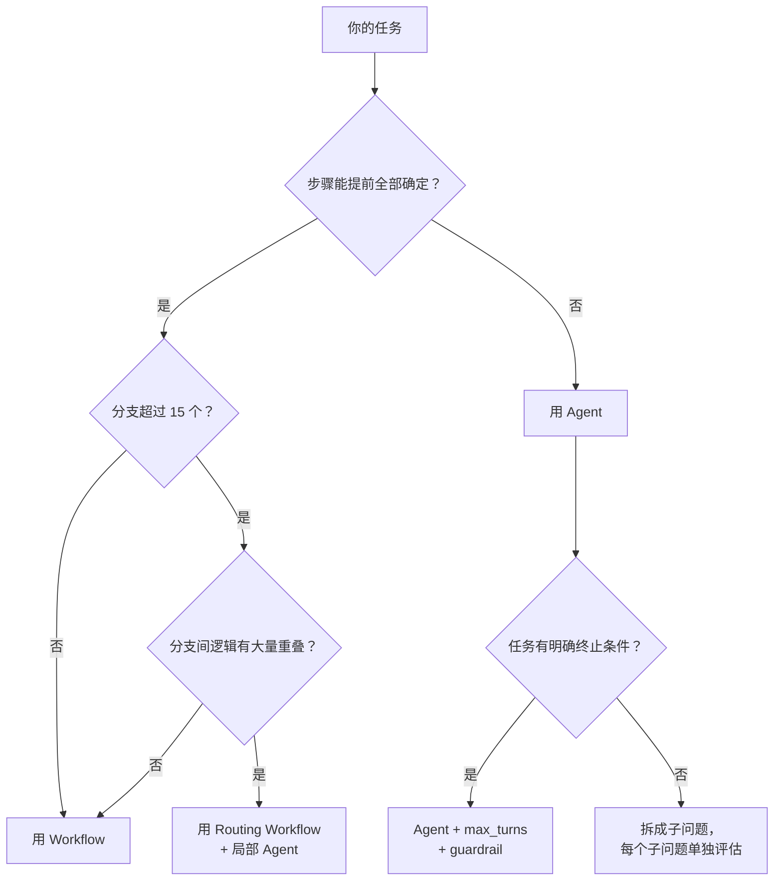

<section class="doc-hero">
  <p class="doc-hero__kicker">流程编排</p>
  <h1>工作流与 Agent 的边界</h1>
  <p class="doc-hero__lead">Anthropic 2024 年底的《Building Effective Agents》把 LLM 系统分成两大类：Workflow（预定义路径编排 LLM）和 Agent（模型自主决定路径和工具）。90% 的"Agent"项目其实该用 Workflow——这篇讲清楚怎么判断、怎么选、以及两者怎么混用。</p>
  <div class="doc-hero__meta" aria-label="本文信息">
    <span>适合阶段：架构选型 / 面试高频</span>
    <span>核心：控制流归属——代码写死 vs 模型动态决定</span>
    <span>面试重点：边界判断 + Anthropic 分类法</span>
  </div>
</section>

> **本文边界**：聚焦 Workflow 和 Agent 的**分类与选型**。Agent 的内部循环（ReAct / Plan-and-Execute）见 [Agent 核心理论](../agent/)；Workflow 的四种编排模式（顺序 / 并行 / 条件 / 循环）见 [编排模式](./patterns)；LangGraph 框架实现见 [LangGraph 深度解析](./langgraph)；Anthropic 原文引用的五种 Workflow 模式与 Agent 的更完整定义见 [Agent 定义与认知架构](../agent/definition)。

## 面试官想考什么

读完这篇你要能正面回答下面这些题。每题后面括号里是面试官真正想看你答出什么。

<div class="interview-grid">
  <div>
    <strong>Anthropic 怎么定义 Workflow 和 Agent？本质区别是什么？</strong>
    <span>考能不能一句话讲出"控制流归属"——代码写死 vs 模型运行时决定。</span>
  </div>
  <div>
    <strong>你的项目里应该用 Workflow 还是 Agent？怎么决策？</strong>
    <span>考工程判断力，面试官最怕听到"上 Agent 更灵活"这种无脑回答。</span>
  </div>
  <div>
    <strong>Anthropic 提出的五种 Workflow 模式分别解决什么问题？</strong>
    <span>考对 prompt chaining / routing / parallelization / orchestrator-workers / evaluator-optimizer 的理解。</span>
  </div>
  <div>
    <strong>Agent 在生产中最常见的失败模式是什么？</strong>
    <span>考对 compounding errors、context overflow、tool confusion、unbounded cost 的认知。</span>
  </div>
  <div>
    <strong>大部分生产系统是纯 Workflow 还是纯 Agent？</strong>
    <span>考能不能答出"混合架构"——确定性路由 + 局部自主决策。</span>
  </div>
  <div>
    <strong>Workflow 的维护成本在什么节点会超过 Agent？</strong>
    <span>考对"分支爆炸"的理解——分支超 15 个就该考虑让模型动态路由。</span>
  </div>
  <div>
    <strong>怎么在 Agent 里保留 Workflow 的可审计性？</strong>
    <span>考 structured output + guardrails + trace logging 的工程组合。</span>
  </div>
</div>

---

## 为什么要区分 Workflow 和 Agent

看一个反例。某团队做了一个"智能客服 Agent"：

```python
agent = Agent(
    model="gpt-4o",
    tools=[查订单, 退款, 改地址, 查物流, 查优惠券, 投诉升级, ...],
    instructions="你是客服助手，根据用户需求自主选择工具解决问题。"
)
```

上线第一周就出了三个事故：

1. **退款没走审批**——用户说"我要退款"，Agent 直接调了退款接口，跳过了金额 > 500 的人工确认
2. **循环调用**——用户问了一个模糊问题，Agent 在"查订单 → 查物流 → 查订单"之间循环了 12 次，烧了 $2.3
3. **工具选错**——用户说"帮我改一下"，Agent 猜测是改地址，实际用户想改发票抬头（没有这个工具）

这三个问题的根因不是模型不够强。根因是**这个场景不需要 Agent**。客服退款的 80% 场景，步骤是固定的：

```text
查订单 → 检查退款条件 → 金额 < 500 自动退 / ≥ 500 走人工 → 返回结果
```

用代码写死流程就行。用 Agent 反而引入了不确定性。

Anthropic 在 [Building Effective Agents](https://www.anthropic.com/research/building-effective-agents) 里把这个区分说得很清楚：

> - **Workflows**: Systems where LLMs and tools are orchestrated through **predefined code paths**.
> - **Agents**: Systems where LLMs **dynamically direct their own processes and tool usage**, maintaining control over how they accomplish tasks.

一句话：**控制流由谁决定。** 代码写死 → Workflow。模型运行时决定 → Agent。

---

## Workflow 的五种模式

Anthropic 总结了五种 Workflow 模式。它们都不是 Agent——控制流由代码决定，LLM 只在每个节点内做推理。

### 模式 1：Prompt Chaining（链式调用）

把任务拆成固定步骤，每步的输出是下一步的输入。

```python
# 步骤固定：生成 → 翻译 → 校对
draft = llm.chat("根据以下 brief 生成营销文案", brief)
translated = llm.chat("把以下文案翻译成日语", draft)
final = llm.chat("校对以下日语翻译，修正语法错误", translated)
```

**适用场景**：步骤已知、顺序固定、每步有明确的输入输出格式。
**关键优势**：每步之间可以插入校验——比如检查翻译长度、检查格式是否符合要求，不通过就提前终止。

### 模式 2：Routing（路由分类）

先分类，再走不同分支。分类逻辑用 LLM 或规则引擎，后续分支是确定性代码。

```python
category = llm.chat(
    "把以下客服消息分类为：refund / shipping / technical / other",
    user_message
)
if category == "refund":
    run_refund_workflow(user_message)
elif category == "shipping":
    run_shipping_workflow(user_message)
elif category == "technical":
    run_tech_support_workflow(user_message)
else:
    escalate_to_human(user_message)
```

**适用场景**：输入类型多但每类的处理逻辑固定。客服、工单分诊、邮件分类都是经典场景。
**和 Agent 的区别**：路由后每个分支是写死的代码，不是让模型自己选。

### 模式 3：Parallelization（并行化）

同时跑多个 LLM 调用——要么是拆成独立子任务（sectioning），要么是同一任务多次尝试（voting）。

```python
import asyncio

async def parallel_analysis(doc):
    # 三个独立维度同时分析
    sentiment, topics, entities = await asyncio.gather(
        llm.chat("分析以下文档的情感倾向", doc),
        llm.chat("提取以下文档的核心主题", doc),
        llm.chat("提取以下文档的命名实体", doc),
    )
    return {"sentiment": sentiment, "topics": topics, "entities": entities}
```

**适用场景**：子任务之间无依赖（可并行），或者需要多视角投票提升准确率。
**关键收益**：延迟从 `N × 单次调用` 降到 `max(所有调用)`。

### 模式 4：Orchestrator-Workers

一个中心 LLM 动态拆解任务，分配给 worker LLM 执行。这是五种模式里最接近 Agent 的——但控制流仍然由代码管理。

```python
# 中心 LLM 拆任务
subtasks = llm.chat(
    "把以下需求拆成独立子任务，返回 JSON 数组",
    user_request
)
# 代码控制分发和聚合
results = []
for task in subtasks:
    result = worker_llm.chat(task["prompt"])
    results.append(result)
# 中心 LLM 汇总
final = llm.chat("汇总以下子任务结果", results)
```

**和 Agent 的区别**：拆任务用了 LLM，但 for 循环、汇总逻辑都是代码控制。Agent 的话，模型自己决定"还需不需要拆更多"、"要不要跳过某个子任务"。

### 模式 5：Evaluator-Optimizer（评估-优化循环）

一个 LLM 生成，另一个 LLM 评估，不合格就重来。循环次数由代码限制。

```python
for attempt in range(max_retries := 3):
    draft = generator_llm.chat("生成一段满足以下要求的代码", spec)
    evaluation = evaluator_llm.chat(
        "评估以下代码是否满足要求，返回 pass/fail + 改进建议",
        {"spec": spec, "code": draft}
    )
    if evaluation["result"] == "pass":
        break
    spec = f"{spec}\n\n上一版问题：{evaluation['feedback']}"
```

**适用场景**：有明确评估标准（能判断好不好），且迭代能显著提升质量。代码生成、文案优化、翻译润色。

### 五种模式速查

| 模式 | 控制流 | 典型场景 | LLM 角色 |
|------|--------|----------|----------|
| Prompt Chaining | 顺序固定 | 内容生成管线 | 每步处理 |
| Routing | 分类 + 分支 | 客服分诊 | 做分类 |
| Parallelization | 并行 | 多维度分析 | 独立处理 |
| Orchestrator-Workers | 动态拆任务 | 复杂调研 | 拆 + 做 + 汇总 |
| Evaluator-Optimizer | 循环 | 代码生成 | 生成 + 评估 |

五种模式的共同点：**代码决定什么时候调 LLM、调几次、结果怎么流转。** LLM 在每个节点内自由推理，但不决定整体控制流。

---

## Agent 什么时候登场

如果五种 Workflow 模式都搞不定你的需求，Agent 才该登场。判断标准：

### 流程图测试

> 能不能在 LLM 运行**之前**画出完整流程图？如果可以 → Workflow。如果流程图要看运行时 LLM 的输出才能确定 → Agent。

具体来说，以下三种情况需要 Agent：

**1. 步骤不可预测。** 比如 debug 一个生产事故：先查日志 → 发现是 OOM → 查 pod 资源 → 发现是某个 query 太重 → 查 slow query log → 定位到具体 SQL → ... 每一步取决于上一步发现了什么。你没法提前写出所有分支。

**2. 工具选择依赖中间结果。** 比如技术调研：先搜 GitHub → 发现某个库没文档 → 转搜 Stack Overflow → 找到用法 → 再回 GitHub 看源码确认。该搜什么、搜到后转哪里，取决于搜到了什么。

**3. 需要长期规划和动态调整。** 比如 Claude Code / Cursor 这样的编程 Agent：先理解需求 → 规划改哪些文件 → 改第一个文件 → 发现还需要改另一个 → 跑测试 → 测试失败 → 修改 → 再跑测试... 计划在执行中不断修正。

### 15 分支测试

Redis 工程博客提出了一个实用标准：

> 让一个工程师看 20 个真实输入，画决策树。如果树的叶子节点不超过 15 个，用 Workflow。如果超过 15 个、或者经常需要加"除非..."从句，就进了 Agent 领地。

---

## Workflow vs Agent 对比

| 维度 | Workflow | Agent |
|------|----------|-------|
| 控制流 | 代码写死 | 模型运行时决定 |
| 可预测性 | 高——每次走同一条路 | 低——同一输入可能走不同路径 |
| 可审计性 | 天然可审计（代码即文档） | 需要额外 trace 和 guardrail |
| Token 成本 | 可预测，固定预算 | 不可预测，可能无限循环 |
| 延迟 | 步骤数 × 单步延迟 | 不可预测，取决于模型决策 |
| 适合任务 | 步骤已知、分支有限 | 步骤未知、需动态探索 |
| 维护成本 | 分支少时低，分支爆炸后高 | 前期高，分支多时反而低 |
| 失败模式 | 分支遗漏（没考虑到的 case） | Compounding errors、循环、幻觉 |

### Agent 的四大失败模式

在生产中把不该用 Agent 的场景用了 Agent，会遇到：

**1. Compounding Errors（错误复合）。** 每步 99% 准确率，10 步串行只有 90%。一个真实案例：某 inbound qualification Agent 测试集准确率 94%，上线三周后发现边界 case 错误率 30%——而且不报错，只能靠每周人工抽样 50 条才发现（[Redis Blog](https://redis.io/blog/agents-vs-workflows/)）。

**2. Context Overflow。** Agent 跑了太多步后，上下文窗口被历史对话填满，模型开始忘记原始指令。典型症状：前 5 步正常，第 10 步开始答非所问。

**3. Tool Confusion。** 工具太多或描述重叠时，模型频繁选错。跟单 Agent 塞 30 个工具崩溃是同一个问题——见 [多 Agent 架构模式](../multi-agent/patterns) 的分析。

**4. Unbounded Cost。** 没设 max_turns 和 cost cap，Agent 在一个死胡同里循环调用，Token 账单飙升。

---

## 混合架构：生产系统的真实形态

纯 Workflow 和纯 Agent 都是极端。大部分生产系统是**混合架构**——确定性骨架 + 局部自主决策。

### 模式：确定性路由 + 专家 Agent

```python
# 第一层：确定性路由（Workflow）
category = classify(user_message)  # 规则引擎或小模型

if category == "simple_refund":
    # 第二层：纯 Workflow，步骤固定
    result = run_simple_refund_workflow(order_id)
elif category == "complex_complaint":
    # 第二层：Agent，需要动态探索
    result = complaint_agent.run(user_message)
elif category == "product_question":
    # 第二层：RAG Workflow
    result = rag_pipeline.query(user_message)
else:
    result = escalate_to_human(user_message)
```

Vodafone / Fastweb 的生产部署就是这个模式：用确定性 supervisor 做意图路由，简单任务走固定 Workflow，复杂查询走 RAG + Agent 的组合（[Redis Blog](https://redis.io/blog/agents-vs-workflows/)）。

### 关键原则

1. **Workflow 是默认选择**——只有 Workflow 搞不定时才升级到 Agent
2. **Agent 的自主范围越小越好**——不要给一个万能 Agent，而是在 Workflow 的特定节点嵌入一个专精 Agent
3. **Agent 必须有兜底**——max_turns、cost cap、fallback to human

Anthropic 原文的建议：

> Find the simplest solution possible, and only increase complexity when needed.

---

## 实战：用 LangGraph 实现混合架构

LangGraph 天然支持混合模式——graph 的节点可以是确定性函数，也可以是 Agent。

```python
from langgraph.graph import StateGraph, END
from typing import TypedDict

class State(TypedDict):
    user_message: str
    category: str
    result: str

def classify_intent(state: State) -> State:
    """确定性分类节点——可以用小模型或规则"""
    category = llm_mini.invoke(
        f"分类以下消息为 refund/shipping/complex: {state['user_message']}"
    ).content.strip()
    return {"category": category}

def handle_refund(state: State) -> State:
    """固定 Workflow：查订单 → 检查条件 → 执行退款"""
    order = lookup_order(state["user_message"])
    if order["amount"] < 500:
        execute_refund(order["id"])
        return {"result": f"订单 {order['id']} 已退款 {order['amount']} 元"}
    return {"result": f"订单金额 {order['amount']} 元超过阈值，已转人工"}

def handle_shipping(state: State) -> State:
    """固定 Workflow：查物流"""
    tracking = lookup_shipping(state["user_message"])
    return {"result": f"物流状态：{tracking}"}

def handle_complex(state: State) -> State:
    """Agent 节点：复杂问题用 ReAct 循环"""
    agent = create_react_agent(
        model="claude-sonnet-4-5",
        tools=[查订单, 查政策, 查历史工单, 创建工单],
        max_turns=8,
    )
    response = agent.run(state["user_message"])
    return {"result": response}

def route(state: State) -> str:
    """条件路由"""
    return {
        "refund": "handle_refund",
        "shipping": "handle_shipping",
    }.get(state["category"], "handle_complex")

# 构建 Graph
graph = StateGraph(State)
graph.add_node("classify", classify_intent)
graph.add_node("handle_refund", handle_refund)
graph.add_node("handle_shipping", handle_shipping)
graph.add_node("handle_complex", handle_complex)

graph.set_entry_point("classify")
graph.add_conditional_edges("classify", route)
graph.add_edge("handle_refund", END)
graph.add_edge("handle_shipping", END)
graph.add_edge("handle_complex", END)

app = graph.compile()
```

这段代码的关键设计：
- **classify 节点**用小模型分类，成本低、延迟低
- **退款和物流**走固定 Workflow，可预测、可审计
- **复杂问题**才启动 Agent，给了 max_turns=8 防止无限循环
- **整体骨架**是 LangGraph 的确定性 graph，不依赖模型决定走哪条路

---

## 决策树：你的场景该用哪个



面试时可以直接画这张图。关键判断点：
1. 步骤能否提前确定 → Workflow vs Agent 的根本分界
2. 分支数量 → Workflow 的维护上限
3. Agent 必须有终止条件 → 没有就不能用

---

## 容易踩的坑

### 坑 1：把 Routing 当成 Agent

**现象**：团队说"我们用了 Agent 做意图分类"，但其实就是 LLM 做了一次分类，后续全是固定代码。

**根因**：把"用了 LLM"等同于"是 Agent"。分类后走固定分支，这是 Routing Workflow。

**修法**：Anthropic 的定义很清楚——Agent 是模型**持续**动态决定流程，不是做一次分类就算。

### 坑 2：一上来就 Agent

**现象**：需求文档写"做一个 XX Agent"，团队直接开始搭 Agent 架构。上线后发现 80% 的 case 走同一条路。

**根因**：没先分析任务分布。可能 80% 是简单 case，只有 20% 需要动态决策。

**修法**：先拿 50-100 个真实输入做分析。画决策树。简单 case 用 Workflow，只有长尾才上 Agent。

### 坑 3：Agent 没有兜底

**现象**：Agent 在边界 case 上循环调用工具，Token 账单 $200+，用户等了 3 分钟没结果。

**根因**：没设 max_turns、cost cap、timeout。

**修法**：三条线必设——
- `max_turns`：最多跑几步（通常 5-15）
- `cost_cap`：单次运行最多花多少 token
- `timeout`：总耗时上限，超时返回 fallback 结果

### 坑 4：混合架构里 Agent 权限太大

**现象**：Workflow 的某个节点嵌入了 Agent，这个 Agent 能调用 Workflow 其他节点不该碰的工具。

**根因**：没做工具隔离。Agent 节点应该只能访问它需要的工具，不是全量工具列表。

**修法**：每个 Agent 节点配独立的 tool 列表。最小权限原则。

### 坑 5：用 Workflow 硬扛该用 Agent 的场景

**现象**：Workflow 的 if-else 分支越写越多，维护成本比 Agent 还高。每周加分支。

**根因**：问题空间本身是开放的，不适合穷举分支。

**修法**：当 if-else 超过 15 个分支、且新分支还在持续增长，考虑把这一层换成 Agent 路由。

---

## 与相邻概念的辨析

**Workflow vs Chain**：Chain 是最简单的 Workflow——纯顺序执行，没有分支。Workflow 是更广的概念，包含 chain、routing、parallelization 等。

**Workflow vs Pipeline**：工程上这两个词经常混用。如果要区分：Pipeline 偏数据处理（ETL、ML Pipeline），Workflow 偏任务编排。在 LLM 语境下通常等价。

**Agent vs Autonomous Agent**：Agent 有自主性，但不意味着完全自主。生产 Agent 通常有人工确认节点、权限边界、最大步数限制。Autonomous Agent（如 AutoGPT）是自主性最大化的极端——很少用于生产。

**Orchestrator-Workers vs Agent**：这是最容易混的。区别在"worker 有没有自主决策权"。如果 worker 只是执行一个固定 prompt，那整体是 Workflow（Orchestrator-Workers 模式）。如果每个 worker 自己决定调什么工具、跑几步，那是多 Agent 系统。详见 [Orchestrator-Worker 模式](../multi-agent/orchestrator-worker)。

---

## 面试题深度解析

### Q: Anthropic 怎么定义 Workflow 和 Agent？本质区别是什么？

**30 秒版本**：Workflow 是"通过预定义代码路径编排 LLM 和工具的系统"，Agent 是"LLM 动态指导自身流程和工具使用的系统"。本质区别在**控制流归属**——Workflow 的每一步由代码决定，Agent 的每一步由模型运行时决定。一个实用的判断：能不能在 LLM 运行之前画出完整流程图？能 → Workflow，不能 → Agent。

**追问 1**：五种 Workflow 模式里，Orchestrator-Workers 也用了 LLM 拆任务，这不就是 Agent 吗？
不是。Orchestrator-Workers 里"拆任务"用了 LLM，但 for 循环分发、结果汇总的逻辑由代码控制。模型不决定"要不要继续拆"、"要不要跳过某个 worker"。真正的 Agent 是模型自己决定下一步做什么——包括是否需要更多信息、是否该停下来。判断标准不是"用没用 LLM"，而是"LLM 是否控制整体流程走向"。

**追问 2**：那 Evaluator-Optimizer 的循环呢？循环次数由 LLM 评估决定，算不算 Agent？
边界确实模糊。关键区别在循环的退出条件：Evaluator-Optimizer 的 `max_retries` 由代码硬编码，每轮要不要继续由 evaluator 的 pass/fail 决定——但 evaluator 只做二分判断，不决定"接下来试什么新策略"。如果你让 evaluator 还能动态调整生成策略（比如"上一轮代码有内存泄漏，这次换个算法"），那它就过渡到 Agent 了。

### Q: 你的项目里应该用 Workflow 还是 Agent？怎么决策？

**30 秒版本**：默认用 Workflow。拿 50 个真实输入画决策树——叶子不超过 15 个就用 Workflow。超过 15 个且持续增长，再考虑混合架构：确定性路由 + 局部 Agent。纯 Agent 只用于步骤完全不可预测的场景（debug、开放式研究、coding agent）。

**追问 1**：客服场景怎么选？
典型混合架构。80% 的客服请求（退款、查物流、改地址）步骤固定，用 Routing + Workflow。剩下 20%（复杂投诉、跨业务咨询）走 Agent，但设 max_turns=10 和 fallback to human。不要因为 20% 的复杂 case 把整个系统做成 Agent。

**追问 2**：怎么知道 50 个样本够不够？
不需要统计显著性——这不是 A/B test，是架构选型。50 个样本的目的是发现"任务类型分布"，不是精确估计比例。如果 50 个里有 45 个走同一条路，信号已经很强了。如果 50 个里分布很散（没有明显聚类），那可能需要 Agent。

### Q: Agent 在生产中最常见的失败模式是什么？

**30 秒版本**：四个主要失败模式——(1) Compounding errors：每步 99% 准确率，10 步下来只有 90%。(2) Context overflow：步骤太多，历史塞满上下文，模型忘记原始指令。(3) Tool confusion：工具太多或描述重叠，模型频繁选错。(4) Unbounded cost：没有 max_turns，Agent 在死循环里烧 Token。

**追问**：怎么防？
分层防御：(1) max_turns + cost_cap + timeout 是硬限制；(2) 每步用 structured output 约束输出格式，减少幻觉；(3) 每 N 步压缩上下文（保留 state summary，丢弃中间 trace 细节）；(4) 工具数量不超过 10 个，如果超过就拆成多 Agent。

### Q: 大部分生产系统是纯 Workflow 还是纯 Agent？

**30 秒版本**：混合架构。确定性骨架（Workflow）做路由和简单处理，复杂节点嵌入 Agent 做动态决策。Google ADK、LangGraph、OpenAI Agents SDK 都在往"graph + agent 混合"的方向走。纯 Workflow 的问题是分支爆炸后维护成本高，纯 Agent 的问题是不可控。混合架构取两者的长处：主干可预测、支线可灵活。

---

## 延伸阅读

- **Anthropic：Building Effective Agents** ([anthropic.com/research/building-effective-agents](https://www.anthropic.com/research/building-effective-agents))
  2024 年底发布的权威分类。本文的 Workflow/Agent 定义、五种 Workflow 模式全部出自这里。必读——面试高频引用源。

- **Redis Blog：AI Agents vs Workflows** ([redis.io/blog/agents-vs-workflows](https://redis.io/blog/agents-vs-workflows/))
  2025 年的工程实践总结，有 Vodafone 生产案例、LangCache 性能数据、compounding error 分析。读它能拿到"混合架构在真实生产中长什么样"的一手经验。

- **论文：A Practical Guide for Designing, Developing, and Deploying Production-Grade Agentic AI Workflows** ([arxiv 2512.08769](https://arxiv.org/abs/2512.08769))
  2025 学术论文，横向对比 Workflow 和 Agent 的生产化策略。读它补充学术视角。

- **LangGraph Docs：Workflows and Agents** ([docs.langchain.com](https://docs.langchain.com/oss/python/langgraph/workflows-agents))
  LangGraph 官方对 Workflow vs Agent 的阐述，有代码示例。读它看框架层怎么实现混合架构。

- **配套阅读**：[Agent 定义与认知架构](../agent/definition) — Agent 的内部组件和循环；[编排模式](./patterns) — 四种编排模式的深度展开；[LangGraph 深度解析](./langgraph) — 框架实现；[多 Agent 架构模式](../multi-agent/patterns) — 从 Workflow 升级到多 Agent 时的架构选择。
